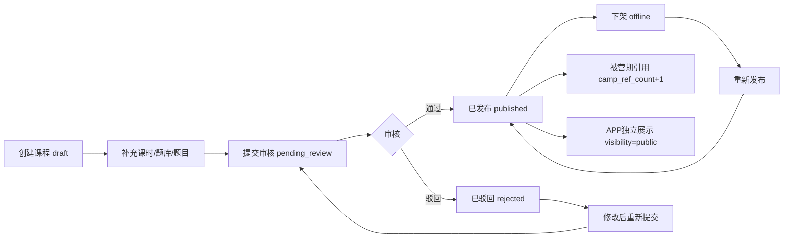
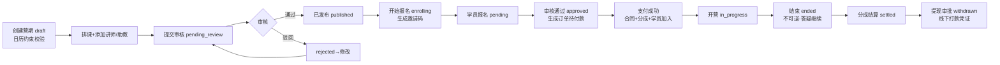
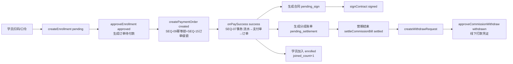
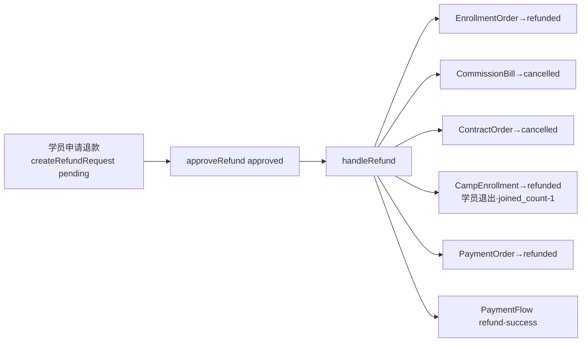
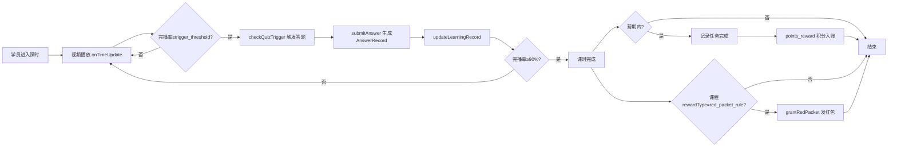
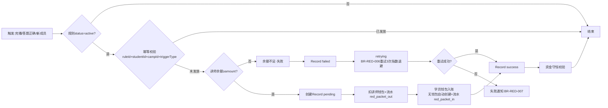
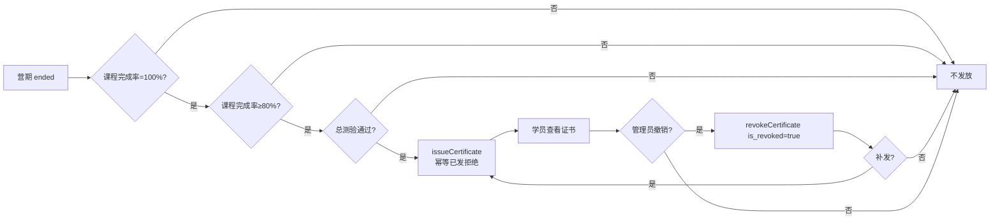
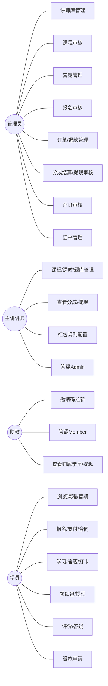
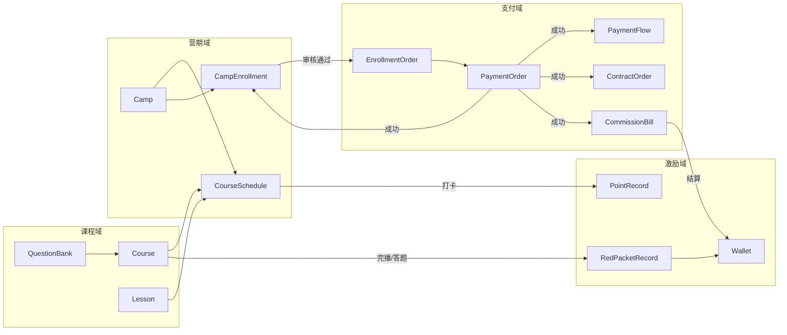
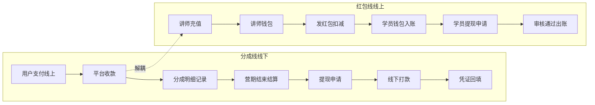

# 18-课程与营期域-PRD-v1.4.0

> **业务域**：课程与营期域（D18） | **版本**：v1.4.0（原型对齐修订版） | **日期**：2026-08-25
> **需求流**：SaaS-Class | **类型**：新增 | **优先级**：P0
> **数据来源**：脑暴确认稿 v1.0.0（D1-D35）+ SugarMate 课程模块逆向分析报告 v1.0.0 + SugarMate 源码 + SugarMate PRD v2.3.0 + 当前原型实际实现状态
> **追溯链**：UC-COURSE → FN-COURSE → PG-COURSE → SC-COURSE → BG-COURSE → BO-COURSE
> **系统缩写**：SAAS | **终端缩码**：PC（运营后台/租户后台）+ APP（学员端/讲师端/助教端 H5）
> **V1核心策略**：课程与营期业务接入现有 SaaS 电商系统（14 域），复用组织/订单/售后/营销/财务域能力，课程域自建内容与营期组织能力
> **PRD状态**：Draft（待评审）
>
> **v1.4.0 原型对齐修订说明（2026-08-25）**：
> - 原型经多轮迭代，业务逻辑发生根本性变化，本版在 v1.3.0 基础上**修订变化点，业务逻辑未变部分保留原文**。
> - **核心变化（6 项决策，详见 §10A）**：
>   ① 角色体系：组织结构直接新增"讲师/助教"角色，废除"店长=主讲/店员=助教"映射（C4）
>   ② 课程商品独立售卖，不进商品域 SPU（对齐微赞）
>   ③ 课程订单进订单域，新增"课程订单/训练营订单"2 类型
>   ④ 课程退款进售后域，接入现有 7 状态机
>   ⑤ 课程分成走线下打款，复用财务域（不接分佣政策）
>   ⑥ 打卡移除；红包复用营销域；积分本期不做
> - **未变部分**：课程/课时/题库/营期/排课/报名/证书等课程域自建能力、状态机、Store 架构、业务流程沿用 v1.3.0。

---

## §1 版本历史

| 版本 | 日期 | 变更内容 |
|------|------|----------|
| v1.0.0 | 2026-08-18 | 初版——基于 SugarMate 课程模块逆向分析 + 脑暴确认稿（D1-D35）产出。33 实体 / 12 状态机 / 7 store / PC19+APP15 功能 / 7 业务闭环。适配优化：讲师通用化(D1)、分类通用化(D2)、分成线下打款(D11)、红包体系引入(D23)。 |
| v1.1.0 | 2026-08-19 | 文档同步补全（基于 doc-audit 42 项差异）：实体 33→38（+LiveSession/LiveRoom/LiveProduct/Store/HomeConfig）；PC 功能 +3（课程类型/直播场次/直播中控台）；APP 功能 +9 类（平台首页/门店/订单/个人中心/直播间/占位页/助教4子页/讲师4子页）；Store 7→10（+useLiveStore/useStoreStore/useHomeStore）；BR 补 BR-PAY-003/004、BR-REFUND-001；N5 直播边界更新。 |
| v1.2.0 | 2026-08-20 | 审查修复（P0×3 + P1×9）：补 LiveSession 状态机（11→12）；§24 补 D22-A 直播场次局部推翻 D22；全文 11→12 状态机；新增 §27 验收检查清单+§28 下一步计划（原 §27/§28 顺延 §29/§30）；§12 补 Series 实体；§16 补 UC-COURSE-REDPACKET/UC-COURSE-CERT；BR-110/111 孤儿引用修正为 BR-RED-006/007；D53-D60 决策孤儿引用修正；Camp 状态机 draft→offline 补 takeOffline；BR-CAMP-SCHED-003 引用修正为 BR-CAMP-001；approveWithdraw 拆分 approveCommissionWithdraw/approveStudentWithdraw；§15 回填排课 action；§13 补 FN-APP-CONTRACT-001 合同勾选。 |
| v1.2.1 | 2026-08-20 | 二轮审查修复（P0×3 + P1×2）：§18.3 引用修正（§15→§14，11→12）；§19 子节编号 8.x→19.x；§25 子节编号 22.x→25.x；Series 降级分类修正（N1 营销→独立说明不计入 38 实体）；BR-RED-006/007 自引用移除；rejectWithdraw 拆分 rejectCommissionWithdraw/rejectStudentWithdraw。 |
| v1.3.0 | 2026-08-23 | **合并修订版**：合并16-课程域-PRD到此文档（16-PRD废弃）；基于34份PRD全系统审查+10项跨域冲突决策+原型偏离核查，修订9项：①§10角色定义改为店长=主讲/店员=助教 ②§11 BR-CERT-001完成率100%→90% ③§11 BR-REFUND-001退款原因更新 ④§12 Lesson新增content_type/is_standalone_sale/price ⑤§12 Course新增分成字段 ⑥§12新增ShareVisit/OrderAttribution实体 ⑦§14 LiveSession第4态replay→cancelled ⑧§13讲师库管理简化+红包/钱包/提现标注废弃+讲师主页新增 ⑨新增§10A跨域冲突10项决策表 |
| v1.4.0 | 2026-08-25 | **原型对齐修订版**：课程业务接入现有 SaaS 电商系统。修订：①§10 角色改为讲师/助教（组织结构新增）②§10A 六项新决策替换十项旧决策 ③§11 业务规则移除打卡/积分，分成改线下，订单/售后/分成复用 SaaS 域 ④§12 讲师域实体改为复用组织域 ⑤§13 功能需求对齐 22 菜单 + 直播录播/商品 ⑥§24 决策索引更新 ⑦§30 新增需求说明面板字段规范。业务逻辑未变部分（课程/课时/题库/营期/排课/报名/证书、状态机、Store、业务流程）沿用 v1.3.0。 |
| v1.4.3 | 2026-08-28 | **方案A·报名审核开关**：营期实体新增 require_review（默认 false）。关闭（默认）：C 端报名即生成订单支付入营，不进审核队列（转化优先）；开启：走报名→审核→通过后生成订单流程（定向/免费限量营期适用）。配套：营期表单「报名需审核」开关、APP 报名提示分支、PC 报名审核页仅处理需审核营期。新增 BR-ENROLL-005。 |
| v1.4.2 | 2026-08-28 | **资质审核暂缓 + 残留清理**：①讲师/助教资质审核流程暂不启用——组织管理建档即生效（review_status 恒为 approved），课程库讲师下拉/营期助教下拉直接可选，审核管理页对讲师/助教仅保留档案查看；字段与状态机保留供后续开启 ②全文清理打卡/积分残留：学习链路改为「报名→支付→学习→测验→证书」，激励闭环仅保留红包（复用营销域），发证依据不含打卡完成率 ③排课逻辑明确：仅草稿/待审核营期可编辑排课，审核通过即锁定（复制营期重做）；新增直播草稿营期排课演示数据 ④提现审核：凭证号改选填，打款凭证图片必填（1-3张），新增批量提现统一凭证 ⑤分成记录新增字段口径（分成基数/应分金额/调整金额/净应分）表头问号悬浮解释 ⑥数据看板：主讲统计与助教统计字段对齐，全部统计明细表加分页器，营期/课程统计移除状态列 ⑦移除"日历排课"等与原型不一致的表述，PRD 与原型需求面板一一对齐。 |
| v1.4.1 | 2026-08-27 | **PRD-原型一致性修订**：①**废弃 FN-COURSE-PC-001 终端角色管理**——终端角色（店长=主讲/店员=助教）复用 SaaS 组织管理（门店域·组织架构/门店成员）统一承接，课程域不再单设页面，讲师/助教档案在组织管理维护，课程/营期经 lecturerStore 同源引用（D16 快照规则不变）②§13.1 PC 端补齐：红包奖励配置 D35（课程级）/课程删除（仅草稿）/课程学员查看抽屉/直播转课时入口/题目触发类型 post_course/助教出题主讲审核流/营期订单支付流水 Timeline/评价二级回复/看板平均完成率 ③移除打卡相关指标与配置（业务无打卡功能）④**废弃三个复用 SaaS 的课程域页面**：红包规则管理（走 SaaS 营销域）、钱包流水查看（走 SaaS 财务域）、课程权益管理（本质是订单衍生，走 SaaS 订单域；数据层 entitlement 保留供 APP 端与订单联动，PC 端不设页面）。 |

---

## §2 目录

1. 版本历史 → 2. 目录 → 3. 背景与问题陈述 → 4. 目标与成功度量 → 5. 范围 → 6. 与既有模块关系 → 7. 业务目标映射 → 8. 用户故事 → 9. 业务流程图 → 10. 角色与权限 → 11. 业务规则（BR） → 12. 数据实体（ENT） → 13. 功能需求（FN） → 14. 状态机 → 15. Store 架构 → 16. 用例（UC） → 17. 验收标准 → 18. 五类图 → 19. 业务流程（文字详述） → 20. 指标登记 → 21. CONFIG 集中配置 → 22. 外部接口标注 → 23. 非功能性需求 → 24. 关键决策索引 → 25. 需求深度分析摘要 → 26. 落地优先级与影响分析 → 27. 验收检查清单 → 28. 下一步计划 → 29. 附录 → 30. 自动排课功能补充

---

## §3 背景与问题陈述

### 3.1 业务背景

SaaS-Class 课程与营期域是平台的**知识付费 + 营期训练**核心业务，承载「内容生产（讲师→课程→审核）→ 营期组织（营期→排课→招募）→ 学员学习（报名→支付→学习→测验→证书）→ 商业闭环（分成→结算→退款）→ 激励闭环（红包）」完整链路。

本 PRD 基于 SugarMate（糖尿病智慧健康平台）课程模块的 1:1 逆向分析重建。SugarMate 已实现完整体系（29 实体 / 10 状态机 / 6 store / 33 页面），本 PRD 在其基础上做适配优化，产出 38 实体 / 12 状态机 / 10 store 的完整需求规格（含直播3实体+门店1实体+首页配置1实体，v1.1.0 补全）。

### 3.2 核心问题

| 问题编号 | 问题 | 严重程度 | 解决方案 |
|----------|------|----------|---------|
| COURSE-ISSUE-001 | 之前课程业务 APP 报名为假交互（仅本地 enrolled=true，不落 store） | 🔴 高 | D12 APP 报名真实落 store |
| COURSE-ISSUE-002 | 之前退款回滚只做 2 项（缺合同+学员退出） | 🔴 高 | D13 退款 4 项回滚完整（SEQ-14） |
| COURSE-ISSUE-003 | 之前完播率默认值 90/100 三处混存冲突 | 🟡 中 | D14 完播率 90% 单点定义 |
| COURSE-ISSUE-004 | 之前分成账单单位存疑（元 vs 分 100 倍风险） | 🔴 高 | D9 金额统一为「分」 |
| COURSE-ISSUE-005 | 之前红包幂等键缺 campId 维度，跨营期误判 | 🔴 高 | D31 幂等键补 campId |
| COURSE-ISSUE-006 | 之前红包学员无钱包时资金不守恒 | 🔴 高 | D32 自动创建学员钱包 |
| COURSE-ISSUE-007 | 之前营期状态机流转无 action 驱动 | 🟡 中 | D15 流转触发规则明确 |
| COURSE-ISSUE-008 | SugarMate 讲师角色硬编码医疗4类，不适配多行业 | 🟡 中 | D1 讲师角色通用化 |
| COURSE-ISSUE-009 | SugarMate 课程分类固定5类，不适配多行业 | 🟡 中 | D2 课程分类通用化 |
| COURSE-ISSUE-010 | 分成需线下打款，SugarMate 线上分成不适用 | 🟡 中 | D11 分成线下打款+讲师钱包红包用 |

### 3.3 需求边界

| 管控对象 | 业务内容 | 技术方案 | V1 |
|---|---|---|---|
| 课程内容 | 课程/课时/题库/题目/答题/评价 | sim-data mock + Pinia | ✅ |
| 营期组织 | 营期/排课/报名/邀请码/分组/总测验 | sim-data mock + Pinia | ✅ |
| 支付分成 | 订单/支付/流水/合同/分成/提现/退款 | sim-data mock + Pinia | ✅ |
| 激励体系 | 红包（完播/答题/新成员，复用营销域） | sim-data mock + Pinia | ✅ |
| 营销 | 团购/秒杀/直播带货 | — | ❌ D22 不做 |
| 积分商城 | 积分消费 | 独立模块 | ❌ D22 不做 |

---

## §4 目标与成功度量

| 目标编号 | 目标 | 度量指标 | 目标值 |
|----------|------|----------|--------|
| BO-COURSE-01 | 内容生产闭环 | 课程审核通过率 | ≥85% |
| BO-COURSE-02 | 营期付费闭环 | 营期完成率 | ≥60% |
| BO-COURSE-03 | 分成激励到位 | 分成结算及时率 | 100% |
| BO-COURSE-04 | 退款回滚可控 | 退款回滚完整率 | 100% |
| BO-COURSE-05 | 资金安全 | 支付时序约束覆盖率 | 100%（SEQ-01~15） |
| BO-COURSE-06 | 激励双轨 | 学员激励触达率 | ≥80% |
| BG-COURSE-01 | 付费转化 | 报名→支付转化率 | ≥80% |
| BG-COURSE-02 | 助教拉新 | 助教拉新学员占比 | ≥30% |
| BG-COURSE-03 | 学习完成 | 营期课程完成率 | ≥80% |
| BG-COURSE-04 | 证书覆盖 | 营期完成获证率 | 100% |
| BG-COURSE-05 | 红包激励 | 红包发放成功率 | ≥99% |
| BG-COURSE-06 | 1:1 对齐 | 代码结构对齐 SugarMate | 100% |

---

## §5 范围

### 5.1 In-Scope（V1）

**PC 后台（22 功能）**：讲师库管理 / 课程中心 CRUD / 课时管理 / 题库管理 / 营期管理 / 排课编辑 / 课程审核 / 营期订单管理 / 营期售后退款 / 分成账单管理 / 报名审核 / 学员管理+看板 / 分成提现审核 / 课程评价审核 / 证书管理 / 营期数据看板 / 红包规则管理 / 钱包流水查看 / 学员提现审核 / **课程类型管理（v1.1.0）** / **直播场次管理（v1.1.0）** / **直播中控台（v1.1.0）**

**APP 学员端（24 功能）**：讲座中心 / 课程详情 / 课时学习 / 营期详情+报名+支付+合同 / 营期学习5Tab / 营期答疑 / 学习记录 / 助教工作台 / 课程评价提交 / 合同签署 / 退款申请 / 讲师工作台 / 学员钱包+红包+提现 / 讲师充值 / 积分中心 / **平台首页+门店体系+我的订单+个人中心+直播间+商城/娱乐/消息占位页（v1.1.0）** / **助教4子页（v1.1.0）** / **讲师4子页（v1.1.0）**

**共享基础设施**：sim-data mock 数据层 / 10 Pinia store / 12 状态机集中定义 / 支付时序 SEQ-01~15 约束 / 8 漏洞防护

### 5.2 Non-Goals

| # | 功能 | 原因 |
|---|------|------|
| N1 | 营销（团购/秒杀/直播带货） | D22 本期不做，allow_products 保留不启用 |
| N2 | 积分商城 | D22 独立模块，本期仅积分获取 |
| N3 | 助教钱包/平台钱包 | D22 平台资金走线下对账 |
| N4 | 部分退款 | D22 仅全额退款（SEQ-14） |
| N5 | 直播带货（营销） | D22 本期不做营销直播带货；D22-A 直播场次管理 v1.1.0 纳入范围（局部推翻 D22）：仅场次管理+挂车+中控台，不做推流/观看/弹幕底层能力；课程域已实现直播场次/挂车/中控能力（FN-PC-LIVE-001/002 + ENT-LIVE-001~003，v1.1.0 补全），非仅消费回放 |
| N6 | 分成预支（commission_advance） | D22 移除该 txType |
| N7 | 课程搜索+推荐算法 | 本期靠分类筛选 |
| N8 | 答题AI判分 | 本期仅客观题 |

---

## §6 与既有模块关系

| 关系类型 | 模块 | 依赖内容 | V1说明 |
|---|---|---|---|
| 依赖（上游） | 直播域 | 直播场次+回放 | 课程 source=live_replay 消费回放（D3） |
| 依赖（上游） | 成员管理域 | 商家成员 | 讲师导入来源 merchant_import（D1） |
| 依赖（上游） | 用户域 | 用户 | 学员身份 |
| 被依赖（下游） | 积分商城（未实现） | 积分消费 | 本期仅积分获取，消费由商城处理 |
| 外部依赖 | 支付渠道 | 微信/支付宝/易宝 | V1 模拟，不对接真实 API |
| 复用规则 | BR-COURSE 体系 | 1:1 对齐 SugarMate | store action 名/schema 字段名/页面拆分对齐 |

---

---

## §7 业务目标映射

| BG编号 | 业务目标 | 关联BO | 关联FN | 优先级 |
|---|---|---|---|:---:|
| BG-COURSE-01 | 付费转化 | BO-COURSE-02 | FN-COURSE-PC-005/008/011, FN-COURSE-APP-004 | P0 |
| BG-COURSE-02 | 助教拉新 | BO-COURSE-02 | FN-COURSE-PC-005, FN-COURSE-APP-008 | P1 |
| BG-COURSE-03 | 学习完成 | BO-COURSE-02 | FN-COURSE-APP-003/005 | P0 |
| BG-COURSE-04 | 证书覆盖 | BO-COURSE-02 | FN-COURSE-PC-012/015, FN-COURSE-APP-005 | P1 |
| BG-COURSE-05 | 红包激励 | BO-COURSE-06 | FN-COURSE-PC-017, FN-COURSE-APP-013/014 | P1 |
| BG-COURSE-06 | 1:1 对齐 | BO-COURSE-05 | 全部 | P0 |

---

## §8 用户故事

### 8.1 讲师用户故事

| 编号 | 角色 | 故事 |
|------|------|------|
| US-LECT-001 | 主讲讲师 | 作为主讲讲师，我需要创建课程和课时，以便组织教学内容 |
| US-LECT-002 | 主讲讲师 | 作为主讲讲师，我需要配置题库和答题触发阈值，以便学员完播后答题 |
| US-LECT-003 | 主讲讲师 | 作为主讲讲师，我需要查看分成账单和申请提现，以便获得收入 |
| US-LECT-004 | 主讲讲师 | 作为主讲讲师，我需要配置红包规则并充值钱包，以便激励学员学习 |
| US-LECT-005 | 主讲讲师 | 作为主讲讲师，我需要在营期答疑区管理问题（Admin权限），以便解答学员疑问 |
| US-LECT-006 | 助教 | 作为助教，我需要生成邀请码拉新学员，以便扩大营期规模 |
| US-LECT-007 | 助教 | 作为助教，我需要在营期答疑区回复本组学员问题（Member权限），以便辅助教学 |
| US-LECT-008 | 助教 | 作为助教，我需要查看归属学员和提现，以便管理学员和获得收入 |

### 8.2 学员用户故事

| 编号 | 角色 | 故事 |
|------|------|------|
| US-STU-001 | 学员 | 作为学员，我需要浏览课程和营期列表，以便选择学习内容 |
| US-STU-002 | 学员 | 作为学员，我需要报名营期并支付，以便加入营期学习 |
| US-STU-003 | 学员 | 作为学员，我需要观看课时视频并完播答题，以便完成学习 |
| US-STU-004 | 学员 | 作为学员，我需要完成课程学习任务，以便记录学习进度 |
| US-STU-005 | 学员 | 作为学员，我需要领取红包（完播/答题/新成员），以便获得激励 |
| US-STU-006 | 学员 | 作为学员，我需要查看钱包余额和红包记录，以便管理收益 |
| US-STU-007 | 学员 | 作为学员，我需要申请提现红包余额，以便变现收益 |
| US-STU-008 | 学员 | 作为学员，我需要签署合同，以便完成报名流程 |
| US-STU-009 | 学员 | 作为学员，我需要申请退款，以便取消报名 |
| US-STU-010 | 学员 | 作为学员，我需要提交课程评价，以便反馈学习体验 |
| US-STU-011 | 学员 | 作为学员，我需要在营期答疑区提问和互答，以便解决学习疑问 |
| US-STU-012 | 学员 | 作为学员，我需要获得证书，以便证明学习成果 |

### 8.3 管理员用户故事

| 编号 | 角色 | 故事 |
|------|------|------|
| US-ADMIN-001 | 管理员 | 作为管理员，我需要管理讲师库（CRUD+审核+导入），以便维护讲师资源 |
| US-ADMIN-002 | 管理员 | 作为管理员，我需要审核课程，以便控制内容质量 |
| US-ADMIN-003 | 管理员 | 作为管理员，我需要管理营期（CRUD+排课+状态流转），以便组织营期 |
| US-ADMIN-004 | 管理员 | 作为管理员，我需要审核报名，以便控制营期准入 |
| US-ADMIN-005 | 管理员 | 作为管理员，我需要管理订单和退款，以便处理售后 |
| US-ADMIN-006 | 管理员 | 作为管理员，我需要结算分成账单和审核提现（线下打款凭证），以便完成资金闭环 |
| US-ADMIN-007 | 管理员 | 作为管理员，我需要审核课程评价，以便控制评价质量 |
| US-ADMIN-008 | 管理员 | 作为管理员，我需要管理证书（发放/撤销/补发），以便管理学员成果 |
| US-ADMIN-009 | 管理员 | 作为管理员，我需要审核学员红包提现，以便处理学员变现 |
| US-ADMIN-010 | 管理员 | 作为管理员，我需要查看营期数据看板，以便监控业务运营 |

---

## §9 业务流程图

### 9.1 课程发布闭环



### 9.2 营期组织闭环



### 9.3 报名支付分成闭环（核心资金链）



### 9.4 退款回滚闭环（SEQ-14 四项回滚）



### 9.5 学习答题积分闭环



### 9.6 红包发放闭环（D34）



### 9.7 证书发放闭环



---

## §10 角色与权限

### 10.1 角色定义

> **v1.4.0 修订**：废除 v1.3.0"店长=主讲、店员=助教"一人多角色映射（C4 决策）。改为**组织结构直接新增"讲师"和"助教"两个角色**，对齐 SaaS 组织域角色枚举。原店长/店员角色保留（SaaS 组织域原角色，不废弃）。

| 角色 | 说明 | 权限边界 |
|------|------|---------|
| **讲师** | 组织结构新增角色，负责课程主讲/直播授课 | 讲课/出题/审核/答疑 Admin；查看分成账单（线下打款） |
| **助教** | 组织结构新增角色，负责招生/答疑/助播 | 拉新/答疑 Member/助播/出题（讲师审核） |
| **学员** | APP端普通用户，报名营期/独立学习 | 报名/支付/学习/答题/评价/签合同/退款申请 |
| **管理员**（Admin） | PC 后台运营 | 课程审核/营期管理/报名审核/订单/分成结算/退款/证书/评价审核 |

### 10.2 终端角色类型（D1 + v1.4.0 修订）

| 字段 | 说明 |
|------|------|
| `role_type` | 终端角色标签：`店长` / `店员` / `讲师`【新增·课程业务】 / `助教`【新增·课程业务】（店长/店员为 SaaS 组织域原角色保留，讲师/助教为课程业务新增） |
| `can_be_main` | 是否可主讲（讲师=true，店长可配置） |
| `can_be_assistant` | 是否可助教（助教=true，店员可配置） |

### 10.3 答疑权限矩阵（D19，v1.4.0 修订角色名）

| 角色 | 答疑权限 |
|------|---------|
| 讲师 | Admin（全营期答疑管理） |
| 助教 | Member（限本组答疑） |
| 学员 | Guest（互答限本营期） |

---

## §10A 六项新决策（v1.4.0，替换 v1.3.0 跨域冲突 10 项决策）

> **v1.3.0 跨域冲突 10 项决策（C1-C10）已全部废止**，替换为以下 6 项新决策：

| # | 决策 | 内容 | 依据 |
|---|------|------|------|
| D-v14-1 | 角色体系 | 组织结构新增"讲师/助教"角色，废除"店长=主讲/店员=助教"映射（C4 废止） | 用户指令：PC/APP 不能出现店长店员，全部讲师助教 |
| D-v14-2 | 课程商品 | 课程商品独立售卖，不进商品域 SPU（C1 废止） | 对齐微赞（用户指令） |
| D-v14-3 | 课程订单 | 课程订单进订单域，新增"课程订单/训练营订单"2 类型（C2 废止） | 用户指令 |
| D-v14-4 | 课程退款 | 课程退款不走售后域，按 SugarMate 独立 3 状态机（待审核→已通过/已驳回）。退款规则：营期未开营可退款，开营后不可退；课程/音视频独立售卖未开营可退款；合同签署后=开营不可退（C7 废止） | 用户指令 + SugarMate 退款流程 |
| D-v14-5 | 课程分成 | 课程分成走线下打款，复用财务域（不接分佣政策，C5/C6 废止） | 用户指令：不创建分佣政策 |
| D-v14-6 | 激励 | 打卡移除；红包复用营销域（课程完播/答题触发）；积分本期不做（C9 废止） | 用户指令 |

> **废止的 v1.3.0 决策**：C1 课程商品独立管理（被 D-v14-2 替代）、C2 课程订单域内闭环（被 D-v14-3 替代）、C4 店长=主讲/店员=助教（被 D-v14-1 替代）、C5 课程分成归讲师（被 D-v14-5 替代）、C6 课程提现线下打款（被 D-v14-5 替代）、C7 课程退款域内 3 状态（被 D-v14-4 替代）、C9 优惠券不扩展（被 D-v14-6 替代）。C3/C8/C10 保留参考。

---

## §10A.1 退款详细规则（v1.4.0 新增，对齐 SugarMate 退款流程）

### 退款状态机（3 状态，不走售后域）

```
pending（待审核）→ approved（已通过，触发4项回滚）
                 → rejected（已驳回）
```

### 退款条件

| 场景 | 退款规则 | 说明 |
|------|----------|------|
| 营期订单 | 未开营可退款，开营后不可退 | 营期状态为 draft/pending_review/published 时可退，enrolling/ongoing/ended 不可退 |
| 课程独立售卖 | 未开营可退款，开营后不可退 | 课程关联营期未开营时可退 |
| 音视频独立售卖 | 未开营可退款，开营后不可退 | 同课程 |
| 合同 | 未签署可退款，签署后=开营不可退 | APP 只有签署，没有取消合同功能 |

### 退款 4 项回滚（审核通过即执行）

| 项 | 操作 | 说明 |
|----|------|------|
| 1. 营期订单更新 | status → refunded，记录退款时间 | 订单状态流转 |
| 2. 退款流水 | 创建独立退款交易号（RF开头），生成退款流水记录 | 渠道对账可区分 |
| 3. 合同取消 | 合同状态 → cancelled | 失败不阻断，仅警告 |
| 4. 分成处理 + 学员退出 | 分成账单取消/冲减 + 学员退出营期 | 见 §10A.3 分成结算规则 |

---

## §10A.2 免费试看规则（v1.4.0 新增）

### 试看规则

| 规则 | 说明 |
|------|------|
| 免费试看 1 节 | 仅第一节课时可免费试看 |
| 登录后才能试看 | 未登录用户不可试看，需先登录 |
| 试看时间限制 | 试看有时间限制（如 5 分钟），超时需购买 |
| 继续观看需购买 | 试看结束后继续观看需购买课程 |
| 购买后显示完整课程 | 购买后所有课时正常展示 |

### 课程列表目录展示规则

| 课时 | 展示方式 |
|------|----------|
| 第一节 | 正常显示课时标题和内容 |
| 第二节及以后 | 模糊化处理 + 🔒 图标 + 文案"购买后可查看完整课程" |

---

## §10A.3 分成结算与冲减规则（v1.4.0 新增）

### 分成结算流程

```
课程订单支付成功
  → 系统按讲师分成比例计算分成金额
  → 生成分成账单，状态为"待结算"
  → 管理员线下打款
  → 账单状态变为"已结算"
```

### 退款时分成处理

| 账单状态 | 退款处理 | 说明 |
|----------|----------|------|
| 待结算 | 直接取消账单 | 钱还没打给讲师，取消即可 |
| 已结算 | 生成冲减账单（金额为负） | 钱已打给讲师，记为冲减账单，后续分成入账优先冲抵 |

### 冲减账单状态机

```
冲减中 → 已抵扣（后续分成入账完全抵扣）
       → 部分抵扣（分成入账不足，剩余待抵扣）
```

### 冲减账单流程

```
退款审核通过
  → 查该订单关联的分成账单
  → 账单待结算 → 直接取消
  → 账单已结算 → 生成冲减账单（金额为负，状态"冲减中"）
  → 下次分成入账时优先抵扣冲减账单
  → 抵扣完成 → 冲减账单状态"已抵扣"
  → 抵扣不足 → 冲减账单状态"部分抵扣"，剩余待后续抵扣
```

---

## §11 业务规则（BR）

### 11.1 课程域

| 编号 | 规则 |
|------|------|
| BR-COURSE-001 | 课程状态机：draft→pending_review→published→offline；rejected→draft |
| BR-COURSE-002 | 讲师快照锁定（D16）：讲师离职后课程 lecturer_name 快照不失效 |
| BR-COURSE-003 | 视频在 Lesson 层上传，Course 层不存视频（V2.0.0 废弃 video_url） |
| BR-COURSE-004 | 完播触发答题（BR-QUIZ-003）：每题独立配置 trigger_threshold |
| BR-COURSE-005 | 课程分类租户自定义（D2）：category_id 关联，移除固定枚举 |
| BR-COURSE-006 | 课程可见性：public（APP独立展示+可独立售卖）/ camp_only（仅营期内可学） |
| BR-COURSE-007 | 直播回放转课程（D3）：source=live_replay 关联 source_live_session_id |
| BR-COURSE-008 | 课程与题库 1对1 绑定 |
| BR-COURSE-009 | 评价审核未通过模糊回显（BR-COMM-027）：pending/rejected 内容 blur+opacity |

### 11.2 营期域

| 编号 | 规则 |
|------|------|
| BR-CAMP-001 | 营期模式创建后不可更改（D26）：live/recorded |
| BR-CAMP-002 | 直播营期 allow_products=false（D4 保留字段本期不启用） |
| BR-CAMP-CAL-04 | 同专题营期时间不交叉（validateCampCalendarNoOverlap） |
| BR-CAMP-003 | 营期状态机 8 状态：draft→pending_review→published→enrolling→in_progress→ended（不可逆，答疑继续 SC-12） |
| BR-CAMP-004 | 营期状态流转触发（D15）：submitCampForReview/approveCamp/openEnrollment/startCamp/endCamp |
| BR-CAMP-005 | 主讲师 1 名/营期 + 助教 N 名（D1） |
| BR-CAMP-006 | 营期讲师团队快照锁定（D16） |
| BR-CAMP-007 | 每日红包模式（D35）：dailyRedPacketMode = by_course/by_camp |

### 11.3 报名域

| 编号 | 规则 |
|------|------|
| BR-ENROLL-001 | 报名三通道（D7）：assistant_qr/camp_password/admin_assign |
| BR-ENROLL-002 | 报名幂等拒绝重复 |
| BR-ENROLL-003 | 审核不通过不生成营期订单（D12） |
| BR-ENROLL-004 | APP 报名真实落 store（D12）：createEnrollment 生成报名记录 |
| BR-ENROLL-005 | 营期级报名审核开关 require_review（默认 false）：关闭=报名即 approved 并自动生成订单（付费 pending_pay / 免费零元自动入营）；开启=进入待审核队列（方案A） |
| BR-ENROLL-005 | 报名状态机 6 状态：pending→approved/rejected→enrolled/cancelled/refunded |

### 11.4 支付域（SEQ-01~15，D9 金额统一为分）

| 编号 | 规则 |
|------|------|
| SEQ-01 | 支付单未成功不可产生流水 |
| SEQ-02 | 流水未产生不可更新支付单 |
| SEQ-03 | 支付单未更新不可更新营期订单 |
| SEQ-04 | 营期订单未更新不可触发后续动作 |
| SEQ-05 | 后续动作必须按顺序触发 |
| SEQ-06 | 支付渠道回调丢失需查询兜底（L-01） |
| SEQ-07 | 流水+支付单+订单更新用事务（L-02） |
| SEQ-08 | 后续动作幂等可重复执行（L-03） |
| SEQ-09 | 支付单幂等锁：订单已支付不可重复支付（L-04） |
| SEQ-10 | 渠道幂等号防重复支付（L-04） |
| SEQ-11 | 流水唯一约束：一支付单一条 success 流水（L-04） |
| SEQ-12 | 支付超时 30 分钟自动取消（L-05） |
| SEQ-13 | 订单超时 24 小时自动取消（L-05） |
| SEQ-14 | 退款触发 4 项回滚：CommissionBill/ContractOrder/CampEnrollment/PaymentOrder（D13） |
| SEQ-15 | 订单级锁：同一订单同时只能一个未支付支付单（L-07） |
| BR-PAY-001 | 金额统一为「分」（D9）：所有金额字段 z.number().int() 分单位 |
| BR-PAY-002 | 本期仅全额退款（D22 不做部分退款） |
| BR-PAY-003 | 支付倒计时 24h（v1.1.0 补）：订单待支付状态超过 24 小时自动取消，前端展示倒计时 |
| BR-PAY-004 | 合同勾选协议（v1.1.0 补）：支付前须勾选同意协议条款，未勾选不可发起支付 |
| BR-REFUND-001 | 退款原因 6 选 1（v1.3.0修订）：退款申请须选择预设原因（课程内容与预期不符/个人时间冲突无法学习/课程服务体验不佳/重复购买误购/店长店员服务问题/其他原因），必选不可空 |

### 11.5 分成域（D10/D11）

| 编号 | 规则 |
|------|------|
| BR-COMM-001 | 分成比例营期配置（D10）：lecturer_rate/assistant_rate/platform_rate 三者=1，默认 0.6/0.2/0.2 |
| BR-COMM-002 | 分成比例不可为 0 或 100%（validateCommissionRate） |
| BR-COMM-003 | 分成账单支付成功后生成（pending_settlement） |
| BR-COMM-004 | 营期结束状态变更为已结算（settled） |
| BR-COMM-005 | 分成线下打款（D11）：WithdrawRequest 仅 offline_transfer，审批通过记录凭证号 |
| BR-COMM-006 | 退款触发分成账单回滚（cancelled） |
| BR-COMM-007 | 讲师钱包不接收分成入账（D11），与分成账单解耦 |

### 11.6 红包钱包域（D23/D29-D35）

| 编号 | 规则 |
|------|------|
| BR-RED-001 | 红包资金来源方案 B（D29）：讲师钱包线上充值，仅用于发红包，与分成解耦 |
| BR-RED-002 | 红包规则 ruleType：new_member/completion/answer_correct（D30） |
| BR-RED-003 | 红包发放幂等键：ruleId+studentId+campId+triggerType（D31，修复之前缺 campId） |
| BR-RED-004 | 学员无钱包自动创建（D32，修复资金不守恒） |
| BR-RED-005 | 红包发放资金守恒：讲师扣减=学员入账（D34） |
| BR-RED-006 | 红包失败自动重试 3 次指数退避 |
| BR-RED-007 | 红包失败通知 |
| BR-RED-008 | 讲师钱包每日上限防刷（dailyLimit） |
| BR-RED-009 | 积分与红包可共存（D35）：课程 rewardType 配置决定 |
| BR-RED-010 | 学员红包可提现（D32）：withdrawable + 提现审核流程 |
| BR-RED-011 | 无分成预支（D22）：移除 commission_advance txType |

### 11.7 学习/积分/证书域

| 编号 | 规则 |
|------|------|
| BR-LEARN-001 | 完播率默认 90%（D14）：COMPLETION_THRESHOLD=0.9 单点定义 |
| BR-LEARN-002 | 学习记录不分区按课程聚合（D18）：source_type 标记来源 |
| BR-LEARN-003 | 学习任务当日完成唯一幂等 |
| BR-LEARN-004 | 打卡积分入账（D7）：CourseSchedule.points_reward |
| BR-LEARN-005 | 邀请码原子+1 防双花（D17） |
| BR-CERT-001 | 证书发放条件（D8，v1.3.0修订）：课程完成率≥90% + 打卡≥80% + 测验通过 |
| BR-CERT-002 | 证书幂等已发拒绝 |
| BR-CERT-003 | 证书可撤销（is_revoked）+ 补发（D28） |
| BR-QUIZ-001 | 总测验 20 题制（D27）：可配置 |
| BR-QUIZ-002 | 总测验幂等拒绝重复提交 |
| BR-QUIZ-003 | 每题独立配置完播率触发阈值 |

---

## §12 数据实体（ENT，38 实体）

### 12.1 课程域（ENT-COURSE-001~008）

#### ENT-COURSE-001 Course 课程
| 字段 | 类型 | 说明 |
|------|------|------|
| id | string | COURSE-YYYYMM-NNNNN |
| course_no | string | 课程编号 |
| title | string | 课程名称（1~100） |
| description | string | 课程简介 |
| cover_url | string | 封面图URL |
| category_id | string | 分类ID（D2 通用化） |
| category_name | string | 分类名称快照（D2） |
| sub_category | string? | 二级分类 |
| tags | string[] | 标签 |
| lecturer_id | string | 讲师ID（快照锁定 D16） |
| lecturer_name | string | 讲师姓名快照 |
| lecturer_role_type | string? | 讲师角色类型快照（通用，D1） |
| source | 'upload'\|'live_replay' | 来源（D3 保留） |
| source_live_session_id | string? | 直播回放来源（D3） |
| mode | 'recorded'\|'live' | 授课方式 |
| visibility | 'public'\|'camp_only' | 可见性 |
| total_video_duration | number | 已发布课时总时长（秒，聚合） |
| price | number | 价格（分，D9） |
| is_paid | boolean | 是否付费 |
| commission_enabled | boolean | 是否启用课程级分成（v1.3.0新增，课程独立售卖时使用） |
| lecturer_rate | number | 课程级店长分成比例（v1.3.0新增，0~1） |
| assistant_rate | number | 课程级店员分成比例（v1.3.0新增，0~1） |
| platform_rate | number | 课程级平台分成比例（v1.3.0新增，0~1，三者=1） |
| lesson_count | number | 课时数（聚合） |
| published_lesson_count | number | 已发布课时数（聚合） |
| camp_ref_count | number | 被营期引用次数（聚合） |
| question_bank_id | string? | 关联题库ID（1对1） |
| quiz_config_id | string? | 关联答题配置ID |
| total_learners | number | 学习总人数（聚合） |
| total_learning_minutes | number | 学习总分钟数（聚合） |
| rating | number | 评分（0~5，聚合） |
| review_count | number | 评价数（聚合） |
| status | CourseStatus | 状态机 |
| review_remark | string? | 审核备注 |
| reviewer_id | string? | 审核人 |
| reviewed_at | number? | 审核时间 |
| completionRewardEnabled | boolean | 完播即领开关（D35） |
| answerRewardEnabled | boolean | 答题奖励开关（D35） |
| rewardType | 'points'\|'red_packet_rule' | 奖励类型（D35 可共存） |
| rewardAmount | number? | 奖励金额/积分（D35） |
| redPacketRuleId | string? | 关联红包规则（D35） |
| created_at | number | 创建时间 |
| updated_at | number | 更新时间 |

#### ENT-COURSE-002 Lesson 课时
| 字段 | 类型 | 说明 |
|------|------|------|
| id | string | LESSON-YYYYMM-NNNNN |
| lesson_no | string | 课时编号 |
| course_id | string \| null | 父课程ID（R-10 父子双向，v1.3.0：可空，池子内容可未关联课程） |
| content_type | 'video' \| 'audio' | 内容形态（v1.3.0新增，微赞模型：视频/音频池子按形态区分） |
| sort_order | number | 课时序号 |
| title | string | 课时名称（1~100） |
| description | string | 课时简介 |
| mode | 'recorded'\|'live'\|'qa_live' | 课时模式 |
| video_url | string? | 录播视频URL（mode=recorded） |
| video_duration | number | 视频时长（秒） |
| live_session_id | string? | 直播场次ID（mode=live/qa_live） |
| question_bank_id | string? | 课时级题库ID |
| status | 'draft'\|'published'\|'offline' | 课时状态 |
| is_free_preview | boolean | 是否免费试看 |
| is_standalone_sale | boolean | 是否单独售卖（v1.3.0新增，微赞模型：视频/音频可独立售卖） |
| price | number | 单独售卖价格（分，v1.3.0新增，is_standalone_sale=true时有效） |
| source | 'manual'\|'camp_schedule' | 来源（手动/营期排课自动生成） |
| source_camp_id | string? | 所属营期ID（camp_schedule 时） |
| source_camp_title | string? | 所属营期名称快照 |
| source_schedule_id | string? | 来源排课ID |
| total_learners | number | 学习总人数（聚合） |
| avg_completion_rate | number | 平均完播率（聚合，0~1） |
| avg_quiz_accuracy | number | 平均答题正确率（聚合，0~1） |
| created_at | number | 创建时间 |
| updated_at | number | 更新时间 |

#### ENT-COURSE-003 QuestionBank 题库
| 字段 | 类型 | 说明 |
|------|------|------|
| id | string | QB-YYYYMM-NNNNN |
| bank_no | string | 题库编号 |
| course_id | string | 关联课程ID（1对1绑定，D13） |
| lesson_id | string? | 关联课时ID（课时级题库，可选） |
| title | string | 题库名称（1~100） |
| description | string | 题库描述 |
| question_count | number | 题目数（聚合） |
| total_answer_count | number | 总答题次数（聚合） |
| avg_accuracy | number | 平均正确率（聚合，0~1） |
| creator_id | string | 创建人ID |
| creator_role | 'main_lecturer'\|'assistant' | 创建人角色（助教出题需主讲审核） |
| status | 'draft'\|'published'\|'offline' | 状态 |
| created_at | number | 创建时间 |
| updated_at | number | 更新时间 |

#### ENT-COURSE-004 Question 题目
| 字段 | 类型 | 说明 |
|------|------|------|
| id | string | QUEST-YYYYMM-NNNNN |
| question_no | string | 题目编号 |
| bank_id | string | 父题库ID |
| sort_order | number | 题目序号 |
| question_type | 'single'\|'multiple' | 题目类型（单选/多选） |
| content | string | 题干 |
| image_url | string? | 题干配图URL |
| options | {key: string, content: string}[] | 选项列表（A/B/C/D，min 2） |
| correct_answer | string[] | 正确答案（数组，单选1项多选多项） |
| explanation | string? | 答案解析 |
| score | number | 题目分值（min 1，默认 1） |
| trigger_type | 'inline_at_time'\|'inline_at_completion'\|'post_course' | 答题时机触发类型 |
| trigger_time | number? | 触发时间点（秒，inline_at_time 时） |
| trigger_threshold | number? | 完播率触发阈值（0~1，BR-QUIZ-003 每题独立配置） |
| total_answer_count | number | 总答题次数（聚合） |
| correct_count | number | 正确数（聚合） |
| accuracy_rate | number | 正确率（聚合，0~1） |
| created_at | number | 创建时间 |
| updated_at | number | 更新时间 |

#### ENT-COURSE-005 AnswerRecord 答题记录
| 字段 | 类型 | 说明 |
|------|------|------|
| id | string | ANSWER-YYYYMM-NNNNN |
| student_id | string | 学员ID |
| camp_id | string? | 关联营期ID（营期内学习时） |
| course_id | string | 关联课程ID |
| lesson_id | string? | 关联课时ID |
| question_id | string | 关联题目ID |
| bank_id | string | 关联题库ID |
| student_answer | string[] | 学员答案（数组） |
| is_correct | boolean | 是否正确 |
| score | number | 得分 |
| duration_seconds | number | 答题耗时（秒） |
| video_progress_at_answer | number? | 答题时视频进度（秒） |
| completion_rate_at_answer | number? | 答题时完播率（0~1） |
| source_type | 'independent'\|'camp' | 来源（D18） |
| created_at | number | 创建时间 |

#### ENT-COURSE-006 CourseQuizConfig 答题配置
| 字段 | 类型 | 说明 |
|------|------|------|
| id | string | QUIZCFG-YYYYMM-NNNNN |
| course_id | string | 关联课程ID（1对1） |
| bank_id | string | 关联题库ID |
| enabled | boolean | 是否启用答题 |
| pass_rate | number | 答题通过率（0~1，默认 0.6） |
| question_configs | {question_id, trigger_type, trigger_time?, trigger_threshold}[] | 每题独立触发配置（BR-QUIZ-003） |
| final_quiz_enabled | boolean | 是否启用营期总测验 |
| final_quiz_question_count | number | 总测验题数（D27 默认 20） |
| final_quiz_pass_rate | number | 总测验通过率（默认 0.6） |
| created_at | number | 创建时间 |
| updated_at | number | 更新时间 |

#### ENT-COURSE-007 CourseReview 课程评价
| 字段 | 类型 | 说明 |
|------|------|------|
| id | string | REVIEW-YYYYMM-NNNNN |
| course_id | string | 关联课程ID |
| camp_id | string? | 关联营期ID |
| student_id | string | 学员ID |
| student_name | string | 学员姓名快照 |
| student_avatar | string? | 学员头像快照 |
| rating | number | 评分（1~5 星） |
| content | string | 评价内容（1~500） |
| images | string[] | 配图URL列表 |
| review_status | 'pending'\|'approved'\|'rejected' | 审核状态（BR-COURSE-009 模糊回显） |
| reviewer_id | string? | 审核人 |
| review_remark | string? | 审核备注（驳回时） |
| reviewed_at | number? | 审核时间 |
| reply_count | number | 回复数（聚合） |
| like_count | number | 点赞数 |
| is_hidden | boolean | 是否隐藏（学员主动删除） |
| created_at | number | 创建时间 |
| updated_at | number | 更新时间 |

#### ENT-COURSE-008 CourseReviewReply 评价回复
| 字段 | 类型 | 说明 |
|------|------|------|
| id | string | REPLY-YYYYMM-NNNNN |
| review_id | string | 父评价ID |
| replier_id | string | 回复人ID |
| replier_name | string | 回复人姓名快照 |
| replier_role | 'student'\|'main_lecturer'\|'assistant' | 回复人角色 |
| content | string | 回复内容（1~500） |
| parent_reply_id | string? | 父回复ID（二级回复，null为一级） |
| review_status | 'pending'\|'approved'\|'rejected' | 审核状态（同评价） |
| created_at | number | 创建时间 |
| updated_at | number | 更新时间 |

#### ENT-COURSE-SERIES Series 专题（D5 保留，本期不启用，实体保留不计入 38 实体计数）
> 注：Series 实体保留用于未来 V2 专题功能，本期无对应 FN/UC/页面。不计入 §12 标题「38 实体」计数（38 = 课程8 + 营期11 + 支付7 + 讲师2 + 红包4 + 积分1 + 直播3 + 门店1 + 首页1）。
| 字段 | 类型 | 说明 |
|------|------|------|
| id | string | SERIES-YYYYMM-NNNNN |
| title | string | 专题名称（1~100） |
| description | string | 专题简介 |
| course_ids | string[] | 关联课程ID列表 |
| status | 'active'\|'inactive' | 专题状态 |
| created_at | number | 创建时间 |
| updated_at | number | 更新时间 |

#### ENT-COURSE-009 ShareVisit 分享访问（v1.3.0 新增，原型已实现）
| 字段 | 类型 | 说明 |
|------|------|------|
| id | string | VISIT-YYYYMM-NNNNN |
| sharer_id | string | 分享人ID（店长/店员） |
| sharer_name | string | 分享人姓名 |
| course_id | string | 课程ID |
| scene | 'course_detail'\|'live_room'\|'recorded_room' | 分享场景 |
| visitor_id | string | 访客ID |
| visitor_name | string | 访客姓名 |
| is_new_customer | boolean | 是否新客户 |
| bind_result | 'bound'\|'existing'\|'self_bind'\|'cross_tenant'\|'failed' | 绑定结果 |
| permanent_inviter_id | string? | 永久邀请人ID（复用分销域永久锁客） |
| permanent_inviter_name | string? | 永久邀请人姓名 |
| visit_at | number | 访问时间 |
| ordered | boolean | 是否已下单 |
| order_id | string? | 关联订单ID |

> 分享归因复用分销域永久锁客机制（跨域冲突决策C10：归因人和讲师各拿各的）。

#### ENT-COURSE-010 OrderAttribution 订单归因（v1.3.0 新增，原型已实现）
| 字段 | 类型 | 说明 |
|------|------|------|
| id | string | ATTR-YYYYMM-NNNNN |
| order_id | string | 订单ID |
| order_no | string | 订单号 |
| source | 'course_detail'\|'live_room'\|'recorded_room' | 订单来源 |
| permanent_inviter_id | string? | 永久邀请人ID |
| permanent_inviter_name | string? | 永久邀请人姓名 |
| current_sharer_id | string? | 当前分享人ID |
| current_sharer_name | string? | 当前分享人姓名 |
| share_visit_id | string? | 关联分享访问ID |
| course_id | string | 课程ID |
| course_title | string | 课程标题 |
| created_at | number | 创建时间 |

> 订单详情显示永久邀请人+本次分享人（BR-COURSE-005 分享归因）。

### 12.2 营期域（ENT-CAMP-001~012）

#### ENT-CAMP-001 Camp 营期
| 字段 | 类型 | 说明 |
|------|------|------|
| id | string | CAMP-YYYYMM-NNNNN |
| camp_no | string | 营期编号 |
| title | string | 营期名称 |
| description | string | 简介 |
| cover_url | string | 封面图 |
| series_id | string | 父专题ID（D5 保留） |
| series_name | string | 专题名称快照（D5） |
| mode | 'live'\|'recorded' | 模式（D26 不可改） |
| allow_products | boolean | 是否允许售货（D4 保留不启用，默认 false） |
| start_date | string | 开始日期 YYYY-MM-DD |
| end_date | string | 结束日期 |
| total_days | number | 天数 |
| price | number | 价格（分，D9） |
| is_paid | boolean | 是否付费 |
| commission_enabled | boolean | 是否启用分成 |
| lecturer_rate | number | 讲师分成比例（D10 默认 0.6） |
| assistant_rate | number | 助教分成比例（D10 默认 0.2） |
| platform_rate | number | 平台分成比例（D10 默认 0.2） |
| certificate_checkin_threshold | number | 证书打卡阈值（D8 默认 0.8） |
| main_lecturer_id | string | 主讲师ID（快照 D16） |
| main_lecturer_name | string | 主讲师姓名快照 |
| capacity | number | 报名上限（0=不限） |
| enroll_deadline | number | 报名截止时间 |
| enrolled_count | number | 已报名数（聚合） |
| approved_count | number | 已通过审核数（聚合） |
| joined_count | number | 已加入数（聚合） |
| course_count | number | 课程数（聚合） |
| schedule_count | number | 排课数（聚合） |
| dailyRedPacketMode | 'by_course'\|'by_camp' | 每日红包模式（D35） |
| status | CampStatus | 状态机 |
| created_at | number | 创建时间 |
| updated_at | number | 更新时间 |

#### ENT-CAMP-002 CampEnrollment 营期报名
| 字段 | 类型 | 说明 |
|------|------|------|
| id | string | ENR-YYYYMM-NNNNN |
| enrollment_no | string | 报名单号 |
| camp_id | string | 父营期ID |
| camp_title | string | 营期名称快照 |
| student_id | string | 学员ID |
| student_name | string | 学员姓名快照 |
| student_phone | string | 学员手机号 |
| channel | 'assistant_qr'\|'camp_password'\|'admin_assign' | 报名通道（D7） |
| invite_code_id | string? | 邀请码ID |
| assistant_id | string? | 归属助教ID（D2 归属关系） |
| assistant_name | string? | 助教姓名快照 |
| group_id | string? | 归属分组ID |
| belong_type | 'auto_assign'\|'admin_adjust' | 归属类型 |
| status | EnrollmentStatus | 6状态：pending/approved/rejected/enrolled/cancelled/refunded |
| reviewer_id | string? | 审核人 |
| review_remark | string? | 审核备注（驳回时） |
| reviewed_at | number? | 审核时间 |
| camp_order_id | string? | 关联营期订单ID（审核通过才生成，D12） |
| enrolled_at | number | 报名时间 |
| joined_at | number? | 加入营期时间（支付成功后） |
| created_at | number | 创建时间 |
| updated_at | number | 更新时间 |

#### ENT-CAMP-003 DailyCheckin 每日打卡
| 字段 | 类型 | 说明 |
|------|------|------|
| id | string | CHECKIN-YYYYMM-NNNNN |
| camp_id | string | 父营期ID |
| student_id | string | 学员ID |
| schedule_id | string | 关联排课ID（checkin_task 类型） |
| checkin_date | string | 打卡日期 YYYY-MM-DD（当日唯一，幂等） |
| day_number | number | 打卡第几天 |
| status | 'pending'\|'completed'\|'skipped'\|'missed' | 打卡状态 |
| content | string? | 打卡内容（文字） |
| images | string[] | 打卡配图 |
| checked_at | number? | 打卡时间 |
| created_at | number | 创建时间 |
| updated_at | number | 更新时间 |

#### ENT-CAMP-004 CampInviteCode 营期邀请码
| 字段 | 类型 | 说明 |
|------|------|------|
| id | string | INVITE-YYYYMM-NNNNN |
| code | string | 邀请码唯一值（QR内容/口令明文） |
| camp_id | string | 父营期ID |
| assistant_id | string | 生成助教ID（D7） |
| assistant_name | string | 助教姓名快照 |
| code_type | 'qr'\|'password' | 类型（D7 扫码/口令） |
| max_usage | number | 使用次数限制（0=不限） |
| used_count | number | 已使用次数（原子+1 防双花 D17） |
| enrolled_count | number | 已通过审核报名数（聚合） |
| expire_at | number | 过期时间 |
| is_active | boolean | 是否启用 |
| created_at | number | 创建时间 |
| updated_at | number | 更新时间 |

#### ENT-CAMP-005 CourseSchedule 营期排课
| 字段 | 类型 | 说明 |
|------|------|------|
| id | string | SCHEDULE-YYYYMM-NNNNN |
| camp_id | string | 父营期ID |
| day_number | number | 排课第几天（1~total_days） |
| sort_order | number | 同一天内序号 |
| schedule_type | 'course'\|'checkin_task' | 排课类型（V2 简化二值） |
| schedule_mode | 'live'\|'recorded' | 模式归属（对齐营期 mode） |
| course_id | string? | 关联课程ID（course 类型） |
| lesson_id | string? | 关联课时ID |
| live_session_id | string? | 关联直播场次ID（live 类型） |
| unlock_time | number | 解锁时间（当日0点 or 直播开始时间） |
| deadline | number? | 截止时间（打卡任务有截止） |
| title | string | 排课标题 |
| description | string | 排课描述 |
| is_required | boolean | 是否必学 |
| completion_criteria | string | 完成判定（直播≥30min/录播完播≥80%/打卡完成） |
| points_reward | number? | 完成打卡奖励积分（D7，checkin_task 专用） |
| growth_reward | number? | 完成打卡奖励成长值 |
| task_description | string? | 积分任务说明 |
| completed_count | number | 已完成人数（聚合） |
| completion_rate | number | 完成率（聚合，0~1） |
| created_at | number | 创建时间 |
| updated_at | number | 更新时间 |

#### ENT-CAMP-006 CampLecturer 营期讲师
| 字段 | 类型 | 说明 |
|------|------|------|
| id | string | CAMPLECT-YYYYMM-NNNNN |
| camp_id | string | 父营期ID |
| lecturer_id | string | 讲师ID |
| lecturer_name | string | 讲师姓名快照（D16） |
| role_type | string | 讲师角色类型快照（D1 通用） |
| camp_role | 'main_lecturer'\|'assistant' | 营期角色（主讲1名+助教N名，D1） |
| can_assistant_broadcast | boolean | 助播权限 |
| can_answer_qa | boolean | 答疑权限 |
| can_create_question | boolean | 出题权限 |
| student_count | number | 负责学员数（聚合，助教归属） |
| joined_at | number | 加入时间 |
| left_at | number? | 退出时间（讲师离职，D16） |
| is_active | boolean | 是否在职 |
| created_at | number | 创建时间 |
| updated_at | number | 更新时间 |

#### ENT-CAMP-007 CampGroup 营期分组
| 字段 | 类型 | 说明 |
|------|------|------|
| id | string | CAMPGROUP-YYYYMM-NNNNN |
| camp_id | string | 父营期ID |
| group_name | string | 分组名称（1~50） |
| assistant_id | string | 负责助教ID |
| assistant_name | string | 助教姓名快照 |
| student_count | number | 分组学员数（聚合） |
| capacity | number | 分组容量上限（0=不限） |
| created_at | number | 创建时间 |
| updated_at | number | 更新时间 |

#### ENT-CAMP-008 CampFinalQuiz 营期总测验
| 字段 | 类型 | 说明 |
|------|------|------|
| id | string | FINALQUIZ-YYYYMM-NNNNN |
| camp_id | string | 父营期ID |
| title | string | 总测验标题 |
| description | string | 总测验描述 |
| question_ids | string[] | 题目ID列表（从课程题库抽取，D27 默认20题） |
| question_count | number | 题目数量 |
| total_score | number | 总分 |
| pass_score | number | 通过分数 |
| start_at | number | 开始时间 |
| deadline | number | 截止时间 |
| attempted_count | number | 已参加人数（聚合） |
| passed_count | number | 通过人数（聚合） |
| pass_rate | number | 通过率（聚合，0~1） |
| created_at | number | 创建时间 |
| updated_at | number | 更新时间 |

**幂等**：拒绝重复提交（BR-QUIZ-002）

#### ENT-CAMP-009 LearningRecord 学习记录
| 字段 | 类型 | 说明 |
|------|------|------|
| id | string | LEARN-YYYYMM-NNNNN |
| student_id | string | 学员ID |
| course_id | string | 关联课程ID |
| lesson_id | string? | 关联课时ID |
| camp_id | string? | 关联营期ID（营期内学习时，D18） |
| source_type | 'independent'\|'camp' | 学习来源（D18 不分区按课程聚合） |
| learning_duration | number | 学习时长（秒） |
| completion_rate | number | 完播率（0~1） |
| is_completed | boolean | 是否完成 |
| completed_at | number? | 完成时间 |
| quiz_accuracy | number | 答题正确率（0~1） |
| answered_count | number | 答题数 |
| correct_count | number | 正确数 |
| last_position | number | 最后学习位置（视频秒数） |
| last_learned_at | number? | 最后学习时间 |
| created_at | number | 创建时间 |
| updated_at | number | 更新时间 |

#### ENT-CAMP-010 QA 答疑
| 字段 | 类型 | 说明 |
|------|------|------|
| id | string | QA-YYYYMM-NNNNN |
| camp_id | string | 父营期ID（D3 跨营期严格隔离） |
| course_id | string? | 关联课程ID |
| lesson_id | string? | 关联课时ID |
| questioner_id | string | 提问人ID |
| questioner_name | string | 提问人姓名快照 |
| questioner_role | 'student'\|'main_lecturer'\|'assistant' | 提问人角色（D19 权限矩阵） |
| content | string | 问题内容 |
| images | string[] | 问题配图 |
| replies | QAReply[] | 回复列表（子实体） |
| is_pinned | boolean | 是否置顶 |
| is_resolved | boolean | 是否已解决 |
| view_count | number | 浏览数 |
| is_post_camp | boolean | 营期结束后继续标记（SC-12） |
| created_at | number | 创建时间 |
| updated_at | number | 更新时间 |

**QAReply 子结构**：id/replier_id/replier_name(快照)/replier_role(student/main_lecturer/assistant)/content/parent_reply_id?(二级回复)/created_at

#### ENT-CAMP-011 CampCertificate 营期证书
| 字段 | 类型 | 说明 |
|------|------|------|
| id | string | CERT-YYYYMM-NNNNN |
| certificate_no | string | 证书编号（唯一，幂等已发拒绝） |
| cert_title | string? | 证书标题 |
| camp_id | string | 父营期ID |
| camp_title | string | 营期名称快照 |
| student_id | string | 学员ID |
| student_name | string | 学员姓名快照 |
| course_completion_rate | number | 课程完成率（必须100%，D8） |
| checkin_completion_rate | number | 课程完成率（≥certificate_checkin_threshold，D8） |
| final_quiz_passed | boolean | 总测验通过（D8） |
| final_quiz_score | number | 总测验得分 |
| template_url | string | 证书模板URL |
| issued_at | number | 证书发放时间 |
| is_revoked | boolean | 是否撤销（D28） |
| revoked_at | number? | 撤销时间 |
| revoke_reason | string? | 撤销原因 |
| created_at | number | 创建时间 |

### 12.3 支付分成域（ENT-PAY-001~007）

#### ENT-PAY-001 EnrollmentOrder 营期订单
| 字段 | 类型 | 说明 |
|------|------|------|
| id | string | CAMPORD-YYYYMM-NNNNN |
| order_no | string | 订单编号（唯一） |
| enrollment_id | string | 父报名单ID（审核通过才生成，D12） |
| camp_id | string | 营期ID |
| camp_title | string | 营期名称快照 |
| student_id | string | 学员ID |
| student_name | string | 学员姓名快照 |
| student_phone | string | 学员手机号 |
| amount | number | 订单金额（分，D9） |
| is_free | boolean | 营期是否免费 |
| pay_channel | 'wechat'\|'alipay'\|'yeepay'? | 支付渠道 |
| status | 'pending_pay'\|'paid'\|'cancelled'\|'refunded' | 4状态 |
| payment_order_id | string? | 关联支付单ID（支付成功后） |
| contract_order_id | string? | 关联合同单ID（支付成功后生成） |
| commission_bill_id | string? | 关联分成账单ID（支付成功后生成） |
| created_at | number | 创建时间 |
| paid_at | number? | 支付时间 |
| cancelled_at | number? | 取消时间 |
| refunded_at | number? | 退款时间 |
| updated_at | number | 更新时间 |

#### ENT-PAY-002 PaymentOrder 支付单
| 字段 | 类型 | 说明 |
|------|------|------|
| id | string | PAYORD-YYYYMM-NNNNN |
| payment_no | string | 支付单编号（唯一） |
| order_id | string | 父订单ID（SEQ-15 订单级锁） |
| order_no | string | 订单编号快照 |
| amount | number | 支付金额（分） |
| pay_channel | PaymentChannel | 支付渠道 |
| channel_idempotency_no | string | 渠道幂等号（SEQ-10 防重复） |
| idempotency_key | string | 支付单幂等锁（SEQ-09） |
| status | 'created'\|'paying'\|'success'\|'failed'\|'cancelled'\|'refunded' | 6状态（SEQ-01~04） |
| channel_trade_no | string? | 渠道交易号（成功后返回） |
| callback_type | 'sync_callback'\|'async_query'? | 回调类型（L-01 兜底） |
| callback_at | number? | 回调时间 |
| created_at | number | 创建时间 |
| paid_at | number? | 支付时间 |
| failed_at | number? | 失败时间 |
| cancelled_at | number? | 取消时间（SEQ-12 超时30分钟） |
| refunded_at | number? | 退款时间 |
| updated_at | number | 更新时间 |

#### ENT-PAY-003 PaymentFlow 支付流水
| 字段 | 类型 | 说明 |
|------|------|------|
| id | string | PAYFLOW-YYYYMM-NNNNN |
| flow_no | string | 流水编号（唯一） |
| payment_order_id | string | 父支付单ID（SEQ-11 唯一约束：一支付单一条 success） |
| order_id | string | 订单ID快照 |
| flow_type | 'pay'\|'refund' | 流水类型 |
| amount | number | 流水金额（分） |
| pay_channel | PaymentChannel | 支付渠道快照 |
| channel_trade_no | string | 渠道交易号快照 |
| status | 'pending'\|'success'\|'failed'\|'refunded' | 流水状态（SEQ-02） |
| created_at | number | 创建时间 |
| updated_at | number | 更新时间 |

#### ENT-PAY-004 ContractOrder 合同单
| 字段 | 类型 | 说明 |
|------|------|------|
| id | string | CONTRACT-YYYYMM-NNNNN |
| contract_no | string | 合同编号（唯一） |
| order_id | string | 父订单ID |
| enrollment_id | string | 报名单ID |
| camp_id | string | 营期ID |
| camp_title | string | 营期名称快照 |
| student_id | string | 学员ID |
| student_name | string | 学员姓名快照 |
| content | string | 合同内容（HTML/JSON） |
| template_id | string | 合同模板ID |
| amount | number | 合同金额（分） |
| status | 'pending_sign'\|'signed'\|'cancelled' | 3状态 |
| signer_id | string? | 签署人ID |
| signed_at | number? | 签署时间 |
| cancelled_at | number? | 取消时间（退款触发 SEQ-14） |
| cancel_reason | string? | 取消原因 |
| created_at | number | 创建时间 |
| updated_at | number | 更新时间 |

#### ENT-PAY-005 CommissionBill 分成账单
| 字段 | 类型 | 说明 |
|------|------|------|
| id | string | COMMBILL-YYYYMM-NNNNN |
| bill_no | string | 账单编号（唯一） |
| order_id | string | 父订单ID |
| camp_id | string | 营期ID |
| camp_title | string | 营期名称快照 |
| lecturer_id | string | 主讲师ID |
| lecturer_name | string | 主讲师姓名快照 |
| assistant_id | string? | 助教ID |
| assistant_name | string? | 助教姓名快照 |
| order_amount | number | 订单金额（分） |
| lecturer_rate | number | 讲师分成比例（0.01~0.99，D10） |
| assistant_rate | number? | 助教分成比例（0.01~0.99） |
| platform_rate | number | 平台分成比例（0~1，三者=1） |
| lecturer_amount | number | 讲师分成金额（分） |
| assistant_amount | number | 助教分成金额（分） |
| platform_amount | number | 平台分成金额（分） |
| status | 'pending_settlement'\|'settled'\|'cancelled'\|'withdrawn' | 4状态 |
| settled_at | number? | 结算时间（营期结束） |
| cancelled_at | number? | 取消时间（退款回滚 L-06） |
| cancel_reason | string? | 取消原因 |
| withdrawn_at | number? | 提现时间（D11 线下打款审批通过） |
| created_at | number | 创建时间 |
| updated_at | number | 更新时间 |

#### ENT-PAY-006 WithdrawRequest 提现申请
| 字段 | 类型 | 说明 |
|------|------|------|
| id | string | WITHDRAW-YYYYMM-NNNNN |
| withdraw_no | string | 提现编号（唯一） |
| beneficiary_type | 'lecturer'\|'assistant' | 受益人类型 |
| beneficiary_id | string | 受益人ID |
| beneficiary_name | string | 受益人姓名快照 |
| commission_bill_ids | string[] | 关联分成账单ID列表（批量，D25） |
| amount | number | 提现金额（分，min=1） |
| withdraw_method | 'offline_transfer' | 提现方式（D11 仅线下） |
| account_info | string | 收款账户信息 |
| status | 'pending'\|'paid_out'\|'rejected' | 3状态 |
| reviewer_id | string? | 审核人 |
| reject_reason | string? | 驳回原因 |
| payment_voucher_no | string? | 打款凭证号（D11 线下打款凭证） |
| reviewed_at | number? | 审核时间 |
| created_at | number | 创建时间 |
| updated_at | number | 更新时间 |

#### ENT-PAY-007 RefundRequest 退款申请
| 字段 | 类型 | 说明 |
|------|------|------|
| id | string | REFUND-REQ-YYYYMM-NNNNN |
| refund_no | string | 退款编号（唯一） |
| order_id | string | 关联订单ID |
| order_no | string | 订单编号快照 |
| camp_id | string | 营期ID |
| camp_title | string | 营期名称快照 |
| student_id | string | 学员ID |
| student_name | string | 学员姓名快照 |
| amount | number | 退款金额（分，全额，D22 不做部分退款） |
| reason | string | 退款原因（1~500） |
| description | string? | 补充说明 |
| attachments | string[] | 附件URL |
| status | 'pending'\|'approved'\|'rejected' | 3状态 |
| reviewer_id | string? | 审核人 |
| review_remark | string? | 审核备注 |
| reviewed_at | number? | 审核时间 |
| created_at | number | 创建时间 |
| updated_at | number | 更新时间 |

**退款触发 4 项回滚**（SEQ-14，D13）：审核通过 → handleRefund 回滚 EnrollmentOrder/CommissionBill/ContractOrder/CampEnrollment + PaymentOrder

### 12.4 讲师域（ENT-LECT-001~002）

#### ENT-LECT-001 Lecturer 讲师
| 字段 | 类型 | 说明 |
|------|------|------|
| id | string | LECT-YYYYMM-NNNNN |
| lecturer_no | string | 讲师编号 |
| name | string | 姓名 |
| avatar | string? | 头像 |
| phone | string | 手机号 |
| email | string? | 邮箱 |
| role_type | string | 角色类型（D1 通用化，展示用） |
| can_be_main | boolean | 可主讲（D1 配置字段） |
| can_be_assistant | boolean | 可助教（D1 配置字段） |
| source | 'merchant_import'\|'form_add' | 来源 |
| merchant_member_id | string? | 关联成员管理ID |
| merchant_name | string? | 成员管理名称快照 |
| cert_no | string? | 执业证书编号 |
| institution | string? | 机构 |
| department | string? | 科室/领域 |
| title | string? | 职称 |
| bio | string? | 简介 |
| review_status | LecturerReviewStatus | 资质审核状态（**暂不启用**：讲师/助教建档即 approved，字段保留供后续开启审核） |
| status | LecturerStatus | 状态（active/suspended/left，D16 快照锁定） |
| total_courses | number | 累计课程数（聚合） |
| total_camps | number | 累计营期数（聚合） |
| total_students | number | 累计学员数（聚合） |
| total_commission | number | 累计分成（分，聚合） |
| created_at | number | 创建时间 |
| updated_at | number | 更新时间 |

#### ENT-LECT-002 LecturerAssistantRelation 讲师-助教归属
| 字段 | 类型 | 说明 |
|------|------|------|
| id | string | ASSTREL-YYYYMM-NNNNN |
| lecturer_id | string | 父讲师ID（主讲，1讲师→N助教） |
| lecturer_name | string | 讲师姓名快照 |
| assistant_id | string | 助教ID |
| assistant_name | string | 助教姓名快照 |
| assistant_role_type | string | 助教角色类型快照（D1 通用） |
| status | 'active'\|'inactive' | 归属关系状态 |
| established_at | number | 归属建立时间 |
| terminated_at | number? | 解除时间 |
| terminate_reason | string? | 解除原因 |
| created_at | number | 创建时间 |
| updated_at | number | 更新时间 |

### 12.5 红包钱包域（ENT-RED-001~004，D23 新增）

#### ENT-RED-001 RedPacketRule 红包规则
| 字段 | 类型 | 说明 |
|------|------|------|
| id | string | R-xxx |
| ownerId | string | 讲师/助教 ID |
| ownerName | string | 姓名（快照） |
| ownerType | 'lecturer'\|'assistant' | 所有者类型 |
| ruleType | 'new_member'\|'completion'\|'answer_correct' | 触发类型（D30） |
| amount | number | 金额（分，D9） |
| dailyLimit | number? | 每日上限（防刷，BR-RED-008） |
| status | 'active'\|'paused'\|'exhausted' | 状态 |

#### ENT-RED-002 RedPacketRecord 红包发放记录
| 字段 | 类型 | 说明 |
|------|------|------|
| id | string | REDREC-xxx |
| ruleId | string | 关联规则 |
| ownerId | string | 发放方ID |
| ownerName | string | 发放方姓名（快照） |
| studentId | string | 学员ID |
| studentName | string | 学员姓名（快照） |
| campId | string? | 营期ID（幂等键维度，D31 修复） |
| courseId | string | 课程ID |
| triggerType | 'completion'\|'answer_correct'\|'new_member' | 触发类型 |
| amount | number | 金额（分） |
| status | 'pending'\|'success'\|'failed'\|'retrying' | 状态（BR-RED-006 重试） |
| time | number | 发放时间 |

**幂等键**：`ruleId + studentId + campId + triggerType`（D31）

#### ENT-RED-003 Wallet 钱包
| 字段 | 类型 | 说明 |
|------|------|------|
| id | string | W-xxx |
| ownerId | string | 所有者ID |
| ownerName | string | 姓名（快照） |
| ownerType | 'lecturer'\|'student' | 类型（D32 本期仅讲师+学员） |
| balance | number | 余额（分） |
| withdrawable | number? | 可提现（学员，D32） |
| frozenWithdraw | number? | 提现冻结（学员，D32） |

**自动创建**：学员首次收红包时无钱包自动创建（D32 修复资金不守恒）

#### ENT-RED-004 WalletTransaction 钱包流水
| 字段 | 类型 | 说明 |
|------|------|------|
| id | string | TX-xxx |
| walletId | string | 关联钱包 |
| txType | 'recharge'\|'consume'\|'refund'\|'freeze'\|'unfreeze'\|'red_packet_in'\|'red_packet_out'\|'withdraw' | 流水类型（D33，移除 commission_advance） |
| amount | number | 金额（分，正入负出） |
| relatedType | string? | 关联类型 |
| relatedId | string? | 关联ID |
| status | 'pending'\|'success'\|'failed'? | 状态（提现审核用） |
| time | number | 时间 |

### 12.6 积分域（ENT-PTS-001）

#### ENT-PTS-001 PointRecord 积分流水
1:1 对齐 SugarMate member 域。字段：id/student_id/source_type(task/checkin/quiz/completion)/points/growth/time。仅记录获取，消费由积分商城处理（本期不做）。

### 12.7 直播域（ENT-LIVE-001~003，v1.1.0 新增）

#### ENT-LIVE-001 LiveSession 直播场次
| 字段 | 类型 | 说明 |
|------|------|------|
| id | string | LIVE-YYYYMM-NNNNN |
| session_no | string | 场次编号（唯一） |
| title | string | 直播标题 |
| room_id | string | 关联直播间 ID（ENT-LIVE-002） |
| camp_id | string? | 关联营期 ID（营期直播时） |
| course_id | string? | 关联课程 ID |
| lecturer_id | string | 主讲讲师 ID |
| lecturer_name | string | 讲师姓名快照 |
| mode | 'live'\|'replay' | 直播/回放 |
| status | 'not_started'\|'live'\|'ended'\|'cancelled' | 直播状态（v1.3.0：第4态改为cancelled） |
| start_time | number | 预计开始时间 |
| end_time | number? | 结束时间 |
| viewer_count | number | 在线观看人数（聚合） |
| replay_url | string? | 回放 URL（mode=replay） |
| product_ids | string[] | 挂车商品 ID 列表 |
| created_at | number | 创建时间 |
| updated_at | number | 更新时间 |

#### ENT-LIVE-002 LiveRoom 直播间
| 字段 | 类型 | 说明 |
|------|------|------|
| id | string | ROOM-YYYYMM-NNNNN |
| room_no | string | 直播间编号（唯一） |
| name | string | 直播间名称 |
| cover_url | string | 封面图 |
| owner_id | string | 所有者（讲师/管理员）ID |
| owner_name | string | 所有者姓名快照 |
| status | 'active'\|'inactive' | 直播间状态 |
| max_viewer | number | 最大在线人数限制 |
| total_sessions | number | 累计直播场次（聚合） |
| created_at | number | 创建时间 |
| updated_at | number | 更新时间 |

#### ENT-LIVE-003 LiveProduct 直播挂车商品
| 字段 | 类型 | 说明 |
|------|------|------|
| id | string | LIVEPROD-YYYYMM-NNNNN |
| session_id | string | 关联直播场次 ID |
| product_name | string | 商品名称 |
| product_type | 'course'\|'camp'\|'external' | 商品类型 |
| target_id | string | 关联目标 ID（课程/营期/外部链接） |
| price | number | 商品价格（分，D9） |
| sort_order | number | 展示排序 |
| is_pinned | boolean | 是否置顶 |
| click_count | number | 点击数（聚合） |
| created_at | number | 创建时间 |

### 12.8 门店与首页域（ENT-STORE-001、ENT-HOME-001，v1.1.0 新增）

#### ENT-STORE-001 Store 门店
| 字段 | 类型 | 说明 |
|------|------|------|
| id | string | STORE-YYYYMM-NNNNN |
| store_no | string | 门店编号（唯一） |
| name | string | 门店名称 |
| cover_url | string | 门店封面 |
| description | string | 门店简介 |
| address | string | 门店地址 |
| phone | string | 联系电话 |
| manager_id | string | 店长/管理员 ID |
| manager_name | string | 管理员姓名快照 |
| status | 'active'\|'inactive' | 门店状态 |
| course_count | number | 关联课程数（聚合） |
| camp_count | number | 关联营期数（聚合） |
| created_at | number | 创建时间 |
| updated_at | number | 更新时间 |

#### ENT-HOME-001 HomeConfig 首页配置
| 字段 | 类型 | 说明 |
|------|------|------|
| id | string | HOME-YYYYMM-NNNNN |
| config_key | string | 配置键（如 banner/recommend/hot_camp 等） |
| config_type | 'banner'\|'carousel'\|'recommend'\|'hot_camp'\|'notice' | 配置类型 |
| title | string | 配置标题 |
| content | string | 配置内容（JSON 字符串，含图片/链接/排序） |
| sort_order | number | 展示排序 |
| is_active | boolean | 是否启用 |
| start_time | number? | 生效开始时间 |
| end_time | number? | 生效结束时间 |
| created_at | number | 创建时间 |
| updated_at | number | 更新时间 |

---

## §13 功能需求（FN）

### 13.1 PC 端功能（FN-COURSE-PC-001~019 + FN-PC-002A/LIVE-001/LIVE-002，v1.1.0 补 3 项）

| 编号 | 名称 | 优先级 | 对齐 SugarMate |
|------|------|:---:|:---:|
| ~~FN-COURSE-PC-001~~ | ~~终端角色管理~~（v1.4.0废弃：终端角色复用SaaS组织管理/门店成员体系，课程域不再单设） | ~~P1~~ | ~~已删除~~ |
| FN-COURSE-PC-002 | 课程中心 CRUD（含红包配置 D35） | P0 | CourseManagePage |
| FN-COURSE-PC-003 | 课时管理+直播转课时 | P0 | LessonDrawer |
| FN-COURSE-PC-004 | 题库管理+完播率配置 | P1 | QuestionBankDrawer |
| FN-COURSE-PC-005 | 营期管理（CRUD+模式+日历+分成+邀请码+每日红包模式） | P0 | CampManagePage |
| FN-COURSE-PC-006 | 排课表编辑（2类型） | P0 | CampSchedulePage |
| FN-COURSE-PC-007 | 课程审核 | P0 | CourseManagePage 内嵌 |
| FN-COURSE-PC-008 | 营期订单管理 | P0 | CampOrderManagePage |
| FN-COURSE-PC-009 | 营期售后退款（4项回滚） | P0 | CampAftersalePage |
| FN-COURSE-PC-010 | 分成账单管理（结算/取消） | P0 | CampCommissionPage |
| FN-COURSE-PC-011 | 报名审核 | P0 | EnrollmentReviewPage |
| FN-COURSE-PC-012 | 学员管理+营期看板 | P1 | CampStudentManagePage |
| FN-COURSE-PC-013 | 分成提现审核（线下打款凭证） | P0 | WithdrawReviewPage |
| FN-COURSE-PC-014 | 课程评价审核（店长/店员回复） | P0 | CourseReviewManagePage |
| FN-COURSE-PC-015 | 证书管理（查看/撤销/补发） | P1 | CertificateManagePage |
| FN-COURSE-PC-016 | 营期数据看板 | P1 | CampDashboardPage |
| ~~FN-COURSE-PC-017~~ | ~~红包规则管理~~（v1.3.0废弃：复用营销域红包功能） | ~~P1~~ | ~~已删除~~ |
| ~~FN-COURSE-PC-018~~ | ~~钱包流水查看~~（v1.3.0废弃：复用营销域钱包流水） | ~~P1~~ | ~~已删除~~ |
| ~~FN-COURSE-PC-019~~ | ~~学员提现审核~~（v1.3.0废弃：复用营销域提现审核） | ~~P1~~ | ~~已删除~~ |
| FN-PC-002A | 课程类型管理（v1.1.0 新增） | P1 | CourseTypeManagePage |
| ~~FN-PC-LIVE-001~~ | ~~直播场次管理~~（v1.3.0废弃：复用直播域） | ~~P1~~ | ~~已删除~~ |
| ~~FN-PC-LIVE-002~~ | ~~直播中控台~~（v1.3.0废弃：复用直播域） | ~~P1~~ | ~~已删除~~ |

#### ~~FN-COURSE-PC-001 终端角色管理~~（v1.4.0 废弃）
> **v1.4.0 废弃说明**：终端角色（店长=主讲/店员=助教）已由 **SaaS 组织管理（门店域·组织架构/门店成员）统一承接**，课程域不再单设终端角色管理页面。讲师/助教档案在组织管理中维护，课程库「讲师」下拉与营期「主讲讲师」直接引用组织管理的数据（lecturerStore 同源快照 D16 不变：讲师离职后已发布课程/营期的 lecturer_name 快照不失效）。

#### FN-COURSE-PC-002 课程中心 CRUD
**用户故事**：作为管理员，我需要管理课程（CRUD+审核+红包配置），以便组织课程内容。

**功能点**：
1. 课程列表（表格：编号/标题/分类/讲师/课时数/价格/状态/操作）
2. 新增课程（表单：title/description/cover_url/category_id(D2 通用)/lecturer_id/source/mode/visibility/price/is_paid + 红包配置 D35：completionRewardEnabled/answerRewardEnabled/rewardType/reewardAmount/redPacketRuleId）
3. 课程审核（pending_review→approved/rejected，驳回填 review_remark）
4. 课程状态流转（draft→pending_review→published→offline）
5. 删除课程（仅 draft 可删）
6. 课程学员查看（CourseStudentDrawer 抽屉）

**调用 Action**：createCourse/updateCourse/deleteCourse/loadCourseList/transitionCourseStatus/approveCourse/rejectCourse/submitCourseForReview

**验收标准**：
- ✅ 课程分类从租户自定义分类树选择（D2）
- ✅ 讲师离职后课程 lecturer_name 快照不失效（D16）
- ✅ camp_only 课程 APP 不独立展示
- ✅ 红包配置 rewardType=points/red_packet_rule 可共存（D35）

#### FN-COURSE-PC-003 课时管理+直播转课时
**用户故事**：作为管理员，我需要管理课程课时（CRUD+直播转课时），以便组织课程内容结构。

**功能点**：
1. 课时列表（按课程分组：序号/标题/模式/时长/状态/操作）
2. 新增课时（LessonDrawer 抽屉：sort_order/title/mode/video_url/video_duration/is_free_preview）
3. 直播转课时（mode=live/qa_live 关联 live_session_id）
4. 课时状态流转（draft→published→offline）
5. 课时来源标记（manual/camp_schedule，营期排课自动生成 source=camp_schedule）

**调用 Action**：createLesson/updateLesson/deleteLesson/transitionLessonStatus/loadLessonsByCourse

**验收标准**：
- ✅ 视频在 Lesson 层上传，Course 层不存视频（BR-COURSE-003）
- ✅ 创建/删除课时聚合 course.lesson_count
- ✅ 直播课时关联 LiveSession（LINK-05）

#### FN-COURSE-PC-004 题库管理+完播率配置
**用户故事**：作为管理员/主讲，我需要管理题库和题目，配置完播率触发阈值。

**功能点**：
1. 题库列表（按课程 1对1 绑定，D13）
2. 题目 CRUD（QuestionBankDrawer 抽屉：question_type/content/options[]/correct_answer[]/explanation/score）
3. 每题独立配置答题触发（trigger_type=inline_at_time/inline_at_completion/post_course + trigger_threshold，BR-QUIZ-003）
4. 助教出题需主讲师审核（creator_role=assistant）
5. 答题配置（CourseQuizConfig：enabled/pass_rate/question_configs[]）

**调用 Action**：createQuestionBank/createQuestion/loadQuestionsByBank/loadQuizConfig

**验收标准**：
- ✅ 课程与题库 1对1 绑定（BR-COURSE-008）
- ✅ 每题独立 trigger_threshold（BR-QUIZ-003）
- ✅ 助教出题标记 creator_role=assistant

#### FN-COURSE-PC-005 营期管理
**用户故事**：作为管理员，我需要管理营期（CRUD+模式+日历+分成+邀请码+每日红包模式）。

**功能点**：
1. 营期列表（表格：编号/名称/模式/时间/主讲/价格/报名情况/排课数/状态/操作）
2. 新增/编辑营期（Modal：title/cover_url/series_id(D5)/mode(D26不可改)/start_date/end_date/total_days/price/is_paid/commission_enabled/lecturer_rate/assistant_rate/platform_rate(D10)/certificate_checkin_threshold(D8)/main_lecturer_id/capacity/enroll_deadline/dailyRedPacketMode(D35)）
3. 日历约束校验（同专题时间不交叉 BR-CAMP-CAL-04）
4. 状态流转（draft→pending_review→published→enrolling→in_progress→ended，D15）
5. 邀请码管理（Drawer：生成/查看/QR放大/使用漏斗）
6. 营期讲师管理（主讲1名+助教N名，D1）
7. 营期详情 Drawer（Tabs：课时统计/邀请码漏斗/排课概览）

**调用 Action**：createCamp/updateCamp/deleteCamp/loadCampList/transitionCampStatus/submitCampForReview/approveCamp/createInviteCode/loadInviteCodesByCamp/addCampLecturer

**验收标准**：
- ✅ 营期模式创建后不可更改（D26）
- ✅ 同专题时间不交叉（BR-CAMP-CAL-04）
- ✅ 分成比例三者=1（D10）
- ✅ allow_products 默认 false 且 UI 标注本期未启用（D4）

#### FN-COURSE-PC-006 排课表编辑
**用户故事**：作为管理员，我需要为营期排课（2类型：课程学习/打卡任务）。

**功能点**：
1. 排课列表（按天数分组：day_number/sort_order/schedule_type/title/unlock_time/status）
2. 新增排课（schedule_type=course 关联课程/schedule_type=checkin_task 打卡任务）
3. 打卡任务配置积分奖励（points_reward/growth_reward/task_description，D7）
4. 解锁时间配置（unlock_time：当日0点 or 直播开始时间）
5. 完成判定配置（completion_criteria：直播≥30min/录播完播≥80%/打卡完成）

**调用 Action**：createSchedule/loadSchedulesByCamp/updateSchedule/deleteSchedule

**验收标准**：
- ✅ 2类型排课（course/checkin_task，V2 简化）
- ✅ 打卡任务含 points_reward（D7）
- ✅ 排课数聚合 camp.schedule_count

#### FN-COURSE-PC-007 课程审核
**用户故事**：作为管理员，我需要审核课程（pending_review→approved/rejected）。

**功能点**：内嵌于课程管理页，审核操作（通过/驳回填备注），状态流转校验。

**验收标准**：
- ✅ pending_review→published（approveCourse）
- ✅ pending_review→rejected（rejectCourse 填 review_remark）
- ✅ rejected→draft（修改后重新提交）

#### FN-COURSE-PC-008 营期订单管理
**用户故事**：作为管理员，我需要管理营期订单全链路（查看/搜索/详情/手动退款）。

**功能点**：
1. 统计卡片（订单总数/待付款/已支付/已退款/成交金额）
2. 订单列表（表格：订单号/营期/学员/金额/支付渠道/状态/下单时间/支付时间/操作）
3. 筛选（搜索 + 状态 + 营期）
4. 详情 Modal（订单信息 + 支付单 + 支付流水 Timeline + 合同 + 分成账单）
5. 手动退款（退款原因必填 + 回滚警告提示）

**调用 Action**：loadAllEnrollmentOrders/loadAllPaymentOrders/loadAllPaymentFlows/loadAllContractOrders/handleRefund

**验收标准**：
- ✅ 退款触发 4 项回滚（SEQ-14 D13：Order/Bill/Contract/Enrollment + PaymentOrder）
- ✅ 订单状态机校验（paid→refunded）

#### FN-COURSE-PC-009 营期售后退款
**用户故事**：作为管理员，我需要管理退款售后（查看已退款/发起退款）。

**功能点**：
1. 统计卡片（已退款订单数/退款总金额/可退款订单数）
2. Tabs（已退款/可退款双表格）
3. 退款详情 Modal（订单信息 + 退款流水 Timeline + 合同状态 + 分成账单回滚状态）
4. 发起退款（退款原因必填 + 回滚操作警告）

**调用 Action**：loadAllEnrollmentOrders/handleRefund/loadAllCommissionBills

**验收标准**：
- ✅ 退款触发完整 4 项回滚（D13）
- ✅ 本期仅全额退款（D22 不做部分退款）

#### FN-COURSE-PC-010 分成账单管理
**用户故事**：作为管理员，我需要管理分成账单全生命周期（待结算→已结算/已取消）。

**功能点**：
1. 统计卡片（账单总数/待结算/已结算/讲师分成总额/助教分成总额）
2. 筛选（搜索 + 状态 + 营期 + 角色）
3. 账单列表（表格：账单号/营期/讲师(含比例)/讲师分成/助教/助教分成/订单金额/状态/操作）
4. 详情 Modal（账单信息 + 分成明细 + 时间信息）
5. 结算操作（pending_settlement→settled，营期结束触发）
6. 取消操作（settled→cancelled，退款触发，填原因）

**调用 Action**：loadAllCommissionBills/settleCommissionBill/cancelCommissionBill

**验收标准**：
- ✅ 分成比例三者=1（D10，validateCommissionRate）
- ✅ 营期结束自动结算（BR-COMM-004）
- ✅ 退款触发回滚（cancelled）

#### FN-COURSE-PC-011 报名审核
**用户故事**：作为管理员，我需要审核营期报名（pending→approved/rejected）。

**功能点**：
1. 报名列表（表格：报名单号/营期/学员/通道/归属助教/状态/报名时间/操作）
2. 筛选（搜索 + 状态 + 营期）
3. 审核通过（pending→approved，生成 EnrollmentOrder 待付款，D12）
4. 审核驳回（pending→rejected，填备注，不生成订单）
5. 报名详情（学员信息 + 归属助教 + 邀请码 + 审核记录）

**调用 Action**：loadEnrollmentsByCamp/approveEnrollment/rejectEnrollment

**验收标准**：
- ✅ 审核通过生成订单（D12）
- ✅ 审核驳回不生成订单（BR-ENROLL-003）
- ✅ 报名幂等拒绝重复（BR-ENROLL-002）

#### FN-COURSE-PC-012 学员管理+营期看板
**用户故事**：作为管理员，我需要管理营期学员（查看/归属调整/证书发放/看板）。

**功能点**：
1. 营期看板（营期总数/进行中/已结束/报名总数/已通过审核/累计收入/打卡总数/平均完成率）
2. 学员列表（表格：学员/手机号/归属助教/分组/报名状态/学习进度/打卡数/证书/操作）
3. 归属调整（admin_adjust：调整学员归属助教/分组）
4. 证书发放（满足条件：课程100%+打卡≥80%+测验通过，D8）
5. 证书撤销/补发（D28）

**调用 Action**：loadEnrollmentsByCamp/issueCertificate/revokeCertificate/loadCampList

**验收标准**：
- ✅ 证书发放条件（D8）
- ✅ 证书幂等已发拒绝（BR-CERT-002）
- ✅ 证书可撤销+补发（D28）

#### FN-COURSE-PC-013 分成提现审核
**用户故事**：作为管理员，我需要审核讲师/助教提现申请（线下打款凭证回填）。

**功能点**：
1. 提现申请列表（表格：提现号/受益人/类型/金额/关联账单/状态/申请时间/操作）
2. 审核通过（pending→paid_out，填打款凭证号 payment_voucher_no，D11）
3. 审核驳回（pending→rejected，填驳回原因）
4. 批量提现（关联多分成账单 commission_bill_ids，D25）

**调用 Action**：createWithdrawRequest/approveCommissionWithdraw/rejectCommissionWithdraw/loadAllCommissionBills

**验收标准**：
- ✅ 仅 offline_transfer（D11）
- ✅ 审核通过记录凭证号（D11）
- ✅ 账单状态→withdrawn

#### FN-COURSE-PC-014 课程评价审核
**用户故事**：作为管理员，我需要审核课程评价（含讲师/助教回复）。

**功能点**：
1. 评价列表（表格：课程/学员/评分/内容/状态/操作）
2. 审核通过/驳回（pending→approved/rejected）
3. 评价回复（管理员代讲师/助教回复，createReviewReply）
4. 审核未通过模糊回显（BR-COURSE-009：pending/rejected 内容 blur+opacity）

**调用 Action**：loadReviewsByCourse/approveReview/rejectReview/createReviewReply

**验收标准**：
- ✅ 审核未通过模糊回显（BR-COURSE-009）
- ✅ 回复支持二级回复（parent_reply_id）

#### FN-COURSE-PC-015 证书管理
**用户故事**：作为管理员，我需要管理证书（查看/撤销/补发）。

**功能点**：
1. 证书列表（表格：证书号/营期/学员/发放时间/状态/操作）
2. 撤销证书（is_revoked=true，填撤销原因，D28）
3. 补发证书（已撤销可补发，issueCertificate）
4. 证书详情（发放条件：课程完成率/课程完成率/测验通过/得分）

**调用 Action**：loadCertificates/revokeCertificate/issueCertificate

**验收标准**：
- ✅ 证书可撤销（D28）
- ✅ 已撤销可补发（D28）

#### FN-COURSE-PC-016 营期数据看板
**用户故事**：作为管理员，我需要查看营期数据汇总看板。

**功能点**：统计卡片（营期总数/进行中/已结束/报名总数/已通过审核/累计收入/打卡总数/平均完成率）+ 分成账单统计 + 营期列表。

**调用 Action**：loadCampList/loadAllCommissionBills（只读统计）

#### ~~FN-COURSE-PC-017 红包规则管理~~（v1.4.1 废弃）
> **v1.4.1 废弃说明**：红包规则的创建与管理**走原有 SaaS 营销域**（营销中心现金红包），课程域不再单设红包规则管理页面。课程级红包配置（D35）仅引用营销域红包规则编号。

#### ~~FN-COURSE-PC-018 钱包流水查看~~（v1.4.1 废弃）
> **v1.4.1 废弃说明**：钱包流水**走原有 SaaS 财务域**（钱包/虚拟账户流水），课程域不再单设钱包流水页面。分成/红包发放的流水量在 SaaS 钱包中统一查看。

#### ~~课程权益管理页~~（v1.4.1 废弃）
> **v1.4.1 废弃说明**：课程权益**本质是订单衍生数据，走原有 SaaS 订单域**，课程域不再单设权益管理页面。权益状态（GRANT_PENDING/ACTIVE/EXPIRED/REVOKED）由订单支付/退款联动驱动（数据层保留），PC 端不提供独立页面；APP 端按 entitlement 状态控制购买/学习入口不变。

#### FN-COURSE-PC-019 学员提现审核（新增）
**用户故事**：作为管理员，我需要审核学员红包提现申请。

**功能点**：
1. 学员提现列表（表格：提现号/学员/金额/状态/申请时间/操作）
2. 审核通过（pending→success，冻结→解冻→出账）
3. 审核驳回（pending→failed，冻结→解冻退回）

**调用 Action**：withdrawStudent/approveStudentWithdraw/rejectStudentWithdraw

**验收标准**：
- ✅ 学员红包可提现（D32，BR-RED-010）
- ✅ 提现审核流程（freeze→unfreeze+withdraw）

#### FN-PC-002A 课程类型管理（v1.1.0 新增）
**用户故事**：作为管理员，我需要管理课程分类/类型（CRUD），以便组织课程分类体系。

**功能点**：
1. 课程类型列表（表格：类型名称/排序/关联课程数/状态/操作）
2. 新增/编辑类型（名称/排序/图标/启用状态）
3. 删除类型（仅无关联课程时可删）
4. 类型排序（拖拽或数字排序）

**调用 Action**：useCourseStore 类型管理相关 action

**验收标准**：
- ✅ 有关联课程的类型不可删除
- ✅ 类型排序可调整

#### FN-PC-LIVE-001 直播场次管理（v1.1.0 新增）
**用户故事**：作为管理员/讲师，我需要管理直播场次（创建/编辑/关联课程/挂车），以便组织直播教学。

**功能点**：
1. 直播场次列表（表格：场次号/标题/直播间/讲师/状态/开始时间/观看人数/操作）
2. 新建直播场次（选直播间/标题/关联课程/营期/开始时间/挂车商品）
3. 编辑/删除场次
4. 直播间管理（LiveRoom CRUD）
5. 挂车商品管理（LiveProduct 关联课程/营期/外部链接）

**调用 Action**：useLiveStore（createLiveSession/loadLiveSessions/updateLiveSession/createLiveRoom/loadLiveProducts）

**验收标准**：
- ✅ 直播场次可关联课程/营期
- ✅ 挂车商品支持课程/营期/外部链接三种类型

#### FN-PC-LIVE-002 直播中控台（v1.1.0 新增）
**用户故事**：作为讲师，我需要在直播中控台控制直播（开始/结束/推送商品/查看观众），以便管理直播过程。

**功能点**：
1. 直播状态控制（开始直播/结束直播/切换回放）
2. 实时观众列表（在线人数/观众昵称/观看时长）
3. 挂车商品推送（置顶/取消置顶/排序）
4. 直播数据看板（观看峰值/平均时长/点击数）
5. 直播间信息展示

**调用 Action**：useLiveStore（startLiveSession/endLiveSession/loadLiveViewers/pinLiveProduct/loadLiveStats）

**验收标准**：
- ✅ 中控台可控制直播状态流转
- ✅ 实时展示在线观众与挂车数据

### 13.2 APP 端功能（FN-COURSE-APP-001~015 + v1.1.0 补 9 类）

| 编号 | 名称 | 优先级 | 对齐 SugarMate |
|------|------|:---:|:---:|
| FN-COURSE-APP-001 | 讲座中心（课程+营期列表） | P0 | LectureCenterPage |
| FN-COURSE-APP-002 | 课程详情（4Tab） | P0 | CourseDetailPage |
| FN-COURSE-APP-003 | 课时学习+完播触发答题+打卡+积分 | P0 | VideoPlayPage |
| FN-COURSE-APP-004 | 营期详情+报名+支付+合同 | P0 | CampDetailPage |
| FN-COURSE-APP-005 | 营期学习5Tab | P0 | CampLearningPage |
| FN-COURSE-APP-006 | 营期答疑（权限矩阵） | P1 | CampQAPage |
| FN-COURSE-APP-007 | 学习记录4Tab | P0 | LearningRecordPage |
| FN-COURSE-APP-008 | 助教拉新+工作台+提现入口 | P1 | AssistantWorkbenchPage |
| FN-COURSE-APP-009 | 课程评价提交 | P0 | CourseReviewPage |
| FN-COURSE-APP-010 | 合同签署 | P0 | ContractSignPage |
| FN-APP-CONTRACT-001 | 合同签署勾选确认（BR-PAY-004 落地） | P0 | ContractSignPage 内嵌 |
| FN-COURSE-APP-011 | 退款申请 | P0 | RefundApplyPage |
| FN-COURSE-APP-012 | 店长工作台（v1.3.0：分成+课程数据+学员管理+答疑） | P1 | LecturerWorkbenchPage |
| ~~FN-COURSE-APP-013~~ | ~~学员钱包+红包记录+提现~~（v1.3.0废弃：复用营销域钱包/提现） | ~~P1~~ | ~~未实现~~ |
| ~~FN-COURSE-APP-014~~ | ~~讲师充值入口~~（v1.3.0废弃：复用营销域钱包充值） | ~~P1~~ | ~~未实现~~ |
| FN-COURSE-APP-015 | 积分中心（积分流水） | P1 | PointsCenterPage |
| FN-APP-LECTURER-HOME | 店长主页（v1.3.0新增：店长信息卡+统计概览+课程列表+营期列表） | P1 | LecturerHomePage |
| FN-APP-HOME | 平台首页（v1.1.0 新增） | P0 | HomePage |
| FN-APP-STORE | 门店体系（v1.1.0 新增） | P1 | StoreHomePage/StoreListPage |
| FN-APP-ORDERS | 我的订单（v1.1.0 新增） | P0 | MyOrdersPage |
| FN-APP-PROFILE | 个人中心（v1.1.0 新增） | P0 | ProfilePage |
| FN-APP-LIVE | 直播间（v1.1.0 新增） | P1 | LiveRoomPage |
| FN-APP-MALL | 商城占位页（v1.1.0 新增） | P2 | MallPage |
| FN-APP-ENT | 娱乐占位页（v1.1.0 新增） | P2 | EntertainmentPage |
| FN-APP-MSG | 消息占位页（v1.1.0 新增） | P2 | MessagePage |
| FN-APP-008A~D | 助教4子页（v1.1.0 新增：拉新/学员/答疑/提现） | P1 | AssistantInvitePage/AssistantStudentPage/AssistantQAPage/AssistantWithdrawPage |
| FN-APP-012A~D | 讲师4子页（v1.1.0 新增：分成/红包/钱包/课程） | P1 | LecturerCommissionPage/LecturerRedPacketPage/LecturerWalletPage/LecturerCoursePage |

#### FN-COURSE-APP-001 讲座中心
**用户故事**：作为学员，我需要浏览课程和营期列表并进入学习。

**功能点**：
1. 顶部搜索栏（关键词搜索 + 刷新跨端同步）
2. Tab 切换（课程/营期/专题）
3. 课程分类筛选条（D2 通用分类）
4. 课程列表（封面/标题/分类/讲师/评分/在学人数/课时数/直播录播标签/价格）
5. 营期列表（标题/简介/模式/天数/主讲/报名状态/人数进度）

**调用 Action**：loadCourseList/reloadCourseList/loadCampList

**验收标准**：
- ✅ public 课程独立展示，camp_only 不展示
- ✅ 刷新强制从 store 重新加载

#### FN-COURSE-APP-002 课程详情
**用户故事**：作为学员，我需要查看课程详情并学习。

**功能点**：
1. 封面区 + 讲师卡 + 课程简介 + 标签
2. 4 Tab（课时/测验/评价/答疑）
3. 课时 Tab（课时列表，点击跳转 VideoPlayPage）
4. 测验 Tab（测验介绍→答题→对错反馈→结果汇总→逐题回顾→重新答题）
5. 评价 Tab（写评价入口 + 评分总览 + 评论列表，BR-COURSE-009 模糊回显）
6. 答疑 Tab（占位，P1 规划）
7. 拦截（未发布/camp_only）

**调用 Action**：loadCourse/loadLessonsByCourse/loadQuizConfig/submitAnswer/loadReviewsByCourse

**验收标准**：
- ✅ 未发布课程显示拦截页
- ✅ camp_only 课程显示"仅营期内可学"
- ✅ 评价审核未通过模糊回显

#### FN-COURSE-APP-003 课时学习
**用户故事**：作为学员，我需要观看课时视频，完播触发答题，打卡获积分。

**功能点**：
1. 视频播放器（HTML5，onTimeUpdate 记录完播率）
2. 完播触发答题（completionRate ≥ trigger_threshold → checkQuizTrigger）
3. 课时完成判定（完播率 ≥ 90%，D14 BR-LEARN-001）
4. 营期内打卡浮层（createCheckin + 积分入账 points_reward，D7）
5. 学习记录更新（updateLearningRecord：learning_duration/completion_rate/last_position）

**调用 Action**：loadLessonsByCourse/checkQuizTrigger/submitAnswer/updateLearningRecord/createCheckin/addPointRecord

**验收标准**：
- ✅ 完播率 ≥ 90% 判定课时完成（D14）
- ✅ 完播触发答题（trigger_threshold 每题独立配置）
- ✅ 打卡积分入账（D7）

#### FN-COURSE-APP-004 营期详情+报名+支付+合同
**用户故事**：作为学员，我需要查看营期详情，报名，支付，签署合同。

**功能点**：
1. 营期详情（封面/简介/主讲/时间/价格/已报名数/排课概览）
2. 报名（三通道：扫码/口令/后台，createEnrollment 真实落 store，D12）
3. 支付（createPaymentOrder → onPaySuccess，SEQ-01~15）
4. 合同签署（signContract，pending_sign→signed）
5. 报名成功后加入营期（enrolled，joined_count+1）

**调用 Action**：createEnrollment/approveEnrollment(审核通过后)/createPaymentOrder/onPaySuccess/signContract

**验收标准**：
- ✅ APP 报名真实落 store（D12，规避假交互）
- ✅ 支付时序 SEQ-01~15
- ✅ 支付成功生成合同+分成账单+学员加入

#### FN-COURSE-APP-005 营期学习5Tab
**用户故事**：作为学员，我需要在营期内学习（5Tab）。

**功能点**：5 Tab（课程/打卡/测验/答疑/排名）。
1. 课程 Tab（排课列表，按天数解锁，点击跳 VideoPlayPage）
2. 打卡 Tab（打卡任务列表，createCheckin + 积分）
3. 测验 Tab（总测验，幂等拒绝重复提交）
4. 答疑 Tab（跳 CampQAPage）
5. 排名 Tab（学习进度/打卡/积分排名）

**调用 Action**：loadSchedulesByCamp/createCheckin/loadCampFinalQuiz

**验收标准**：
- ✅ 排课按天数解锁（unlock_time）
- ✅ 打卡当日唯一幂等（BR-LEARN-003）
- ✅ 总测验幂等（BR-QUIZ-002）

#### FN-COURSE-APP-006 营期答疑
**用户故事**：作为学员/讲师/助教，我需要在营期答疑（权限矩阵 D19）。

**功能点**：
1. 答疑列表（按 camp_id 隔离，D3）
2. 提问（student 角色）
3. 回复（主讲 Admin/助教 Member 限本组/学员 Guest 互答限本营期，D19）
4. 二级回复（parent_reply_id）
5. 置顶/解决标记
6. 营期结束后继续（is_post_camp，SC-12）

**调用 Action**：createQA/createQAReply/loadQAsByCamp

**验收标准**：
- ✅ 跨营期严格隔离（D3）
- ✅ 权限矩阵（D19）
- ✅ 营期结束答疑继续（SC-12）

#### FN-COURSE-APP-007 学习记录
**用户故事**：作为学员，我需要查看学习记录（4Tab）。

**功能点**：4 Tab（课程学习/打卡/答题/积分）。

**调用 Action**：loadLearningRecords/loadCheckinsByStudent/loadAnswerRecords/loadPointRecords

#### FN-COURSE-APP-008 助教工作台
**用户故事**：作为助教，我需要拉新学员+管理工作+申请提现。

**功能点**：
1. 邀请码生成（createInviteCode，qr/password 双通道 D7）
2. 邀请码使用统计（已用/已通过审核/漏斗）
3. 归属学员列表
4. 提现入口（关联分成账单，createWithdrawRequest，D11 线下）

**调用 Action**：createInviteCode/loadInviteCodesByCamp/loadEnrollmentsByCamp/createWithdrawRequest

**验收标准**：
- ✅ 邀请码原子+1 防双花（D17）
- ✅ 提现仅 offline_transfer（D11）

#### FN-COURSE-APP-009 课程评价提交
**用户故事**：作为学员，我需要提交/修改/隐藏课程评价。

**功能点**：
1. 评价表单（5星评分 + 文字 ≤500）
2. 提交（createReview，status=pending 审核中）
3. 修改（updateReview，重置 pending）
4. 隐藏/取消隐藏（toggleReviewHidden）

**调用 Action**：createReview/updateReview/toggleReviewHidden/loadReviewsByCourse

**验收标准**：
- ✅ 评价提交后 pending 审核中
- ✅ 修改重置 pending

#### FN-COURSE-APP-010 合同签署
**用户故事**：作为学员，我需要签署合同。

**功能点**：
1. 合同内容展示（HTML/JSON 模板渲染）
2. 协议勾选确认（BR-PAY-004）：支付前须勾选「同意协议条款」复选框，未勾选不可发起支付/签署
3. 签署按钮（signContract，pending_sign→signed）

**调用 Action**：signContract

**验收标准**：
- ✅ 协议勾选为签署前置条件（BR-PAY-004）
- ✅ 未勾选复选框时签署按钮置灰不可点

#### FN-COURSE-APP-011 退款申请
**用户故事**：作为学员，我需要申请退款。

**功能点**：
1. 退款表单（退款原因 + 补充说明 + 附件）
2. 提交（createRefundRequest，status=pending）
3. 退款状态查看（pending/approved/rejected）

**调用 Action**：createRefundRequest/loadRefundRequest

**验收标准**：
- ✅ 退款审核通过触发 4 项回滚（SEQ-14 D13）
- ✅ 本期仅全额退款（D22）

#### FN-COURSE-APP-012 讲师工作台
**用户故事**：作为讲师，我需要查看分成+提现+红包规则+钱包。

**功能点**：
1. 分成账单查看（loadCommissionBills）
2. 提现申请（createWithdrawRequest，D11 线下）
3. 红包规则配置（createRedPacketRule）
4. 钱包余额+充值入口（跳 LecturerRechargePage）
5. 红包发放记录查看

**调用 Action**：loadCommissionBills/createWithdrawRequest/createRedPacketRule/loadWalletByOwner/rechargeWallet

**验收标准**：
- ✅ 讲师钱包仅红包充值+发红包，不接收分成入账（D11）

#### FN-COURSE-APP-013 学员钱包+红包记录+提现（新增）
**用户故事**：作为学员，我需要查看钱包余额、红包记录、申请提现。

**功能点**：
1. 钱包余额（balance + withdrawable，D32）
2. 红包记录列表（RedPacketRecord，按课程/营期筛选）
3. 提现申请（withdrawStudent，freeze→审核→unfreeze+withdraw）
4. 钱包流水（WalletTransaction）

**调用 Action**：loadWalletByOwner/loadWalletTransactions/withdrawStudent

**验收标准**：
- ✅ 学员红包可提现（D32，BR-RED-010）
- ✅ 提现审核流程（freeze→unfreeze）

#### FN-COURSE-APP-014 讲师充值入口（新增）
**用户故事**：作为讲师，我需要充值钱包用于发红包。

**功能点**：充值表单（金额）→ rechargeWallet → 余额增加 + WalletTransaction(recharge)。

**调用 Action**：rechargeWallet/loadWalletByOwner

**验收标准**：
- ✅ 充值仅用于发红包（D29 方案 B）

#### FN-COURSE-APP-015 积分中心
**用户故事**：作为学员，我需要查看积分流水。

**功能点**：积分流水列表（source_type: task/checkin/quiz/completion + points + growth）。

**调用 Action**：loadPointRecords

**验收标准**：
- ✅ 积分仅记录获取，消费由积分商城处理（本期不做）

#### FN-APP-LECTURER-HOME 店长主页（v1.3.0 新增）
**用户故事**：作为学员，我需要查看店长（主讲）的简介和课程/营期列表，以便了解更多内容。

**功能点**：
1. 店长信息卡（头像/名称/角色/课程数/学员数/简介）
2. 统计概览（课程数/营期数/学员数）
3. 店长课程列表（点击进入课程详情）
4. 店长官期列表（点击进入营期详情）

**调用 Action**：loadLecturer/loadLessonsByCourse/loadCampList

**验收标准**：
- ✅ 从课程详情页"店长卡片"点击可跳转到店长主页
- ✅ 店长主页展示该店长名下所有已发布课程和关联营期

#### FN-APP-HOME 平台首页（v1.1.0 新增）
**用户故事**：作为学员，我需要在平台首页看到 Banner/推荐课程/热门营期/通知，以便快速入口。

**功能点**：Banner 轮播 + 推荐课程列表 + 热门营期 + 系统通知 + 底部 Tab 导航。

**调用 Action**：useHomeStore（loadHomeConfig/loadRecommendCourses/loadHotCamps）

#### FN-APP-STORE 门店体系（v1.1.0 新增）
**用户故事**：作为学员，我需要浏览门店列表和门店首页，以便选择门店关联的课程/营期。

**功能点**：门店列表（StoreListPage）+ 门店首页（StoreHomePage：门店信息+关联课程+营期）。

**调用 Action**：useStoreStore（loadStoreList/loadStore/loadCoursesByStore）

#### FN-APP-ORDERS 我的订单（v1.1.0 新增）
**用户故事**：作为学员，我需要查看我的全部订单（待付款/已支付/已退款），以便管理购买记录。

**功能点**：订单 Tab（全部/待付款/已支付/已退款）+ 订单卡片（营期/金额/状态/操作）+ 跳转退款申请。

**调用 Action**：loadAllEnrollmentOrders（按 studentId 过滤）

#### FN-APP-PROFILE 个人中心（v1.1.0 新增）
**用户故事**：作为学员，我需要在个人中心管理个人信息、学习记录、钱包、积分入口。

**功能点**：个人资料 + 学习记录入口 + 钱包入口 + 积分入口 + 订单入口 + 证书入口 + 设置。

**调用 Action**：loadWalletByOwner/loadPointRecords/loadCertificates

#### FN-APP-LIVE 直播间（v1.1.0 新增）
**用户故事**：作为学员，我需要在 APP 直播间观看直播、查看挂车商品、互动。

**功能点**：直播播放器 + 在线观众列表 + 挂车商品列表 + 互动弹幕（模拟）+ 回放切换。

**调用 Action**：useLiveStore（loadLiveSession/joinLiveSession/loadLiveProducts/loadLiveViewers）

#### FN-APP-MALL/ENT/MSG 占位页（v1.1.0 新增）
**用户故事**：作为学员，我需要商城/娱乐/消息入口（本期占位页，后续开发）。

**功能点**：占位页（MallPage/EntertainmentPage/MessagePage）展示「功能开发中」+ 底部 Tab 导航。

#### FN-APP-008A~D 助教4子页（v1.1.0 新增）
**用户故事**：作为助教，我需要在4个子页分别管理拉新/学员/答疑/提现。

**功能点**：
- FN-APP-008A 拉新（AssistantInvitePage）：邀请码生成+使用统计
- FN-APP-008B 学员（AssistantStudentPage）：归属学员列表+学习进度
- FN-APP-008C 答疑（AssistantQAPage）：本组学员答疑回复
- FN-APP-008D 提现（AssistantWithdrawPage）：分成提现申请+审核状态

**调用 Action**：createInviteCode/loadEnrollmentsByCamp/loadQAsByCamp/createWithdrawRequest

#### FN-APP-012A~D 讲师4子页（v1.1.0 新增）
**用户故事**：作为讲师，我需要在4个子页分别管理分成/红包/钱包/课程。

**功能点**：
- FN-APP-012A 分成（LecturerCommissionPage）：分成账单+提现
- FN-APP-012B 红包（LecturerRedPacketPage）：红包规则+发放记录
- FN-APP-012C 钱包（LecturerWalletPage）：余额+充值+流水
- FN-APP-012D 课程（LecturerCoursePage）：自己的课程列表+审核状态

**调用 Action**：loadCommissionBills/createRedPacketRule/loadWalletByOwner/rechargeWallet/loadCourseList

---

## §14 状态机定义（12 个）

集中定义于 `src/contracts/state-machine/course-state-machine.ts`（v1.1.0 更名：course-sm.ts → course-state-machine.ts），统一校验入口 `validateTransition(entityType, current, target)`。

### 14.1 Course 状态机（5状态）
| 当前状态 | 可流转到 | 触发 action |
|---------|---------|------------|
| draft | pending_review, offline | submitCourseForReview, offlineCourse |
| pending_review | published, rejected | approveCourse, rejectCourse |
| published | offline | offlineCourse |
| offline | published, draft | republishCourse, backToDraft |
| rejected | draft | 修改后重新提交 |

### 14.2 Lesson 状态机（3状态）
| 当前状态 | 可流转到 |
|---------|---------|
| draft | published, offline |
| published | offline |
| offline | published, draft |

### 14.3 Camp 状态机（8状态，D15 流转触发明确）
| 当前状态 | 可流转到 | 触发 action |
|---------|---------|------------|
| draft | pending_review, offline | submitCampForReview（→pending_review）, takeOffline（→offline，守卫：仅 draft 营期可下架） |
| pending_review | published, rejected | approveCamp, rejectCamp |
| published | enrolling, offline | openEnrollment（到达报名开始时间） |
| enrolling | in_progress, offline | startCamp（到达开营时间） |
| in_progress | ended | endCamp（到达结束时间，不可逆） |
| ended | —（终态，答疑继续 SC-12） | — |
| offline | published, draft | republishCamp, backToDraft |
| rejected | draft | 修改后重新提交 |

### 14.4 Enrollment 状态机（6状态）
| 当前状态 | 可流转到 | 触发 action |
|---------|---------|------------|
| pending | approved, rejected, cancelled | approveEnrollment, rejectEnrollment, cancelEnrollment |
| approved | enrolled, cancelled | onPaySuccess（支付成功）, cancelEnrollment |
| rejected | pending | 重新提交（管理员允许） |
| enrolled | cancelled, refunded | cancelEnrollment, handleRefund |
| cancelled | —（终态） | — |
| refunded | —（终态） | — |

### 14.5 CampOrder 状态机（4状态）
| 当前状态 | 可流转到 |
|---------|---------|
| pending_pay | paid, cancelled |
| paid | refunded |
| cancelled | —（终态） |
| refunded | —（终态） |

### 14.6 PaymentOrder 状态机（6状态，SEQ-01~04）
| 当前状态 | 可流转到 | 说明 |
|---------|---------|------|
| created | paying, cancelled | 发起支付/超时取消（SEQ-12 30分钟） |
| paying | success, failed, cancelled | 成功/失败/取消 |
| success | refunded | 退款（终态，幂等拒绝重复） |
| failed | cancelled | 取消 |
| cancelled | —（终态） | — |
| refunded | —（终态） | — |

### 14.7 CommissionBill 状态机（4状态）
| 当前状态 | 可流转到 | 说明 |
|---------|---------|------|
| pending_settlement | settled, cancelled | 营期结束结算/退款回滚 |
| settled | withdrawn | 提现审批通过（D11 线下打款） |
| cancelled | —（终态，退款回滚 L-06） | — |
| withdrawn | —（终态） | — |

### 14.8 Contract 状态机（3状态）
| 当前状态 | 可流转到 |
|---------|---------|
| pending_sign | signed, cancelled |
| signed | —（终态） |
| cancelled | —（终态，退款触发） |

### 14.9 Lecturer 状态机（3状态，D16 快照锁定）
| 当前状态 | 可流转到 |
|---------|---------|
| active | suspended, left |
| suspended | active, left |
| left | —（终态，课程/营期讲师快照不失效） |

### 14.10 LecturerReview 状态机（3状态）
| 当前状态 | 可流转到 |
|---------|---------|
| pending | approved, rejected |
| approved | —（终态） |
| rejected | pending（重新提交） |

### 14.11 RedPacketRecord 状态机（新增，D31）
| 当前状态 | 可流转到 | 说明 |
|---------|---------|------|
| pending | success, failed | 发放成功/失败 |
| failed | retrying | BR-RED-006 自动重试3次指数退避 |
| retrying | success, failed | 重试成功/最终失败 |
| success | —（终态） | — |

### 14.12 LiveSession 状态机（4状态，v1.3.0 修订第4态）
| 当前状态 | 可流转到 | 触发 action | 守卫条件 |
|---------|---------|------------|---------|
| not_started | live | startLiveSession | 关联 LiveRoom 状态=active + 店长未离职 |
| live | ended | endLiveSession | 直播开始后才可结束 |
| ended | cancelled | cancelLiveSession | v1.3.0：第4态改为 cancelled（取消/终止），回放功能降级为 ended 状态下 replay_url 字段判断 |

> v1.3.0 修订：原第4态 `replay`（回放就绪）改为 `cancelled`（已取消/终止）。回放消费改为在 `ended` 状态下通过 `replay_url` 字段是否存在判断，不再使用独立状态。对齐原型实现。

---

## §15 Store 架构（10 store，v1.1.0 补 3 个）

Store 采用 Pinia 多 store 分域，action 名 1:1 对齐 SugarMate（zustand→pinia 语法转换）。数据架构遵循 ARCH-01 单源（D6 sim-data mock，Pinia store 为唯一数据源）。

### 15.1 useCourseStore — 课程域

**State**：courses[]/currentCourse?/lessons[]/questionBanks[]/questions[]/answerRecords[]/quizConfigs[]/reviews[]/reviewReplies[]/learningRecords[]

**Action 完整清单**：

| Action | 签名 | 功能 |
|--------|------|------|
| createCourse | (input: CreateCourseInput) => Course | 创建课程（ID系统生成，status=draft） |
| updateCourse | (id, patch) => Course | 更新课程 |
| deleteCourse | (id) => void | 删除课程（仅 draft） |
| loadCourseList | () => Course[] | 加载课程列表（内存→sim-data） |
| reloadCourseList | () => Course[] | 强制重新加载 |
| loadCourse | (id) => Course | 加载单课程 |
| submitCourseForReview | (id) => void | 提交审核（draft→pending_review） |
| approveCourse | (id, reviewerId) => void | 审核通过（→published） |
| rejectCourse | (id, reviewerId, remark) => void | 审核驳回（→rejected） |
| offlineCourse | (id) => void | 下架（→offline） |
| republishCourse | (id) => void | 重新发布（→published） |
| transitionCourseStatus | (id, target) => void | 状态机流转（校验 validateCourseTransition） |
| createLesson | (input) => Lesson | 创建课时（聚合 course.lesson_count） |
| updateLesson | (id, patch) => Lesson | 更新课时 |
| deleteLesson | (id) => void | 删除课时（聚合 lesson_count） |
| loadLessonsByCourse | (courseId) => Lesson[] | 按课程加载课时 |
| transitionLessonStatus | (id, target) => void | 课时状态流转 |
| createQuestionBank | (input) => QuestionBank | 创建题库（1对1） |
| loadQuestionBank | (courseId) => QuestionBank | 加载课程题库 |
| createQuestion | (input) => Question | 创建题目（聚合 bank.question_count） |
| loadQuestionsByBank | (bankId) => Question[] | 按题库加载题目 |
| loadQuizConfig | (courseId) => CourseQuizConfig | 加载答题配置 |
| checkQuizTrigger | (lessonId, currentTime, completionRate) => Question? | 检查答题触发 |
| submitAnswer | (input) => AnswerRecord | 提交答题（聚合 Question 正确率） |
| createReview | (input) => CourseReview | 创建评价（status=pending） |
| updateReview | (id, patch) => void | 更新评价（重置 pending） |
| loadReviewsByCourse | (courseId) => CourseReview[] | 按课程加载评价 |
| approveReview | (id, reviewerId) => void | 审核通过（聚合 Course.rating） |
| rejectReview | (id, reviewerId, remark) => void | 审核驳回 |
| toggleReviewHidden | (id) => void | 隐藏/取消隐藏 |
| createReviewReply | (input) => CourseReviewReply | 创建回复（聚合 reply_count） |
| updateLearningRecord | (input) => LearningRecord | 更新学习记录（聚合 Course 统计） |
| createLessonFromCampSchedule | (input) => Lesson | 从排课生成只读课时（source=camp_schedule，同 schedule_id 幂等不重复，BR-CAMP-SCHED-006） |
| deleteLessonByScheduleId | (scheduleId) => void | 按排课ID删除关联只读课时（BR-CAMP-SCHED-007） |

### 15.2 useCampStore — 营期域

**State**：camps[]/enrollments[]/schedules[]/checkins[]/inviteCodes[]/campLecturers[]/campGroups[]/finalQuizzes[]/qas[]/certificates[]

**Action 完整清单**：

| Action | 签名 | 功能 |
|--------|------|------|
| createCamp | (input: CreateCampInput) => Camp | 创建营期（日历约束校验 validateCampCalendarNoOverlap） |
| updateCamp | (id, patch) => Camp | 更新营期（mode 不可改 D26） |
| deleteCamp | (id) => void | 删除营期（仅 draft） |
| loadCampList | () => Camp[] | 加载营期列表 |
| loadCamp | (id) => Camp | 加载单营期 |
| submitCampForReview | (id) => void | 提交审核（draft→pending_review） |
| approveCamp | (id, reviewerId) => void | 审核通过（→published） |
| rejectCamp | (id, reviewerId, remark) => void | 审核驳回 |
| openEnrollment | (id) => void | 开始报名（published→enrolling） |
| startCamp | (id) => void | 开营（enrolling→in_progress） |
| endCamp | (id) => void | 结束（in_progress→ended，不可逆） |
| transitionCampStatus | (id, target) => void | 状态机流转（D15） |
| createEnrollment | (input) => CampEnrollment | 创建报名（幂等拒绝重复，聚合 enrolled_count） |
| approveEnrollment | (id, reviewerId) => void | 审核通过（生成 EnrollmentOrder 待付款，D12，聚合 approved_count） |
| rejectEnrollment | (id, reviewerId, remark) => void | 审核驳回（不生成订单） |
| cancelEnrollment | (id) => void | 取消报名 |
| loadEnrollmentsByCamp | (campId) => CampEnrollment[] | 按营期加载报名 |
| createSchedule | (input) => CourseSchedule | 创建排课（聚合 camp.schedule_count） |
| updateSchedule | (id, patch) => void | 更新排课 |
| deleteSchedule | (id) => void | 删除排课 |
| loadSchedulesByCamp | (campId) => CourseSchedule[] | 按营期加载排课 |
| batchCreateSchedules | (inputs) => {success: CourseSchedule[], failed: any[]} | 批量创建排课（串行执行，单条失败不阻断，BR-CAMP-SCHED-008） |
| createSchedulesForCourse | (params) => CourseSchedule[] | 一键排整个课程（按已发布课时展开，接续现有排课，BR-CAMP-SCHED-005） |
| applyScheduleTemplate | (campId, rows) => CourseSchedule[] | 应用模板排课（清除旧排课后按模板生成，BR-CAMP-SCHED-004） |
| createCheckin | (input) => DailyCheckin | 创建打卡（当日唯一幂等） |
| loadCheckinsByStudent | (studentId, campId?) => DailyCheckin[] | 加载学员打卡 |
| createInviteCode | (input) => CampInviteCode | 生成邀请码 |
| useInviteCode | (code) => CampInviteCode | 使用邀请码（原子+1 防双花 D17） |
| loadInviteCodesByCamp | (campId) => CampInviteCode[] | 按营期加载邀请码 |
| addCampLecturer | (input) => CampLecturer | 添加营期讲师 |
| removeCampLecturer | (id) => void | 移除营期讲师（快照锁定 D16） |
| loadCampLecturersByCamp | (campId) => CampLecturer[] | 按营期加载讲师 |
| createCampGroup | (input) => CampGroup | 创建分组 |
| updateStudentBelong | (enrollmentId, assistantId?, groupId?) => void | 调整学员归属 |
| createFinalQuiz | (input) => CampFinalQuiz | 创建总测验 |
| submitFinalQuiz | (campId, studentId, answers) => AnswerRecord[] | 提交总测验（幂等 BR-QUIZ-002） |
| createQA | (input) => QA | 创建答疑 |
| createQAReply | (qaId, input) => void | 创建答疑回复 |
| loadQAsByCamp | (campId) => QA[] | 按营期加载答疑 |
| issueCertificate | (input) => CampCertificate | 发放证书（幂等已发拒绝，D8 条件校验） |
| revokeCertificate | (id, reason) => void | 撤销证书（D28） |
| loadCertificates | (campId?) => CampCertificate[] | 加载证书 |

### 15.3 useCampPaymentStore — 支付域

**State**：enrollmentOrders[]/paymentOrders[]/paymentFlows[]/contracts[]/refundRequests[]

**Action 完整清单**：

| Action | 签名 | 功能 |
|--------|------|------|
| loadAllEnrollmentOrders | () => EnrollmentOrder[] | 加载全部订单 |
| loadAllPaymentOrders | () => PaymentOrder[] | 加载全部支付单 |
| loadAllPaymentFlows | () => PaymentFlow[] | 加载全部流水 |
| loadAllContractOrders | () => ContractOrder[] | 加载全部合同 |
| createPaymentOrder | (input) => PaymentOrder | 创建支付单（SEQ-09 幂等锁 + SEQ-15 订单级锁） |
| onPaySuccess | (orderId, channelFlowNo) => void | 支付成功（SEQ-07 事务：流水→支付单→订单；生成合同+分成+学员加入） |
| handleRefund | (orderId, reason) => void | 退款（SEQ-14 四项回滚 D13：Order/Bill/Contract/Enrollment + PaymentOrder） |
| pollPaymentStatus | (paymentOrderId) => void | 查询兜底（L-01 防回调丢失） |
| signContract | (orderId, signerId) => void | 签署合同（pending_sign→signed） |
| createRefundRequest | (input) => RefundRequest | 创建退款申请 |
| approveRefund | (id, reviewerId) => void | 退款审核通过（触发 handleRefund） |
| rejectRefund | (id, reviewerId, remark) => void | 退款驳回 |
| cleanTimeoutPayments | () => void | 清理超时支付（SEQ-12 30分钟 + SEQ-13 24小时） |

### 15.4 useCommissionStore — 分成域

**State**：commissionBills[]/withdrawRequests[]

**Action 完整清单**：

| Action | 签名 | 功能 |
|--------|------|------|
| generateCommissionBill | (orderId) => CommissionBill | 生成分成账单（支付成功后，validateCommissionRate） |
| loadAllCommissionBills | () => CommissionBill[] | 加载全部账单 |
| settleCommissionBill | (billId) => void | 结算（pending_settlement→settled，营期结束） |
| cancelCommissionBill | (billId, reason) => void | 取消（→cancelled，退款回滚 L-06） |
| createWithdrawRequest | (input) => WithdrawRequest | 创建提现申请（D11 仅 offline_transfer，批量关联 commission_bill_ids） |
| approveCommissionWithdraw | (id, reviewerId, voucherNo) => void | 审核通过（账单→withdrawn，记录凭证号 D11） |
| rejectCommissionWithdraw | (id, reviewerId, reason) => void | 驳回 |

### 15.5 useLecturerStore — 讲师域

**State**：lecturers[]/assistantRelations[]

**Action 完整清单**：

| Action | 签名 | 功能 |
|--------|------|------|
| createLecturer | (input) => Lecturer | 表单添加讲师（can_be_main 校验 D1） |
| importLecturerFromMerchant | (input) => Lecturer | 从成员管理导入 |
| updateLecturer | (id, patch) => Lecturer | 更新讲师 |
| loadLecturerList | () => Lecturer[] | 加载讲师列表 |
| loadLecturer | (id) => Lecturer | 加载单讲师 |
| approveLecturer | (id, reviewerId) => void | 资质审核通过（**暂不启用**：建档即 approved，方法保留） |
| rejectLecturer | (id, reviewerId, remark) => void | 资质审核驳回（**暂不启用**：方法保留） |
| transitionLecturerStatus | (id, target) => void | 讲师状态流转（active→suspended→left，D16 快照锁定） |
| createAssistantRelation | (input) => LecturerAssistantRelation | 建立讲师-助教归属 |
| terminateAssistantRelation | (id, reason) => void | 解除归属 |

### 15.6 useMemberStore — 积分域

**State**：pointRecords[]

**Action 完整清单**：

| Action | 签名 | 功能 |
|--------|------|------|
| addPointRecord | (input) => PointRecord | 积分入账（source_type: task/checkin/quiz/completion） |
| loadPointRecords | (studentId?) => PointRecord[] | 加载积分流水 |

### 15.7 useWalletStore — 红包钱包域（新增，D23）

**State**：redPacketRules[]/redPacketRecords[]/wallets[]/walletTransactions[]

**Action 完整清单**：

| Action | 签名 | 功能 |
|--------|------|------|
| createRedPacketRule | (input) => RedPacketRule | 创建红包规则（D30） |
| loadRedPacketRules | (ownerId?) => RedPacketRule[] | 加载红包规则 |
| updateRedPacketRule | (id, patch) => void | 更新规则（status: active/paused） |
| grantRedPacket | (ruleId, studentId, campId, courseId, triggerType) => RedPacketRecord | 发放红包（D34 闭环：幂等键校验+余额校验+自动创建学员钱包+资金守恒） |
| retryRedPacket | (recordId) => void | 重试失败红包（BR-RED-006 重试3次指数退避） |
| loadRedPacketRecords | (studentId?/ownerId?) => RedPacketRecord[] | 加载红包记录 |
| rechargeWallet | (walletId, amount) => WalletTransaction | 讲师充值（txType=recharge，D29） |
| loadWalletByOwner | (ownerId, ownerType) => Wallet? | 查询钱包 |
| loadWalletTransactions | (walletId) => WalletTransaction[] | 查询流水 |
| withdrawStudent | (walletId, amount) => WalletTransaction | 学员提现（freeze→审核→unfreeze+withdraw，D32） |
| approveStudentWithdraw | (txId, reviewerId) => void | 学员提现审批通过 |
| rejectStudentWithdraw | (txId, reviewerId, reason) => void | 学员提现驳回 |

### 15.8 useLiveStore — 直播域（v1.1.0 新增）

**State**：liveSessions[]/liveRooms[]/liveProducts[]/liveViewers[]/liveStats?

**Action 完整清单**：

| Action | 签名 | 功能 |
|--------|------|------|
| createLiveSession | (input) => LiveSession | 创建直播场次（关联课程/营期/挂车） |
| loadLiveSessions | (filters?) => LiveSession[] | 加载直播场次列表 |
| updateLiveSession | (id, patch) => LiveSession | 更新直播场次 |
| deleteLiveSession | (id) => void | 删除直播场次 |
| startLiveSession | (id) => void | 开始直播（status→live） |
| endLiveSession | (id) => void | 结束直播（status→ended） |
| createLiveRoom | (input) => LiveRoom | 创建直播间 |
| loadLiveRooms | (ownerId?) => LiveRoom[] | 加载直播间列表 |
| createLiveProduct | (input) => LiveProduct | 创建挂车商品 |
| loadLiveProducts | (sessionId) => LiveProduct[] | 加载场次挂车商品 |
| pinLiveProduct | (id, isPinned) => void | 置顶/取消置顶挂车商品 |
| loadLiveViewers | (sessionId) => LiveViewer[] | 加载实时观众列表 |
| loadLiveStats | (sessionId) => LiveStats | 加载直播数据看板 |

### 15.9 useStoreStore — 门店域（v1.1.0 新增）

**State**：stores[]/currentStore?

**Action 完整清单**：

| Action | 签名 | 功能 |
|--------|------|------|
| createStore | (input) => Store | 创建门店 |
| updateStore | (id, patch) => Store | 更新门店 |
| deleteStore | (id) => void | 删除门店（无关联课程/营期时可删） |
| loadStoreList | () => Store[] | 加载门店列表 |
| loadStore | (id) => Store | 加载单门店 |
| loadCoursesByStore | (storeId) => Course[] | 加载门店关联课程 |
| loadCampsByStore | (storeId) => Camp[] | 加载门店关联营期 |

### 15.10 useHomeStore — 首页配置域（v1.1.0 新增）

**State**：homeConfigs[]/recommendCourses[]/hotCamps[]/notices[]

**Action 完整清单**：

| Action | 签名 | 功能 |
|--------|------|------|
| loadHomeConfig | (configType?) => HomeConfig[] | 加载首页配置（banner/recommend/hot_camp/notice） |
| createHomeConfig | (input) => HomeConfig | 创建首页配置 |
| updateHomeConfig | (id, patch) => void | 更新首页配置 |
| deleteHomeConfig | (id) => void | 删除首页配置 |
| loadRecommendCourses | () => Course[] | 加载推荐课程 |
| loadHotCamps | () => Camp[] | 加载热门营期 |

---

## §16 用例（UC，核心用例六段格式）

### UC-COURSE-PC-001 讲师库管理

| 段 | 内容 |
|----|------|
| **用例名** | 讲师库管理 |
| **参与者** | 管理员 |
| **前置条件** | 管理员已登录 PC 后台 |
| **主流程** | 1.进入讲师库管理页 → 2.查看讲师列表 → 3.新增讲师（表单填写）/ 从成员管理导入 → 4.讲师状态流转（在职/暂停/离职）→ 5.建立讲师-助教归属 → 6.配置红包规则。<br/>**业务调整（v1.4.0）：讲师/助教资质审核流程暂不启用——建档即生效（review_status 恒为 approved），可直接被课程库与营期引用；字段与状态机保留，后续按业务需要再开启审核。** |
| **后置条件** | 讲师创建成功即被课程引用（无需资质审核） |
| **异常流** | 手机号格式校验失败/离职讲师不可被新营期引用为主讲 |

### UC-COURSE-PC-002 课程中心 CRUD

| 段 | 内容 |
|----|------|
| **用例名** | 课程中心 CRUD |
| **参与者** | 管理员 |
| **前置条件** | 讲师库已有讲师档案（建档即生效，无需审核） |
| **主流程** | 1.进入课程中心 → 2.新增课程（填写基本信息+分类+讲师+红包配置）→ 3.提交审核 → 4.审核通过（published）→ 5.课程可被营期引用/APP展示 |
| **后置条件** | 课程发布成功，camp_ref_count 可递增 |
| **异常流** | 审核驳回填 review_remark/camp_only 课程 APP 不独立展示/讲师离职后课程 lecturer_name 快照不失效 |

### UC-COURSE-PC-005 营期管理

| 段 | 内容 |
|----|------|
| **用例名** | 营期管理 |
| **参与者** | 管理员 |
| **前置条件** | 课程库已有发布课程 + 讲师库已有审核通过讲师 |
| **主流程** | 1.新增营期（选专题/模式/时间/主讲/分成比例/每日红包模式）→ 2.日历约束校验（同专题不交叉）→ 3.提交审核 → 4.审核通过 → 5.开始报名（生成邀请码）→ 6.开营 → 7.结束（不可逆） |
| **后置条件** | 营期创建成功，状态可流转 |
| **异常流** | 同专题时间交叉拒绝/模式创建后不可改/分成比例三者≠1 拒绝/allow_products 默认 false 本期不启用 |

### UC-COURSE-PC-011 报名审核

| 段 | 内容 |
|----|------|
| **用例名** | 报名审核 |
| **参与者** | 管理员 |
| **前置条件** | 营期处于 enrolling 状态 + 有 pending 报名 |
| **主流程** | 1.进入报名审核页 → 2.查看报名列表 → 3.审核通过（生成 EnrollmentOrder 待付款）→ 4.学员收到支付通知 |
| **后置条件** | 报名状态 approved，订单生成 |
| **异常流** | 审核驳回不生成订单/报名幂等拒绝重复/审核通过生成订单后学员未支付超时取消（SEQ-13 24小时） |

### UC-COURSE-PC-008/009 订单管理/售后退款

| 段 | 内容 |
|----|------|
| **用例名** | 订单管理/售后退款 |
| **参与者** | 管理员 |
| **前置条件** | 有已支付订单 |
| **主流程** | 1.查看订单列表 → 2.查看订单详情（支付单+流水+合同+分成）→ 3.发起退款（填原因）→ 4.退款触发 4 项回滚（SEQ-14） |
| **后置条件** | � refunded，分成 cancelled，合同 cancelled，学员退出 |
| **异常流** | 本期仅全额退款/退款幂等/4 项回滚原子性 |

### UC-COURSE-PC-010/013 分成账单/提现审核

| 段 | 内容 |
|----|------|
| **用例名** | 分成账单管理/提现审核 |
| **参与者** | 管理员 |
| **前置条件** | 营期有已支付订单（生成分成账单） |
| **主流程** | 1.查看分成账单列表 → 2.营期结束结算（pending_settlement→settled）→ 3.讲师/助教申请提现 → 4.审核通过填打款凭证号（线下打款）→ 5.账单 withdrawn |
| **后置条件** | 分成线下打款完成，凭证回填 |
| **异常流** | 退款触发分成回滚 cancelled/提现仅 offline_transfer/凭证号必填 |

### UC-COURSE-APP-004 营期报名+支付+合同

| 段 | 内容 |
|----|------|
| **用例名** | 营期报名+支付+合同签署 |
| **参与者** | 学员 |
| **前置条件** | 营期处于 enrolling + 学员已登录 |
| **主流程** | 1.浏览营期详情 → 2.点击报名（扫码/口令/后台）→ 3.createEnrollment 真实落 store → 4.等待审核 → 5.审核通过后支付 → 6.onPaySuccess（生成合同+分成+学员加入）→ 7.签署合同 |
| **后置条件** | 学员 enrolled，合同 signed，分成账单生成 |
| **异常流** | 报名幂等拒绝重复/审核驳回不生成订单/支付超时30分钟取消（SEQ-12）/支付时序 SEQ-01~15 |

### UC-COURSE-APP-003 课时学习+完播答题+打卡

| 段 | 内容 |
|----|------|
| **用例名** | 课时学习+完播答题+打卡 |
| **参与者** | 学员 |
| **前置条件** | 学员已加入营期（enrolled） |
| **主流程** | 1.进入课时视频播放 → 2.完播率≥trigger_threshold 触发答题 → 3.submitAnswer → 4.完播率≥90% 课时完成 → 5.营期内打卡 → 6.积分入账 → 7.红包触发（如配置） |
| **后置条件** | 学习记录更新，积分/红包入账 |
| **异常流** | 完播率不足不触发答题/打卡当日唯一幂等/红包余额不足失败重试 |

### UC-COURSE-REDPACKET 红包发放（新增）

| 段 | 内容 |
|----|------|
| **用例名** | 红包发放 |
| **参与者** | 讲师（配置规则）/ 学员（领取红包） |
| **前置条件** | 讲师钱包余额充足 + 学员已加入营期 + 红包规则 status=active |
| **主流程** | 1.讲师配置红包规则（createRedPacketRule：new_member/completion/answer_correct）→ 2.触发事件（新成员加入/完播/答对）→ 3.grantRedPacket 幂等校验（ruleId+studentId+campId+triggerType，D31）→ 4.余额校验 + 自动创建学员钱包（D32）→ 5.讲师钱包扣减 + 学员钱包入账（资金守恒 D34）→ 6.失败自动重试 3 次指数退避（BR-RED-006）+ 失败通知（BR-RED-007） |
| **后置条件** | 红包记录 success，讲师/学员钱包流水落账 |
| **异常流** | 余额不足失败重试/幂等拒绝重复发放/学员钱包自动创建异常 |

### UC-COURSE-CERT 证书发放（新增）

| 段 | 内容 |
|----|------|
| **用例名** | 证书发放 |
| **参与者** | 管理员（发放/撤销/补发）/ 学员（查看） |
| **前置条件** | 营期处于 ended/in_progress + 学员满足发证条件（D8：课程完成率100% + 打卡≥80% + 测验通过） |
| **主流程** | 1.校验发证条件（BR-CERT-001）→ 2.issueCertificate 发放（幂等已发拒绝 BR-CERT-002）→ 3.证书落账（certificate_no 生成）→ 4.学员在 APP 查看证书 → 5.管理员可撤销（revokeCertificate，D28）→ 6.撤销后可补发（D28） |
| **后置条件** | 证书记录落账，学员可在 APP 查看 |
| **异常流** | 条件不满足拒绝发放/幂等拒绝重复发放/撤销后补发需重新校验条件 |

---

## §17 验收标准（GWT 格式，核心验收）

### AC-COURSE-001 课程发布
- **Given** 管理员已创建课程并补充课时/题库
- **When** 提交审核且审核通过
- **Then** 课程状态 published，可被营期引用（camp_ref_count+1），APP 可独立展示（visibility=public）

### AC-COURSE-002 讲师快照锁定
- **Given** 讲师已关联课程/营期
- **When** 讲师离职（status=left）
- **Then** 课程 lecturer_name 快照不失效，课程继续可用；营期讲师记录保留 is_active=false

### AC-COURSE-003 营期日历约束
- **Given** 同专题已有营期 A（时间 2026-09-01~2026-09-10）
- **When** 新建营期 B（同专题，时间 2026-09-05~2026-09-15）
- **Then** 校验失败（validateCampCalendarNoOverlap 返回 false），拒绝创建

### AC-COURSE-004 报名真实落 store
- **Given** 学员点击报名
- **When** createEnrollment 执行
- **Then** 生成 CampEnrollment 记录（status=pending），Camp.enrolled_count+1，PC 审核页可见

### AC-COURSE-005 支付时序幂等
- **Given** 订单已支付（status=paid）
- **When** 再次创建支付单
- **Then** 拒绝（validatePaymentIdempotency 返回 false，SEQ-09）

### AC-COURSE-006 退款 4 项回滚
- **Given** �订单已支付（有合同+分成+学员加入）
- **When** 退款审核通过（approveRefund）
- **Then** EnrollmentOrder→refunded + CommissionBill→cancelled + ContractOrder→cancelled + CampEnrollment→refunded + PaymentOrder→refunded + Camp.joined_count-1

### AC-COURSE-007 红包资金守恒
- **Given** 讲师钱包余额 1000 分，学员无钱包
- **When** 发放红包 100 分
- **Then** 讲师余额 900 分 + WalletTransaction(red_packet_out, -100) + 学员钱包自动创建余额 100 分 + WalletTransaction(red_packet_in, +100) + 资金守恒（900+100=1000）

### AC-COURSE-008 红包幂等
- **Given** 红包已发放（ruleId+studentId+campId+triggerType 已存在 success 记录）
- **When** 再次触发同条件红包
- **Then** 拒绝重复发放（幂等键校验）

### AC-COURSE-009 证书发放条件
- **Given** 营期 ended
- **When** 课程完成率=100% + 课程完成率≥80% + 总测验通过
- **Then** issueCertificate 成功（幂等已发拒绝）；任一条件不满足则不发放

### AC-COURSE-010 金额统一为分
- **Given** 课程价格 99.9 元
- **When** 入参传入 store
- **Then** 转换为 9990 分存储，展示层转回 99.9 元

---

## §18 五类图

### 18.1 用例图（核心参与者-用例）



### 18.2 业务信息流图（核心数据流）



### 18.3 状态图

见 §14 状态机定义（12 个状态机完整流转表）。

### 18.4 角色操作矩阵（关键操作权限）

| 操作 | 管理员 | 主讲讲师 | 助教 | 学员 |
|------|:---:|:---:|:---:|:---:|
| 课程 CRUD | ✅ | ✅（自己课程） | ❌ | ❌ |
| 课程审核 | ✅ | ❌ | ❌ | ❌ |
| 营期 CRUD | ✅ | ❌ | ❌ | ❌ |
| 报名审核 | ✅ | ❌ | ❌ | ❌ |
| 排课编辑 | ✅ | ✅（自己营期） | ❌ | ❌ |
| 题库管理 | ✅ | ✅ | ✅（需主讲审核） | ❌ |
| 答疑提问 | ❌ | ✅(Admin) | ✅(Member本组) | ✅(Guest本营期) |
| 答疑回复 | ❌ | ✅(Admin) | ✅(Member本组) | ✅(Guest互答本营期) |
| 红包规则配置 | ✅ | ✅ | ❌ | ❌ |
| 钱包充值 | ❌ | ✅(自己) | ❌ | ❌ |
| 发红包 | 系统 | 系统(扣讲师) | ❌ | ❌ |
| 收红包 | ❌ | ❌ | ❌ | ✅(自己) |
| 学员提现 | ✅(审核) | ❌ | ❌ | ✅(申请) |
| 分成提现 | ✅(审核) | ✅(申请) | ✅(申请) | ❌ |
| 退款审核 | ✅ | ❌ | ❌ | ❌ |
| 退款申请 | ❌ | ❌ | ❌ | ✅(自己订单) |
| 证书管理 | ✅ | ❌ | ❌ | ✅(查看) |
| 评价提交 | ❌ | ❌ | ❌ | ✅(自己) |
| 评价审核 | ✅ | ❌ | ❌ | ❌ |
| 评价回复 | ❌ | ✅(自己课程) | ✅(自己营期) | ✅(自己评价) |

### 18.5 资金信息流图（双线资金闭环）



**关键**：分成线（线下打款）与红包线（线上）完全解耦（D11/D29）。

---

## §19 业务流程（文字详述）

### 19.1 课程发布流程

```
管理员创建课程(draft) 
  → 补充课时(createLesson) + 题库(createQuestionBank) + 题目(createQuestion) + 答题配置(loadQuizConfig)
  → 提交审核(submitCourseForReview → pending_review)
  → 审核通过(approveCourse → published) / 审核驳回(rejectCourse → rejected → 修改后重新提交)
  → 上架后可被营期引用(camp_ref_count+1) / APP 独立展示(visibility=public)
  → 下架(offlineCourse → offline) / 重新发布(republishCourse)
```

### 19.2 营期组织流程

```
管理员创建营期(draft，日历约束校验 validateCampCalendarNoOverlap)
  → 排课(createSchedule：course/checkin_task) + 添加讲师/助教(addCampLecturer)
  → 提交审核(submitCampForReview → pending_review)
  → 审核通过(approveCamp → published)
  → 开始报名(openEnrollment → enrolling，生成邀请码 createInviteCode)
  → 学员扫码/口令报名(createEnrollment → pending)
  → 审核通过(approveEnrollment → approved，生成 EnrollmentOrder 待付款)
  → 学员支付(createPaymentOrder → onPaySuccess，生成合同+分成账单+学员加入 joined_count+1)
  → 开营(startCamp → in_progress)
  → 营期学习(打卡+答题+完播+积分+红包)
  → 结束(endCamp → ended，不可逆，答疑继续 SC-12)
  → 分成结算(settleCommissionBill → settled)
  → 讲师/助教提现(createWithdrawRequest → approveCommissionWithdraw 线下打款凭证)
```

### 19.3 报名支付分成闭环（核心资金链）

```
学员扫码/口令 → createEnrollment(pending) 
  → approveEnrollment(approved，生成 EnrollmentOrder 待付款) 
  → createPaymentOrder(created，SEQ-09 幂等锁 + SEQ-15 订单级锁)
  → onPaySuccess(success，SEQ-07 事务：流水→支付单→订单 paid)
    → 生成 ContractOrder(pending_sign) → signContract(signed)
    → generateCommissionBill(pending_settlement)
    → Enrollment joined + Camp.joined_count+1
  → 营期结束 settleCommissionBill(settled)
  → createWithdrawRequest → approveCommissionWithdraw(withdrawn，线下打款凭证 payment_voucher_no)
```

### 19.4 退款回滚闭环（SEQ-14 四项回滚，D13）

```
学员申请退款 → createRefundRequest(pending)
  → approveRefund(approved) → handleRefund:
    1. EnrollmentOrder → refunded
    2. CommissionBill → cancelled（分成回滚）
    3. ContractOrder → cancelled（合同取消）
    4. CampEnrollment → refunded（学员退出）+ Camp.joined_count-1
    5. PaymentOrder → refunded
    6. PaymentFlow(refund·success)
```

### 19.5 学习答题积分闭环

```
学员进入课时(VideoPlayPage) → 视频播放 onTimeUpdate 记录完播率
  → completionRate ≥ trigger_threshold → checkQuizTrigger 触发答题
  → submitAnswer(生成 AnswerRecord，聚合 Question 正确率)
  → updateLearningRecord(聚合 Course.total_learners/total_learning_minutes)
  → 完播率 ≥ 90%(D14 BR-LEARN-001) → 课时完成
  → 营期内 createCheckin(打卡) → points_reward 积分入账(addPointRecord)
  → 课程 rewardType=red_packet_rule 时 → grantRedPacket 发红包(扣讲师钱包→学员钱包入账)
```

### 19.6 红包发放闭环（D34）

```
触发条件(完播 completion / 答题正确 answer_correct / 新成员 new_member)
  → 检查 RedPacketRule.status=active
  → 幂等校验：ruleId+studentId+campId+triggerType 是否已发放(D31)
  → 余额校验：讲师钱包 balance >= amount
  → 创建 RedPacketRecord(status=pending)
  → 扣减讲师钱包 balance + WalletTransaction(red_packet_out)
  → 学员钱包入账(无钱包自动创建 D32) + WalletTransaction(red_packet_in)
  → RedPacketRecord.status=success
  → 失败 → status=failed → retrying(BR-RED-006 重试3次指数退避) + 失败通知(BR-RED-007)
  → 资金守恒校验：讲师扣减=学员入账(D34)
```

### 19.7 证书发放闭环

```
营期 ended + 全部课程完结(course_completion_rate=100%，D8)
  + 课程完成率 ≥ certificate_checkin_threshold(0.8，D8)
  + final_quiz_passed=true(D8)
  → issueCertificate(幂等已发拒绝 BR-CERT-002)
  → 学员查看证书
  → 管理员撤销 revokeCertificate(is_revoked=true，D28) 
  → 管理员补发 issueCertificate(已撤销可补发，D28)
```


| 维度 | 要求 |
|------|------|
| 金额单位 | 统一为「分」（D9），入参/展示层元↔分转换 |
| 幂等性 | 报名/支付/红包/打卡/证书 全链路幂等 |
| 资金安全 | SEQ-01~15 + 8 漏洞防护 + 退款4项回滚 + 红包资金守恒 |
| 数据架构 | ARCH-01 单源 Pinia（D6 sim-data mock） |
| ID 格式 | {ENTITY}-YYYYMM-NNNNN 统一 |
| 状态机集中 | course-state-machine.ts 集中定义，validateTransition 统一入口 |

---

## §20 指标登记

| 指标编号 | 指标名 | 类型 | 计算方式 | 关联BO | 采集点 |
|----------|--------|------|---------|--------|--------|
| MET-COURSE-001 | 课程审核通过率 | 比率 | approved/(approved+rejected) | BO-01 | approveCourse/rejectCourse |
| MET-COURSE-002 | 营期完成率 | 比率 | ended_camps/total_camps | BO-02 | transitionCampStatus |
| MET-COURSE-003 | 报名→支付转化率 | 比率 | paid_orders/approved_enrollments | BG-01 | onPaySuccess |
| MET-COURSE-004 | 助教拉新占比 | 比率 | assistant_qr_enrollments/total_enrollments | BG-02 | createEnrollment(channel) |
| MET-COURSE-005 | 课程完成率 | 比率 | completed_checkins/scheduled_checkins | BG-03 | createCheckin |
| MET-COURSE-006 | 获证率 | 比率 | certificates/ended_camps_students | BG-04 | issueCertificate |
| MET-COURSE-007 | 红包发放成功率 | 比率 | success_records/total_records | BG-05 | grantRedPacket |
| MET-COURSE-008 | 分成结算及时率 | 比率 | settled_on_time/total_settled | BO-03 | settleCommissionBill |
| MET-COURSE-009 | 退款回滚完整率 | 比率 | complete_rollbacks/total_refunds | BO-04 | handleRefund |
| MET-COURSE-010 | 支付时序约束覆盖率 | 比率 | enforced_seq/15 | BO-05 | 全链路 |

---

## §21 CONFIG 集中配置

| 配置项 | 值 | 说明 | 关联BR |
|--------|-----|------|--------|
| COMPLETION_THRESHOLD | 0.9 | 完播率完成判定阈值（D14） | BR-LEARN-001 |
| CERTIFICATE_CHECKIN_THRESHOLD_DEFAULT | 0.8 | 证书打卡阈值默认值（D8） | BR-CERT-001 |
| FINAL_QUIZ_QUESTION_COUNT_DEFAULT | 20 | 总测验题数默认值（D27） | BR-QUIZ-001 |
| QUIZ_PASS_RATE_DEFAULT | 0.6 | 答题通过率默认值 | BR-QUIZ-003 |
| PAY_TIMEOUT_SECONDS | 1800 | 支付超时30分钟（SEQ-12） | SEQ-12 |
| ORDER_TIMEOUT_SECONDS | 86400 | 订单超时24小时（SEQ-13） | SEQ-13 |
| COMMISSION_LECTURER_RATE_DEFAULT | 0.6 | 讲师分成默认（D10） | BR-COMM-001 |
| COMMISSION_ASSISTANT_RATE_DEFAULT | 0.2 | 助教分成默认（D10） | BR-COMM-001 |
| COMMISSION_PLATFORM_RATE_DEFAULT | 0.2 | 平台分成默认（D10） | BR-COMM-001 |
| RED_PACKET_RETRY_MAX | 3 | 红包重试次数（BR-RED-006） | BR-RED-006 |
| RED_PACKET_RETRY_BACKOFF_BASE | 2 | 红包重试指数退避基数（秒） | BR-RED-006 |
| WITHDRAW_MIN_AMOUNT | 1 | 提现最低金额（分，D25） | BR-COMM-005 |

---

## §22 外部接口标注

| 接口 | 类型 | V1 状态 | 说明 |
|------|------|---------|------|
| 支付渠道（微信/支付宝/易宝） | 支付 | 模拟 | V1 纯前端模拟，不对接真实 API；模拟回调+查询兜底（L-01） |
| 直播域 | 回放 | 依赖 | 课程 source=live_replay 消费直播回放（D3），直播域独立实现 |
| 成员管理域 | 导入 | 依赖 | 讲师导入来源 merchant_import（D1），mapMerchantRoleToLecturer |
| 用户域 | 身份 | 依赖 | 学员身份来自用户域 |
| 积分商城（未实现） | 消费 | 不依赖 | 本期仅积分获取，消费由商城处理（D22 不做） |
| 腾讯云 IM | 答疑 | 不依赖 | V1 答疑用 sim-data mock，不对接 IM |

---

## §23 非功能性需求

| 维度 | 要求 |
|------|------|
| 金额单位 | 统一为「分」（D9），入参/展示层元↔分转换 |
| 幂等性 | 报名/支付/红包/打卡/证书 全链路幂等 |
| 资金安全 | SEQ-01~15 + 8 漏洞防护 + 退款4项回滚 + 红包资金守恒 |
| 数据架构 | ARCH-01 单源 Pinia（D6 sim-data mock） |
| ID 格式 | {ENTITY}-YYYYMM-NNNNN 统一 |
| 状态机集中 | course-state-machine.ts 集中定义，validateTransition 统一入口 |
| 异步处理 | 支付回调模拟异步 + 红包重试指数退避 |
| 事件驱动 | 支付成功多实体联动（合同+分成+学员加入） |
| 数据一致性 | 退款 4 项回滚原子性 + 红包资金守恒 |

---

## §24 关键决策索引（D1-D35 + v1.4.0 六项决策）

> **v1.4.0 新增决策（D-v14-1~6，详见 §10A）为最高优先级，与旧决策冲突时以 v1.4.0 决策为准。**

| 决策 | 类别 | 摘要 | v1.4.0 状态 |
|------|------|------|------|
| **D-v14-1** | 角色 | 组织结构新增讲师/助教角色，废除店长=主讲映射 | ✅ 生效（替换 C4） |
| **D-v14-2** | 商品 | 课程商品独立售卖，不进商品域 SPU | ✅ 生效（替换 C1） |
| **D-v14-3** | 订单 | 课程订单进订单域，新增课程/训练营订单 2 类型 | ✅ 生效（替换 C2） |
| **D-v14-4** | 退款 | 课程退款不走售后域，独立3状态机（待审核→已通过/已驳回）；营期未开营可退款，开营后不可退 | ✅ 生效（替换 C7） |
| **D-v14-5** | 分成 | 课程分成线下打款，复用财务域 | ✅ 生效（替换 C5/C6） |
| **D-v14-6** | 激励 | 打卡移除；红包复用营销域；积分不做 | ✅ 生效（替换 C9） |
| D1 | 适配 | 讲师角色通用化 | ⚠️ 部分废止（改为组织结构讲师/助教角色） |
| D2 | 适配 | 课程分类通用化 | ✅ 保留 |
| D3 | 适配 | 直播回放转课程保留 | ✅ 保留 |
| D4 | 适配 | allow_products 保留不启用 | ✅ 保留 |
| D5 | 适配 | 专题 Series 保留 | ✅ 保留 |
| D6 | 适配 | sim-data mock | ✅ 保留 |
| D7 | 适配 | 打卡积分保留 | ❌ 废止（打卡移除，积分不做） |
| D8 | 适配 | 证书条件沿用 | ✅ 保留 |
| D9 | 优化 | 金额统一为分 | ✅ 保留 |
| D10 | 优化 | 分成比例营期配置 | ⚠️ 调整（分成线下打款） |
| D11 | 优化 | 分成线下打款+讲师钱包红包用 | ✅ 保留（线下打款） |
| D12 | 优化 | APP报名真实落store | ✅ 保留 |
| D13 | 优化 | 退款4项回滚完整 | ✅ 保留 |
| D14 | 优化 | 完播率90%统一 | ✅ 保留 |
| D15 | 优化 | 营期状态机流转明确 | ✅ 保留 |
| D16 | 优化 | 讲师快照锁定 | ✅ 保留 |
| D17 | 优化 | 邀请码原子+1 | ✅ 保留 |
| D18 | 优化 | 学习记录不分区 | ✅ 保留 |
| D19 | 优化 | 答疑隔离+权限矩阵 | ✅ 保留（角色改讲师/助教） |
| D20 | 优化 | 数据架构简化 | ✅ 保留 |
| D21 | 边界 | 做的范围 | ⚠️ 调整（接入 SaaS 域） |
| D22 | 边界 | 不做范围 | ⚠️ 调整 |
| D22-A | 边界 | 直播场次管理 v1.1.0 纳入范围 | ⚠️ 调整（直播复用 SaaS 直播域） |
| D23 | 红包 | 红包体系引入 | ❌ 废止（红包复用营销域） |
| D24 | 积分 | 积分获取渠道 | ❌ 废止（积分不做） |
| D25 | 边界 | 提现门槛 | ⚠️ 调整（提现复用营销域） |
| D26 | 边界 | 营期模式不可改 | ✅ 保留 |
| D27 | 边界 | 总测验20题 | ✅ 保留 |
| D28 | 边界 | 证书撤销补发 | ✅ 保留 |
| D29 | 红包 | 资金来源方案B | ❌ 废止 |
| D30 | 红包 | RedPacketRule实体 | ❌ 废止（复用营销域） |
| D31 | 红包 | RedPacketRecord幂等键含campId | ❌ 废止 |
| D32 | 红包 | Wallet自动创建学员钱包 | ❌ 废止（复用营销域钱包） |
| D33 | 红包 | WalletTransaction移除预支 | ❌ 废止 |
| D34 | 红包 | 红包发放闭环资金守恒 | ❌ 废止 |
| D35 | 红包 | 红包配置可共存 | ❌ 废止 |

---

## §25 需求深度分析摘要

### 25.1 资金安全分析

| 风险 | 等级 | 防护措施 | 决策 |
|------|:---:|---------|------|
| 支付双花 | P0 | SEQ-09 幂等锁 + SEQ-10 渠道幂等号 + SEQ-11 流水唯一 | SEQ-09/10/11 |
| 回调丢失 | P0 | SEQ-06 查询兜底 + L-01 防护 | SEQ-06 |
| 数据不一致 | P0 | SEQ-07 事务包裹 | SEQ-07 |
| 退款回滚不完整 | P0 | SEQ-14 四项回滚（D13） | D13 |
| 并发支付 | P0 | SEQ-15 订单级锁 | SEQ-15 |
| 红包资金不守恒 | P0 | D32 自动创建学员钱包 + D34 守恒校验 | D32/D34 |
| 红包重复发放 | P0 | D31 幂等键含 campId | D31 |
| 金额单位错位 | P0 | D9 统一为「分」 | D9 |

### 25.2 业务闭环完整性

| 闭环 | 完整性 | 关键节点 |
|------|:---:|---------|
| 课程发布 | ✅ | draft→pending_review→published→offline（含驳回回草稿） |
| 营期组织 | ✅ | draft→pending_review→published→enrolling→in_progress→ended（D15 触发明确） |
| 报名支付分成 | ✅ | 报名→审核→支付→合同+分成+学员加入→结算→提现（D12 真实落 store） |
| 退款回滚 | ✅ | 4项回滚完整（D13 SEQ-14） |
| 学习答题积分 | ✅ | 播放→完播触发答题→完成判定→打卡→积分/红包 |
| 红包发放 | ✅ | 触发→规则校验→幂等→余额→扣讲师→学员入账→守恒→失败重试（D34） |
| 证书发放 | ✅ | 条件校验→发放→撤销→补发（D28） |

### 25.3 1:1 对齐 SugarMate 验证

| 维度 | 对齐情况 |
|------|---------|
| 实体（38） | ✅ 29 实体 1:1 + 4 红包实体新增（D23）+ 5 直播/门店/首页实体新增（v1.1.0） |
| 状态机（12） | ✅ 10 状态机 1:1 + 1 红包记录状态机新增 + 1 直播场次状态机新增（v1.1.0） |
| Store（10） | ✅ 6 store 1:1 + 1 useWalletStore 新增（D23）+ 3 直播/门店/首页 store 新增（v1.1.0） |
| 页面（PC23+APP32） | ✅ 1:1 映射 + 红包/钱包/直播/门店/首页页新增（v1.1.0） |
| Action（~110） | ✅ action 名 1:1 对齐 |
| 字段名 | ✅ schema 字段名 1:1 对齐（适配 D1/D2/D11） |

### 25.4 待确认的开放问题

| # | 问题 | 状态 | 说明 |
|---|------|:---:|------|
| O1 | 讲师充值支付渠道 | 待定 | V1 模拟，后续对接真实支付 |
| O2 | 学员提现打款方式 | 待定 | V1 模拟审核流程，后续对接 |
| O3 | 直播域实现时间 | 待定 | 课程 source=live_replay 依赖直播域 |
| O4 | 积分商城接入时间 | 待定 | 本期仅积分获取 |
| O5 | 真实后端 API 对接 | 待定 | V1 sim-data mock，后续接真实后端 |

---

*本 PRD 基于脑暴确认稿 v1.0.0（D1-D35 全部确认）+ SugarMate 逆向分析报告产出，作为 SaaS-Class 课程与营期业务的需求基准。*
## §26 落地优先级与影响分析

### 26.1 P0 核心闭环（31 任务）

| 模块 | 任务范围 | 影响分析 |
|------|---------|---------|
| 契约层 | 7 契约文件 38 实体 + 12 状态机 | 全部下游依赖 |
| Store 层 | 10 store ~110+ action | 页面层依赖 |
| PC 核心 | 讲师/课程/营期/排课/报名/订单/退款/分成/提现/评价/合同 | 业务闭环 |
| APP 核心 | 讲座/课程/课时/营期/学习/记录/评价/合同/退款 | 学员闭环 |
| 路由 | PC23+APP32 路由注册 | 页面可达 |

### 26.2 P1 增强功能（13 任务）

| 模块 | 任务范围 | 影响分析 |
|------|---------|---------|
| 抽屉 | 题库/课时/学员抽屉 | 交互增强 |
| 看板 | 学员管理+看板/营期看板 | 数据可视化 |
| 证书 | 证书管理页 | 成果管理 |
| 红包钱包 | 红包规则/钱包流水/学员提现审核 | 激励闭环 |
| APP 增强 | 答疑/助教工作台/讲师工作台/学员钱包/充值/积分 | 角色工作台 |

### 26.3 落地建议

1. **先契约后 Store**：T-P0-001~010 契约+Store 先行，页面依赖 Store action
2. **先 PC 后 APP**：PC 后台先行（管理数据），APP 学员端依赖 PC 产出的课程/营期
3. **先闭环后增强**：P0 核心闭环优先（报名→支付→分成），P1 增强后补
4. **sim 数据先行**：sim-data mock 先行支撑原型，后续接真实后端

---

## §27 验收检查清单

> 对照规范文档章节完整性要求与本次审查项，逐项核对 PRD 覆盖情况。

### 27.1 章节完整性自查

| # | 检查项 | 状态 | 说明 |
|---|--------|:---:|------|
| C1 | 版本历史 | ✅ | §1 含 v1.0.0/v1.1.0/v1.2.0 |
| C2 | 目录 | ✅ | §2 全 30 章索引 |
| C3 | 背景与问题陈述 | ✅ | §3 含背景/核心问题/需求边界 |
| C4 | 目标与成功度量 | ✅ | §4 BO+BG 指标 |
| C5 | 范围（In-Scope/Non-Goals） | ✅ | §5 含 N1-N8 + D22-A |
| C6 | 与既有模块关系 | ✅ | §6 |
| C7 | 业务目标映射 | ✅ | §7 |
| C8 | 用户故事 | ✅ | §8 讲师/学员/管理员 |
| C9 | 业务流程图 | ✅ | §9 含 mermaid 闭环 |
| C10 | 角色与权限 | ✅ | §10 |
| C11 | 业务规则（BR） | ✅ | §11 7 域，BR 编号无孤儿引用 |
| C12 | 数据实体（ENT） | ✅ | §12 38 实体 + Series（D5 保留） |
| C13 | 功能需求（FN） | ✅ | §13 PC+APP + FN-APP-CONTRACT-001 |
| C14 | 状态机 | ✅ | §14 12 状态机（含 LiveSession） |
| C15 | Store 架构 | ✅ | §15 10 store，排课 action 已回填 |
| C16 | 用例（UC） | ✅ | §16 含红包/证书 UC |
| C17 | 验收标准 | ✅ | §17 GWT |
| C18 | 五类图 | ✅ | §18 |
| C19 | 业务流程文字详述 | ✅ | §19 |
| C20 | 指标登记 | ✅ | §20 |
| C21 | CONFIG 集中配置 | ✅ | §21 |
| C22 | 外部接口标注 | ✅ | §22 |
| C23 | 非功能性需求 | ✅ | §23 |
| C24 | 关键决策索引 | ✅ | §24 D1-D35 + D22-A |
| C25 | 需求深度分析摘要 | ✅ | §25 |
| C26 | 落地优先级与影响分析 | ✅ | §26 |

### 27.2 本次审查修复项核对

| # | 问题 | 级别 | 修复 | 验证位置 |
|---|------|:---:|------|------|
| P0-1 | LiveSession 状态机缺失 | P0 | §14.12 新增 | 状态名对齐 ENT-LIVE-001 |
| P0-2 | D22 与 N5 直播矛盾 | P0 | §24 补 D22-A + N5 更新 | D22-A 局部推翻 D22 |
| P0-3 | 11→12 状态机计数 | P0 | 全文 replace | §5.1/§14/§25 已改 |
| P1-1 | 缺检查清单/下一步 | P1 | 新增 §27/§28 | 原 §27/§28 顺延 §29/§30 |
| P1-2 | Series 实体缺失 | P1 | §12 补 ENT-COURSE-SERIES | D5 保留 |
| P1-3 | 红包/证书无 UC | P1 | §16 补 UC-COURSE-REDPACKET/CERT | — |
| P1-4 | BR-110/111 + D53-D60 孤儿 | P1 | 改 BR-RED-006/007 + SEQ/D13 | §11/§25 |
| P1-5 | Camp draft→offline 缺 action | P1 | 补 takeOffline + 守卫 | §14.3 |
| P1-6 | BR-CAMP-SCHED-003 误引 | P1 | 改 BR-CAMP-001 | §30.1 |
| P1-7 | approveWithdraw 命名冲突 | P1 | 拆分 commission/student | §15.4/15.7 |
| P1-8 | 排课 action 未回填 §15 | P1 | 回填 5 个 action | §15.1/15.2 |
| P1-9 | BR-PAY-004 无 FN | P1 | 补 FN-APP-CONTRACT-001 | §13 |

---

## §28 下一步计划

### 28.1 文档后续

| # | 事项 | 负责方 | 状态 |
|---|------|--------|:---:|
| N1 | PRD 评审会（产品+研发+测试） | 产品 | 待评审 |
| N2 | 确认 O1-O5 开放问题（§25.4） | 产品 | 待定 |
| N3 | 跨天直播流量归属规则用户裁决 | 产品 | 待定 |

### 28.2 开发阶段衔接

1. **契约层先行**：按 §26.3 落地建议，T-P0-001~010 契约+Store 先行（src/contracts/schemas + state-machine）
2. **sim-data mock**：支撑原型演示，后续接真实后端
3. **PC 后台先行**：管理数据产出后再做 APP 学员端
4. **直播域依赖**：课程 source=live_replay 依赖直播域实现（O3 待定），本期 D22-A 仅做场次管理不做底层

### 28.3 遗留风险

| 风险 | 等级 | 缓解 |
|------|:---:|------|
| 直播域实现时间未定（O3） | 中 | D22-A 隔离底层依赖，场次管理可独立先行 |
| 讲师充值支付渠道（O1） | 低 | V1 sim 模拟 |
| 积分商城接入（O4） | 低 | 本期仅积分获取 |

---

## §29 附录

### 29.1 与 SugarMate 差异对照

| 维度 | SugarMate | SaaS-Class | 差异原因 |
|------|-----------|-----------|---------|
| 实体数 | 29 | 38 | +红包4实体（D23）+直播3/门店1/首页1实体（v1.1.0） |
| Store | 6 | 10 | +useWalletStore（D23）+useLiveStore/useStoreStore/useHomeStore（v1.1.0） |
| 激励 | 仅积分 | 积分+红包 | D23 用户要求 |
| 分成打款 | 线上 | 线下凭证 | 用户裁决 |
| 讲师角色 | 医疗4类 | 通用化 | D1 去医疗化 |
| 课程分类 | 固定5类 | 租户自定义 | D2 通用化 |
| 持久化 | IndexedDB | sim-data mock | D6 原型阶段 |

### 29.2 1:1 代码结构映射

| SugarMate | SaaS-Class |
|-----------|-----------|
| contracts/course.ts | src/contracts/schemas/course-schemas.ts |
| contracts/camp.ts | src/contracts/schemas/camp-schemas.ts |
| contracts/payment.ts | src/contracts/schemas/payment-schemas.ts |
| contracts/lecturer.ts | src/contracts/schemas/lecturer-schemas.ts |
| contracts/state-machine/course-state-machine.ts | src/contracts/state-machine/course-state-machine.ts |
| stores/courseStore.ts (zustand) | src/stores/course-store.ts (pinia) |
| stores/campStore.ts | src/stores/camp-store.ts |
| stores/campPaymentStore.ts | src/stores/camp-payment-store.ts |
| stores/commissionStore.ts | src/stores/commission-store.ts |
| stores/lecturerStore.ts | src/stores/lecturer-store.ts |
| stores/memberStore.ts | src/stores/member-store.ts |
| — | src/stores/wallet-store.ts（新增） |
| pages/pc/course/*.tsx (18) | src/pages/course/tenant/*.vue (18+红包页) |
| pages/app/patient/lecture/*.tsx | src/pages/course/app/*.vue |
| configs/scheduleTemplates.ts | src/contracts/constants/schedule-templates.ts |

---

## §30 自动排课功能补充（1:1 对齐 SugarMate 排课引擎）

> 本章基于 SugarMate `configs/scheduleTemplates.ts` + `stores/campStore.ts` 排课 action 逆向还原，补充 §11/§12/§13 中未覆盖的自动排课功能需求。

### 30.1 业务规则补充（BR-CAMP-SCHED）

| 编号 | 规则 | 说明 |
|------|------|------|
| BR-CAMP-SCHED-001 | 排课模板按周迭代 | 内置模板按7天一周迭代，支持7/14/21/28/35天营期，每周=开营/正课/答疑/打卡循环 |
| BR-CAMP-SCHED-002 | 直播vs录播模板分流 | 直播模式：课程行 lesson_mode=live/qa_live，解锁=19:00；录播模式：课程行 lesson_mode=recorded，解锁=当日0点 |
| BR-CAMP-SCHED-003 | 营期模式与课程模式不混合 | 直播营期只能关联直播课程，录播营期只能关联录播课程（BR-CAMP-001 延伸） |
| BR-CAMP-SCHED-004 | 应用模板清除旧排课 | 应用模板前若已有排课，需二次确认清除旧排课后重新生成 |
| BR-CAMP-SCHED-005 | 一键排课按已发布课时展开 | 读取课程所有 status=published 的课时，每条课时生成一行排课，从已有排课的下一个 Day 接续 |
| BR-CAMP-SCHED-006 | 排课自动生成只读课时 | schedule_type=course 且关联课程时，自动生成 source=camp_schedule 的只读课时，同 schedule_id 幂等不重复 |
| BR-CAMP-SCHED-007 | 删除排课联动删除只读课时 | 删除排课时联动删除对应的 source=camp_schedule 只读课时 |
| BR-CAMP-SCHED-008 | 批量排课部分失败不阻断 | 批量创建排课串行执行，单条失败不阻断后续创建，返回成功+失败列表 |
| BR-CAMP-SCHED-009 | 打卡排课配置积分 | schedule_type=checkin_task 时可配置 points_reward/growth_reward/task_description |

### 30.2 功能需求补充（FN-CAMP-SCHED）

| 编号 | 功能 | 优先级 | 描述 |
|------|------|:------:|------|
| FN-CAMP-SCHED-001 | 应用排课模板 | P0 | 支持选择10套预设模板（7/14/21/28/35天 × live/recorded），预览排课骨架后批量生成 |
| FN-CAMP-SCHED-002 | 自定义模板生成 | P1 | 按周数（1-5周）自定义生成模板，不注册到预设库，临时使用 |
| FN-CAMP-SCHED-003 | 一键排整个课程 | P0 | 选择课程后自动加载已发布课时，每条课时生成一行排课，接续现有排课 |
| FN-CAMP-SCHED-004 | 批量排课 | P0 | 动态添加多行排课（上限30条），一次保存，同一天自动递增 sort_order |
| FN-CAMP-SCHED-005 | 单条排课新增 | P0 | 单条新增排课，支持课程/打卡两种类型，打卡配置积分奖励 |
| FN-CAMP-SCHED-006 | 排课列表按天展示 | P0 | 按营期天数分组展示，显示类型/标题/解锁时间/完成判定/积分奖励 |
| FN-CAMP-SCHED-007 | 排课删除 | P0 | 删除排课并联动删除只读课时 |
| FN-CAMP-SCHED-008 | 模板匹配辅助 | P1 | 根据营期模式+天数自动匹配最适合的模板 |

### 30.3 排课模板结构

**内置模板库（10套）**：

| 模板ID | 模式 | 天数 | 周数 | 排课行数 | 说明 |
|--------|------|:----:|:----:|:--------:|------|
| live-7 | 直播 | 7 | 1 | ~14 | 1周完整周期 |
| live-14 | 直播 | 14 | 2 | ~28 | 2周迭代 |
| live-21 | 直播 | 21 | 3 | ~42 | 3周迭代 |
| live-28 | 直播 | 28 | 4 | ~56 | 4周迭代 |
| live-35 | 直播 | 35 | 5 | ~70 | 5周迭代 |
| recorded-7 | 录播 | 7 | 1 | ~14 | 1周完整周期 |
| recorded-14 | 录播 | 14 | 2 | ~28 | 2周迭代 |
| recorded-21 | 录播 | 21 | 3 | ~42 | 3周迭代 |
| recorded-28 | 录播 | 28 | 4 | ~56 | 4周迭代 |
| recorded-35 | 录播 | 35 | 5 | ~70 | 5周迭代 |

**周结构（7天）**：

| 天 | 直播模式 | 录播模式 |
|----|----------|----------|
| Day1（周一） | 开营直播+打卡 | 开营录播+打卡 |
| Day2-Day6 | 正课直播+打卡 | 正课录播+打卡 |
| Day7（周日） | 直播答疑+周总结打卡 | 复习课+周总结打卡 |
| 营期最后一天 | 结营直播答疑+结营打卡 | 结营总结课+结营打卡 |

### 30.4 Store Action 补充

| Action | 所属 Store | 描述 |
|--------|-----------|------|
| `batchCreateSchedules(inputs)` | useCampStore | 批量创建排课，串行执行，返回成功+失败列表 |
| `createSchedulesForCourse(params)` | useCampStore | 一键排整个课程，按已发布课时展开 |
| `applyScheduleTemplate(campId, rows)` | useCampStore | 应用模板排课，清除旧排课后按模板生成 |
| `createLessonFromCampSchedule(input)` | useCourseStore | 从排课生成只读课时（source=camp_schedule） |
| `deleteLessonByScheduleId(scheduleId)` | useCourseStore | 按排课ID删除关联的只读课时 |

---

## §31 需求说明面板字段规范（v1.4.0 新增）

> 需求说明面板（RequirementPanel.vue）放置在**复刻与新增原型**（`/saas-replica` 路由，ReplicaLayout 右侧），为每个菜单项展示对应的需求说明。数据源 `src/constants/requirement-data.ts`。

### 31.1 面板字段

| 字段 | 说明 | 示例 |
|------|------|------|
| 需求编号 id | FN 编号 | FN-COURSE-PC-002 |
| 需求名称 title | 页面功能名 | 课程库管理（CRUD） |
| 前置条件 pre | 进入该功能的完整前提 | 已创建课程分类、已添加讲师 |
| 后置条件 post | 操作完成后的状态变化 | 课程创建成功，可进入课时管理 |
| 备用流程 altFlows | 异常/分支流程 | 审核驳回需填原因 |
| 数据流转 dataFlow | 数据从哪来 → 处理 → 到哪去 | APP 下单 → store → Order 表 |
| 上中下游影响 impact | 上游/下游影响的页面功能 | 上游：课程分类；下游：课时管理 |
| 字段说明 fields | 字段名 + 说明 + 已有/新增 | order_type（新增 course/camp） |
| 业务规则 rules | 核心业务约束 | 授课方式直播/录播二选一 |
| 业务流程 businessFlow | 详细步骤 | 1. 新增课程 → 2. 选授课方式 → ... |
| 交互流程 interactionFlow | 详细交互/动画 | 弹窗 300ms ease-out |

### 31.2 联动规则

- 点击左侧菜单 → 右侧面板根据 route.path 自动匹配需求
- 带 query 的路径去 query 后匹配
- 覆盖范围：复刻与新增原型全部菜单项（交易/门店/组织/营销/课堂/直播/分佣/售后共 30 项）

### 31.3 页面编号标注（待实现）

原型页面每个区块（按钮/表格/筛选区/操作列）加数字标注，对应需求面板中的功能点编号，便于研发对照"哪个区块对应哪个需求点"。

