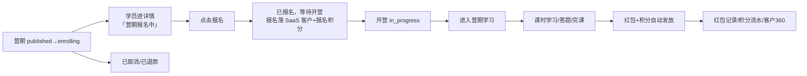
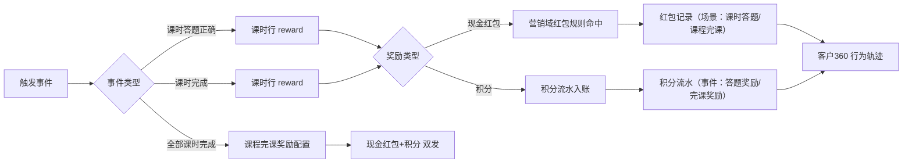
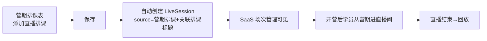
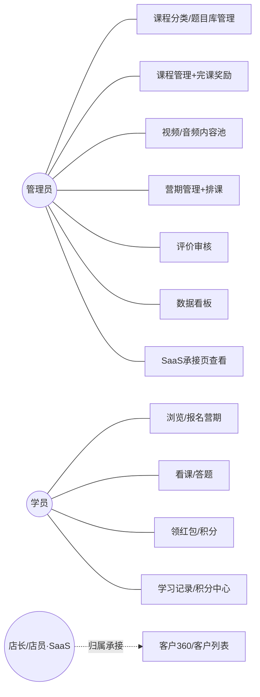
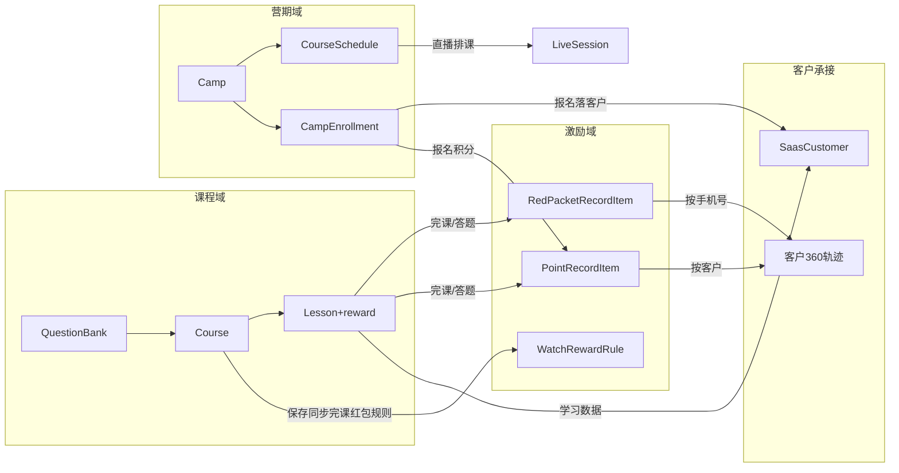
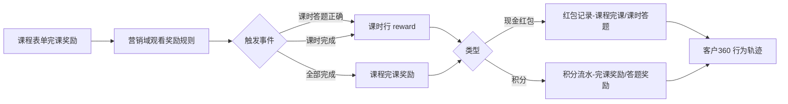

# 18-课程与营期域-PRD-v2.0.0

> **业务域**：课程与营期域（D18） | **版本**：v2.0.0（V2·0829 商业模式重构版） | **日期**：2026-08-29
> **需求流**：SaaS-Class | **类型**：新增 | **优先级**：P0
> **数据来源**：当前原型实现（唯一事实来源）+ 0828 会议纪要 + 0829 用户裁决 + v1.4.0 历史PRD
> **追溯链**：UC-COURSE → FN-COURSE → PG-COURSE → SC-COURSE → BG-COURSE → BO-COURSE
> **系统缩写**：SAAS | **终端缩码**：PC（租户后台）+ APP（学员端 H5）
> **V2核心策略**：纯内容课堂。课程与营期后台发布、学员端免费直接看；激励（红包+积分）自动发放；客户归属统一走 SaaS 门店成员体系；行为数据回流 SaaS 客户档案（客户 360）
> **PRD状态**：Draft（待评审）
>
> **v2.0.0 商业模式重构说明（2026-08-29）**：
> - 0829 会议对业务模式做出根本性调整，本版按**当前原型实现**全量重写，v1.4.0 中与现状冲突的内容一律以本版为准。
> - **核心变化（V2·0829 裁决，详见 §10A）**：
>   ① 全免费：下线售卖/支付/订单/售后退款/合同全链路
>   ② 讲师/助教角色下线：含主讲人字段、讲师档案、分成、讲师/助教统计
>   ③ 报名免审核：报名状态统一「已报名」，下线报名审核页与学员管理独立页
>   ④ 下线九个模块：报名审核/学员管理/营期售后/答疑管理/结营测验/合同管理/证书管理/分成记录/分成提现
>   ⑤ 红包+积分保留：完课红包/答题红包（课时行配置）+课程积分任务，全部自动发放
>   ⑥ 客户归属：统一走 SaaS 门店成员（店长/店员），课程业务不自带归属
>   ⑦ 营期排课直播落地 LiveSession（来源标记「营期排课」）
>   ⑧ 数据看板重构（卡片/图表/报表按新口径）
>   ⑨ 表单精简：课程库/视频/音频/题目库/分类按新规则
>   ⑩ SaaS 承接页（课程结合 6 页）1:1 复刻+红框标注课程域修改
> - **与 v1.4.0 的关系**：章节结构完全保持一致（§1~§31）；已下线功能在对应章节标注「已下线」并说明去向；未受裁决影响的部分（题目/答题/排课引擎/内容保护等）沿用 v1.4.0 定义并在本版明确保留。

---

## §1 版本历史

| 版本 | 日期 | 变更内容 |
|------|------|----------|
| v1.0.0 | 2026-08-18 | 初版——基于 SugarMate 逆向分析 + 脑暴确认稿（D1-D35）。33 实体 / 12 状态机 / 7 store。 |
| v1.1.0 | 2026-08-19 | 补直播域/门店域/首页配置；实体 33→38；Store 7→10。 |
| v1.2.0 | 2026-08-20 | 审查修复（LiveSession 状态机等 12 项）。 |
| v1.2.1 | 2026-08-20 | 二轮审查修复（编号/引用修正）。 |
| v1.3.0 | 2026-08-23 | 合并 16-课程域 PRD；店长=主讲/店员=助教映射；新增分享归因实体。 |
| v1.4.0 | 2026-08-25 | 原型对齐修订：组织结构新增讲师/助教角色；课程商品独立售卖；退款独立状态机；分成线下打款；打卡移除。 |
| v1.4.1 | 2026-08-27 | PRD-原型一致性修订：废弃终端角色管理；红包/钱包/权益页废弃走 SaaS 域。 |
| v1.4.2 | 2026-08-28 | 资质审核暂缓；打卡/积分残留清理；排课锁定规则；看板对齐。 |
| v1.4.3 | 2026-08-28 | 方案A·报名审核开关（require_review 默认关闭）。 |
| **v2.0.0** | **2026-08-29** | **V2·0829 商业模式重构（本版）**：全免费；讲师/助教下线；报名免审核状态统一；下线九模块；红包积分自动发放；归属走门店成员；排课直播落地 LiveSession；看板重构；表单精简；课程结合承接页。详见 §10A。 |

---

## §2 目录

1. 版本历史 → 2. 目录 → 3. 背景与问题陈述 → 4. 目标与成功度量 → 5. 范围 → 6. 与既有模块关系 → 7. 业务目标映射 → 8. 用户故事 → 9. 业务流程图 → 10. 角色与权限 → 10A. V2 决策 → 11. 业务规则（BR） → 12. 数据实体（ENT） → 13. 功能需求（FN） → 14. 状态机 → 15. Store 架构 → 16. 用例（UC） → 17. 验收标准 → 18. 五类图 → 19. 业务流程（文字详述） → 20. 指标登记 → 21. CONFIG 集中配置 → 22. 外部接口标注 → 23. 非功能性需求 → 24. 关键决策索引 → 25. 需求深度分析摘要 → 26. 落地优先级与影响分析 → 27. 验收检查清单 → 28. 下一步计划 → 29. 附录 → 30. 自动排课功能补充 → 31. 需求说明面板字段规范

---

## §3 背景与问题陈述

### 3.1 业务背景

SaaS-Class 课程与营期域 V2 定位为**纯内容课堂**：课程与营期由后台统一发布，学员端免费直接看。业务链路收敛为「内容生产（管理员→课程→审核）→ 营期组织（营期→排课→直播落地）→ 学员学习（报名→开营→学习→答题）→ 自动激励（完课红包/答题红包/积分任务）→ 客户沉淀（行为数据回流 SaaS 客户 360，归属门店店长/店员）」。

商业变现不在本域承担（无售卖/支付/订单/分成）；课程业务作为 SaaS 电商系统的**附加能力**，核心价值是帮门店（店长/店员）经营客户关系——通过内容与服务沉淀客户，业绩归属由 SaaS 门店成员体系承接。

### 3.2 核心问题（V2 视角）

| 问题编号 | 问题 | 严重程度 | 解决方案 |
|----------|------|----------|---------|
| COURSE-ISSUE-011 | v1.x 付费/分成/讲师体系与"免费引流内容"定位冲突，研发维护成本高 | 🔴 高 | V2·0829 商业模式重构（§10A） |
| COURSE-ISSUE-012 | 报名审核在免费模式下阻断转化（报名→审核→等待，无支付意义） | 🔴 高 | 报名免审核，状态统一「已报名」 |
| COURSE-ISSUE-013 | 课程级答题红包与课时行奖励双入口重复配置 | 🟡 中 | 答题奖励唯一入口=课时行「添加奖励」 |
| COURSE-ISSUE-014 | 学员管理/归属调整与 SaaS 客户体系重复建设 | 🟡 中 | 学员数据复用 SaaS 客户列表，归属走门店成员 |
| COURSE-ISSUE-015 | 看板指标口径混乱（报名总数 vs 学员总数冲突、逐人绘图不可扩展） | 🟡 中 | 看板重构（§6/§13 FN-PC-016） |
| COURSE-ISSUE-001 | 之前课程业务 APP 报名为假交互 | ✅ 已解决 | 报名真实落 store 并同步 SaaS 客户 |
| COURSE-ISSUE-003 | 完播率默认值多处混存冲突 | ✅ 已解决 | 完播率 90% 单点定义 |
| COURSE-ISSUE-007 | 营期状态机流转无 action 驱动 | ✅ 已解决 | 流转触发规则明确 |

### 3.3 需求边界

| 管控对象 | 业务内容 | 技术方案 | V2 |
|---|---|---|---|
| 课程内容 | 课程/课时/视频音频内容池/题库/题目/答题/评价 | sim-data mock + Pinia | ✅ |
| 营期组织 | 营期/排课/报名/直播排课落地 | sim-data mock + Pinia | ✅ |
| 激励体系 | 完课红包/答题红包/课程积分任务（自动发放） | sim-data mock + Pinia | ✅ |
| 客户承接 | 报名落客户/学习数据回传/积分红包流水（SaaS 复刻页） | customer-replica-store + marketing-replica-store | ✅ |
| 交易支付 | 订单/支付/退款/合同 | — | ❌ V2 全免费已下线 |
| 讲师助教 | 讲师档案/资质/分成/提现/统计 | — | ❌ V2 角色下线 |
| 营期周边 | 售后/答疑/结营测验/合同/证书 | — | ❌ V2 已下线 |
| 营销 | 团购/秒杀/直播带货 | — | ❌ 沿用 v1.4 不做 |

---

## §4 目标与成功度量

| 目标编号 | 目标 | 度量指标 | 目标值 |
|----------|------|----------|--------|
| BO-COURSE-01 | 内容生产闭环 | 课程审核通过率 | ≥85% |
| BO-COURSE-02 | 营期组织闭环 | 营期完成率 | ≥60% |
| BO-COURSE-03 | 学员学习完成 | 平均完课率 | ≥70% |
| BO-COURSE-04 | 激励自动发放 | 红包/积分发放成功率 | ≥99% |
| BO-COURSE-05 | 客户沉淀 | 报名落客户率 | 100% |
| BO-COURSE-06 | 归属清晰 | 报名客户归属门店/店员率 | ≥95% |
| BG-COURSE-01 | 报名转化 | 营期详情→报名转化率 | ≥40% |
| BG-COURSE-02 | 开营留存 | 已报名→开营进入学习率 | ≥60% |
| BG-COURSE-03 | 激励拉动 | 领红包学员次日内留存 | ≥50% |
| BG-COURSE-04 | 内容规模 | 月均新增课程数 | ≥20 |

---

## §5 范围

### 5.1 In-Scope（V2）

**PC 后台（12 页面）**：课程分类管理 / 题目库 / 课程库（含课程学员查看抽屉）/ 视频课程（列表+编辑+批量添加）/ 音频课程（列表+编辑+批量添加）/ 课程评价审核 / 数据看板 / 营期列表（含学员列表抽屉）/ 排课表 / 课程结合·客户列表（复刻）/ 课程结合·观看奖励+红包记录+积分任务+积分记录（复刻）/ 课程结合·场次管理（复刻）。

**APP 学员端（核心页）**：首页 / 讲座中心（课程+营期列表）/ 课程详情 / 课时学习（完播答题+红包积分）/ 营期详情+报名 / 营期学习 / 学习记录 / 积分中心 / 直播间 / 个人中心。

**共享基础设施**：sim-data mock 数据层 / Pinia store（course/camp/member/wallet/live/home + customer-replica + marketing-replica）/ 状态机集中定义。

### 5.2 Non-Goals（V2 已下线与不做）

| # | 功能 | 原因 |
|---|------|------|
| N1 | 售卖/支付/订单/退款/合同 | V2 全免费，交易链路整体下线 |
| N2 | 讲师/助教角色及档案/资质/分成/提现/统计 | V2 角色下线，归属走门店成员 |
| N3 | 报名审核页/学员管理独立页 | 报名免审核；学员数据复用 SaaS 客户列表 |
| N4 | 营期售后/答疑管理/结营测验/合同管理/证书管理 | V2 已下线模块 |
| N5 | 分成记录/分成提现审核 | 无交易即无分成 |
| N6 | 课程上下架与售卖有效期、课程级答题红包、允许试看、类目介绍、禁用保护、题目介绍 | V2 表单精简裁决 |
| N7 | 营销（团购/秒杀/直播带货）、积分商城、答题 AI 判分 | 沿用 v1.4 不做 |
| N8 | 答疑（APP 营期答疑页） | V2 随答疑管理下线（APP 答疑入口同步移除） |

---

## §6 与既有模块关系

| 关系类型 | 模块 | 依赖内容 | V2 说明 |
|---|---|---|---|
| 复用（承接） | SaaS 营销域 | 红包规则/红包记录/积分任务/积分记录 | 课程事件回传；课程结合复刻页承接展示 |
| 复用（承接） | SaaS 客户域 | 客户档案/客户 360/归属（门店成员） | 报名落客户、学习数据回传、归属店长店员 |
| 依赖（上游） | SaaS 直播域 | 直播场次 LiveSession | 营期排课直播落地 LiveSession（来源标记）；学员跳转观看 |
| 依赖（上游） | 用户域 | 用户 | 学员身份 |
| 保留（内部） | 课程域 | 课程/课时/题库/答题/评价 | 本域自建 |
| 保留（内部） | 营期域 | 营期/排课/报名/学习记录 | 本域自建 |

---

## §7 业务目标映射

| BG编号 | 业务目标 | 关联BO | 关联FN | 优先级 |
|---|---|---|---|:---:|
| BG-COURSE-01 | 报名转化 | BO-COURSE-02 | FN-APP-CAMP-004（报名）、FN-PC-005（营期） | P0 |
| BG-COURSE-02 | 开营留存 | BO-COURSE-03 | FN-APP-CAMP-005（营期学习） | P0 |
| BG-COURSE-03 | 激励拉动 | BO-COURSE-04 | FN-APP-003（课时学习）、FN-PC-002（完课奖励） | P0 |
| BG-COURSE-04 | 客户沉淀 | BO-COURSE-05 | FN-GLUE-001（客户列表）、FN-GLUE-005（积分记录） | P0 |
| BG-COURSE-05 | 归属清晰 | BO-COURSE-06 | FN-GLUE-001（归属列，承接 SaaS 门店成员） | P1 |

---

## §8 用户故事

### 8.1 管理员用户故事

| 编号 | 角色 | 故事 |
|------|------|------|
| US-ADMIN-001 | 管理员 | 作为管理员，我需要管理课程分类（名称+图标），以便组织课程体系 |
| US-ADMIN-002 | 管理员 | 作为管理员，我需要维护题库和题目（单选/多选+选项答案），以便支撑课时答题 |
| US-ADMIN-003 | 管理员 | 作为管理员，我需要创建课程（录播/直播）并从视频/音频内容池组课，以便发布教学内容 |
| US-ADMIN-004 | 管理员 | 作为管理员，我需要为课时配置答题奖励、为课程配置完课奖励（红包+积分），以便自动激励学员 |
| US-ADMIN-005 | 管理员 | 作为管理员，我需要审核课程，以便控制内容质量 |
| US-ADMIN-006 | 管理员 | 作为管理员，我需要创建营期并排课（含直播排课），以便组织营期教学节奏 |
| US-ADMIN-007 | 管理员 | 作为管理员，我需要查看营期学员列表与学习进度，以便掌握营期情况 |
| US-ADMIN-008 | 管理员 | 作为管理员，我需要审核课程评价，以便控制评价质量 |
| US-ADMIN-009 | 管理员 | 作为管理员，我需要查看数据看板（营期/学员/完课/激励），以便监控业务运营 |
| US-ADMIN-010 | 管理员 | 作为管理员，我需要在 SaaS 复刻页查看课程行为在客户/营销侧的落点，以便确认数据回流正确 |

### 8.2 学员用户故事

| 编号 | 角色 | 故事 |
|------|------|------|
| US-STU-001 | 学员 | 作为学员，我需要在首页浏览推荐课程与营期，以便发现学习内容 |
| US-STU-002 | 学员 | 作为学员，我需要进入营期详情看到「营期报名中」并点击报名，以便加入营期 |
| US-STU-003 | 学员 | 作为学员，我需要报名后看到「已报名，等待开营」，以便明确下一步 |
| US-STU-004 | 学员 | 作为学员，我需要开营后直接进入学习，以便无打断地开始看课 |
| US-STU-005 | 学员 | 作为学员，我需要看课时视频并在完播节点答题，以便检验学习效果 |
| US-STU-006 | 学员 | 作为学员，我需要答题正确/完课后自动获得红包和积分，以便获得激励 |
| US-STU-007 | 学员 | 作为学员，我需要查看学习记录和积分流水，以便了解学习成果 |


## §9 业务流程图

### 9.1 课程发布闭环

```mermaid
flowchart LR
    A[创建课程 draft<br/>录播|直播] --> B[内容管理<br/>选择视频/音频组课<br/>课时行：是否答题+添加奖励]
    B --> C[完课奖励配置<br/>现金红包+积分可同选]
    C --> D[提交审核 pending_review]
    D --> E{审核}
    E -->|通过| F[已发布 published]
    E -->|驳回| G[rejected→修改重提]
    F --> H[直播课：自动创建直播间三联]
    F --> I[录播课：APP展示 visibility=public]
    F --> J[保存同步：完课红包规则→营销域观看奖励]
```

### 9.2 报名-开营-学习闭环（V2 主链路）



### 9.3 激励自动发放闭环



### 9.4 直播排课落地闭环



### 9.5 已下线流程（仅历史参考，见 v1.4.0 对应章节）

报名支付分成闭环（v1.4.0 §9.3）、退款回滚闭环（§9.4）、证书发放闭环（§9.7）——随交易链路与证书模块下线，流程不再存在。

---

## §10 角色与权限

### 10.1 角色定义

> **V2·0829 修订**：讲师/助教角色**删除**（v1.4.0 的组织结构讲师/助教角色一并废止）。课程不区分主讲人；客户归属由 **SaaS 门店成员** 承接。

| 角色 | 说明 | 权限边界 |
|------|------|---------|
| **平台管理员** | PC 后台运营 | 课程/题目/内容池/分类/营期/排课 全量管理；课程与评价审核；数据看板；SaaS 承接页查看 |
| **学员** | APP 端用户 | 浏览/报名/学习/答题/领红包积分/查看记录 |
| **店长/店员** | SaaS 门店成员 | 客户归属承接（课程报名客户自动归属，业绩归门店）；课程业务不提供归属调整入口 |

### 10.2 客户归属规则（V2 新增）

| 规则 | 说明 |
|------|------|
| 归属承接方 | SaaS 门店成员（店长/店员），课程域不维护归属关系 |
| 报名归属 | 报名落客户时按报名入口自动归属：门店码报名→归属该门店店员；自然流量→公共池（归属分配由 SaaS 侧规则决定） |
| 课程域边界 | 课程/营期表单**无任何归属字段**；学员列表抽屉只读展示 SaaS 归属信息 |

---

## §10A V2·0829 决策（本版最高优先级，废止 v1.4.0 D-v14-1~6）

> 以下 13 条决策为 0829 会议+用户裁决的固化，与任何旧决策冲突时**以本表为准**。旧决策废止状态见 §24。

| # | 决策 | 内容 | 影响章节 |
|---|------|------|---------|
| V2-01 | 全免费 | 课程/营期全部免费，无售卖/支付/订单/退款/合同 | §11/§12/§13/§14 |
| V2-02 | 讲师助教下线 | 角色删除；课程无主讲人字段；无分成/提现/讲师统计 | §10/§12/§13 |
| V2-03 | 报名免审核 | 无审核环节；状态统一「已报名」 | §11.3/§14.4/§13 |
| V2-04 | 下线九模块 | 报名审核/学员管理/营期售后/答疑/结营测验/合同/证书/分成记录/分成提现 | §13/§24 |
| V2-05 | 激励保留自动化 | 完课红包+答题红包（课时行）+课程完课奖励（现金红包+积分可同选）+积分任务（报名/完课/答题），全部自动发放 | §11.4/§13 |
| V2-06 | 客户归属走门店 | 归属承接 SaaS 门店成员（店长/店员）；课程域无归属字段 | §10.2/§13 |
| V2-07 | 排课直播落地 | 直播排课自动创建 LiveSession，标记「营期排课」来源 | §12.7/§13 |
| V2-08 | 数据回流 | 报名落客户（幂等）、学习数据回传、积分红包流水回流客户360 | §13 FN-GLUE |
| V2-09 | 表单精简 | 课程库/视频/音频/题目/分类表单按 §13 各页「已移除」清单执行 | §13 |
| V2-10 | 答题奖励唯一入口 | 课程级答题红包配置移除；唯一入口=课时行「添加奖励」 | §13 FN-PC-002 |
| V2-11 | 有效期口径 | 课程/视频/音频有效期=长期有效 \| 自定义时间（原售卖有效期概念废弃） | §13 |
| V2-12 | 看板口径 | 报名状态统一「已报名」；指标卡/图表/报表按 §13 FN-PC-016 新口径 | §13 |
| V2-13 | 内容展示 | 视频列表无上下架状态；APP 首页无报名按钮（进详情报名） | §13 |

---

## §11 业务规则（BR）

### 11.1 课程域

| 编号 | 规则 |
|------|------|
| BR-COURSE-001 | 课程状态机：draft→pending_review→published；rejected→draft。offline 状态仅保留历史数据兼容，UI 不再提供手动停售/上架入口（V2-09） |
| BR-COURSE-002 | ~~讲师快照锁定~~ **已下线**（讲师角色删除，课程无讲师字段） |
| BR-COURSE-003 | 视频在内容池（视频课程/音频课程）上传，课程通过「选择视频/音频」引用组课 |
| BR-COURSE-004 | 完播触发答题（BR-QUIZ-003）：每题独立配置 trigger_threshold |
| BR-COURSE-005 | 课程分类租户自定义（D2）：category_id 关联 |
| BR-COURSE-006 | 课程可见性：public（APP 独立展示）/ camp_only（仅营期内可学） |
| BR-COURSE-007 | 直播课审核通过自动创建直播间三联（计划+场次+直播间，类型=课程直播） |
| BR-COURSE-008 | 课程与题库 1对1 绑定 |
| BR-COURSE-009 | 评价审核未通过模糊回显（pending/rejected 内容 blur+opacity） |
| BR-COURSE-010 | **有效期**：validity_type=long（长期）| custom（自定义失效时间）；仅数据记录与展示，无自动下架动作（V2-11） |
| BR-COURSE-011 | **全免费**：price=0、is_paid=false 固定值；表单无价格/售卖字段（V2-01） |
| BR-COURSE-012 | **完课奖励**：completion_reward_enabled 开启后，reward_cash_enabled（现金红包：金额+关联营销规则）与 reward_points_enabled（积分：分值）至少一项生效，两者可同时开启（V2-05） |
| BR-COURSE-013 | **完课红包同步营销域**：课程保存时按「完课红包·课程名」幂等创建/更新营销域观看奖励规则（reward_type=完课红包，bind_scene=营期） |

### 11.2 营期域

| 编号 | 规则 |
|------|------|
| BR-CAMP-001 | 营期模式创建后不可更改：live/recorded |
| BR-CAMP-CAL-04 | 同专题营期时间不交叉（validateCampCalendarNoOverlap） |
| BR-CAMP-003 | 营期状态机：draft→pending_review→published→enrolling→in_progress→ended |
| BR-CAMP-004 | 营期状态流转触发：submitCampForReview/approveCamp/openEnrollment/startCamp/endCamp |
| BR-CAMP-010 | **营期免费**：无价格/付费模式/分成字段（V2-01） |
| BR-CAMP-011 | **报名情况口径**：列表报名情况列统一展示「已报名 N」（V2-03/12） |
| BR-CAMP-012 | **直播排课落地**：直播排课保存自动创建 LiveSession（source=camp_schedule，回填关联排课标题）（V2-07） |

### 11.3 报名域

| 编号 | 规则 |
|------|------|
| BR-ENROLL-010 | **报名免审核**：createEnrollment 直接 enrolled，无 pending/approved/rejected 环节（V2-03） |
| BR-ENROLL-011 | **状态统一**：展示层 pending/approved/enrolled 统一显示「已报名」；cancelled=已取消、refunded=已退款（V2-03） |
| BR-ENROLL-012 | **报名落客户**：按手机号幂等创建/关联 SaaS 复刻客户（source=课程报名），learn_camp_count+1，落「课程报名」积分流水（+10） |
| BR-ENROLL-013 | **报名幂等**：同学员同营期拒绝重复报名 |
| BR-ENROLL-014 | **归属承接**：客户归属字段（门店/成员/身份）由 SaaS 门店成员体系维护，课程域只读展示 |

### 11.4 激励域（红包+积分，V2-05）

| 编号 | 规则 |
|------|------|
| BR-RED-020 | **红包规则来源**：营销域观看奖励规则（reward_type：完课红包/答题红包/观看红包）；课程保存同步创建完课规则（BR-COURSE-013） |
| BR-RED-021 | **答题奖励唯一入口**：课时行「添加奖励」（lesson.reward：{no, amount, count, type}）；type=积分 → 答题正确加积分；否则走红包规则发放（V2-10） |
| BR-RED-022 | **完课奖励发放**：课程下全部课时完成 → 瞬间触发课程完课奖励（现金红包按 reward_cash_enabled 金额发放+回流红包记录「课程完课」；积分按 reward_points 加分+落「完课奖励」流水；至少一项生效、可同开，仅开积分时弹窗展示积分样式与分值）；**每学员每课程仅发放一次**，重复播放/断点续播/跨营期重学同一课程均不重复触发；发放前断网/退出，进度与完成判定已回写，重新进入按完成结果补发弹窗、不重复发放（V2·0831） |
| BR-RED-023 | **积分任务**：课程报名(10)/课时完课(20)/课时答题(10)（SaaS 积分任务设置同步配置） |
| BR-RED-024 | **发放自动化**：全部激励由事件触发自动发放，无人工干预；发放记录回流营销域红包记录与客户积分流水 |
| BR-RED-025 | **客户360 回流**：红包记录按手机号关联客户；积分流水按客户关联；行为轨迹按时间倒序合并展示 |

### 11.5 学习域

| 编号 | 规则 |
|------|------|
| BR-LEARN-001 | **完播判定**：完播率默认 90%（COMPLETION_THRESHOLD=0.9 单点定义）；按自然播放累计时长 ÷ 课时时长计算，**拖动进度条只改变播放位置、不累计进度**；完播率 ≥90% 即计课时完成，前端"已完成"标签 ≥90% 显示、进度数值照实展示；含直播课时的课程，直播课时以**观看回放达到完播线**计入完成（V2·0831。示例：20 分钟课时需自然播放累计 ≥18 分钟；拖到片尾再退出不计进度） |
| BR-LEARN-002 | 学习记录不分区按课程聚合（source_type 标记 independent/camp） |
| BR-LEARN-010 | **学习数据回传**：完课时同步客户学习数据（时长+10min/完课率重算/「完课奖励」积分流水 +20）；答题正确落「答题奖励」流水 +10 |

### 11.6 已下线域（规则随模块下线废止）

支付域（SEQ-01~15）、分成域（BR-COMM-001~007）、证书域（BR-CERT-001~003）、测验域（BR-QUIZ-001~002 保留每题触发阈值 BR-QUIZ-003）、打卡（BR-LEARN-004）、邀请码（BR-LEARN-005）、答疑（D19）——详见 §24 决策索引废止标记。


## §12 数据实体（V2 收敛后）

> V2 实体清单：课程域 8（Course/Lesson/QuestionBank/Question/AnswerRecord/CourseQuizConfig/CourseReview/CourseReviewReply）+ 营期域 4（Camp/CampEnrollment/CourseSchedule/LearningRecord）+ 激励域 2（RedPacketRule(营销域)/RedPacketRecord(营销域)）+ 积分 1（PointRecord）+ 直播域 1（LiveSession）+ 客户承接 2（SaasCustomer/SaasPointsRecord，SaaS 复刻）+ 首页 1（HomeConfig）≈ **21 实体**。
> **已下线实体**（v1.4.0 定义，随模块下线不再新建）：DailyCheckin/CampInviteCode/CampLecturer/CampGroup/CampFinalQuiz/QA/CampCertificate/EnrollmentOrder/PaymentOrder/PaymentFlow/ContractOrder/CommissionBill/WithdrawRequest/RefundRequest/Lecturer/LecturerAssistantRelation/Wallet/WalletTransaction/LiveRoom/LiveProduct/ShareVisit/OrderAttribution/Series。字段级定义见 v1.4.0 §12（历史参考）。

### 12.1 课程域

#### ENT-COURSE-001 Course 课程（V2 修订）
| 字段 | 类型 | 说明 |
|------|------|------|
| id / course_no | string | COURSE-YYYYMM-NNNNN / 课程编号 |
| title | string | 课程名称（≤45 字） |
| description | string | 课程介绍 |
| cover_url | string | 封面（预设+上传） |
| category_id / category_name | string | 分类（D2 自定义） |
| tags | string[] | 标签 |
| source | 'upload'\|'live_replay' | 来源 |
| mode | 'recorded'\|'live' | 授课方式（业务新增） |
| visibility | 'public'\|'camp_only' | 可见性 |
| show_in_app | boolean | C 端展示开关（业务新增） |
| validity_type | 'long'\|'custom' | 有效期：长期|自定义（V2-11） |
| validity_custom_date | number? | 自定义失效时间 |
| completion_reward_enabled | boolean | 完课奖励开关 |
| reward_cash_enabled | boolean | 现金红包开关（与积分可同选） |
| reward_amount | number | 现金红包金额（分） |
| red_packet_rule_id | string? | 关联营销红包规则 |
| reward_points_enabled | boolean | 积分奖励开关 |
| reward_points | number | 完课积分分值 |
| show_intro / virtual_viewers / virtual_min / virtual_max / comment_enabled / comment_max_words / show_progress / allow_pause / completion_percent | - | 课程设置线上六项（1:1） |
| forbid_seek / forbid_speed / watermark_horse / watermark_text | boolean | 内容保护四项（业务新增） |
| price / is_paid / lecturer_id / lecturer_name / commission_* / answer_reward_enabled / allow_preview / on_shelf / validity_fixed_days | - | **已移除字段**（V2-01/02/09/10） |
| status | 'draft'\|'pending_review'\|'published'\|'offline'\|'rejected' | 状态机（offline 不再由 UI 触发） |
| created_at / updated_at | number | 时间戳 |

#### ENT-COURSE-002 Lesson 课时（V2 修订）
| 字段 | 类型 | 说明 |
|------|------|------|
| id / lesson_no | string | LESSON-YYYYMM-NNNNN / 课时编号 |
| course_id | string \| null | 父课程（内容池课时可为空） |
| content_type | 'video'\|'audio' | 内容形态 |
| sort_order / title / description | - | 序号/名称/简介 |
| mode | 'recorded'\|'live' | 模式 |
| video_duration | number | 时长（秒） |
| question_bank_id | string? | 课时级题库（是否答题） |
| **reward** | {no, amount, count, type} \| null | **课时行奖励（V2-10 答题奖励唯一数据源）** |
| status | 'draft'\|'published'\|'offline' | 状态 |
| ~~is_free_preview / is_standalone_sale / price~~ | - | **已移除** |
| source | 'manual'\|'camp_schedule' | 来源（排课只读课时） |
| created_at / updated_at | number | 时间戳 |

#### ENT-COURSE-003 QuestionBank / ENT-COURSE-004 Question（V2 修订）
题库结构同 v1.4.0。Question **移除 intro（题目介绍）字段**（V2-09）；保留 question_type/content/options/correct_answer/score/trigger_type/trigger_time/trigger_threshold 及聚合字段。

#### ENT-COURSE-006 CourseType 课程分类（V2 修订，替代原 CourseTypeManage）
| 字段 | 类型 | 说明 |
|------|------|------|
| id / name / cover_url / status | - | 分类名称（≤30字）/图标/状态 |
| ~~description~~ | - | **已移除**（类目介绍） |

其余：AnswerRecord/CourseQuizConfig/CourseReview/CourseReviewReply 同 v1.4.0（creator_role 助教相关枚举值保留兼容但不再产生新数据）。

### 12.2 营期域

#### ENT-CAMP-001 Camp 营期（V2 修订）
| 字段 | 类型 | 说明 |
|------|------|------|
| id / camp_no / title / description / cover_url | - | 基础信息 |
| mode | 'live'\|'recorded' | 模式（不可改） |
| start_date / end_date / total_days | - | 时间（≤90 天） |
| capacity | number | 报名上限（0=不限） |
| enroll_deadline | number? | 报名截止 |
| enrolled_count | number | 已报名数（统一口径） |
| ~~price / is_paid / commission_* / lecturer_rate / assistant_rate / platform_rate / certificate_checkin_threshold / main_lecturer_* / approved_count / joined_count / dailyRedPacketMode~~ | - | **已移除**（免费/无讲师/状态统一） |
| course_count / schedule_count / status | - | 聚合与状态机 |
| created_at / updated_at | number | 时间戳 |

#### ENT-CAMP-002 CampEnrollment 营期报名（V2 修订）
| 字段 | 类型 | 说明 |
|------|------|------|
| id / camp_id / camp_title | - | 营期关联 |
| student_id / student_name / student_phone | - | 学员信息（手机号为落客户幂等键） |
| channel | 'direct'\|'admin_assign' | 报名通道（邀请码通道已下线） |
| status | 'enrolled'\|'cancelled'\|'refunded' | **状态收敛为 3 态**（V2-03；展示层统一「已报名」） |
| ~~assistant_id / assistant_name / group_id / belong_type / invite_code_id / reviewer_id / review_remark / camp_order_id~~ | - | **已移除**（无审核/无归属/无邀请码/无订单） |
| enrolled_at / created_at / updated_at | number | 时间戳 |

#### ENT-CAMP-005 CourseSchedule 营期排课
同 v1.4.0（schedule_type/schedule_mode/course_id/lesson_id/live_session_id/unlock_time/title/completion_criteria 等）；V2 补充：直播排课保存联动 ENT-LIVE-001（见 §12.7）。

#### ENT-CAMP-009 LearningRecord 学习记录
同 v1.4.0；V2 补充：完课触发客户学习数据回传（customer-replica-store.syncLearningData）。

#### ~~ENT-CAMP-003 DailyCheckin / 004 CampInviteCode / 006 CampLecturer / 007 CampGroup / 008 CampFinalQuiz / 010 QA / 011 CampCertificate~~
**已下线**（V2-04；字段定义见 v1.4.0 §12.2 历史参考）。

### 12.3 激励域（营销域承接，课程事件回传）

#### ENT-RED-020 WatchRewardRule 观看奖励规则（营销域，V2 修订）
| 字段 | 类型 | 说明 |
|------|------|------|
| id / rule_no / rule_name | - | 规则编号/名称 |
| reward_type | '观看红包'\|'完课红包'\|'答题红包' | 类型（课程域新增后两类） |
| bind_scene | '直播间场次'\|'营期' | 绑定场景（新增营期） |
| scene_name | string | 场景名称（课程名/营期名） |
| amount_yuan / total_count / issued_count / received_count | - | 金额（元）/个数/发放/领取 |
| status | 'enabled'\|'disabled' | 状态 |

#### ENT-RED-021 RedPacketRecordItem 红包记录（营销域，V2 修订）
| 字段 | 类型 | 说明 |
|------|------|------|
| id / rule_name / user_name / phone / amount_yuan | - | 记录基础 |
| scene | '直播间'\|'课程完课'\|'课时答题' | 场景（新增课程事件） |
| obtained_at / receive_status | - | 时间/状态 |

#### ENT-PTS-002 PointRecordItem 积分流水（SaaS 口径）
| 字段 | 类型 | 说明 |
|------|------|------|
| id / customer_id / event / reason | - | 事件（管理员发放/课程报名/完课奖励/答题奖励） |
| type / delta / status | - | 类型（发放积分）/变动/状态 |
| operate_at / expire_at / related_order_no | - | 时间/过期/关联单号 |

### 12.4 客户承接域（SaaS 复刻）

#### ENT-GLUE-001 SaasCustomer 客户（1:1 复刻 SaaS 客户列表 + 课程域修改）
| 字段 | 类型 | 说明 |
|------|------|------|
| id / customer_no / customer_name / phone | - | 客户基础 |
| level / level_status / growth_total / growth_value / level_expire / benefit_count | - | 等级成长值（SaaS 侧） |
| store_name / store_staff_name / store_staff_role | - | **归属（店长/店员，SaaS 门店成员承接）** |
| source | 'APP注册'\|'门店导入'\|'课程报名' | 来源（课程域新增枚举） |
| points / points_frozen / points_total_issued | - | 积分 |
| learn_course_count / learn_camp_count / learn_duration_min / completion_rate | - | **学习数据 4 项（课程域新增）** |
| tags / status / created_at / updated_at / member_at / last_consume_at / last_login_at / ip | - | 其余 1:1 |

#### ENT-GLUE-002 SaasPointsRecord 客户积分流水
字段：id/customer_id/event（管理员发放|课程报名|完课奖励|答题奖励）/reason/type/operate_at/expire_at/status/delta/related_order_no。

### 12.5 直播域

#### ENT-LIVE-001 LiveSession 直播场次（V2 修订）
| 字段 | 类型 | 说明 |
|------|------|------|
| id / session_no / title | - | 场次基础 |
| anchor_id / anchor_name | string | 主播（直播域概念，非讲师） |
| **source** | 'normal'\|'camp_schedule' | **来源（V2-07：营期排课标记）** |
| **schedule_id / schedule_title** | string? | **关联排课（V2-07）** |
| mode / status / start_time / end_time / viewer_count / replay_url | - | 同 v1.4.0 |
| ~~lecturer_id / lecturer_name / room_id / product_ids~~ | - | **已移除/移交直播域** |

---

## §13 功能需求（FN，逐页对齐原型）

### 13.1 PC 端（12 页面）

| 编号 | 页面 | 优先级 | 原型文件 |
|------|------|:---:|------|
| FN-PC-001 | 课程分类管理 | P1 | CourseTypeManagePage |
| FN-PC-002 | 课程库（列表+抽屉+学员查看） | P0 | CourseManagePage |
| FN-PC-003 | 视频课程（列表/编辑/批量） | P0 | VideoListPage/VideoEditPage/VideoBatchAddPage |
| FN-PC-004 | 音频课程（列表/编辑/批量） | P0 | AudioListPage/AudioEditPage/AudioBatchAddPage |
| FN-PC-005 | 题目库 | P0 | QuestionBankManagePage |
| FN-PC-006 | 课程评价审核 | P0 | CourseReviewManagePage |
| FN-PC-007 | 数据看板 | P1 | CampDashboardPage |
| FN-PC-008 | 营期列表（含学员列表抽屉） | P0 | CampManagePage + CampStudentDrawerPage |
| FN-PC-009 | 排课表 | P0 | CampSchedulePage |
| FN-GLUE-001 | 课程结合·客户列表 | P0 | saas-replica/customer/CustomerListPage + CustomerDetailPage |
| FN-GLUE-002 | 课程结合·观看奖励/红包记录/积分任务/积分记录 | P0 | saas-replica/marketing/* |
| FN-GLUE-003 | 课程结合·场次管理 | P0 | saas-replica/live/LiveSessionsReplicaPage |

#### FN-PC-001 课程分类管理
**功能点**：1. 分类列表（名称/图标/排序/关联课程数/状态/操作=编辑、禁用|启用）2. 新建/编辑类目（分类名称\*30字 + 上传图标）。
**已移除**：类目介绍字段、禁用保护规则。
**已移除项**：~~FN-COURSE-PC-003 课时管理抽屉~~（入口随操作列删除，组课在编辑抽屉内容管理完成）、~~FN-COURSE-PC-008 订单~~、~~009 售后~~、~~010 分成~~、~~011 报名审核~~、~~012 学员管理~~、~~013 分成提现~~、~~015 证书~~（V2-04/09）。

#### FN-PC-002 课程库
**功能点**：
1. 列表：筛选（创建时间/名称/编号/分类/关键词/状态）；列（编号/名称/分类/查看视频/查看音频/查看题库/创建时间/状态/操作）；操作（编辑/学员/提交审核/审核通过/驳回/删除）。
2. 编辑抽屉五区块（详见 §4.3）：基本信息 → 内容管理（选择视频/音频+课时行是否答题+添加奖励）→ 展示设置（有效期+C端展示）→ 完课奖励配置 → 课程设置+内容保护。
3. 查看视频/查看音频弹窗（播放器+文件信息）。
4. 学员查看抽屉（课程维度学员：编号/姓名/手机号/开通时间/学习状态/进度；无支付方式/实付列）。
5. 保存联动：完课红包规则同步营销域（幂等）。

**已移除**：操作列停售/题库/课时按钮、主讲人区块、上架设置区块、允许试看、课程级答题奖励红包、售卖/分成字段。

#### FN-PC-003 / FN-PC-004 视频课程 / 音频课程
**功能点**：
1. 列表：ID/内容标题/时长/创建时间/操作（编辑/删除）；批量添加入口。
2. 编辑表单：标题\*+上传+详情富文本+封面+有效期（长期|自定义）+播放设置（禁拖动/禁倍速）+内容保护（跑马灯/水印）。
3. 批量添加：内容池多选+统一简介+有效期+保护设置。
**已移除**：上架状态列/筛选/操作（含草稿态）、购买前详情模式两选项、允许试看/试听、售卖信息、主讲人。

#### FN-PC-005 题目库
**功能点**：题目列表 1:1 线上；新增/编辑（所属分类\*+题目名称\*+类型+选项+正确答案）；每题独立触发配置（trigger_type/trigger_threshold 沿用）。
**已移除**：题目介绍字段。

#### FN-PC-006 课程评价审核
沿用 v1.4.0 FN-COURSE-PC-014（评价列表/审核通过驳回/回复/模糊回显）。

#### FN-PC-007 数据看板
**功能点**：
1. 指标卡 4 张：营期总数（直播|录播）/学员总数（已报名学员）/进行中营期（已结束 N）/平均完成率。
2. 图表两列大图：观看与完播人数趋势（分组柱状；日期升序；Y 轴取整刻度，档位 50~50000 覆盖万级）+ 完播率趋势（折线，Y 轴 0~90% 固定）。
3. 报表四 Tab：
   - 每日统计：日期/直播课程数/观看人数/完播人数/完播率/答题人数/正确人数/正确率/答题红包/观看次数/完播次数/视频完播率（**无会员总数/新增会员列**）+ 合计行 + CSV 导出。
   - 会员统计：观看次数分布直方图（等宽分桶 0/1-5/6-10/11-15/16-20/>20）+ 红包领取总金额与个数 KPI 卡 + 观看/完播合计 KPI 卡 + 会员明细表（分页）。
   - 营期统计：各营期报名人数对比 + 营期明细（报名列=已报名 N）。
   - 课程统计：课程分类占比 + 课程明细。
**已移除**：报名总数卡、报名转化漏斗、营期状态分布（看板图表区+营期统计 Tab）、排课完成率、主讲/助教统计 Tab、会员总数/新增会员列。

#### FN-PC-008 营期列表
**功能点**：
1. 列表：标题/模式/时间/报名情况（已报名 N）/状态/操作（编辑/详情/驳回等）。
2. 新增/编辑：标题\*/模式\*/直播联动提示/时间\*（≤90 天校验）/报名上限/报名截止/营期简介。
3. 学员列表抽屉：统计卡（报名总数/已报名/已取消/已退款）+ 学员表（学员/通道/状态/完成率）。
**已移除**：价格列与付费模式、发证、分组 Tab、调归属、学员管理独立页、报名审核页。

#### FN-PC-009 排课表
沿用 v1.4.0 §30 排课引擎（模板/一键排课/批量/打卡任务）；V2 变更：直播排课保存联动创建 LiveSession（source=camp_schedule）；讲师/助教分配配置随角色下线移除。

#### FN-GLUE-001~003 课程结合承接页（SaaS 复刻 1:1 + 红框标注课程域修改）
1. **客户列表**：1:1 线上列（22 列）+ 批量操作；红框新增=学习数据 4 列（学习课程数/参与营期数/学习时长/平均完课率）+ 客户来源「课程报名」+ 积分事件/红包场景课程枚举；积分管理弹窗（明细含课程事件）；客户详情 360（基础信息/数据概览含学习 4 项红框/行为轨迹红框：积分课程行为+红包领取合并时间线）。
2. **观看奖励**：1:1 规则列表；红框=红包类型新增「完课红包/答题红包」、绑定场景新增「营期」。
3. **红包记录**：1:1 记录列表；红框=红包场景新增「课程完课/课时答题」。
4. **积分任务设置**：1:1 任务列表；红框=新增课程报名(10)/课时完课(20)/课时答题(10)。
5. **积分记录**：1:1 流水列表；红框=积分事件新增课程三类。
6. **场次管理**：1:1 场次列表；红框=来源新增「营期排课」标记+关联排课标题列。
**联动链路**：课程表单配红包 → 观看奖励页出规则 → C 端完课/答题 → 红包记录+积分记录+客户360 三处同步可见。

### 13.2 APP 端（学员核心流程）

| 编号 | 页面 | 优先级 | 变更 |
|------|------|:---:|------|
| FN-APP-HOME | 首页 | P0 | Banner/金刚区/直播推荐/课程瀑布流；**报名按钮已移除**（进详情报名） |
| FN-APP-CAMP-004 | 营期详情+报名 | P0 | 状态机：营期报名中→点击报名→已报名等待开营→开营直接进入学习；无审核/支付/合同 |
| FN-APP-003 | 课时学习 | P0 | 完播答题→课时行奖励（红包/积分）自动发放+数据回传 |
| FN-APP-005 | 营期学习 | P0 | 课程/打卡任务列表（答疑/测验/排名 Tab 随模块下线移除） |
| FN-APP-007 | 学习记录 | P0 | 状态文案统一「已报名」 |
| FN-APP-015 | 积分中心 | P1 | 积分流水（含课程事件） |
| FN-APP-LIVE | 直播间 | P1 | 营期排课直播跳转观看 |

**已移除**：支付/合同/退款/钱包提现/助教讲师工作台及其子页/答疑页。
**状态口径**：报名状态文案统一「已报名」；营期头部统计「已报名 N 人」。


## §14 状态机定义（V2 现役 5 个 + 已下线 7 个）

### 14.1 Course 状态机（5状态）
| 当前状态 | 可流转到 | 触发 action |
|---------|---------|------------|
| draft | pending_review | submitCourseForReview |
| pending_review | published, rejected | approveCourse, rejectCourse |
| published | —（V2 无手动下架入口；offline 仅保留历史数据兼容） | — |
| offline | —（保留态） | — |
| rejected | draft | 修改后重新提交 |

### 14.2 Lesson 状态机（3状态，同 v1.4.0）
draft → published/offline；published → offline；offline → published/draft。

### 14.3 Camp 状态机（6状态，V2 简化）
| 当前状态 | 可流转到 | 触发 action |
|---------|---------|------------|
| draft | pending_review | submitCampForReview |
| pending_review | published, rejected | approveCamp, rejectCamp |
| published | enrolling | openEnrollment |
| enrolling | in_progress | startCamp |
| in_progress | ended | endCamp（不可逆） |
| ended | —（终态） | — |
> offline/rejected 分支随营期下架/驳回入口精简保留兼容；reported 流转同 v1.4.0 D15。

### 14.4 Enrollment 状态机（V2 收敛为 3 态）
| 当前状态 | 可流转到 | 触发 action |
|---------|---------|------------|
| enrolled | cancelled | cancelEnrollment |
| cancelled | —（终态） | — |
| refunded | —（终态） | — |
> **V2-03**：createEnrollment 直接落 enrolled（免审核）；存储层 pending/approved/rejected 枚举保留兼容（展示层统一映射「已报名」），不再产生新数据。

### 14.5 RedPacketRecord 状态机（营销域，沿用）
pending → success/failed；failed → retrying（重试3次指数退避）；retrying → success/failed。

### 14.6 LiveSession 状态机（4状态，同 v1.4.0）
not_started → live → ended → cancelled。

### 14.7 已下线状态机（保留历史参考，不再产生新数据）
CampOrder（4态）/PaymentOrder（6态）/CommissionBill（4态）/Contract（3态）/Lecturer（3态）/LecturerReview（3态）——随交易链路/讲师角色/证书合同模块下线，定义见 v1.4.0 §14.5~§14.10。

---

## §15 Store 架构（V2 现役 7 + 承接 2）

| Store | 域 | V2 变更 |
|---|---|---|
| useCourseStore | 课程域 | updateCourse/createLesson 增加 reward 落库；offlineCourse/republishCourse 已删（无 UI 入口）；useLecturerStore 引用已移除 |
| useCampStore | 营期域 | createEnrollment 直落 enrolled+联动落客户；createSchedule 直播排课联动 LiveSession；助教/分组/测验/证书/答疑 action 保留兼容但无 UI 入口 |
| useMemberStore | 积分域 | addPointRecord 沿用 |
| useWalletStore | 红包域 | loadRedPacketRules/grantRedPacket 沿用（课时行奖励触发） |
| useLiveStore | 直播域 | createSession（营期排课联动 source） |
| useHomeStore | 首页配置 | 沿用 |
| ~~useCampPaymentStore / useCommissionStore / useLecturerStore~~ | 交易/分成/讲师 | **已下线**（action 清单见 v1.4.0 §15.3/15.4/15.5） |
| **useCustomerReplicaStore**（新增） | SaaS 客户承接 | loadCustomers/upsertCustomerFromEnrollment（报名落客户幂等）/syncLearningData（完课答题学习数据+积分流水）/loadPointsByCustomer |
| **useMarketingReplicaStore**（新增） | SaaS 营销承接 | rules/redRecords/tasks（观看奖励规则/红包记录/积分任务 seed 与事件回流） |

> Store 架构原则沿用 ARCH-01 单源 Pinia（D6 sim-data mock）。

---

## §16 用例（UC，六段格式）

### UC-PC-002 课程管理

| 段 | 内容 |
|----|------|
| **用例名** | 课程管理（CRUD+审核+完课奖励） |
| **参与者** | 管理员 |
| **前置条件** | 课程分类已建；视频/音频内容池已有已发布内容（录播课） |
| **主流程** | 1.新增课程（基本信息+授课方式）→ 2.内容管理：从内容池选择视频/音频组课 → 3.课时行配置 是否答题 + 添加奖励 → 4.展示设置（有效期/C端展示）→ 5.完课奖励配置（现金红包/积分）→ 6.课程设置+内容保护 → 7.提交审核 → 8.审核通过发布（直播课自动建直播间三联；完课红包规则同步营销域） |
| **后置条件** | 课程 published；奖励规则落营销域；C 端可展示 |
| **异常流** | 审核驳回填备注/未选任何内容提交校验拦截/完课奖励未开类型提示 |

### UC-PC-008 营期管理

| 段 | 内容 |
|----|------|
| **用例名** | 营期管理 |
| **参与者** | 管理员 |
| **前置条件** | 课程库已有发布课程 |
| **主流程** | 1.新增营期（标题/模式/时间≤90天/上限/截止/简介）→ 2.提交审核 → 3.审核通过 → 4.排课（含直播排课自动落 LiveSession）→ 5.开始报名 → 6.开营 → 7.结束（不可逆） |
| **后置条件** | 营期按状态机流转；直播场次已落 |
| **异常流** | 时间交叉拒绝/超 90 天拒绝/模式创建后不可改 |

### UC-APP-004 营期报名与学习

| 段 | 内容 |
|----|------|
| **用例名** | 营期报名与学习 |
| **参与者** | 学员 |
| **前置条件** | 营期处于报名中/已开营；学员已登录 |
| **主流程** | 1.进入营期详情「营期报名中」→ 2.点击报名 → 3.提示「已报名，等待开营」（同步落 SaaS 客户+报名积分）→ 4.开营后详情直达「进入营期学习」→ 5.看课/答题 → 6.红包积分自动发放 |
| **后置条件** | 报名记录 enrolled；客户建档；激励入账 |
| **异常流** | 重复报名幂等拒绝/未开营不可进入学习/已结束营期不可报名 |

### UC-APP-003 课时学习+自动激励

| 段 | 内容 |
|----|------|
| **用例名** | 课时学习+完播答题+自动激励 |
| **参与者** | 学员 |
| **前置条件** | 学员已报名且营期已开营 |
| **主流程** | 1.播放课时视频 → 2.完播率≥trigger_threshold 弹题 → 3.答对 → 4.命中课时行 reward：积分→+N 积分流水；红包→营销规则发放+红包记录 → 5.完播率≥90% 课时完成 → 6.学习数据回传客户（时长/完课率/完课积分+20）→ 7.全部课时完成触发课程完课奖励 |
| **后置条件** | 学习记录更新；红包记录/积分流水/客户360 同步 |
| **异常流** | 答错不触发奖励/未配置课时奖励无发放/红包规则未命中提示/课程未开启完课奖励时全部课时完成仅更新学习记录（无弹窗无发放不报错）/完课奖励发放中断按完成结果补发不重复 |

### UC-GLUE-001 报名落客户（结合件①）

| 段 | 内容 |
|----|------|
| **用例名** | 报名落客户 |
| **参与者** | 系统 |
| **前置条件** | 学员报名成功 |
| **主流程** | 1.createEnrollment → 2.按手机号查复刻客户 → 3.已存在：learn_camp_count+1+落「课程报名」积分流水 → 4.不存在：建档（来源=课程报名，学习数据初始 0）+落积分流水 |
| **后置条件** | SaaS 复刻客户列表可见新客户/更新的营期数与积分 |
| **异常流** | 手机号为空跳过落客户/重复报名幂等 |

---

## §17 验收标准（GWT，V2 golden path）

### AC-V2-001 课程发布与奖励规则同步
- **Given** 管理员新建课程并开启完课奖励现金红包（金额 1 元）
- **When** 保存课程
- **Then** 营销复刻观看奖励页出现「完课红包·课程名」规则（金额 1 元）；重复保存不重复创建（幂等，仅更新金额）

### AC-V2-002 报名落客户幂等
- **Given** 学员（手机号 138\*\*\*\*0001）首次报名营期 A
- **When** createEnrollment 执行
- **Then** 复刻客户新建（来源=课程报名）+ learn_camp_count=1 + 「课程报名」积分流水 +10；再次报名营期 B 时**不新建客户**，learn_camp_count+1 并再落 +10 流水

### AC-V2-003 报名状态统一
- **Given** 学员已完成报名（任意历史状态）
- **When** 查看营期列表/学员列表/学习记录
- **Then** 状态文案显示「已报名」；营期列表报名情况显示「已报名 N」

### AC-V2-004 答题奖励按课时行发放
- **Given** 课时行已配置添加奖励（红包规则 X）
- **When** 学员答题正确
- **Then** 按规则发放红包，红包记录新增「课时答题」场景记录，客户积分流水落「答题奖励」+10

### AC-V2-005 完课奖励双类型
- **Given** 课程开启完课奖励且现金红包（1 元）与积分（20 分）同开
- **When** 学员完成全部课时（完播率≥90%）
- **Then** 红包记录新增「课程完课」+¥1.00；客户积分流水落「完课奖励」+20；学习时长+10min、完课率重算

### AC-V2-006 排课直播落地
- **Given** 营期添加直播排课并保存
- **When** 保存成功
- **Then** LiveSession 创建且来源标记「营期排课」；场次管理复刻页该场次显示排课标题

### AC-V2-007 看板口径
- **Given** 每日统计存在数据
- **When** 查看看板
- **Then** 指标卡无「报名总数」；每日统计无「会员总数/新增会员」列；人数趋势 Y 轴底部为 0 顶部为取整档位；完播率 Y 轴上限 90%

### AC-V2-008 APP 报名流程
- **Given** 营期处于报名中
- **When** 学员从首页进入营期详情并点击报名
- **Then** 提示「已报名，等待开营」；首页卡片无报名按钮；开营后详情显示「进入营期学习」直达学习页

---

## §18 五类图

### 18.1 用例图



### 18.2 业务信息流图



### 18.3 状态图
见 §14 状态机定义。

### 18.4 角色操作矩阵

| 操作 | 管理员 | 学员 |
|------|:---:|:---:|
| 课程/分类/题目/内容池 CRUD | ✅ | ❌ |
| 课程审核 | ✅ | ❌ |
| 营期 CRUD/排课 | ✅ | ❌ |
| 报名 | ❌ | ✅ |
| 看课/答题 | ❌ | ✅ |
| 红包/积分获得 | 系统 | 系统（自动） |
| 数据看板 | ✅ | ❌ |
| SaaS 承接页 | ✅（查看） | ❌ |
| 客户归属调整 | SaaS 门店域 | ❌ |

### 18.5 激励信息流图




## §19 业务流程（文字详述）

### 19.1 课程发布流程

```
管理员创建课程(draft，选授课方式 录播|直播)
  → 录播：从内容池选择视频/音频组课 → 课时行配置 是否答题 + 添加奖励（红包规则/积分）
  → 展示设置（有效期/C端展示） → 完课奖励配置（现金红包+积分可同选）
  → 提交审核(submitCourseForReview → pending_review)
  → 审核通过(approveCourse → published)：直播课自动创建直播间三联；完课红包规则同步营销域
  → 审核驳回(rejectCourse → rejected → 修改重新提交)
  → published 课程进入 APP（show_in_app 控制）或被营期引用
```

### 19.2 报名-开营-学习流程

```
营期 published → openEnrollment(enrolling)
  → 学员进入营期详情：「营期报名中」→ 点击报名
  → createEnrollment(直接 enrolled，V2-03 免审核)
    → 联动：customer-replica-store.upsertCustomerFromEnrollment
      （按手机号幂等建档 source=课程报名；learn_camp_count+1；积分流水「课程报名」+10）
  → 提示「已报名，等待开营」
  → startCamp(in_progress 开营)
  → 学员详情直达「进入营期学习」→ 课时学习（见 19.3）
```

### 19.3 课时学习与自动激励流程

```
学员进入 LessonLearnPage → 视频播放 onTimeUpdate 完播率
  → 完播率≥trigger_threshold → checkQuizTrigger 弹题 → submitAnswer
    → 答对且课时行有 reward：
       type=积分 → memberStore.addPointRecord(+N) + 同步客户「答题奖励」流水(+10)
       否则 → grantRedPacket（营销规则命中）+ 红包记录回流营销域（场景=课时答题）
  → 完播率≥90% → onPlayComplete 课时完成
    → courseStore.updateLearningRecord
    → customer-replica-store.syncLearningData（时长+10min/完课率/「完课奖励」+20）
    → 红包记录回流（场景=课程完课）
  → 全部课时完成 → 课程完课奖励（现金红包+积分按配置双发）
```

### 19.4 直播排课落地流程

```
营期排课表添加直播排课 → createSchedule(schedule_mode=live)
  → liveStore.createSession（source=camp_schedule，回填 schedule_id）
  → SaaS 场次管理复刻页显示：来源=营期排课 + 关联排课标题
  → 开营后学员从营期进入直播间 → 结束生成回放
```

### 19.5 已下线流程（历史参考见 v1.4.0 §19.3/19.4/19.7）

报名支付分成闭环、退款回滚闭环、证书发放闭环——随 V2 裁决下线。

---

## §20 指标登记

| 指标编号 | 指标名 | 类型 | 计算方式 | 关联BO | 采集点 |
|----------|--------|------|---------|--------|--------|
| MET-V2-001 | 课程审核通过率 | 比率 | approved/(approved+rejected) | BO-01 | approveCourse/rejectCourse |
| MET-V2-002 | 营期完成率 | 比率 | ended_camps/total_camps | BO-02 | transitionCampStatus |
| MET-V2-003 | 平均完课率 | 比率 | Σcompletion_rate/学员数 | BO-03 | updateLearningRecord |
| MET-V2-004 | 报名落客户率 | 比率 | 落客户数/报名数 | BO-05 | upsertCustomerFromEnrollment |
| MET-V2-005 | 激励发放成功率 | 比率 | success/(success+failed) | BO-04 | grantRedPacket/addPointRecord |
| MET-V2-006 | 报名转化率 | 比率 | 报名数/详情访问数 | BG-01 | createEnrollment |
| MET-V2-007 | 完课奖励覆盖率 | 比率 | 配置完课奖励课程数/课程总数 | BG-03 | doSave |

---

## §21 CONFIG 集中配置

| 配置项 | 值 | 说明 | 关联BR |
|--------|-----|------|--------|
| COMPLETION_THRESHOLD | 0.9 | 完播率完成判定阈值 | BR-LEARN-001 |
| QUIZ_PASS_RATE_DEFAULT | 0.6 | 答题通过率默认值 | BR-QUIZ-003 |
| COURSE_MAX_TITLE | 45 | 课程名称上限 | FN-PC-002 |
| CAMP_MAX_DAYS | 90 | 营期最长天数 | BR-CAMP-CAL-04 |
| ENROLL_POINT_REWARD | 10 | 报名积分 | BR-RED-023 |
| COMPLETION_POINT_REWARD | 20 | 完课积分 | BR-RED-023 |
| ANSWER_POINT_REWARD | 10 | 答题积分 | BR-RED-023 |
| DASHBOARD_RATE_MAX | 90 | 看板完播率 Y 轴上限（%） | FN-PC-007 |
| DASHBOARD_BUCKETS | 0/1-5/6-10/11-15/16-20/>20 | 观看次数分桶 | FN-PC-007 |

---

## §22 外部接口标注

| 接口 | 类型 | V2 状态 | 说明 |
|------|------|---------|------|
| SaaS 营销域 | 承接 | 依赖 | 完课红包规则创建、红包记录回流、积分任务/积分记录（课程结合复刻页 1:1） |
| SaaS 客户域 | 承接 | 依赖 | 报名落客户（幂等）、客户 360 行为轨迹、归属（门店成员） |
| SaaS 直播域 | 依赖 | 依赖 | 排课直播落 LiveSession；学员跳转直播间观看 |
| 用户域 | 身份 | 依赖 | 学员身份 |
| ~~支付渠道~~ | — | 已下线 | V2 无交易 |
| ~~腾讯云 IM~~ | — | 已下线 | 答疑随模块下线 |

---

## §23 非功能性需求

| 维度 | 要求 |
|------|------|
| 幂等性 | 报名落客户（手机号幂等）/红包规则同步（名称幂等）/报名重复拒绝 |
| 数据一致性 | 激励发放三处同步（红包记录/积分流水/客户360）原子落账 |
| 数据架构 | ARCH-01 单源 Pinia（sim-data mock）；承接页独立 replica-store |
| ID 格式 | {ENTITY}-YYYYMM-NNNNN 统一 |
| 状态机集中 | course-state-machine.ts 集中定义 |
| 图表性能 | 分桶统计（桶数固定），支持万级会员渲染 |
| 红框标注 | 复刻页课程域修改点以 ReplicaFieldBox 红框+编号角标标注，联动需求面板 |

---

## §24 关键决策索引（V2·0829 13 条 + 历史决策状态）

> **V2-01~13（§10A）为最高优先级**。历史决策状态标记如下：

| 决策 | 摘要 | V2 状态 |
|------|------|------|
| **V2-01~13** | 见 §10A | ✅ 生效（最高优先级） |
| D-v14-1~6 | v1.4.0 六项决策（讲师助教/独立售卖/订单/退款/分成线下/打卡移除） | ❌ 全部废止（被 V2-01/02/03/04/05 覆盖） |
| D2 | 课程分类通用化 | ✅ 保留 |
| D3 | 直播回放转课程 | ✅ 保留 |
| D6 | sim-data mock | ✅ 保留 |
| D9 | 金额统一为分 | ⚠️ 调整（红包金额字段沿用分，展示层元） |
| D12 | APP 报名真实落 store | ✅ 保留（并扩展落 SaaS 客户） |
| D14 | 完播率 90% 统一 | ✅ 保留 |
| D15 | 营期状态机流转 | ✅ 保留 |
| D17 | 邀请码原子+1 | ❌ 废止（邀请码体系下线） |
| D18 | 学习记录不分区 | ✅ 保留 |
| D19 | 答疑权限矩阵 | ❌ 废止（答疑下线） |
| D22/D22-A | 不做范围/直播场次 | ⚠️ 调整（直播排课落地 LiveSession 纳入） |
| D23/D24/D25/D29/D30/D31/D32/D33/D34/D35 | 红包钱包体系（讲师钱包/学员提现等） | ⚠️ 重构（V2-05：营销域规则+自动发放+回流，讲师钱包/提现废止） |
| D26 | 营期模式不可改 | ✅ 保留 |
| D27/D28 | 总测验/证书撤销补发 | ❌ 废止（测验/证书下线） |
| D1/D7/D8/D10/D11/D13/D16 | 讲师/打卡/证书/分成/退款回滚/快照 | ❌ 废止（讲师/交易/证书下线） |
| D20/D21 | 数据架构/范围 | ✅ 保留 |

---

## §25 需求深度分析摘要

### 25.1 风险分析（V2）

| 风险 | 等级 | 防护措施 |
|------|:---:|---------|
| 报名重复 | P0 | BR-ENROLL-013 幂等拒绝 |
| 落客户重复建档 | P0 | 手机号幂等 upsert |
| 红包重复发放 | P0 | 营销域规则幂等（ruleId+studentId+triggerType） |
| 红包滥用刷取 | P1 | 任务每日上限（积分任务 daily_limit）+ 风控字段预留 |
| 双 store 数据漂移 | P1 | 课程事件单点触发（camp-store/LessonLearnPage）→ replica store 消费 |
| 图表大数据渲染 | P1 | 分桶统计（桶数固定）+ 明细分页 |

### 25.2 业务闭环完整性

| 闭环 | 完整性 | 关键节点 |
|------|:---:|---------|
| 课程发布 | ✅ | draft→审核→published→奖励规则同步 |
| 报名学习 | ✅ | 报名→落客户→等待开营→开营直达学习 |
| 激励发放 | ✅ | 事件触发→规则命中→发放→三处记录同步 |
| 直播排课 | ✅ | 排课→LiveSession→学员观看 |
| 客户沉淀 | ✅ | 学习数据/积分/红包 → 客户360 |

### 25.3 与 v1.4.0 差异验证

| 维度 | v1.4.0 | v2.0.0 |
|------|--------|--------|
| 实体 | 38 | ~21（下线 22+ 新增承接 4） |
| 状态机 | 12 | 6 现役（下线 6） |
| Store | 10 | 7 现役 + 2 承接新增（下线 3） |
| PC 页面 | 22 | 12 |
| 交易链路 | 完整 | 全部下线 |

### 25.4 待确认的开放问题

| # | 问题 | 状态 |
|---|------|:---:|
| O1 | 报名客户归属分配规则（门店码→店员；自然流量→公共池的细化规则） | 待产品确认 |
| O2 | 红包反刷限额（单人单营期/单日上限） | 待产品确认 |
| O3 | 真实后端 API 对接（replica store → SaaS 真实接口） | 待排期 |
| O4 | 营期答疑是否恢复（当前下线，学员提问渠道缺失） | 待产品确认 |

---

## §26 落地优先级与影响分析

### 26.1 P0（已完成于原型）

课程库/视频/音频/题目/分类表单精简、营期免审核与状态统一、看板重构、激励自动发放链路、报名落客户、课程结合 6 承接页、APP 报名流程。

### 26.2 P1（待办）

客户归属分配规则落地（O1）、红包限额风控（O2）、真实后端对接（O3）、需求面板与 PRD 持续同步机制。

### 26.3 落地建议

1. 契约/Store 先行，页面依赖 action。
2. 回归以三条 golden path 为门禁：①课程保存→观看奖励出规则 ②报名→客户360 增长 ③完课→红包记录+积分流水+客户360。
3. replica store 与业务 store 的联动点已收敛（createEnrollment/updateLearningRecord/doSave/onPlayComplete/grantRedPacket 五处），接真实后端时替换这五处即可。

---

## §27 验收检查清单

| # | 检查项 | 状态 |
|---|--------|:---:|
| C1 | 版本历史 | ✅ §1 |
| C2 | 目录 | ✅ §2 |
| C3 | 背景/问题/边界 | ✅ §3 |
| C4 | 目标度量 | ✅ §4 |
| C5 | 范围/Non-Goals | ✅ §5 |
| C6 | 模块关系 | ✅ §6 |
| C7 | 目标映射 | ✅ §7 |
| C8 | 用户故事 | ✅ §8 |
| C9 | 流程图 | ✅ §9 mermaid |
| C10 | 角色权限+归属 | ✅ §10 |
| C10A | V2 决策 | ✅ §10A |
| C11 | BR | ✅ §11（含下线域标注） |
| C12 | 实体 | ✅ §12（含已下线清单） |
| C13 | FN 逐页 | ✅ §13 |
| C14 | 状态机 | ✅ §14 |
| C15 | Store | ✅ §15 |
| C16 | UC | ✅ §16 |
| C17 | GWT 验收 | ✅ §17 |
| C18 | 五类图 | ✅ §18 |
| C19 | 流程详述 | ✅ §19 |
| C20~C23 | 指标/CONFIG/接口/非功能 | ✅ |
| C24 | 决策索引（含废止标记） | ✅ §24 |
| C25~C26 | 分析/优先级 | ✅ |
| C27~C28 | 检查清单/计划 | ✅ §27/§28 |
| C29~C30 | 附录/排课补充 | ✅ §29/§30（排课沿用 v1.4.0 §30） |
| C31 | 需求面板规范 | ✅ §31 |

---

## §28 下一步计划

| # | 事项 | 负责方 | 状态 |
|---|------|--------|:---:|
| N1 | PRD v2.0.0 评审会（产品+研发+测试） | 产品 | 待评审 |
| N2 | O1 归属分配规则 / O2 红包限额 裁决 | 产品 | 待定 |
| N3 | 需求面板逐页说明按本 PRD 对齐 | 产品+前端 | 进行中 |
| N4 | O3 真实后端对接排期 | 研发 | 待定 |

---

## §29 附录

### 29.1 V2 与 v1.4.0 章节差异对照

| 章节 | v1.4.0 | v2.0.0 | 差异说明 |
|------|--------|--------|---------|
| §3 背景 | 知识付费+营期训练 | 纯内容课堂 | 商业模式重构 |
| §5 范围 | PC22+APP24 | PC12+APP核心 | 下线 9 模块 |
| §8 用户故事 | 讲师/学员/管理员 | 学员/管理员 | 讲师删除 |
| §9 流程 | 7 闭环（含支付/退款/证书） | 4 闭环 | 交易/证书闭环删除 |
| §10 角色 | 讲师/助教/学员/管理员 | 管理员/学员/店长店员 | 角色重构 |
| §10A | v1.4.0 六项决策 | V2·0829 十三项决策 | 全量替换 |
| §11 BR | 7 域 | 6 域（支付/分成/证书下线；新增激励/客户承接） | 重写 |
| §12 实体 | 38 | ~21 | 下线实体标注 |
| §13 FN | PC22+APP24 | PC12+APP核心+承接6 | 逐页重写 |
| §14 状态机 | 12 | 6 现役 | 收敛 |
| §15 Store | 10 | 7+2 | 支付/分成/讲师 store 下线 |
| §16~§19 | 含支付/证书用例流程 | 重写为 V2 闭环 | — |
| §24 决策 | D1-D35+D-v14 | V2-01~13+历史状态 | 全量标记 |
| §30 排课补充 | 完整 | ✅ 沿用 v1.4.0 §30（未受裁决影响） | — |
| §31 面板规范 | 字段规范 | 更新（简版/详细两模式+无标签） | 本版 §31 |

### 29.2 代码结构映射（V2 现役）

| PRD | 代码 |
|-----|------|
| 课程/营期/激励实体 | src/contracts/schemas/*.ts |
| 状态机 | src/contracts/state-machine/course-state-machine.ts |
| course/camp/member/wallet/live/home store | src/stores/*.ts |
| 客户承接 | src/stores/saas-replica/customer-replica-store.ts |
| 营销承接 | src/stores/saas-replica/marketing-replica-store.ts |
| PC 12 页 | src/pages/course/tenant/*.vue |
| APP 学员端 | src/pages/course/app/*.vue |
| 课程结合承接页 | src/pages/saas-replica/{customer,marketing,live}/*.vue |

---

## §30 自动排课功能补充

> **沿用 v1.4.0 §30 全部内容**（BR-CAMP-SCHED-001~009、FN-CAMP-SCHED-001~008、10 套排课模板、Store Action 补充），排课引擎未受 V2 裁决影响。唯一变更：直播排课保存联动创建 LiveSession（source=camp_schedule，见 §11.6 BR-CAMP-012）；讲师/助教分配配置随角色下线移除。详见 v1.4.0 §30。

---

## §31 需求说明面板字段规范（V2 更新）

> 需求面板（ReplicaRequirementPanel）展示每页需求说明。数据源 `src/data/replica-requirements.ts`。

### 31.1 两类说明模式

| 模式 | 适用页面 | 结构要求 |
|------|---------|---------|
| **详细模式** | 常规课程域页面（课程库/视频/音频/题目/营期/看板等） | 完整结构：title/field/type/description（+precondition/rules/exceptions 可选）。description 通俗直白，写清字段、操作、规则、异常，确保研发测试可直接照做；详细但不啰嗦 |
| **简版模式** | 课程结合承接页（6 页） | 仅说明：新增了哪些字段 + 上游来源 + 下游去向（一句话式） |

### 31.2 书写规范

| 规范 | 要求 |
|------|------|
| 语言 | 通俗易懂，不用拗口长句；研发和测试能直接看懂 |
| 详细度 | 详细但不啰嗦：每个改动点一条，覆盖字段/规则/异常即可，不堆砌废话 |
| 标签 | **不体现「线上原有」「业务新增」标签**（字段级 tag 已移除，面板不再渲染） |
| 状态同步 | 说明必须与当前原型一致；裁决变更时先改 PRD 再同步面板 |
| 红框联动 | marker 编号与页面红框角标一一对应，点击红框/角标面板滚动高亮 |

### 31.3 联动规则（沿用）

- 点击左侧菜单 → 面板按 route.path 自动匹配
- 页面内点击红框/角标 → marker-click 事件 → 面板滚动到对应编号并高亮
