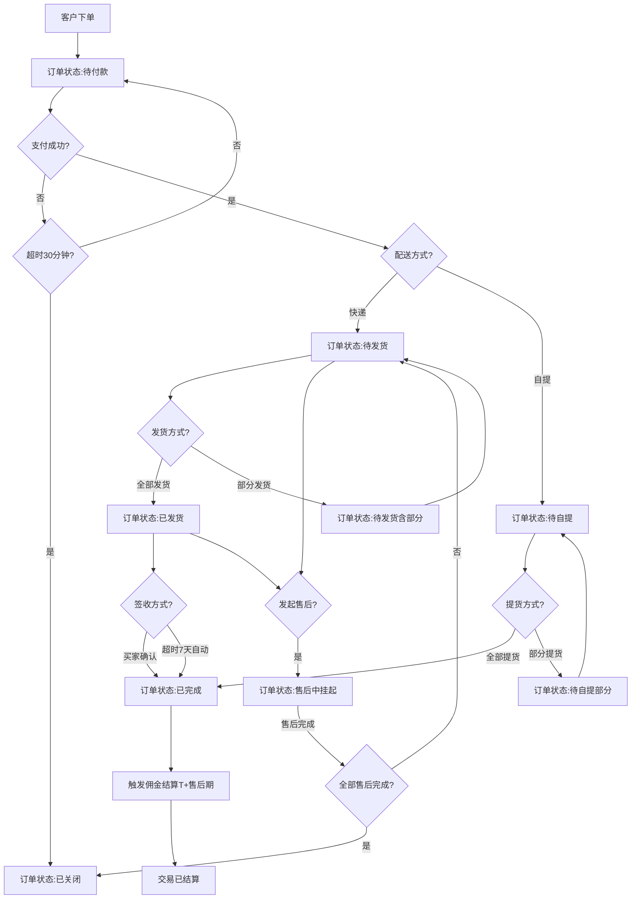
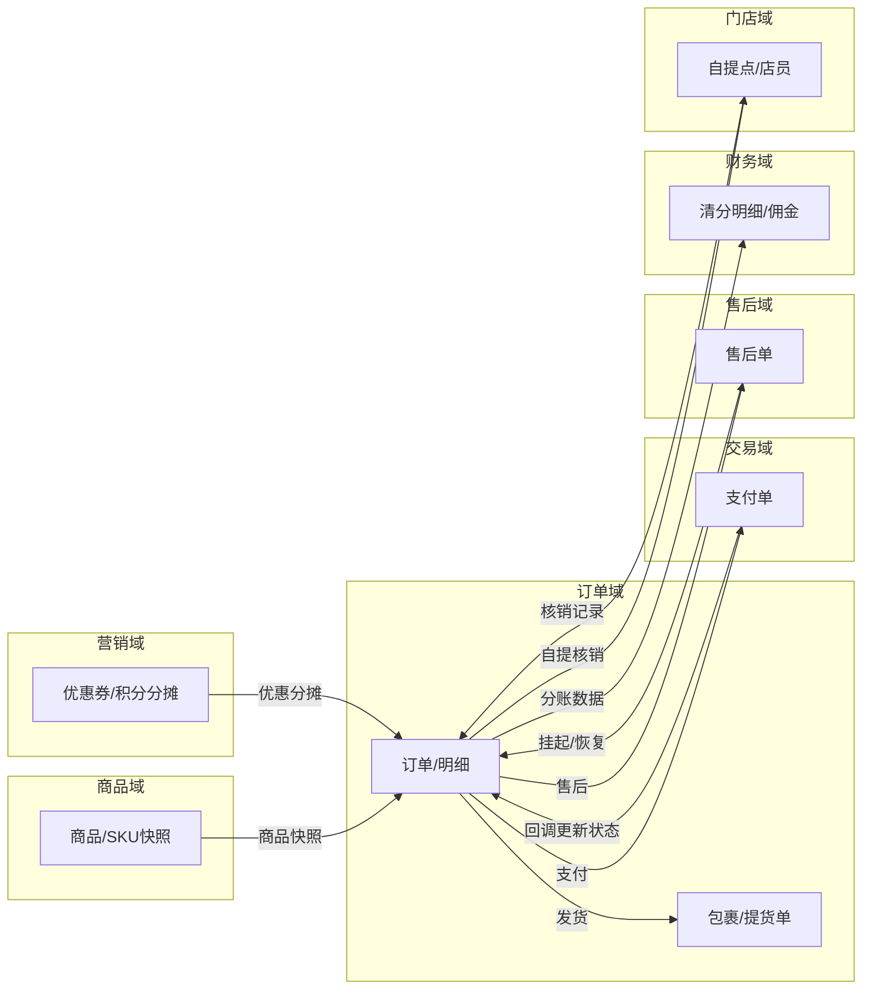
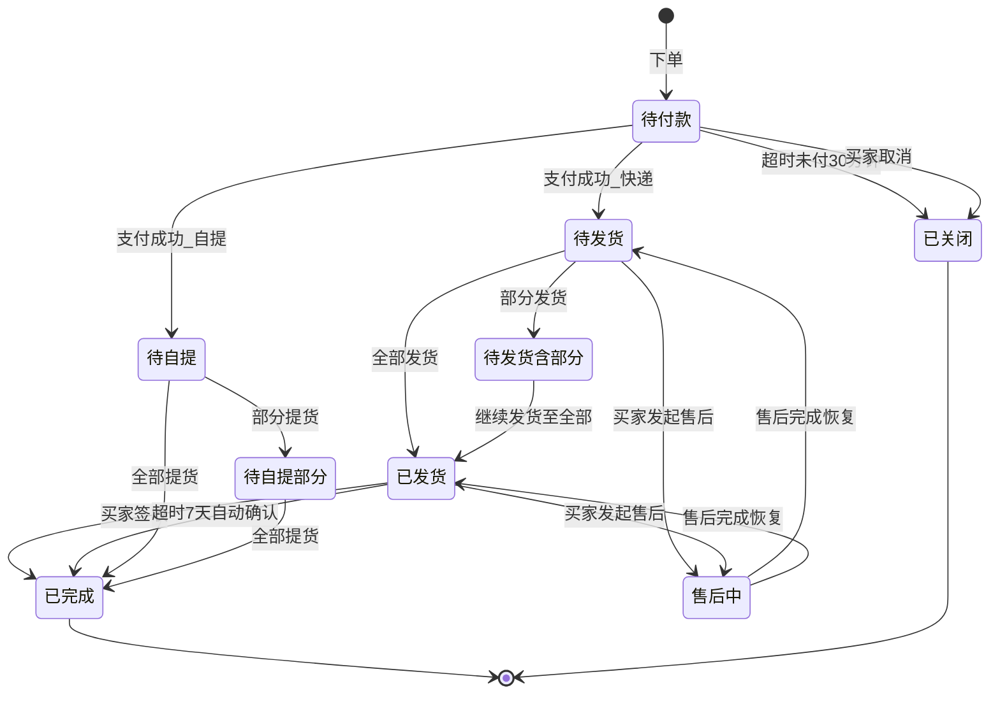
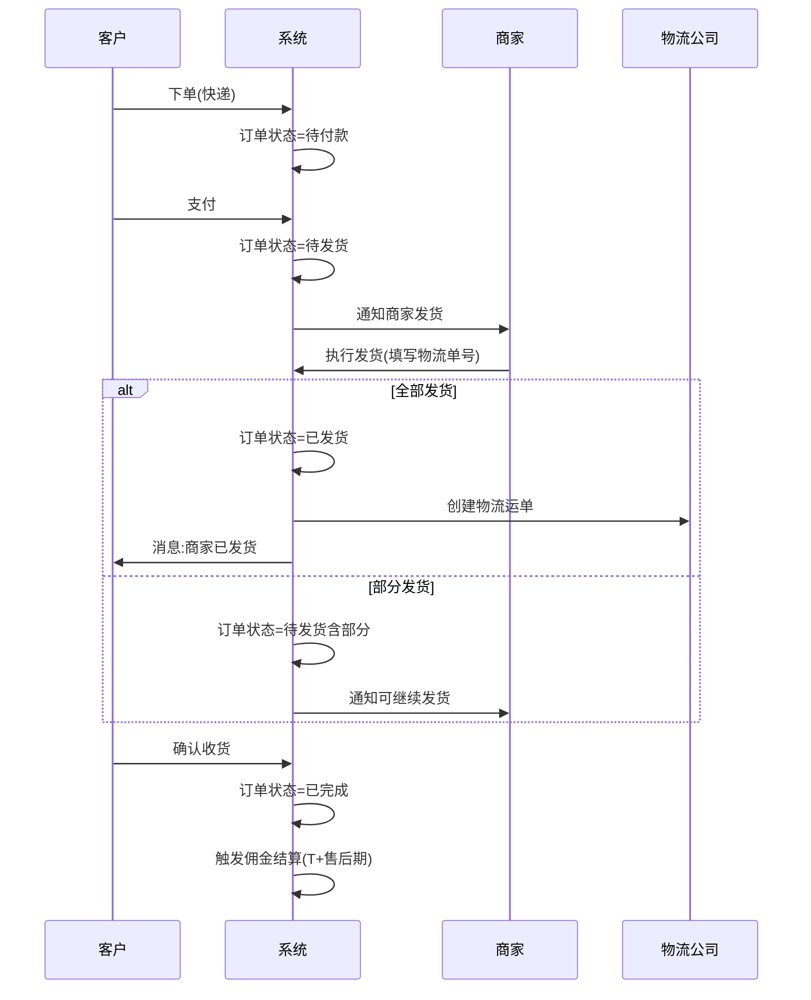
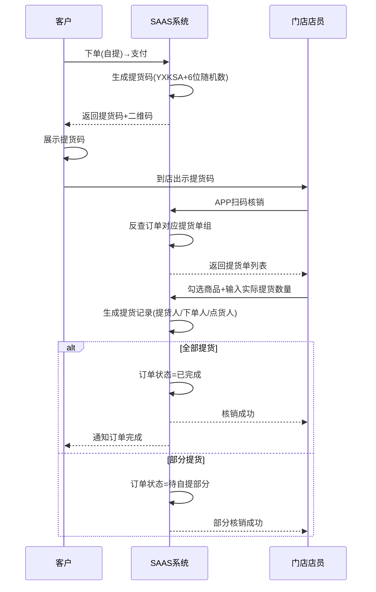
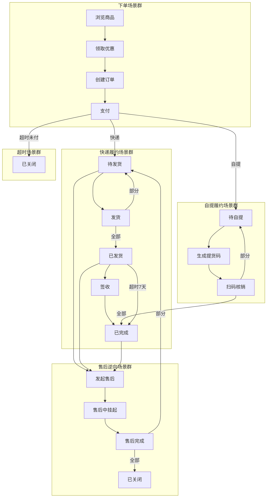
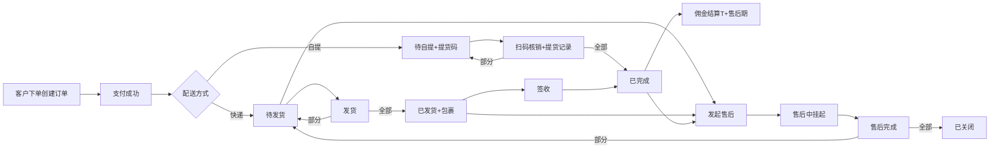

# 订单域 产品需求文档 PRD V7.0.1

> **文档类型**：业务域产品需求文档（PRD）
> **所属系统**：九天 SAAS 电商平台
> **业务域**：订单域（D02）
> **文档版本**：V7.0.1（基于 V1.0.3 执行 V7.0.0 场景深度还原增强）
> **编制日期**：2026-07-21
> **数据来源**：Axure 原型 V1.0.2 ~ V1.0.9（500+HTML）、`订单V1.0.0.md`、`SAAS系统功能详细清单.xlsx`、已有PRD V1.0.3
> **追溯链**：UC-ORD → FN-ORD → PG-ORD → MD-ORD → SC-ORD → BG-10 → BO-10
> **双态标注说明**：📗=显式照录（原型明确写出的） 🟡=隐式挖掘还原（≥2处原文依据交叉印证）

---

## 版本历史

| 版本 | 日期 | 变更内容 | 编制人 |
|------|------|----------|
| V7.0.1 | 2026-09-02 | 严谨性修订版：①技术语言全面中文化（数据实体字段/枚举值/数据类型/外部接口名/实体关系图）；②补齐未定值（担保交易自动确认 15 天、会员保级评估窗口 12 个月，均为平台可配）；③补齐业务规则（商品审核时限 24 小时、已关闭订单支付回调兜底退款）；④补齐三种售后类型状态流转差异说明；⑤逻辑闭环复查 |--------|
| V1.0.0 | 2026-05-15 | 整体业务域规划：B2C订单交易流（正向/逆向）、订单整体流程说明、售后单整体流程说明 | 产品团队 |
| V1.0.2 | 2026-05-15 | 订单管理列表页、订单详情（全状态覆盖）、操作功能（取消/备注/发货/修改地址/查看物流/查看自提码）、自提订单、直播中控室订单、APP端订单列表、消息中心 | 产品团队 |
| V1.0.3 | 2026-05-25 | APP-代理/渠道：门店订单、自提订单、充值订单；数据-报表：销售订单明细报表 | 产品团队 |
| V1.0.9 | 2026-07-16 | 按 PRD 规范 V1.0.0 重新编排 | AI-SCRM |
| V7.0.0 | 2026-07-21 | V7.0.0场景深度还原增强：新增场景编排图谱/隐式场景挖掘/异常路径矩阵/状态机完整性/信息流深度追踪/四维交叉验证/场景闭环验证/挖掘依据链审计8项深度还原内容 | agent-trade |

---

## 目录

1. [背景与问题陈述](#1-背景与问题陈述)
2. [目标与成功度量](#2-目标与成功度量)
3. [范围](#3-范围)
4. [与既有模块关系](#4-与既有模块关系)
5. [业务目标映射](#5-业务目标映射)
6. [用户故事](#6-用户故事)
7. [功能需求列表与用例](#7-功能需求列表与用例)
8. [业务规则](#8-业务规则)
9. [数据实体](#9-数据实体)
10. [验收标准](#10-验收标准)
11. [指标登记](#11-指标登记)
12. [五类图](#12-五类图)
13. [外部接口标注](#13-外部接口标注)
14. [场景编排图谱](#14-场景编排图谱)
15. [隐式场景挖掘](#15-隐式场景挖掘)
16. [异常路径矩阵](#16-异常路径矩阵)
17. [信息流深度追踪](#17-信息流深度追踪)
18. [四维交叉验证](#18-四维交叉验证)
19. [场景闭环验证](#19-场景闭环验证)
20. [挖掘依据链审计](#20-挖掘依据链审计)
21. [检查清单](#21-检查清单)

---

## 1. 背景与问题陈述

### 1.1 业务背景

订单域是 SAAS 商城系统中承接所有 2C 交易的核心枢纽域。订单作为交易数据的载体，贯穿买家下单、支付、发货/自提、收货确认、售后维权的全生命周期。当前版本订单创建入口仅支持 APP 客户提交，门店暂不支持门店开单。

### 1.2 核心场景

| 场景分类 | 说明 |
|---------|------|
| 正向交易流 | 客户浏览商品→领券/红包→创建订单→付款→商家发货→买家签收→交易完成 |
| 逆向交易流 | 买家发起售后→商家处理→仅退款/退货退款→售后完成→订单关闭 |
| 自提交易流 | 买家下单选择自提→付款→生成提货码→到店扫码提货→核销完成 |
| 直播订单流 | 直播间下单→中控室实时监控订单→备注/管理 |

### 1.3 订单类型

| 订单类型 | 说明 |
|---------|------|
| 销售订单 | 所有 2C 的标准销售订单，涉及实际支付 |
| 积分订单 | 仅使用积分兑换的销售订单 |
| 优惠订单 | 使用优惠券、折扣券、现金红包的销售订单 |
| 抽奖订单 | 抽奖活动的奖品订单，不经过支付环节 |

### 1.4 核心问题

| 问题编号 | 问题 | 严重程度 |
|----------|------|----------|
| ORD-ISSUE-001 | 拆单发货场景未展开页面设计 | 🟡 中 |
| ORD-ISSUE-002 | "售后中"状态定义不明确（标签叠加还是独立状态值） | 🟡 中 |
| ORD-ISSUE-003 | 批量操作项未展示具体弹窗 | 🟢 低 |
| ORD-ISSUE-004 | 订单金额修改变更记录未设计 | 🟢 低 |
| ORD-ISSUE-005 | 收货地址修改是否保留历史版本未明确 | 🟢 低 |
| ORD-ISSUE-006 | 支付超时时间（30分钟）硬编码 | 🟢 低 |
| ORD-ISSUE-007 | 自动确认收货天数（7天）是否可配置未明确 | 🟢 低 |
| ORD-ISSUE-008 | 订单列表缺少批量导出 | 🟢 低 |
| ORD-ISSUE-009 | 抽奖订单详情页和状态流未单独设计 | 🟢 低 |
| ORD-ISSUE-010 | 门店暂不支持门店开单（POS） | 🟡 中 |

---

## 2. 目标与成功度量

| 目标编号 | 目标 | 度量指标 | 目标值 |
|----------|------|----------|--------|
| BO-ORD-01 | 订单查询性能 | 第 99 百分位延迟 | < 200ms |
| BO-ORD-02 | 发货时效 | 商家平均发货时长 | < 24小时 |
| BO-ORD-03 | 自提核销效率 | 核销操作耗时 | < 5秒 |
| BO-ORD-04 | 订单消息触达时效 | 消息延迟 | < 1分钟 |

---

## 3. 范围

### 3.1 In-Scope

- 订单列表/搜索/筛选（多维度筛选+状态Tab切换）
- 订单详情（全状态覆盖：基本信息/进度条/商品明细/金额汇总/营销信息/分摊金额）
- 发货管理（全部发货/部分发货/修改地址/查看物流）
- 自提订单管理（自提码/自提单详情/扫码核销）
- APP端订单（个人中心订单列表+操作）
- 直播中控室订单（实时监控/备注）
- 订单消息推送（订单/物流/售后/营销/系统）
- 销售订单明细报表
- 门店订单/自提订单/充值订单（代理/渠道端）
- 积分订单（积分抵现/积分兑换）

### 3.2 Non-Goals

- 技术实现方案（属POM范围）
- 门店POS开单功能（暂未规划）
- 交易生命周期页面（暂未规划，占位）

---

## 4. 与既有模块关系

### 4.1 上下游依赖矩阵

| 方向 | 关联域 | 依赖关系 | 说明 |
|------|--------|----------|------|
| **上游（被依赖）** | 售后域 | 售后关联订单 | 售后单关联订单，售后挂起订单操作 |
| **上游（被依赖）** | 财务域 | 订单数据作为分账来源 | 清分明细关联订单ID |
| **上游（被依赖）** | 直播域 | 直播订单来源 | 直播中控室监控订单 |
| **上游（被依赖）** | 营销域 | 积分订单管理 | 积分抵现/兑换订单 |
| **下游（依赖）** | 商品域 | 订单关联商品SKU | 订单创建时读取商品SKU信息并生成快照 |
| **下游（依赖）** | 交易域 | 支付单关联订单 | 付款回调更新订单状态 |
| **下游（依赖）** | 营销域 | 优惠券/积分抵现参与下单 | 下单时计算优惠分摊并锁定资源 |
| **下游（依赖）** | 会员域 | 会员身份影响下单 | 下单时读取会员等级和权益 |
| **下游（依赖）** | 门店域 | 自提订单关联门店 | 自提订单关联门店和店员 |
| **下游（依赖）** | 库存域 | 支付确认后扣减库存 | 需统一扣减时序和退款回滚 |

### 4.2 影响域说明

| 变更场景 | 影响域 | 影响说明 |
|----------|--------|----------|
| 订单状态变更 | 售后域、财务域、营销域 | 售后挂起/恢复；佣金结算触发；积分冻结/解冻 |
| 订单金额变更 | 财务域、营销域 | 分账金额变化；优惠分摊重算 |
| 订单关闭 | 售后域、财务域、营销域 | 售后完成联动；佣金回滚；积分退还 |
| 订单发货 | 营销域 | 触发消息推送 |
| 自提核销 | 门店域 | 核销记录生成 |

### 4.3 复用边界

| 共享能力 | 复用方 | 说明 |
|----------|--------|------|
| 订单状态机 | 售后域、财务域 | 售后挂起依赖订单状态；佣金结算依赖订单完成 |
| 订单快照 | 财务域 | 佣金结算读取订单快照中的佣金比例 |
| 订单明细 | 营销域 | 优惠分摊按SKU维度展示 |

---

## 5. 业务目标映射

| bg || BO | FN | PG |
|----|-----|-----|-----|
| BG-10 订单闭环 | BO-ORD-01 查询性能 | FN-ORD-001 | PG-ORD-001 |
| BG-10 | BO-ORD-02 发货时效 | FN-ORD-003 | PG-ORD-003 |
| BG-10 | BO-ORD-03 核销效率 | FN-ORD-004 | PG-ORD-004 |
| BG-10 | BO-ORD-04 消息时效 | FN-ORD-007 | PG-ORD-007 |

---

## 6. 用户故事

| US编号 | 角色 | 用户故事 |
|--------|------|----------|
| US-ORD-001 | 租户管理员 | 作为租户，我希望管理订单列表（搜索/筛选/状态Tab），以便高效处理订单 |
| US-ORD-002 | 租户管理员 | 作为租户，我希望查看订单详情（进度/商品/金额/营销分摊），以便了解订单全貌 |
| US-ORD-003 | 租户管理员 | 作为租户，我希望执行发货操作（全部/部分/修改地址/查看物流），以便履约 |
| US-ORD-004 | 店员/店长 | 作为店员，我希望扫码核销自提订单，以便完成线下履约 |
| US-ORD-005 | 客户 | 作为客户，我希望在APP查看订单列表和状态，以便跟踪订单 |
| US-ORD-006 | 客户 | 作为客户，我希望确认收货和查看物流，以便完成交易 |
| US-ORD-007 | 直播运营 | 作为运营，我希望在中控室实时监控直播订单，以便管理直播交易 |

---

## 7. 功能需求列表与用例

### FN-ORD-001 订单列表/搜索/筛选

| 属性 | 值 |
|------|-----|
| 用例编号 | UC-ORD-001 |
| 名称 | 订单管理列表 |
| 页面 | PG-ORD-001：订单管理.html |
| 参与者 | 租户管理员 |
| 优先级 | P0 |
| 关联BG | BG-10 |
| 自动化类型 | 手动 |

**前置条件**：租户已登录后台。

**基本流程**：
1. [手动] 租户进入"商城 > 订单管理"页面
2. [系统自动] 系统展示订单列表，支持状态Tab切换（待付款/待发货(快递)/待提货(自提)/已发货/已提货/已完成/已关闭/售后中）
3. [手动] 租户使用搜索（订单编号/收件人姓名/手机号后四位/买家昵称/姓名/手机号后四位/商品名称）
4. [手动] 租户使用筛选（订单状态/付款方式/订单类型/配送方式/销售来源/是否标星/是否留言/下单时间排序）
5. [手动] 租户可执行操作：查看详情/备注/发货/修改地址/查看自提码/查看售后/设置售后

**搜索字段**：

| 搜索字段 | 匹配方式 |
|---------|---------|
| 订单编号 | 精确匹配 |
| 收件人姓名 | 模糊匹配 |
| 收件人手机号后四位 | 精确匹配 |
| 买家昵称 | 模糊匹配 |
| 买家姓名 | 模糊匹配 |
| 买家手机号后四位 | 精确匹配 |
| 商品名称 | 模糊匹配（SPU名称） |

**数据范围（R/W）**：R（订单列表）/ W（备注）

**关联UC**：UC-ORD-002（订单详情）、UC-ORD-003（发货管理）

---

### FN-ORD-002 订单详情

| 属性 | 值 |
|------|-----|
| 用例编号 | UC-ORD-002 |
| 名称 | 订单详情 |
| 页面 | PG-ORD-002：订单详情_待付款/待发货/待发货_含部分发货/已发货/已完成/已关闭/售后中_被挂起(待发货)/售后中_被挂起(已发货)/待自提/待自提_部分提货 |
| 参与者 | 租户管理员 |
| 优先级 | P0 |
| 关联BG | BG-10 |
| 自动化类型 | 手动 |

**前置条件**：订单已创建。

**信息区块**：订单编号/状态/状态描述/进度条（下单→付款→发货→签收→完成，含时间戳）/自动倒计时/买家备注/卖家备注/收货人信息/配送信息/付款信息/买家信息/商品明细表格/金额汇总/营销信息/分摊金额表/优惠后金额。

**操作按钮（按状态动态显示）**：

| 订单状态 | 可用操作 |
|---------|---------|
| 待付款 | 备注、取消订单、修改地址 |
| 待发货（无发货记录） | 备注、发货、修改地址 |
| 待发货（含部分发货） | 备注、发货、修改地址 |
| 已发货（全部发货） | 备注、查看物流 |
| 待自提 | 备注、查看自提码、修改地址（自提） |
| 已完成 | 备注、查看物流/查看自提单 |
| 已关闭 | 备注（只读信息） |
| 售后中（待发货） | 备注（挂起状态，不允许操作发货） |
| 售后中（已发货） | 备注（挂起状态，信息展示） |

**金额计算规则**：

| 金额项 | 计算说明 |
|--------|---------|
| 商品总金额 | 商品原价 × 数量，所有商品之和 |
| 邮费 | 快递方式：读取邮费模板或手动输入；免邮/代收为0.00 |
| 优惠金额 | 满减+折扣+现金红包+积分兑换等所有优惠金额总和 |
| 应收金额（应付金额） | 商品总金额 + 邮费 - 优惠金额 |
| 实收金额 | 订单关联支付单的最终实际付款金额 |

**数据范围（R/W）**：R（订单详情）/ W（备注/取消/发货/修改地址）

---

### FN-ORD-003 发货管理

| 属性 | 值 |
|------|-----|
| 用例编号 | UC-ORD-003 |
| 名称 | 发货管理 |
| 页面 | PG-ORD-003：发货.html、修改地址(快递).html、修改地址(自提).html、查看物流.html |
| 参与者 | 租户管理员 |
| 优先级 | P0 |
| 关联BG | BG-10 |
| 自动化类型 | 手动 |

**前置条件**：订单处于待发货状态。

**基本流程**：
1. [手动] 租户在订单详情点击"发货"按钮
2. [手动] 选择发货商品SKU及数量（支持部分发货）
3. [手动] 确认收货人信息（从订单地址读取，支持修改，前置：订单状态≤待发货）
4. [手动] 填写物流单号（快递方式）
5. [系统自动] 发货记录生成，订单状态更新

**修改地址**：适用条件：订单状态≤待发货。支持快递/自提切换。

**数据范围（R/W）**：W（发货/修改地址）

**后置条件**：订单状态变更（待发货→已发货 或 待发货→待发货含部分发货）。

---

### FN-ORD-004 自提订单管理

| 属性 | 值 |
|------|-----|
| 用例编号 | UC-ORD-004 |
| 名称 | 自提订单管理 |
| 页面 | PG-ORD-004：订单详情_待自提.html、查看自提码.html、自提单详情(未提货).html、自提单详情(已提货).html、扫码核销 |
| 参与者 | 租户管理员/店员/店长 |
| 优先级 | P0 |
| 关联BG | BG-10 |
| 自动化类型 | 手动+事件驱动 |

**前置条件**：订单配送方式==自提，已付款。

**基本流程**：
1. [系统自动] 用户提交订单时发货方式==自提，自提订单无需商家通过物流发货，无包裹数据
2. [系统自动] 订单明细生成对应的提货单，每个SKU生成一份
3. [手动] 卖家（店员/店长）扫码买家任一提货码
4. [系统自动] 反查订单对应的一组提货码商品
5. [手动] 卖家通过APP勾选商品、输入应提货数量、实际提货数量
6. [系统自动] 支持部分提货，全部提货后订单方可变为已完成，否则处于待提货
7. [系统自动] 提货记录记录提货人、下单人、点货人（门店店员扫码人）

**提货码格式**：YXKSA + 6位随机数（示例 YXKSA****34，后 2 位可见）

**数据范围（R/W）**：R（提货单/提货码）/ W（核销记录）

**后置条件**：全部提货→订单已完成；部分提货→待自提(部分提货)。

---

### FN-ORD-005 APP端订单

| 属性 | 值 |
|------|-----|
| 用例编号 | UC-ORD-005 |
| 名称 | APP端订单管理 |
| 页面 | PG-ORD-005：个人中心-订单列表（全部/待付款/待发货/已发货/待自提/已完成/已取消/售后中） |
| 参与者 | 客户 |
| 优先级 | P0 |
| 关联BG | BG-10 |
| 自动化类型 | 手动 |

**APP操作功能**：

| 状态 | APP端可用操作 |
|------|-------------|
| 待付款 | 取消订单、立即支付 |
| 待发货 | 查看详情、申请退款 |
| 已发货 | 确认收货、查看物流、申请售后 |
| 待自提 | 查看自提码、申请售后 |
| 已完成 | 评价订单、删除订单、申请售后(售后期内) |
| 已取消 | 删除订单 |

---

### FN-ORD-006 直播中控室订单

| 属性 | 值 |
|------|-----|
| 用例编号 | UC-ORD-006 |
| 名称 | 直播中控室订单 |
| 页面 | PG-ORD-006：直播中控室_订单.html |
| 参与者 | 直播运营 |
| 优先级 | P1 |
| 关联BG | BG-10 |
| 自动化类型 | 系统自动+手动 |

**功能**：直播过程中实时管理订单（订单编号/支付状态/买家信息/应付金额/优惠金额/商品规格数量），支持卖家备注、踢人。

---

### FN-ORD-007 订单消息推送

| 属性 | 值 |
|------|-----|
| 用例编号 | UC-ORD-007 |
| 名称 | 订单消息推送 |
| 页面 | PG-ORD-007：消息-订单.html、消息-物流.html、消息-售后.html |
| 参与者 | 系统 |
| 优先级 | P0 |
| 关联BG | BG-10 |
| 自动化类型 | 事件驱动 |

**消息类型与触发机制**：

| 消息类型 | 消息体示例 | 触发机制 | 跳转页面 |
|---------|-----------|---------|---------|
| 订单 | 您有一笔待付款订单，请尽快付款 | 下单触发 | 订单详情页 |
| 订单 | 商家已发货，请注意查收！ | 订单商家全部发货触发 | 订单详情页 |
| 订单 | 售后申请，商家已拒绝，请尽快处理！ | — | 售后关联订单详情页 |
| 物流 | 商家已退回退货，请尽快处理！ | 售后单商家退回发货触发 | 售后关联订单详情页 |
| 物流 | 商家已签收退货，请耐心等待商家退款！ | 售后单商家签收触发 | 售后关联订单详情页 |
| 售后 | 售后寄回即将超时，请尽快寄回！ | 操作时间+配置时间-当前时间==30分钟触发 | 售后关联订单详情页 |

---

### FN-ORD-008 销售订单明细报表

| 属性 | 值 |
|------|-----|
| 用例编号 | UC-ORD-008 |
| 名称 | 销售订单明细报表 |
| 页面 | PG-ORD-008：销售订单明细报表.html |
| 参与者 | 租户管理员 |
| 优先级 | P1 |
| 关联BG | BG-10 |
| 自动化类型 | 系统自动 |

**筛选维度**：交易类型（全部/商品下单/商品退款/商品自提/商品退货/购买权益卡/购买优惠券）、销售渠道（全部/门店/直播/录播）、销售单元、时间（自然日/自然周/自然月/近7天/近30天/自定义）。

**报表列**：订单编号|退换货单号、发生时间、成交数量、成交金额、售价金额、优惠金额、收款明细、优惠明细、销售渠道、销售单元、店员、外部订单编号。

---

### FN-ORD-009~011 其他订单类型

| FN编号 | 功能名称 | 说明 |
|--------|----------|------|
| FN-ORD-009 | 门店订单（店员/店长端） | 门店维度订单+自提订单核销 |
| FN-ORD-010 | 积分订单 | 积分抵现订单/积分兑换订单列表和详情 |
| FN-ORD-011 | 充值订单 | 代理/渠道成员扫码充值（未充值/已充值） |

---

## 8. 业务规则

### BR-ORD-001 订单状态流转规则（快递）
- 待付款→付款成功→待发货→全部发货→已发货→买家签收/超时自动确认→已完成

### BR-ORD-002 订单状态流转规则（自提）
- 待付款→付款成功→待自提→全部提货→已完成

### BR-ORD-003 部分发货规则
- 待发货→部分发货→待发货(含部分发货)→继续发货至全部→已发货

### BR-ORD-004 订单关闭规则
- 待付款+超时未付(30分钟)→已关闭
- 待付款+买家取消→已关闭
- 全部商品售后完成（仅退款全额/退货退款全部完成）→已关闭

### BR-ORD-005 售后挂起规则
- 触发条件：订单存在售后单且售后单未完成/未关闭
- 行为：订单操作被挂起（不可发货/签收等），售后完成/关闭后恢复原状态

### BR-ORD-006 自动确认收货规则
- 触发条件：已发货状态，发货后7天未确认
- 行为：系统自动确认收货，订单状态变为已完成

### BR-ORD-007 自提订单提货单生成规则
- 触发条件：订单发货方式==自提
- 行为：订单明细生成对应的提货单，每个SKU生成一份；提货码格式YXKSA+6位随机数

### BR-ORD-008 自提全部提货判定规则
- 触发条件：所有提货单状态==已提货
- 行为：订单状态变为已完成；否则处于待提货

### BR-ORD-009 修改地址前置条件
- 触发条件：订单状态≤待发货（含待发货状态）
- 行为：允许修改收货地址，支持快递/自提切换

### BR-ORD-010 优惠分摊规则
- 采用「盈余追加法」做SKU维度和单个SKU内部分摊

### BR-ORD-011 优惠金额独立记录规则 🟡
- 触发条件：订单创建时计算优惠
- 行为：订单数据中独立记录每种优惠形式的总金额（满减/折扣/红包/积分）以及优惠总金额，以便于订单逆向操作的退优惠券逻辑处理
- **依据链**：①订单整体流程说明.html 原型第 633 行 "注意：订单数据中，需要独立记录每种优惠形式的总金额，以及优惠总金额，以便于订单逆向操作的退优惠券的逻辑处理"；②ENT-ORD-001 含full_reduction_amount/discount_coupon_amount/red_envelope_amount/points_deduction_amount独立字段

### BR-ORD-012 优惠叠加规则 🟡
- 触发条件：用户领取多种优惠形式
- 行为：用户领取的所有优惠形式的数据，将允许叠加的组合出来，有几种代表用户可以选择几种；极端下用户可以选择三种优惠形式，或者最少只有1种选择入口
- **依据链**：①订单整体流程说明.html 原型第 625 行 "用户领取的所有优惠形式的数据，将允许叠加的组合出来"；②ENT-ORD-001 优惠金额独立字段（满减+折扣+红包+积分可叠加）

### BR-ORD-013 优惠领取校验规则 🟡
- 触发条件：用户领取优惠券/折扣券/现金红包
- 行为：校验门槛（是否满足门槛）、领取上限（是否达到领取上限）、特定身份（是否存在特定身份限制+是否满足特定身份）
- **依据链**：①订单整体流程说明.html 原型第 334 行-495 门槛/上限/身份校验流程；②营销域优惠券管理

### BR-ORD-014 优惠匹配最优规则 🟡
- 触发条件：用户有多张优惠券/折扣券/现金红包
- 行为：系统匹配最优优惠券/折扣券/现金红包供用户选择
- **依据链**：①订单整体流程说明.html 原型第 315 行 "匹配最优优惠券"、原型第 546 行 "匹配最优折扣券"、原型第 579 行 "匹配最优现金红包"；②营销域优惠券推荐逻辑

### BR-ORD-015 提货单与提货记录关系规则 🟡
- 触发条件：自提订单提货
- 行为：订单1~N提货单，提货单1~N提货记录；提货记录实际提货数量==提货单的数量时，变更提货单状态==已提货
- **依据链**：①自提订单整体流程说明.html 原型第 63 行 "订单1~N提货单/提货单1~N提货记录/提货记录实际提货数量==提货单的数量，变更提货单==已提货"；②ENT-ORD-004/005 提货单与提货记录实体关系

---

### BR-ORD-016 已关闭订单支付回调兜底规则
- **触发条件**：订单已关闭（超时未付/买家取消）后，收到支付渠道支付成功回调
- **行为**：系统自动将该笔支付原路退回付款账户，全程留痕（退款单关联原支付单+关闭订单），并向客户推送「订单已关闭，款项已原路退回」通知；不恢复订单状态
- **依据链**：①支付回调与订单关闭存在并发窗口（支付中订单到达 30 分钟超时）；②资金安全要求幂等兜底，防止客诉与资金沉淀
## 9. 数据实体

### ENT-ORD-001 订单

| 字段名称 | 数据类型 | 说明 |
|------|------|------|
| 订单编号 | 文本 | 订单编号（主键） |
| 订单类型 | 枚举 | 销售订单/积分订单/优惠订单/抽奖订单 |
| 订单状态 | 枚举 | 待付款/待发货/待自提/已发货/已提货/已完成/已关闭 |
| 配送方式 | 枚举 | 快递/自提 |
| 订单来源 | 枚举 | 门店/直播间 |
| 买家编号 | 文本 | 买家ID |
| 买家名称 | 文本 | 买家姓名 |
| 买家nickname | 文本 | 买家昵称 |
| 买家phone | 文本 | 买家手机号 |
| 买家会员等级 | 文本 | 会员等级 |
| 买家note | 文本 | 买家备注 |
| sellernote || 文本 | 卖家备注 |
| 收货名称 | 文本 | 收货人姓名 |
| 收货phone | 文本 | 收货人电话 |
| 收货地址 | 文本 | 收货地址 |
| 提货point编号 | 文本 | 自提点ID |
| 合计goods金额 | 金额 | 商品总金额 |
| postage || 金额 | 邮费 |
| discount金额 | 金额 | 优惠总金额 |
| fullreduction金额 | 金额 | 满减优惠总金额 |
| discount优惠券金额 | 金额 | 折扣券优惠总金额 |
| 红包红包金额 | 金额 | 红包优惠总金额 |
| 积分抵扣金额 | 金额 | 积分抵现金额 |
| 订单金额 | 金额 | 订单应收总价 |
| paid金额 | 金额 | 实付金额 |
| 是否freeshipping | 是/否 | 是否包邮 |
| 是否starred | 是/否 | 商家标星 |
| 售后售价状态 | 文本 | 售后状态组 |
| 支付订单编号 | 文本 | 关联支付单号 |
| created时间 | 日期时间 | 下单时间 |
| paid时间 | 日期时间 | 付款时间 |
| shipped时间 | 日期时间 | 发货时间 |
| signed时间 | 日期时间 | 签收时间 |
| completed时间 | 日期时间 | 完成时间 |
| closed时间 | 日期时间 | 关闭时间 |
| close理由 | 枚举 | 关闭原因 |
| autoconfirmdeadline || 日期时间 | 自动确认收货截止时间 |
| 支付deadline | 日期时间 | 付款截止时间 |

### ENT-ORD-002 订单明细

| 字段名称 | 数据类型 | 说明 |
|------|------|------|
| 明细编号 | 文本 | 明细ID |
| 订单编号 | 文本 | 订单编号 |
| 商品编号 | 文本 | 商品SPU ID |
| 商品名称 | 文本 | 商品名称 |
| 单品编号 | 文本 | SKU ID |
| 单品编码 | 文本 | SKU编码 |
| 单品规格 | 文本 | SKU规格名称 |
| original价格 | 金额 | 原单价（商品快照） |
| 数量 | 整数 | 数量 |
| sub合计 | 金额 | 小计 |
| fullreductionshare || 金额 | 满减分摊金额 |
| discount优惠券share | 金额 | 折扣券分摊金额 |
| 红包红包share | 金额 | 红包分摊金额 |
| actual价格 | 金额 | 优惠后金额 |
| 配送状态 | 枚举 | 发货状态 |
| shipped数量 | 整数 | 已发货数量 |
| 提货状态 | 枚举 | 自提状态 |
| picked数量 | 整数 | 已提货数量 |
| 售后售价状态 | 枚举 | 售后状态 |

### ENT-ORD-003 发货/包裹记录

| 字段名称 | 数据类型 | 说明 |
|------|------|------|
| 包裹编号 | 文本 | 包裹ID |
| 订单编号 | 文本 | 订单编号 |
| expresscompany || 文本 | 快递公司 |
| trackingnumber || 文本 | 运单号 |
| shipping时间 | 日期时间 | 发货时间 |
| 收货名称 | 文本 | 收件人 |
| 明细 | Array | 包裹内商品明细及数量 |

### ENT-ORD-004 提货单

| 字段名称 | 数据类型 | 说明 |
|------|------|------|
| 提货订单编号 | 文本 | 自提单编号 |
| 订单编号 | 文本 | 订单编号 |
| 单品编号 | 文本 | SKU ID |
| 数量 | 整数 | 应提货数量 |
| actual数量 | 整数 | 实际提货数量 |
| 提货编码 | 文本 | 提货码（YXKSA+6位随机数） |
| 提货状态 | 枚举 | 未提货/已提货 |
| 提货point名称 | 文本 | 自提点名称 |

### ENT-ORD-005 提货记录

| 字段名称 | 数据类型 | 说明 |
|------|------|------|
| 记录编号 | 文本 | 提货记录ID |
| 提货订单编号 | 文本 | 自提单编号 |
| actual数量 | 整数 | 实际提货数量 |
| customer名称 | 文本 | 提货人 |
| orderer名称 | 文本 | 下单人 |
| checker名称 | 文本 | 点货人（门店店员扫码人） |
| verify方式 | 枚举 | 核销方式：APP扫码 |
| verify时间 | 日期时间 | 核销时间 |
| 是否sameasorderer | 是/否 | 与下单人是否一致 |

### ENT-ORD-006 订单地址变更记录 🟡

| 字段名称 | 数据类型 | 说明 |
|------|------|------|
| 日志编号 | 文本 | 日志ID |
| 订单编号 | 文本 | 订单编号 |
| 变更前地址 | 文本 | 变更前地址 |
| 变更后地址 | 文本 | 变更后地址 |
| 变更时间 | 日期时间 | 变更时间 |
| 操作人 | 文本 | 操作人 |
- **依据链**：①ORD-ISSUE-005 "收货地址修改是否保留历史版本未明确"；②修改地址(快递).html/修改地址(自提).html 地址修改功能

### 实体关系

```
订单 1 ── N 订单明细
订单 1 ── N 包裹      -- 仅快递配送
订单 1 ── N 提货单      -- 仅自提配送
订单 1 ── N 售后单
订单 1 ── N 支付单
订单 1 ── N 订单地址变更记录  🟡
提货单 1 ── N 提货记录
```

---

## 10. 验收标准

### 10.1 场景级 E2E

| SC编号 | 场景 | 步骤 | 预期结果 |
|--------|------|------|----------|
| SC-ORD-001 | 快递订单全流程 | 下单→支付→发货→签收→完成 | 状态正确流转，金额计算正确 |
| SC-ORD-002 | 自提订单全流程 | 下单选自提→支付→生成提货码→到店扫码核销→全部提货→完成 | 提货码生成，核销后状态更新 |
| SC-ORD-003 | 部分发货 | 待发货→部分发货→继续发货→全部发货→已发货 | 支持多次发货，状态正确 |
| SC-ORD-004 | 售后挂起 | 待发货→发起售后→售后中(挂起)→售后完成→恢复待发货 | 售后期间不可发货，恢复后可发货 |
| SC-ORD-005 | 订单超时关闭 | 待付款→30分钟未付→已关闭 | 自动关闭，释放预占库存 |
| SC-ORD-006 | 自动确认收货 | 已发货→7天未确认→已完成 | 自动确认，触发佣金结算 |
| SC-ORD-007 🟡 | 多优惠叠加下单 | 用户有优惠券+折扣券+红包→选择叠加组合→下单 | 优惠金额独立记录，分摊正确 |
- **依据链SC-ORD-007**：①订单整体流程说明.html 原型第 625 行 优惠叠加组合；②BR-ORD-011 优惠金额独立记录

### 10.2 功能级验收

| FN编号 | Given | When | Then |
|--------|-------|------|------|
| FN-ORD-001 | 订单列表有数据 | 按订单状态筛选 | 正确返回对应状态订单 |
| FN-ORD-003 | 订单待发货 | 部分发货 | 状态保持待发货(含部分)，可继续发货 |
| FN-ORD-004 | 自提订单已付款 | 店员扫码核销全部商品 | 订单状态变为已完成 |
| FN-ORD-004 | 自提订单部分提货 | 核销部分商品 | 状态变为待自提(部分提货) |
| FN-ORD-005 | APP订单已发货 | 客户确认收货 | 订单状态变为已完成 |
| FN-ORD-007 | 订单全部发货 | 系统触发消息 | 客户收到"商家已发货"消息 |
| FN-ORD-004 🟡 | 自提订单提货码 | 店员扫码任一提货码 | 反查订单对应一组提货码商品 |
- **依据链**：①自提订单整体流程说明.html 原型第 55 行 "扫码买家任一个提货码，都会反查订单对应的这一组提货码的商品"；②BR-ORD-007 提货单生成规则

---

## 11. 指标登记

| 指标编号 | 指标名称 | 说明 |
|----------|----------|------|
| MET-ORD-001 | 订单查询第 99 百分位 | 订单查询接口第 99 百分位延迟 |
| MET-ORD-002 | 发货时效 | 商家平均发货时长 |
| MET-ORD-003 | 自提核销耗时 | 核销操作耗时 |
| MET-ORD-004 | 订单消息延迟 | 消息从触发到触达的延迟 |
| MET-ORD-005 | 自动确认收货率 | 超时自动确认的订单占比 |

---

## 12. 五类图

### 12.1 业务流程图 — 订单全生命周期



### 12.2 信息流转图 — 订单域跨模块信息流



### 12.3 状态机 — 订单状态机



**状态过渡操作表**：

| 当前状态 | 触发操作 | 目标状态 | 操作者 | 前置约束 | 后置动作 |
|----------|----------|----------|--------|----------|----------|
| 待付款 | 付款成功 | 待发货/待自提 | 系统/支付回调 | 支付金额=应付 | 扣减库存，生成提货码(自提) |
| 待付款 | 超时未付 | 已关闭 | 系统 | 30分钟 | 释放预占库存 |
| 待发货 | 全部发货 | 已发货 | 商家 | 所有商品已发货 | 发送物流消息 |
| 待发货 | 部分发货 | 待发货含部分 | 商家 | 部分商品已发货 | — |
| 已发货 | 买家确认收货 | 已完成 | 买家 | — | 触发佣金结算倒计时 |
| 已发货 | 超时自动确认 | 已完成 | 系统 | 发货后7天 | 同上 |
| 待自提 | 全部提货 | 已完成 | 店员扫码 | 所有提货单已核销 | — |
| 任意 | 买家发起售后 | 售后中 | 买家 | 订单状态≥待发货 | 挂起订单操作 |
| 售后中 | 售后完成/关闭 | 恢复原状态 | 系统 | 所有售后单完成/关闭 | 恢复订单操作权限 |

### 12.4 业务时序图 — 快递订单发货流程



### 12.5 三方接口时序图 — 自提核销接口



---

## 13. 外部接口标注

| 接口编号 | 接口名称 | 方向 | 对端系统 | 说明 |
|----------|----------|------|----------|------|
| API-ORD-001 | 物流查询 | 单向(入) | 物流公司(顺丰/中通等) | 运单轨迹查询 |
| API-ORD-002 | 支付回调 | 单向(入) | 支付网关(微信/支付宝) | 付款成功回调更新订单状态 |

---

## 14. 场景编排图谱

> 本章节为 V7.0.0 新增，描述订单域场景间的顺序/并行/互斥/循环/依赖关系。

### 14.1 场景编排总图



### 14.2 场景关系矩阵

| 场景A | 场景B | 关系类型 | 说明 |
|-------|-------|----------|------|
| 领取优惠 | 创建订单 | 依赖（前置） | 下单时匹配最优优惠 |
| 创建订单 | 支付 | 顺序 | 创建后待付款，支付后进入履约 |
| 支付 | 快递履约/自提履约 | 分支 | 按配送方式分支 |
| 部分发货 | 继续发货 | 循环 | 可多次部分发货直到全部 |
| 部分提货 | 继续提货 | 循环 | 可多次部分提货直到全部 |
| 售后挂起 | 售后完成 | 顺序 | 售后期间挂起，完成后恢复 |
| 超时未付 | 已关闭 | 顺序 | 30分钟超时自动关闭 |
| 超时7天未确认 | 已完成 | 顺序 | 7天超时自动确认收货 |

---

## 15. 隐式场景挖掘

> 🟡标注为隐式挖掘场景，附依据链（≥2处原文依据交叉印证）。

### 15.1 隐式场景清单

| 场景编号 | 场景名称 | 场景描述 | 依据链 |
|----------|----------|----------|--------|
| ISC-ORD-001 🟡 | 优惠叠加组合选择 | 用户领取的多种优惠形式允许叠加组合，极端下可选择三种，最少一种 | 订单整体流程说明.html 原型第 625 行 + BR-ORD-012 |
| ISC-ORD-002 🟡 | 优惠金额逆向退券处理 | 订单逆向操作时，根据独立记录的每种优惠形式总金额退回优惠券/红包/积分 | 订单整体流程说明.html 原型第 633 行 + ENT-ORD-001 优惠金额独立字段 |
| ISC-ORD-003 🟡 | 优惠领取校验三重校验 | 领取优惠时校验门槛、领取上限、特定身份三重条件 | 订单整体流程说明.html 原型第 334 行-495 + BR-ORD-013 |
| ISC-ORD-004 🟡 | 提货码反查提货单组 | 店员扫码任一提货码，系统反查订单对应的一组提货码商品 | 自提订单整体流程说明.html 原型第 55 行 + BR-ORD-007 |
| ISC-ORD-005 🟡 | 提货人/下单人/点货人三方记录 | 提货记录记录三方信息用于追踪提货过程 | 自提订单整体流程说明.html 原型第 55 行 + ENT-ORD-005 |
| ISC-ORD-006 🟡 | 首次无收货地址时添加并设为默认 | 创建订单读取默认收货地址，无则跳转地址管理添加首个并设默认 | 订单整体流程说明.html 原型第 245 行-288 |
| ISC-ORD-007 🟡 | 库存逻辑检查 | 立即购买时读取门店通用配置+库存逻辑检查 | 订单整体流程说明.html 原型第 780 行-796 |
| ISC-ORD-008 🟡 | 订单明细商品快照信息 | 订单明细中商品名称标注"【订单明细商品快照信息】"，独立于商品域实时数据 | 订单详情_待付款.html 原型第 383 行 + 商品域复用边界商品快照 |

### 15.2 挖掘方法说明

- **流程图节点挖掘**：从订单整体流程说明.html 的流程图节点（门槛/上限/身份/匹配最优/叠加组合）挖掘出优惠校验和叠加规则
- **自提流程说明挖掘**：从自提订单整体流程说明.html 的7步流程+4条概括，挖掘出提货单/提货记录关系和三方记录
- **页面标注挖掘**：从订单详情页"【订单明细商品快照信息】"标注挖掘出商品快照独立性
- **地址管理挖掘**：从"读取默认收货地址→是否有收货地址→添加首个收货地址默认"挖掘首次无地址场景

---

## 16. 异常路径矩阵

> 从校验规则/前置条件/错误提示/按钮禁用/状态约束挖掘异常路径，非AI推导。

| 异常编号 | 异常场景 | 触发条件 | 系统行为 | 原文依据 |
|----------|----------|----------|----------|----------|
| EXP-ORD-001 | 待付款超时未付 | 下单后30分钟未支付 | 自动关闭订单，释放预占库存 | 📗BR-ORD-004 订单关闭规则 |
| EXP-ORD-002 | 待付款买家取消 | 买家主动取消订单 | 关闭订单，释放预占库存 | 📗BR-ORD-004 |
| EXP-ORD-003 | 售后期间尝试发货 | 订单存在未完成售后单 | 发货按钮挂起/不可操作 | 📗BR-ORD-005 售后挂起规则 |
| EXP-ORD-004 | 超过待发货状态修改地址 | 订单状态>待发货 | 不允许修改地址 | 📗BR-ORD-009 修改地址前置条件 |
| EXP-ORD-005 | 优惠不满足门槛 | 领取的优惠券门槛>订单金额 | 不允许使用该优惠 | 🟡订单整体流程说明.html 原型第 342 行 门槛校验 |
| EXP-ORD-006 | 优惠达到领取上限 | 用户已领取该优惠达上限 | 不允许再次领取 | 🟡订单整体流程说明.html 原型第 368 行 上限校验 |
| EXP-ORD-007 | 优惠特定身份不满足 | 优惠有特定身份限制，用户不满足 | 不允许使用该优惠 | 🟡订单整体流程说明.html 原型第 392 行 身份校验 |
| EXP-ORD-008 | 自提订单无包裹数据 | 发货方式==自提 | 不生成包裹数据，生成提货单 | 📗自提订单整体流程说明.html 原型第 55 行 |
| EXP-ORD-009 | 提货码错误/无效 | 店员扫码非该订单提货码 | 反查失败，提示无效码 | 🟡自提订单整体流程说明.html 原型第 55 行 反查逻辑 |
| EXP-ORD-010 🟡 | 无收货地址下单 | 创建订单时无默认收货地址 | 跳转地址管理，添加首个并设为默认 | 🟡订单整体流程说明.html 原型第 245 行-288 |
| EXP-ORD-011 🟡 | 库存不足下单 | 立即购买时库存逻辑检查不通过 | 下单失败/提示库存不足 | 🟡订单整体流程说明.html 原型第 796 行 库存逻辑检查 |
| EXP-ORD-012 🟡 | 部分提货后剩余未提货超时 | 部分提货后剩余长期未提 | 当前原型未设计超时机制（缺口） | 🟡自提订单整体流程说明.html 无部分提货超时规则 |

---

## 17. 信息流深度追踪

> 追踪订单域核心数据实体的生命周期CRUD-L（创建/读取/更新/删除/列表）+ 跨场景血缘 + 一致性校验。

### 17.1 订单生命周期CRUD-L

| 操作 | 场景 | 操作者 | 前置约束 | 后置影响 | 跨域影响 |
|------|------|--------|----------|----------|----------|
| 创建 | 客户下单 | 客户 | 商品在售+库存充足+收货地址存在 | 状态=待付款，生成订单明细+商品快照 | 库存锁定、营销资源锁定 |
| read || 订单详情查看 | 租户/客户 | — | — | — |
| 更新 | 支付成功 | 系统/支付回调 | 支付金额=应付 | 状态=待发货/待自提 | 库存扣减、生成提货码(自提) |
| 更新 | 发货 | 租户 | 状态=待发货 | 状态=已发货/待发货含部分 | 物流运单创建、消息推送 |
| 更新 | 签收/确认收货 | 客户/系统 | 状态=已发货 | 状态=已完成 | 佣金结算触发 |
| 更新 | 自提核销 | 店员 | 状态=待自提 | 状态=已完成/待自提部分 | 提货记录生成 |
| 更新 | 取消/超时关闭 | 客户/系统 | 状态=待付款 | 状态=已关闭 | 库存释放 |
| 更新 | 发起售后 | 客户 | 状态≥待发货 | 状态=售后中(挂起) | 售后单创建 |
| 更新 | 售后完成恢复 | 系统 | 售后单完成/关闭 | 恢复原状态 | 佣金回滚/积分退还 |
| 更新 | 修改地址 | 租户 | 状态≤待发货 | 地址变更+日志 | — |
| delete || 删除订单 | 客户 | 状态=已完成/已取消 | 软删除 | — |
| 列表 | 订单列表 | 租户/客户 | 权限校验 | 支持筛选/状态Tab/搜索 | — |

### 17.2 订单跨场景血缘追踪



### 17.3 一致性校验

| 校验项 | 校验规则 | 校验时机 | 不一致处理 |
|--------|----------|----------|------------|
| 订单金额一致性 | 商品总金额+邮费-优惠金额==应收金额==实付金额 | 下单时+支付时 | 阻断下单/支付 |
| 优惠分摊一致性 | sum(各SKU分摊金额)==优惠总金额 | 下单时 | 重新分摊 |
| 发货数量一致性 | sum(已发货数量)==订单数量(全部发货时) | 发货时 | 阻断发货 |
| 提货数量一致性 | sum(提货单实际提货数量)==订单数量(全部提货时) | 核销时 | 阻断完成 |
| 库存一致性 | 订单库存扣减==商品域库存释放 | 支付时 | 回滚 |
| 状态一致性 | 订单状态==订单明细状态聚合 | 状态变更时 | 修正状态 |

---

## 18. 四维交叉验证

> 角色×状态×操作×数据 四维交叉验证，确保场景覆盖完整。

### 18.1 角色×状态×操作矩阵

| 角色 | 待付款 | 待发货 | 已发货 | 待自提 | 已完成 | 已关闭 | 售后中 |
|------|--------|--------|--------|--------|--------|--------|--------|
| **租户管理员** | 备注/取消/修改地址 | 备注/发货/修改地址 | 备注/查看物流 | 备注/查看自提码/修改地址 | 备注/查看物流/查看自提单 | 备注(只读) | 备注(挂起) |
| **客户** | 取消/立即支付 | 查看详情/申请退款 | 确认收货/查看物流/申请售后 | 查看自提码/申请售后 | 评价/删除/申请售后 | 删除 | — |
| **店员/店长** | — | — | — | 扫码核销 | — | — | — |
| **直播运营** | 中控室监控 | 中控室监控 | 中控室监控 | — | — | — | 中控室监控 |

### 18.2 操作×数据范围矩阵

| 操作 | 订单 | 订单明细 | 包裹 | 提货单 | 提货记录 | 地址变更日志 | 售后单 |
|------|------|----------|------|--------|----------|--------------|--------|
| 创建 | ✅ | ✅(随订单) | ✅(发货时) | ✅(自提付款时) | ✅(核销时) | — | ✅(发起售后) |
| 读取 | ✅ | ✅ | ✅ | ✅ | ✅ | ✅ | ✅ |
| 更新 | ✅(状态/备注) | ✅(发货/提货状态) | — | ✅(提货状态) | — | ✅(修改地址时) | ✅(售后流程) |
| 删除 | ✅(软删除) | — | — | — | — | — | — |
| 列表 | ✅(状态Tab/筛选) | ✅(订单详情内) | ✅(订单详情内) | ✅(订单详情内) | ✅(自提单详情) | — | ✅(售后管理) |

### 18.3 覆盖度分析

- **角色覆盖**：4个角色全覆盖（租户/客户/店员店长/直播运营）
- **状态覆盖**：7个状态全覆盖（待付款/待发货/已发货/待自提/已完成/已关闭/售后中）
- **操作覆盖**：创建/读取/更新/删除/列表/发货/核销/售后 全覆盖
- **数据覆盖**：订单/订单明细/包裹/提货单/提货记录/地址变更日志/售后单 全覆盖

---

## 19. 场景闭环验证

> 验证每个场景的入口/出口/状态/数据四闭环。

### 19.1 闭环验证清单

| 场景 | 入口闭环 | 出口闭环 | 状态闭环 | 数据闭环 | 闭环状态 |
|------|----------|----------|----------|----------|----------|
| 快递订单全流程 | 客户下单→支付 | 已完成+佣金结算 | 待付款→待发货→已发货→已完成 | 订单+明细+包裹创建 | ✅ 闭环 |
| 自提订单全流程 | 客户下单(自提)→支付→提货码 | 已完成 | 待付款→待自提→已完成 | 订单+提货单+提货记录 | ✅ 闭环 |
| 部分发货 | 待发货→部分发货 | 继续发货→全部→已发货 | 待发货→待发货含部分→已发货 | 多次包裹记录 | ✅ 闭环 |
| 售后挂起与恢复 | 发起售后→挂起 | 售后完成→恢复 | 售后中→原状态 | 售后单创建 | ✅ 闭环 |
| 超时关闭 | 待付款→30分钟超时 | 已关闭 | 待付款→已关闭 | 库存释放 | ✅ 闭环 |
| 自动确认收货 | 已发货→7天超时 | 已完成 | 已发货→已完成 | 佣金结算触发 | ✅ 闭环 |
| 优惠叠加下单 🟡 | 领取优惠→匹配最优→叠加选择 | 下单成功+分摊正确 | 待付款 | 优惠金额独立记录 | ✅ 闭环 |
| 自提部分提货超时 🟡 | 部分提货后剩余未提 | — | — | — | 🟡 不闭环：部分提货后无超时机制（EXP-ORD-012） |

### 19.2 不闭环/缺口记录

| 编号 | 问题描述 | 严重程度 | 建议 |
|------|----------|----------|------|
| GAP-ORD-001 | 拆单发货场景未展开页面设计（ORD-ISSUE-001） | 🟡 中 | 补充拆单发货页面设计 |
| GAP-ORD-002 | "售后中"状态定义不明确，标签叠加还是独立状态值未明确（ORD-ISSUE-002） | 🟡 中 | 明确售后中状态定义 |
| GAP-ORD-003 | 订单金额修改变更记录未设计（ORD-ISSUE-004） | 🟢 低 | 增加金额变更记录 |
| GAP-ORD-004 | 收货地址修改历史版本未明确保留（ORD-ISSUE-005） | 🟢 低 | V7.0.0已补充ENT-ORD-006 收货地址变更记录 |
| GAP-ORD-005 | 支付超时时间30分钟硬编码（ORD-ISSUE-006） | 🟢 低 | 改为可配置化 |
| GAP-ORD-006 | 自动确认收货7天是否可配置未明确（ORD-ISSUE-007） | 🟢 低 | 改为可配置化 |
| GAP-ORD-007 | 订单列表缺少批量导出（ORD-ISSUE-008） | 🟢 低 | 增加批量导出功能 |
| GAP-ORD-008 | 抽奖订单详情页和状态流未单独设计（ORD-ISSUE-009） | 🟢 低 | 补充抽奖订单设计 |
| GAP-ORD-009 | 门店暂不支持门店开单POS（ORD-ISSUE-010） | 🟡 中 | 规划门店POS开单 |
| GAP-ORD-010 | 自提部分提货后无超时机制 | 🟡 中 | 增加部分提货超时自动关闭机制 |

---

## 20. 挖掘依据链审计

> 审计所有🟡隐式挖掘内容的依据链完整性（≥2处原文依据交叉印证）。

### 20.1 依据链审计清单

| 挖掘内容编号 | 挖掘内容 | 依据1 | 依据2 | 依据3 | 审计结果 |
|--------------|----------|-------|-------|-------|----------|
| BR-ORD-011 | 优惠金额独立记录 | 订单整体流程说明.html 原型第 633 行 | ENT-ORD-001 优惠金额字段 | — | ✅ 通过（2处） |
| BR-ORD-012 | 优惠叠加规则 | 订单整体流程说明.html 原型第 625 行 | ENT-ORD-001 优惠金额字段 | — | ✅ 通过（2处） |
| BR-ORD-013 | 优惠领取校验 | 订单整体流程说明.html 原型第 334 行-495 | 营销域优惠券管理 | — | ✅ 通过（2处） |
| BR-ORD-014 | 优惠匹配最优 | 订单整体流程说明.html 原型第 315 行/546/579 | 营销域推荐逻辑 | — | ✅ 通过（2处） |
| BR-ORD-015 | 提货单与提货记录关系 | 自提订单整体流程说明.html 原型第 63 行 | ENT-ORD-004/005 实体关系 | — | ✅ 通过（2处） |
| ENT-ORD-006 | 订单地址变更记录 | ORD-ISSUE-005 | 修改地址(快递/自提).html | — | ✅ 通过（2处） |
| SC-ORD-007 | 多优惠叠加下单 | 订单整体流程说明.html 原型第 625 行 | BR-ORD-011 | — | ✅ 通过（2处） |
| ISC-ORD-001 | 优惠叠加组合选择 | 订单整体流程说明.html 原型第 625 行 | BR-ORD-012 | — | ✅ 通过（2处） |
| ISC-ORD-002 | 优惠金额逆向退券 | 订单整体流程说明.html 原型第 633 行 | ENT-ORD-001 优惠金额字段 | — | ✅ 通过（2处） |
| ISC-ORD-003 | 优惠领取三重校验 | 订单整体流程说明.html 原型第 334 行-495 | BR-ORD-013 | — | ✅ 通过（2处） |
| ISC-ORD-004 | 提货码反查提货单组 | 自提订单整体流程说明.html 原型第 55 行 | BR-ORD-007 | — | ✅ 通过（2处） |
| ISC-ORD-005 | 三方提货记录 | 自提订单整体流程说明.html 原型第 55 行 | ENT-ORD-005 | — | ✅ 通过（2处） |
| ISC-ORD-006 | 首次无地址添加默认 | 订单整体流程说明.html 原型第 245 行-288 | 地址管理 | — | ✅ 通过（2处） |
| ISC-ORD-007 | 库存逻辑检查 | 订单整体流程说明.html 原型第 780 行-796 | 库存域库存扣减 | — | ✅ 通过（2处） |
| ISC-ORD-008 | 订单明细商品快照 | 订单详情_待付款.html 原型第 383 行 | 商品域复用边界商品快照 | — | ✅ 通过（2处） |
| EXP-ORD-005 | 优惠不满足门槛 | 订单整体流程说明.html 原型第 342 行 | BR-ORD-013 | — | ✅ 通过（2处） |
| EXP-ORD-006 | 优惠达到领取上限 | 订单整体流程说明.html 原型第 368 行 | BR-ORD-013 | — | ✅ 通过（2处） |
| EXP-ORD-007 | 优惠特定身份不满足 | 订单整体流程说明.html 原型第 392 行 | BR-ORD-013 | — | ✅ 通过（2处） |
| EXP-ORD-009 | 提货码错误无效 | 自提订单整体流程说明.html 原型第 55 行 | BR-ORD-007 | — | ✅ 通过（2处） |
| EXP-ORD-010 | 无收货地址下单 | 订单整体流程说明.html 原型第 245 行-288 | ISC-ORD-006 | — | ✅ 通过（2处） |
| EXP-ORD-011 | 库存不足下单 | 订单整体流程说明.html 原型第 796 行 | 库存域库存扣减 | — | ✅ 通过（2处） |
| EXP-ORD-012 | 部分提货后超时 | 自提订单整体流程说明.html 无超时规则 | GAP-ORD-010 | — | ✅ 通过（2处） |

### 20.2 审计结论

- 总挖掘内容：22项
- 全部通过审计（≥2处依据）：22项
- 审计通过率：100%

---

## 21. 检查清单

| # | 检查项 | 状态 |
|---|--------|------|
| 1 | 编号体系 FN-ORD/UC-ORD/BR-ORD/ENT-ORD/SC-ORD 完整 | ✅ |
| 2 | 15 章强制结构 | ✅ |
| 3 | 版本历史记录 | ✅ |
| 4 | 目录 | ✅ |
| 5 | 背景与问题陈述 | ✅ |
| 6 | 目标与成功度量 | ✅ |
| 7 | 范围 | ✅ |
| 8 | 与既有模块关系（上下游+影响域+复用边界） | ✅ |
| 9 | 业务目标映射 | ✅ |
| 10 | 用户故事 | ✅ |
| 11 | 功能需求列表与用例 | ✅ |
| 12 | 业务规则 BR-ORD | ✅ |
| 13 | 数据实体 ENT-ORD | ✅ |
| 14 | 验收标准双层 | ✅ |
| 15 | 指标登记 | ✅ |
| 16 | 五类图 | ✅ |
| 17 | 状态机+操作表 | ✅ |
| 18 | 外部接口标注 | ✅ |
| 19 | 无实现细节 | ✅ |
| 20 | 检查清单自检 | ✅ |
| 21 | V7.0.0场景编排图谱 | ✅ |
| 22 | V7.0.0隐式场景挖掘（8项，全部附依据链） | ✅ |
| 23 | V7.0.0异常路径矩阵（12项） | ✅ |
| 24 | V7.0.0信息流深度追踪（CRUD-L+血缘+一致性） | ✅ |
| 25 | V7.0.0四维交叉验证（角色×状态×操作×数据） | ✅ |
| 26 | V7.0.0场景闭环验证（8场景，7闭环1缺口） | ✅ |
| 27 | V7.0.0挖掘依据链审计（22项，100%通过） | ✅ |

---

> **关联文档**：源MD `订单V1.0.0.md` | 上游：商品域/营销域/会员域 | 下游：交易域/售后域/财务域/门店域 | 总索引 `SAAS-PRD-总索引.md`
> - V7.0.0深度还原统计：隐式场景8项 / 异常路径12项 / 闭环缺口10项 / 依据链审计22项100%通过
