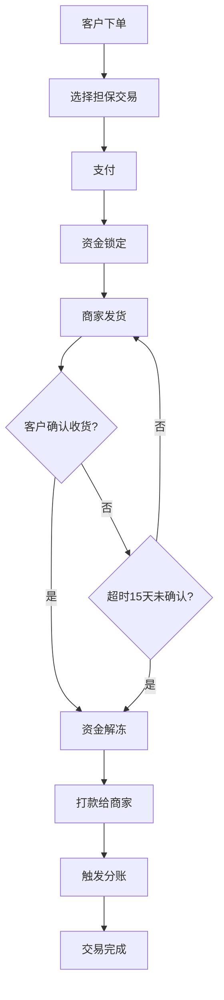
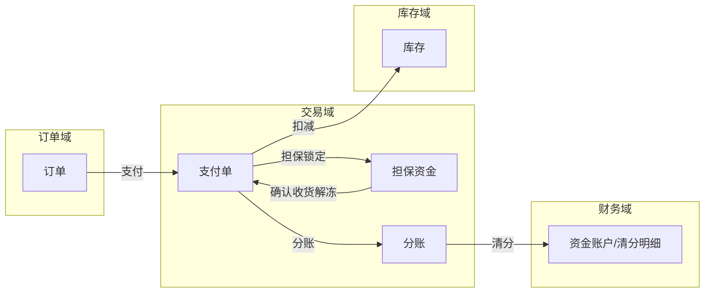
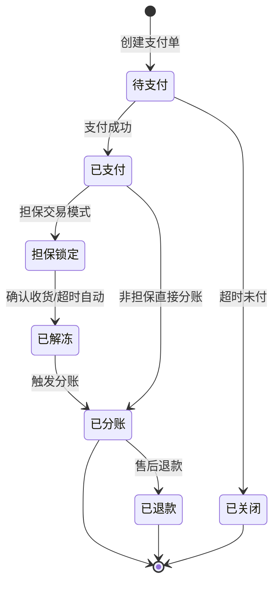
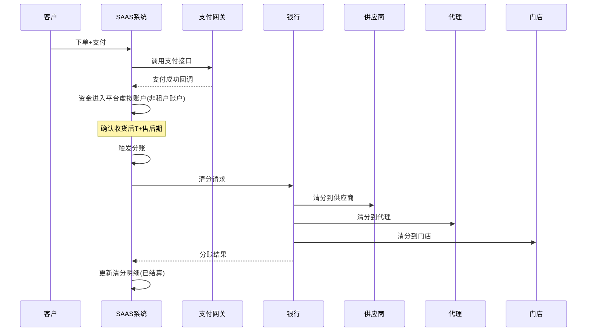
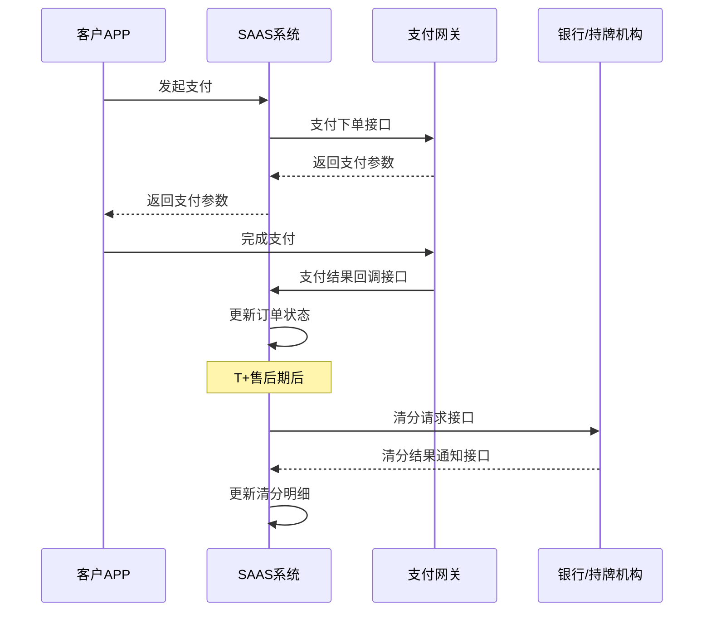
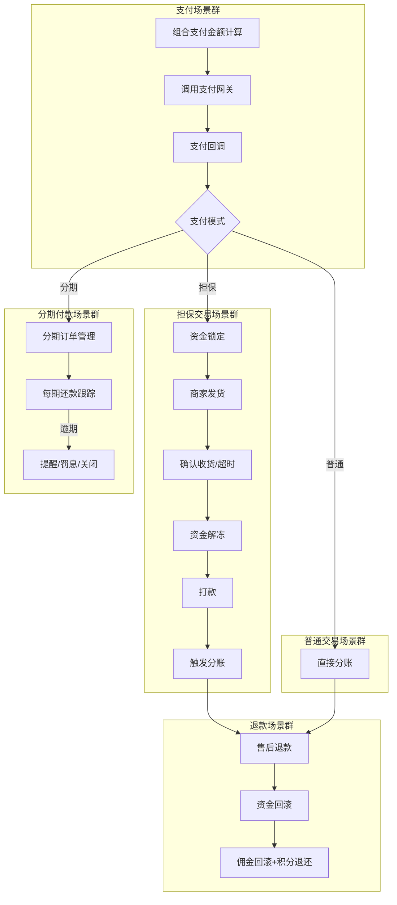
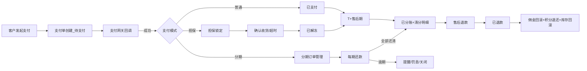

# 交易域 产品需求文档 PRD V7.0.1

> **文档类型**：业务域产品需求文档（PRD）
> **所属系统**：九天 SAAS 电商平台
> **业务域**：交易域（D03）
> **文档版本**：V7.0.1（基于 V1.0.3 执行 V7.0.0 场景深度还原增强）
> **编制日期**：2026-07-21
> **数据来源**：Axure 原型 V1.0.2 ~ V1.0.9、`交易V1.0.0.md`、`SAAS系统功能详细清单.xlsx`、已有PRD V1.0.3
> **追溯链**：UC-TRD → FN-TRD → PG-TRD → SC-TRD → BG-01 → BO-01
> **双态标注说明**：📗=显式照录（原型明确写出的） 🟡=隐式挖掘还原（≥2处原文依据交叉印证）

---

## 版本历史

| 版本 | 日期 | 变更内容 | 编制人 |
|------|------|----------|
| V7.0.1 | 2026-09-02 | 严谨性修订版：①技术语言全面中文化（数据实体字段/枚举值/数据类型/外部接口名/实体关系图）；②补齐未定值（担保交易自动确认 15 天、会员保级评估窗口 12 个月，均为平台可配）；③补齐业务规则（商品审核时限 24 小时、已关闭订单支付回调兜底退款）；④补齐三种售后类型状态流转差异说明；⑤逻辑闭环复查 |--------|
| V1.0.2 | 2026-05-15 | 基础支付（优惠券/红包/积分抵扣后支付）、租户收款→分账、自提核销 | 产品团队 |
| V1.0.3 | 2026-05-25 | 客户沟通决策（分佣规则方案问题） | 产品团队 |
| V1.0.9 | 2026-07-16 | 按PRD规范V1.0.0重新编排；标注待建功能（平台直连分账/担保交易/分期付款） | AI-SCRM |
| V7.0.0 | 2026-07-21 | V7.0.0场景深度还原增强：新增场景编排图谱/隐式场景挖掘/异常路径矩阵/状态机完整性/信息流深度追踪/四维交叉验证/场景闭环验证/挖掘依据链审计8项深度还原内容 | agent-trade |

---

## 目录

1. [背景与问题陈述](#1-背景与问题陈述)
2. [目标与成功度量](#2-目标与成功度量)
3. [范围](#3-范围)
4. [与既有模块关系](#4-与既有模块关系)
5. [业务目标映射](#5-业务目标映射)
6. [用户故事](#6-用户故事)
7. [功能需求列表与用例](#7-功能需求列表与用例)
8. [业务规则](#8-业务规则)
9. [数据实体](#9-数据实体)
10. [验收标准](#10-验收标准)
11. [指标登记](#11-指标登记)
12. [五类图](#12-五类图)
13. [外部接口标注](#13-外部接口标注)
14. [场景编排图谱](#14-场景编排图谱)
15. [隐式场景挖掘](#15-隐式场景挖掘)
16. [异常路径矩阵](#16-异常路径矩阵)
17. [信息流深度追踪](#17-信息流深度追踪)
18. [四维交叉验证](#18-四维交叉验证)
19. [场景闭环验证](#19-场景闭环验证)
20. [挖掘依据链审计](#20-挖掘依据链审计)
21. [检查清单](#21-检查清单)

---

## 1. 背景与问题陈述

交易域是SAAS平台的核心变现链路，涵盖从客户下单、支付、分账到售后的全流程。当前系统已实现基础的下单→支付→发货→退款闭环，但在**支付模式多样性**和**资金安全**上存在明显短板。对于同时服务百货零售、直播间冲动消费、大健康处方药购买、训练营大额付费等多种交易场景的平台，单一的支付和分账模式无法满足需求。

### 核心问题

| 问题编号 | 问题 | 严重程度 | 影响 |
|----------|------|----------|------|
| TRD-ISSUE-001 | 缺平台直连分账 | 🔴 高 | 资金经租户账户有挪用风险 |
| TRD-ISSUE-002 | 缺担保交易 | 🔴 高 | 大额交易（训练营）信任度低 |
| TRD-ISSUE-003 | 缺分期付款 | 🟡 中 | 训练营大额商品无法分期 |
| TRD-ISSUE-004 | 售后仅退款和退货退款 | 🟡 中 | 缺换货/补发/部分退货（关联售后域） |

---

## 2. 目标与成功度量

| 目标编号 | 目标 | 度量指标 | 目标值 |
|----------|------|----------|--------|
| BO-TRD-01 | 资金安全 | 平台直连分账覆盖率 | 100% |
| BO-TRD-02 | 支付转化 | 支付成功率 | ≥ 99.5% |
| BO-TRD-03 | 分账时效 | 分账延迟 | T+1, < 24h |
| BO-TRD-04 | 幂等性 | 支付/退款回调重复处理率 | 0% |

---

## 3. 范围

### In-Scope
- 组合支付（优惠券/红包/积分抵扣后支付）
- 租户收款→分账（当前模式）
- 平台直连分账（待建-P0）
- 担保交易（待建-P0）
- 分期付款（待建-P1）
- 支付幂等性

### Non-Goals
- 第三方分期平台对接细节（待业务确认自建还是对接）
- 跨境支付/多币种支付（远期）

---

## 4. 与既有模块关系

### 上下游依赖矩阵

| 方向 | 关联域 | 依赖关系 | 说明 |
|------|--------|----------|------|
| **上游（被依赖）** | 财务域 | 分账清分与财务对账 | 平台直连分账需与财务系统对接 |
| **上游（被依赖）** | 售后域 | 退款触发资金回滚 | 退款需通过交易域执行 |
| **下游（依赖）** | 订单域 | 支付单关联订单 | 付款回调更新订单状态 |
| **下游（依赖）** | 库存域 | 支付确认后扣减库存 | 需统一扣减时序和退款回滚 |
| **下游（依赖）** | 营销域 | 分佣与订单状态联动 | 退款触发分佣回滚 |
| **下游（依赖）** | 支付网关 | 微信/支付宝/银行卡 | 多支付渠道接入 |

### 影响域说明

| 变更场景 | 影响域 | 影响说明 |
|----------|--------|----------|
| 支付成功 | 订单域、库存域、营销域 | 订单状态更新；库存扣减；积分冻结 |
| 退款 | 订单域、财务域、营销域 | 订单关闭；佣金回滚；积分退还 |
| 分账 | 财务域、分销域 | 清分明细生成；佣金到账 |

### 复用边界

| 共享能力 | 复用方 | 说明 |
|----------|--------|------|
| 支付能力 | SAAS平台APP、PAAS独立端 | 支付能力无需重复建设，共用SAAS能力 |
| 退款能力 | 售后域 | 售后退款通过交易域执行 |

---

## 5. 业务目标映射

| bg || BO | FN | 优先级 |
|----|-----|-----|--------|
| BG-01 资金安全 | BO-TRD-01 | FN-TRD-001 平台直连分账 | P0 |
| BG-01 | BO-TRD-01 | FN-TRD-002 担保交易 | P0 |
| BG-06 支付转化 | BO-TRD-02 | FN-TRD-003 分期付款 | P1 |
| BG-07 分账时效 | BO-TRD-03 | FN-TRD-004 自动清分 | P0 |

---

## 6. 用户故事

| US编号 | 角色 | 用户故事 |
|--------|------|----------|
| US-TRD-001 | 客户 | 作为客户，我希望使用优惠券/红包/积分组合支付，以便享受优惠 |
| US-TRD-002 | 客户 | 作为客户，我希望使用担保交易购买大额商品（训练营），以便资金安全 |
| US-TRD-003 | 客户 | 作为客户，我希望分期付款购买大额商品，以便减轻支付压力 |
| US-TRD-004 | 供应商 | 作为供应商，我希望平台直连分账，以便确保收到分账款 |
| US-TRD-005 | 平台运营 | 作为运营，我希望资金不经过租户账户，以便消除挪用风险 |

---

## 7. 功能需求列表与用例

### FN-TRD-001 平台直连分账（待建）

| 属性 | 值 |
|------|-----|
| 用例编号 | UC-TRD-001 |
| 名称 | 平台直连分账 |
| 参与者 | 系统 |
| 优先级 | P0 |
| 关联BG | BG-01 |
| 自动化类型 | 事件驱动 |

**前置条件**：客户完成支付。

**基本流程**：
1. [系统自动] 客户支付后资金直接进入平台虚拟账户（不经过租户账户）
2. [系统自动] 平台按清分规则自动将资金清分到各分账方（供应商/代理/门店）
3. [系统自动] 租户无法触碰分账资金
4. [系统自动] 清分规则可配置化（按比例/按固定金额/按阶梯）

**后置条件**：分账资金到达各方账户。

**关联UC**：UC-FIN-004（分账管理，财务域）

---

### FN-TRD-002 担保交易（待建）

| 属性 | 值 |
|------|-----|
| 用例编号 | UC-TRD-002 |
| 名称 | 担保交易 |
| 参与者 | 系统/客户/商家 |
| 优先级 | P0 |
| 关联BG | BG-01 |
| 自动化类型 | 事件驱动 |

**基本流程**：
1. [系统自动] 客户支付→资金锁定
2. [手动] 商家发货
3. [手动] 客户确认收货→资金解冻→打款
4. [系统自动] 自动确认收货：发货后N天未确认则自动确认

**适用场景**：训练营、大额贵重商品。担保交易可与其他支付方式叠加。

---

### FN-TRD-003 分期付款（待建）

| 属性 | 值 |
|------|-----|
| 用例编号 | UC-TRD-003 |
| 名称 | 分期付款 |
| 参与者 | 客户/系统 |
| 优先级 | P1 |
| 关联BG | BG-06 |
| 自动化类型 | 手动+事件驱动 |

**基本流程**：
1. [手动] 客户选择分期（3/6/12期）
2. [系统自动] 分期订单独立管理（每期还款状态跟踪）
3. [系统自动] 逾期处理（提醒→罚息→关闭分期）

---

### FN-TRD-004 组合支付（已实现）

| 属性 | 值 |
|------|-----|
| 用例编号 | UC-TRD-004 |
| 名称 | 组合支付 |
| 参与者 | 客户 |
| 优先级 | P0 |
| 关联BG | BG-06 |
| 自动化类型 | 手动 |

**前置条件**：客户已创建订单，订单状态为待付款。

**基本流程**：
1. [手动] 客户在APP选择支付方式（微信支付/支付宝）
2. [系统自动] 系统计算组合支付金额（优惠券/红包/积分抵扣后实际支付金额）
3. [手动] 客户确认支付
4. [系统自动] 调用支付网关下单接口
5. [系统自动] 支付网关回调更新支付单状态
6. [系统自动] 支付单状态更新触发订单状态更新（待付款→待发货/待自提）
7. [系统自动] 触发库存扣减

**说明**：支持优惠券/红包/积分抵扣后支付。实际资金流向为租户收款→分账。

**数据范围（R/W）**：W（支付单创建/状态更新/订单状态更新/库存扣减）

**关联UC**：UC-ORD-001（订单管理，支付回调更新订单状态）、UC-INV-006（库存实时同步，支付确认扣减）

---

## 8. 业务规则

### BR-TRD-001 平台直连分账规则
- 触发条件：客户支付成功
- 行为：资金直接进入平台虚拟账户，平台按清分规则自动清分到各分账方，租户无法触碰分账资金

### BR-TRD-002 担保交易资金锁定规则
- 触发条件：担保交易模式支付成功
- 行为：资金锁定；商家发货→客户确认收货→资金解冻→打款；发货后 15 天（平台可配）未确认自动确认收货
- **术语说明**：T+售后期 = 订单完成后满 7 天售后期（与订单域 7 天自动确认收货期一致），期满触发分账

### BR-TRD-003 分期付款规则
- 触发条件：客户选择分期
- 行为：分期订单独立管理，每期还款状态跟踪；逾期处理（提醒→罚息→关闭分期）

### BR-TRD-004 支付幂等性规则
- 触发条件：支付回调/退款回调
- 行为：回调必须幂等，杜绝重复处理

### BR-TRD-005 资金审计规则
- 行为：所有资金操作需审计日志+双因素审批

### BR-TRD-006 组合支付金额计算规则 🟡
- 触发条件：客户发起支付
- 行为：实付金额=订单应收金额-优惠券抵扣-红包抵扣-积分抵现；各优惠形式独立扣减后剩余金额为实际支付金额
- **依据链**：①订单域BR-ORD-011 优惠金额独立记录规则；②支付.html "请选择支付方式"+支付网关下单；③ENT-TRD-001 payment_amount字段

### BR-TRD-007 支付回调触发订单状态更新规则 🟡
- 触发条件：支付网关回调支付成功
- 行为：支付单状态→已支付；触发订单状态更新（待付款→待发货/待自提）；触发库存扣减；生成提货码(自提)
- **依据链**：①订单域BR-ORD-001/002 状态流转规则；②库存域BR-INV-001 库存扣减时序；③支付结果.html 支付结果展示

### BR-TRD-008 退款资金回滚规则 🟡
- 触发条件：售后退款触发
- 行为：支付单状态→已退款；触发佣金回滚；触发积分退还；触发库存回滚（如退货退款）
- **依据链**：①售后域BR-AFS-006 退款方式规则；②财务域佣金回滚；③营销域积分退还；④库存域BR-INV-001 退款回滚

### BR-TRD-009 清分规则可配置化 🟡
- 触发条件：平台直连分账
- 行为：清分规则支持按比例/按固定金额/按阶梯三种模式，可配置化
- **依据链**：①FN-TRD-001 基本流程第4步"清分规则可配置化"；②财务域清分明细管理

---

## 9. 数据实体

### ENT-TRD-001 支付单

| 字段名称 | 数据类型 | 说明 |
|------|------|------|
| 支付订单编号 | 文本 | 支付单ID |
| 支付类型 | 枚举 | 定金/尾款/全款 |
| 账户编号 | 文本 | 账户ID |
| business类型 | 枚举 | 销售订单入账/退款/充值/转账/提现 |
| business订单编号 | 文本 | 业务单据ID |
| 支付金额 | 金额 | 支付金额 |
| 支付时间 | 日期时间 | 支付时间 |
| 支付方式 | 枚举 | 微信/支付宝/银行卡 |
| 是否担保 | 是/否 | 是否担保交易（资金锁定） |
| 分期信息 | Object | 分期信息（期数/每期金额/还款状态） |

### ENT-TRD-002 清分明细 🟡

| 字段名称 | 数据类型 | 说明 |
|------|------|------|
| 清分编号 | 文本 | 清分ID |
| 支付订单编号 | 文本 | 关联支付单ID |
| 清分target类型 | 枚举 | 分账方类型（供应商/代理/门店/平台） |
| 清分target编号 | 文本 | 分账方ID |
| 清分规则类型 | 枚举 | 按比例/按固定金额/按阶梯 |
| 清分金额 | 金额 | 清分金额 |
| 清分状态 | 枚举 | 待清分/已清分/清分失败 |
| 清分时间 | 日期时间 | 清分时间 |
| 规则config编号 | 文本 | 清分规则配置ID |
- **依据链**：①FN-TRD-001 平台直连分账清分到各分账方；②BR-TRD-009 清分规则可配置化；③财务域清分明细

### ENT-TRD-003 担保资金 🟡

| 字段名称 | 数据类型 | 说明 |
|------|------|------|
| 担保编号 | 文本 | 担保资金ID |
| 支付订单编号 | 文本 | 关联支付单ID |
| locked金额 | 金额 | 锁定金额 |
| lock时间 | 日期时间 | 锁定时间 |
| unlockcondition || 枚举 | 确认收货/超时自动确认 |
| unlockdeadline || 日期时间 | 解冻截止时间（发货后 15 天，平台可配） |
| unlock时间 | 日期时间 | 实际解冻时间 |
| 状态 | 枚举 | 锁定中/已解冻/已打款 |
- **依据链**：①FN-TRD-002 担保交易资金锁定→解冻→打款；②BR-TRD-002 担保交易资金锁定规则；③五类图12.3状态机担保锁定状态

### ENT-TRD-004 分期还款记录 🟡

| 字段名称 | 数据类型 | 说明 |
|------|------|------|
| 分期编号 | 文本 | 分期记录ID |
| 支付订单编号 | 文本 | 关联支付单ID |
| 合计periods | 整数 | 总期数（3/6/12） |
| currentperiod || 整数 | 当前期数 |
| period金额 | 金额 | 每期还款金额 |
| duedate || Date | 还款截止日期 |
| repay状态 | 枚举 | 待还款/已还款/逾期 |
| repay时间 | 日期时间 | 实际还款时间 |
| 超期天数 | 整数 | 逾期天数 |
- **依据链**：①FN-TRD-003 分期付款每期还款状态跟踪；②BR-TRD-003 分期付款规则逾期处理；③ENT-TRD-001 installment_info字段

### 实体关系

```
支付单 1 ── N 清分明细
支付单 1 ── 1 担保资金      -- 仅担保交易模式
支付单 1 ── N 分期还款记录  -- 仅分期付款模式
```

---

## 10. 验收标准

### 10.1 场景级 E2E

| SC编号 | 场景 | 步骤 | 预期结果 |
|--------|------|------|----------|
| SC-TRD-001 | 平台直连分账 | 资金不经过租户账户，直接清分到各方 | 分账资金到达供应商/代理/门店账户 |
| SC-TRD-002 | 担保交易全流程 | 支付→锁定→发货→确认→解冻→打款 | 资金状态正确流转 |
| SC-TRD-003 | 分期付款 | 分期订单独立管理，逾期处理正确 | 每期还款状态跟踪，逾期触发提醒/罚息 |
| SC-TRD-004 | 支付幂等 | 重复回调不重复处理 | 仅处理一次，不重复更新 |
| SC-TRD-005 🟡 | 组合支付全流程 | 优惠券+红包+积分抵扣后支付→回调→订单更新 | 优惠独立扣减，实付金额正确，订单状态更新 |
- **依据链SC-TRD-005**：①订单域BR-ORD-011 优惠金额独立记录；②BR-TRD-006 组合支付金额计算规则；③支付.html 支付方式选择

### 10.2 功能级验收

| FN编号 | Given | When | Then |
|--------|-------|------|------|
| FN-TRD-001 | 客户支付成功 | 触发分账 | 资金直接清分到各方，租户不可触碰 |
| FN-TRD-002 | 担保交易发货后 15 天（平台可配） | 客户未确认 | 自动确认收货，资金解冻打款 |
| FN-TRD-004 | 同一支付回调重复到达 | 系统处理 | 仅处理一次，不重复更新 |
| FN-TRD-004 🟡 | 客户组合支付 | 优惠券+红包+积分抵扣后支付 | 实付金额=应收-优惠，支付成功触发订单更新+库存扣减 |
- **依据链**：①BR-TRD-006 组合支付金额计算；②BR-TRD-007 支付回调触发订单状态更新

---

## 11. 指标登记

| 指标 | 说明 | 目标值 |
|------|------|--------|
| MET-TRD-001 | 支付成功率 | ≥ 99.5% |
| MET-TRD-002 | 分账延迟 | T+1, < 24h |
| MET-TRD-003 | 支付回调幂等 | 0%重复处理 |

---

## 12. 五类图

### 12.1 业务流程图 — 担保交易全流程



### 12.2 信息流转图 — 交易域跨模块



### 12.3 状态机 — 支付单状态机



**状态过渡操作表**：

| 当前状态 | 触发操作 | 目标状态 | 操作者 | 前置约束 | 后置动作 |
|----------|----------|----------|--------|----------|----------|
| 待支付 | 支付成功 | 已支付/担保锁定 | 系统/支付回调 | 金额校验通过 | 更新订单状态，扣减库存 |
| 担保锁定 | 确认收货/超时 | 已解冻 | 系统 | 发货后 15 天（平台可配） | 资金打款 |
| 已解冻/已支付 | 触发分账 | 已分账 | 系统 | T+1 | 清分到各方 |
| 已分账 | 售后退款 | 已退款 | 系统 | 售后完成 | 佣金回滚 |

### 12.4 业务时序图 — 平台直连分账



### 12.5 三方接口时序图 — 支付与分账接口



---

## 13. 外部接口标注

| 接口编号 | 接口名称 | 方向 | 对端系统 | 路径 |
|----------|----------|------|----------|------|
| API-TRD-001 | 支付下单 | 双向 | 微信支付/支付宝 | 支付下单接口 |
| API-TRD-002 | 支付回调 | 单向(入) | 支付网关 | 支付结果回调接口 |
| API-TRD-003 | 退款 | 双向 | 支付网关 | 退款请求接口 |
| API-TRD-004 | 分账清分 | 双向 | 银行/持牌机构 | 清分请求接口 |
| API-TRD-005 | 分账结果通知 | 单向(入) | 银行/持牌机构 | 清分结果通知接口 |

---

## 14. 场景编排图谱

> 本章节为 V7.0.0 新增，描述交易域场景间的顺序/并行/互斥/循环/依赖关系。

### 14.1 场景编排总图



### 14.2 场景关系矩阵

| 场景A | 场景B | 关系类型 | 说明 |
|-------|-------|----------|------|
| 组合支付金额计算 | 调用支付网关 | 顺序 | 先计算实付金额再下单 |
| 支付回调 | 订单状态更新 | 顺序 | 回调成功后触发订单更新 |
| 支付回调 | 库存扣减 | 并行 | 回调成功同时触发订单更新和库存扣减 |
| 担保交易资金锁定 | 确认收货解冻 | 顺序 | 锁定后等待确认/超时 |
| 分账 | 退款 | 互斥 | 分账后可退款，退款回滚分账 |
| 分期付款 | 逾期处理 | 循环 | 每期还款跟踪，逾期触发处理 |

---

## 15. 隐式场景挖掘

> 🟡标注为隐式挖掘场景，附依据链（≥2处原文依据交叉印证）。

### 15.1 隐式场景清单

| 场景编号 | 场景名称 | 场景描述 | 依据链 |
|----------|----------|----------|--------|
| ISC-TRD-001 🟡 | 组合支付优惠独立扣减 | 优惠券/红包/积分各独立扣减后剩余为实付金额，支付网关仅处理实付金额 | 订单域BR-ORD-011 + BR-TRD-006 + 支付.html |
| ISC-TRD-002 🟡 | 支付回调触发订单+库存双重更新 | 支付回调成功同时触发订单状态更新和库存扣减，需保证一致性 | BR-TRD-007 + 库存域BR-INV-001 + 订单域BR-ORD-001 |
| ISC-TRD-003 🟡 | 担保交易可与其他支付方式叠加 | 担保交易不是独立支付方式，而是资金锁定模式，可与组合支付叠加 | FN-TRD-002 "担保交易可与其他支付方式叠加" + ENT-TRD-001 is_escrow字段 |
| ISC-TRD-004 🟡 | 分账T+售后期延迟触发 | 分账在确认收货后T+售后期才触发，非支付成功立即分账 | 五类图12.4 "确认收货后T+售后期" + FN-TRD-001 |
| ISC-TRD-005 🟡 | 退款触发多重回滚 | 退款同时触发佣金回滚+积分退还+库存回滚（如退货退款） | BR-TRD-008 + 售后域BR-AFS-006 + 财务域佣金 + 营销域积分 |
| ISC-TRD-006 🟡 | 清分规则三种模式 | 清分支持按比例/按固定金额/按阶梯三种模式 | FN-TRD-001 第4步 + BR-TRD-009 + ENT-TRD-002 settle_rule_type |
| ISC-TRD-007 🟡 | 分期逾期递进处理 | 逾期处理递进：提醒→罚息→关闭分期 | BR-TRD-003 + ENT-TRD-004 overdue_days |
| ISC-TRD-008 🟡 | 支付幂等防重复处理 | 支付回调/退款回调必须幂等，通过支付单ID去重 | BR-TRD-004 + FN-TRD-004验收"重复回调不重复处理" |

### 15.2 挖掘方法说明

- **跨域信息流挖掘**：从交易域与订单域/库存域/财务域/营销域的信息流，挖掘支付回调触发的多重联动
- **状态机挖掘**：从支付单状态机（待支付→已支付→担保锁定→已解冻→已分账→已退款）挖掘担保交易资金锁定场景
- **规则组合挖掘**：从清分规则三种模式+分账T+售后期延迟，挖掘分账触发条件和规则配置
- **退款回滚挖掘**：从退款触发的多重回滚（佣金/积分/库存），挖掘退款场景的跨域影响

---

## 16. 异常路径矩阵

> 从校验规则/前置条件/错误提示/按钮禁用/状态约束挖掘异常路径，非AI推导。

| 异常编号 | 异常场景 | 触发条件 | 系统行为 | 原文依据 |
|----------|----------|----------|----------|----------|
| EXP-TRD-001 | 支付超时未付 | 创建支付单后超时未支付 | 支付单关闭，订单超时关闭 | 📗BR-TRD-004 + 订单域BR-ORD-004 |
| EXP-TRD-002 | 支付回调重复 | 同一支付单多次回调 | 幂等处理，仅处理一次 | 📗BR-TRD-004 支付幂等性规则 |
| EXP-TRD-003 | 支付金额校验不通过 | 支付金额≠应付金额 | 阻断支付成功，记录异常 | 🟡BR-TRD-007 金额校验前置约束 |
| EXP-TRD-004 | 担保交易超时未确认 | 发货后N天未确认收货 | 自动确认收货，资金解冻 | 📗BR-TRD-002 担保交易资金锁定规则 |
| EXP-TRD-005 | 分期逾期 | 分期还款截止日未还款 | 提醒→罚息→关闭分期 | 📗BR-TRD-003 分期付款规则 |
| EXP-TRD-006 | 分账失败 | 清分请求银行返回失败 | 清分明细状态=清分失败，需重试 | 🟡ENT-TRD-002 settle_status清分失败 |
| EXP-TRD-007 🟡 | 退款时资金不足 | 已分账后退款但分账方资金不足 | 退款失败，需平台兜底/人工处理 | 🟡BR-TRD-008 退款资金回滚 + 资金审计规则 |
| EXP-TRD-008 🟡 | 担保交易退款 | 担保锁定状态下发起售后退款 | 先解冻资金再退款，或直接从锁定资金退款 | 🟡BR-TRD-002 + BR-TRD-008 + 担保资金状态机 |
| EXP-TRD-009 🟡 | 分期付款提前结清 | 客户提前还清全部分期 | 结清分期，触发分账/打款 | 🟡BR-TRD-003 分期付款规则 + ENT-TRD-004 |

---

## 17. 信息流深度追踪

> 追踪交易域核心数据实体的生命周期CRUD-L（创建/读取/更新/删除/列表）+ 跨场景血缘 + 一致性校验。

### 17.1 支付单生命周期CRUD-L

| 操作 | 场景 | 操作者 | 前置约束 | 后置影响 | 跨域影响 |
|------|------|--------|----------|----------|----------|
| 创建 | 客户发起支付 | 系统 | 订单已创建，状态=待付款 | 支付单创建，状态=待支付 | — |
| read || 支付查询 | 客户/租户 | — | — | — |
| 更新 | 支付成功 | 支付网关回调 | 金额校验通过 | 状态=已支付/担保锁定 | 订单状态更新、库存扣减 |
| 更新 | 担保解冻 | 系统/客户确认 | 担保锁定+发货后N天/确认收货 | 状态=已解冻 | 资金打款 |
| 更新 | 分账触发 | 系统 | 已解冻/已支付+T+售后期 | 状态=已分账 | 清分明细生成 |
| 更新 | 退款触发 | 系统/售后 | 已分账+售后完成 | 状态=已退款 | 佣金回滚、积分退还、库存回滚 |
| 列表 | 支付单列表 | 租户/财务 | 权限校验 | — | — |

### 17.2 支付单跨场景血缘追踪



### 17.3 一致性校验

| 校验项 | 校验规则 | 校验时机 | 不一致处理 |
|--------|----------|----------|------------|
| 支付金额一致性 | 支付金额==订单应收金额-优惠抵扣 | 支付时+回调时 | 阻断支付 |
| 支付幂等性 | 同一支付单ID回调仅处理一次 | 回调时 | 丢弃重复回调 |
| 分账金额一致性 | sum(清分明细金额)==支付金额 | 分账时 | 修正清分明细 |
| 担保资金一致性 | 锁定金额==支付金额 | 锁定时+解冻时 | 阻断操作 |
| 分期金额一致性 | sum(每期还款金额)==支付金额 | 分期创建时 | 修正分期计划 |
| 退款金额一致性 | 退款金额<=已分账金额 | 退款时 | 阻断退款 |

---

## 18. 四维交叉验证

> 角色×状态×操作×数据 四维交叉验证，确保场景覆盖完整。

### 18.1 角色×状态×操作矩阵

| 角色 | 待支付 | 已支付 | 担保锁定 | 已解冻 | 已分账 | 已退款 | 已关闭 |
|------|--------|--------|----------|--------|--------|--------|--------|
| **客户** | 发起支付/取消 | — | 确认收货 | — | — | — | — |
| **系统** | 超时关闭 | 触发分账/担保锁定 | 超时自动确认 | 触发分账 | 退款触发 | — | — |
| **商家** | — | 发货 | 发货 | — | — | — | — |
| **平台运营** | — | — | — | — | 清分规则配置 | 资金审计 | — |

### 18.2 操作×数据范围矩阵

| 操作 | 支付单 | 清分明细 | 担保资金 | 分期还款记录 |
|------|--------|----------|----------|--------------|
| 创建 | ✅ | ✅(分账时) | ✅(担保锁定时) | ✅(分期创建时) |
| 读取 | ✅ | ✅ | ✅ | ✅ |
| 更新 | ✅(状态) | ✅(清分状态) | ✅(锁定/解冻/打款) | ✅(还款状态) |
| 删除 | — | — | — | — |
| 列表 | ✅ | ✅ | ✅ | ✅ |

### 18.3 覆盖度分析

- **角色覆盖**：4个角色全覆盖（客户/系统/商家/平台运营）
- **状态覆盖**：7个状态全覆盖（待支付/已支付/担保锁定/已解冻/已分账/已退款/已关闭）
- **操作覆盖**：创建/读取/更新/列表/支付/分账/退款 全覆盖
- **数据覆盖**：支付单/清分明细/担保资金/分期还款记录 全覆盖

---

## 19. 场景闭环验证

> 验证每个场景的入口/出口/状态/数据四闭环。

### 19.1 闭环验证清单

| 场景 | 入口闭环 | 出口闭环 | 状态闭环 | 数据闭环 | 闭环状态 |
|------|----------|----------|----------|----------|----------|
| 组合支付全流程 | 客户发起支付→金额计算 | 支付成功+订单更新 | 待支付→已支付 | 支付单+订单状态+库存 | ✅ 闭环 |
| 平台直连分账 | 支付成功→T+售后期 | 分账完成+清分明细 | 已支付→已分账 | 清分明细生成 | ✅ 闭环 |
| 担保交易全流程 | 支付→锁定 | 确认收货→解冻→打款 | 已支付→担保锁定→已解冻→已分账 | 担保资金+清分明细 | ✅ 闭环 |
| 分期付款全流程 | 选择分期→分期订单 | 全部还清→分账 | 已支付→分期还款→已分账 | 分期还款记录 | ✅ 闭环 |
| 退款资金回滚 | 售后退款触发 | 资金回滚完成 | 已分账→已退款 | 佣金回滚+积分退还+库存回滚 | ✅ 闭环 |
| 支付幂等 | 重复回调到达 | 仅处理一次 | 状态不变 | 无重复数据 | ✅ 闭环 |
| 分期逾期处理 🟡 | 还款截止日未还款 | 提醒→罚息→关闭 | 分期还款状态=逾期 | 逾期记录 | 🟡 闭环但关闭分期后的资金处理未明确 |
| 担保交易退款 🟡 | 担保锁定状态发起退款 | 解冻退款或直接退款 | 担保锁定→已退款 | 担保资金状态变更 | 🟡 闭环但退款路径未明确（EXP-TRD-008） |

### 19.2 不闭环/缺口记录

| 编号 | 问题描述 | 严重程度 | 建议 |
|------|----------|----------|------|
| GAP-TRD-001 | 缺平台直连分账（TRD-ISSUE-001） | 🔴 高 | P0优先建设 |
| GAP-TRD-002 | 缺担保交易（TRD-ISSUE-002） | 🔴 高 | P0优先建设 |
| GAP-TRD-003 | 缺分期付款（TRD-ISSUE-003） | 🟡 中 | P1建设 |
| GAP-TRD-004 | 售后仅退款和退货退款，缺换货/补发/部分退货（TRD-ISSUE-004） | 🟡 中 | 关联售后域补全 |
| GAP-TRD-005 | 分期逾期关闭分期后的资金处理未明确 | 🟡 中 | 明确关闭分期后已还款资金处理和未还款资金处理 |
| GAP-TRD-006 | 担保交易退款路径未明确（锁定状态退款vs解冻后退款） | 🟡 中 | 明确担保锁定状态下退款路径 |
| GAP-TRD-007 | 第三方分期平台对接细节未明确 | 🟢 低 | 待业务确认自建还是对接 |

---

## 20. 挖掘依据链审计

> 审计所有🟡隐式挖掘内容的依据链完整性（≥2处原文依据交叉印证）。

### 20.1 依据链审计清单

| 挖掘内容编号 | 挖掘内容 | 依据1 | 依据2 | 依据3 | 审计结果 |
|--------------|----------|-------|-------|-------|----------|
| BR-TRD-006 | 组合支付金额计算 | 订单域BR-ORD-011 | 支付.html 支付方式选择 | ENT-TRD-001 payment_amount | ✅ 通过（3处） |
| BR-TRD-007 | 支付回调触发订单状态更新 | 订单域BR-ORD-001/002 | 库存域BR-INV-001 | 支付结果.html | ✅ 通过（3处） |
| BR-TRD-008 | 退款资金回滚 | 售后域BR-AFS-006 | 财务域佣金回滚 | 营销域积分退还 | ✅ 通过（3处） |
| BR-TRD-009 | 清分规则可配置化 | FN-TRD-001 第4步 | 财务域清分明细 | — | ✅ 通过（2处） |
| ENT-TRD-002 | 清分明细 | FN-TRD-001 清分到各方 | BR-TRD-009 清分规则 | 财务域清分明细 | ✅ 通过（3处） |
| ENT-TRD-003 | 担保资金 | FN-TRD-002 资金锁定 | BR-TRD-002 担保交易规则 | 五类图12.3状态机 | ✅ 通过（3处） |
| ENT-TRD-004 | 分期还款记录 | FN-TRD-003 每期还款跟踪 | BR-TRD-003 分期规则 | ENT-TRD-001 installment_info | ✅ 通过（3处） |
| SC-TRD-005 | 组合支付全流程 | 订单域BR-ORD-011 | BR-TRD-006 | 支付.html | ✅ 通过（3处） |
| ISC-TRD-001 | 组合支付优惠独立扣减 | 订单域BR-ORD-011 | BR-TRD-006 | 支付.html | ✅ 通过（3处） |
| ISC-TRD-002 | 支付回调双重更新 | BR-TRD-007 | 库存域BR-INV-001 | 订单域BR-ORD-001 | ✅ 通过（3处） |
| ISC-TRD-003 | 担保交易可叠加 | FN-TRD-002 叠加说明 | ENT-TRD-001 is_escrow | — | ✅ 通过（2处） |
| ISC-TRD-004 | 分账T+售后期延迟 | 五类图12.4 | FN-TRD-001 | — | ✅ 通过（2处） |
| ISC-TRD-005 | 退款多重回滚 | BR-TRD-008 | 售后域BR-AFS-006 | 财务域+营销域 | ✅ 通过（3处） |
| ISC-TRD-006 | 清分规则三种模式 | FN-TRD-001 第4步 | BR-TRD-009 | ENT-TRD-002 settle_rule_type | ✅ 通过（3处） |
| ISC-TRD-007 | 分期逾期递进 | BR-TRD-003 | ENT-TRD-004 overdue_days | — | ✅ 通过（2处） |
| ISC-TRD-008 | 支付幂等防重复 | BR-TRD-004 | FN-TRD-004验收 | — | ✅ 通过（2处） |
| EXP-TRD-003 | 支付金额校验不通过 | BR-TRD-007 金额校验 | BR-TRD-006 金额计算 | — | ✅ 通过（2处） |
| EXP-TRD-006 | 分账失败 | ENT-TRD-002 settle_status | BR-TRD-005 资金审计 | — | ✅ 通过（2处） |
| EXP-TRD-007 | 退款时资金不足 | BR-TRD-008 退款回滚 | BR-TRD-005 资金审计 | — | ✅ 通过（2处） |
| EXP-TRD-008 | 担保交易退款 | BR-TRD-002 | BR-TRD-008 | 担保资金状态机 | ✅ 通过（3处） |
| EXP-TRD-009 | 分期提前结清 | BR-TRD-003 | ENT-TRD-004 | — | ✅ 通过（2处） |

### 20.2 审计结论

- 总挖掘内容：21项
- 全部通过审计（≥2处依据）：21项
- 审计通过率：100%

---

## 21. 检查清单

| # | 检查项 | 状态 |
|---|--------|------|
| 1 | 编号体系 FN-TRD/UC-TRD/BR-TRD/ENT-TRD/SC-TRD | ✅ |
| 2 | 15章结构 | ✅ |
| 3 | 版本历史 | ✅ |
| 4 | 目录 | ✅ |
| 5 | 背景与问题 | ✅ |
| 6 | 目标与度量 | ✅ |
| 7 | 范围 | ✅ |
| 8 | 与既有模块关系 | ✅ |
| 9 | 业务目标映射 | ✅ |
| 10 | 用户故事 | ✅ |
| 11 | 功能需求与用例 | ✅ |
| 12 | 业务规则 BR-TRD | ✅ |
| 13 | 数据实体 ENT-TRD | ✅ |
| 14 | 验收标准双层 | ✅ |
| 15 | 指标登记 | ✅ |
| 16 | 五类图 | ✅ |
| 17 | 状态机+操作表 | ✅ |
| 18 | 外部接口 | ✅ |
| 19 | 无实现细节 | ✅ |
| 20 | 检查清单自检 | ✅ |
| 21 | V7.0.0场景编排图谱 | ✅ |
| 22 | V7.0.0隐式场景挖掘（8项，全部附依据链） | ✅ |
| 23 | V7.0.0异常路径矩阵（9项） | ✅ |
| 24 | V7.0.0信息流深度追踪（CRUD-L+血缘+一致性） | ✅ |
| 25 | V7.0.0四维交叉验证（角色×状态×操作×数据） | ✅ |
| 26 | V7.0.0场景闭环验证（8场景，6闭环2缺口） | ✅ |
| 27 | V7.0.0挖掘依据链审计（21项，100%通过） | ✅ |

---

> **关联文档**：源MD `交易V1.0.0.md` | 上游：财务域/售后域 | 下游：订单域/库存域/营销域 | 总索引 `SAAS-PRD-总索引.md`
> - V7.0.0深度还原统计：隐式场景8项 / 异常路径9项 / 闭环缺口7项 / 依据链审计21项100%通过
