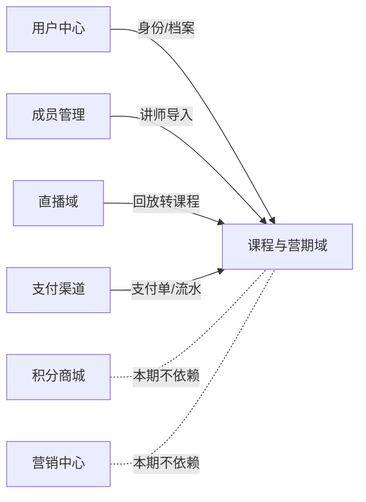

# 课程与营期域 - 架构设计文档 V1.0.0

> **业务领域**：课程与营期域（课程+营期+讲师+助教+分成+支付+红包+钱包+题库+证书+答疑）
> **创建时间**：2026-08-18
> **版本**：V1.0.0（架构规范详纲·基于 PRD v1.0.0 + 脑暴 D1-D35 + SugarMate 逆向分析）
> **来源**：[PRD v1.0.0](../../01-requirements/18-课程与营期域-PRD-v1.0.0.md)（35 决策 + 38 实体 + 12 状态机）
> **架构基础**：SugarMate `docs/03-arch/ARCH-课程与训练营-架构规范详纲-v1.0.0.md` + 实际代码
> **教训依据**：之前课程业务审查教训（资金不守恒/幂等缺维度/退款回滚不完整/假交互/状态机无驱动）
> **关联脑暴**：`00-brainstorm/SaaS-Class/confirmed/BR-脑暴确认稿-SaaS-Class-v1.0.0.md`
> **关联逆向**：`00-brainstorm/SaaS-Class/逆向分析/SugarMate课程模块逆向分析报告-v1.0.0.md`
> **关联设计**：`03-design/SaaS-Class/设计文档-课程与营期域-V1.0.0.md`
> **架构师**：Arch Agent（AI 辅助）
> **V1核心策略**：基于 SugarMate 1:1 逆向分析重建，代码结构 1:1 对齐（zustand→pinia、antd→el-、tsx→vue），sim-data mock 数据层

---

## 版本历史

| 版本 | 日期 | 变更摘要 |
|------|------|----------|
| v1.0.0 | 2026-08-18 | 新建：课程与营期域架构规范详纲，含模块边界/数据架构/支付时序/Store划分/契约/状态机/适配器/页面层/任务清单/风险对照，14章完整规范 |
| v1.1.0 | 2026-08-19 | 文档同步补全（基于 doc-audit 42 项差异）：Store 7→10（+useLiveStore/useStoreStore/useHomeStore）；契约文件补 live-schemas.ts；路由补 23 条遗漏路由；状态机文件名 course-sm.ts → course-state-machine.ts；ARCH-02 补 CertificateManagePage 补发绕过 store 风险提示。 |
| v1.2.0 | 2026-08-20 | 审查修复（P0+P1）：§11 ID 生成规范补全（原为空）；§6.1/§8.2 编号错乱修正；§15 Store 对照表去重统一为 10；§4.1 计数同步 PC23+APP32；§14 验收清单计数同步；新增 §15B 6 大闭环联动矩阵；§9 LessonManagePage 孤儿说明；版本历史更新。 |

---

## 目录

§1 模块边界定义 → §2 数据架构规范 → §3 NFR 非功能识别 → §4 架构总览 → §5 契约层设计 → §6 状态机设计 → §7 Store 层设计 → §8 适配器层设计 → §9 页面层设计 → §10 支付时序规范 → §11 ID 生成规范 → §12 任务清单 → §13 风险与对策 → §14 验收检查清单 → §15 与 SugarMate 架构对照 → §16 下一步

---

## §1 模块边界定义

### 1.1 模块定义

| 维度 | 定义 |
|------|------|
| **模块名** | 课程与营期域 |
| **缩写** | course |
| **核心职责** | 课程/课时/题库/专题/营期/排课/报名/打卡/答疑/讲师/助教/分成/红包/钱包/证书/评价 |
| **数据源** | sim-data mock（D6，Pinia store 为唯一源） |
| **关联终端** | PC 后台（管理员）/ APP 学员端 / APP 讲师端 / APP 助教端 |
| **聚合根** | Course / Camp / Lecturer / Series / Wallet |
| **领域服务** | CourseService / CampService / EnrollmentService / PaymentService / CommissionService / QuizService / CheckinService / QAService / LecturerService / AssistantService / CertificateService / ReviewService / InviteCodeService / ScheduleService / WalletService / RedPacketService |

### 1.2 跨模块依赖方向



### 1.3 模块边界关键约束

| 约束 | 说明 |
|------|------|
| BOUNDARY-01 | 课程与营期域独立，不依赖营销/积分商城中心 |
| BOUNDARY-02 | 直播回放转课程单向依赖直播域（source=live_replay，D3） |
| BOUNDARY-03 | 讲师导入单向依赖成员管理域（merchant_import，D1） |
| BOUNDARY-04 | 支付渠道对接由内部 PaymentService 封装，不外泄 |
| BOUNDARY-05 | 用户中心提供身份信息，课程域只读取不修改 |
| BOUNDARY-06 | 积分商城本期不接入，积分仅获取不消费（D22） |
| BOUNDARY-07 | 红包资金来源=讲师钱包线上充值，与分成线下打款解耦（D11/D29） |

---

## §2 数据架构规范

### 2.1 数据源分层（D6 适配）

| 层级 | 角色 | 说明 |
|------|------|------|
| 后端API（生产环境） | 最终权威 | 生产环境数据源（后续接入） |
| sim-data mock（原型环境） | 原型权威 | V1 数据源，Pinia store 为唯一源 |
| Pinia state（内存） | 权威+缓存 | V1 原型阶段即权威（ARCH-01 单源） |
| mock 数据 | 初始化种子 | sim-data 初始化注入 store |

### 2.2 6 条数据架构铁律（1:1 对齐 SugarMate + D6 适配）

| 编号 | 铁律 | SaaS-Class 实现要求 |
|------|------|----------|
| **ARCH-01** | 单源数据原则 | Pinia store 为唯一数据源（D6 sim-data mock） |
| **ARCH-02** | 写操作单写 | 直接更新 store state（无 DB 双写，原型简化）。⚠️ **风险提示（v1.1.0 补）**：CertificateManagePage 补发证书时必须通过 `useCampStore.issueCertificate` action 走 store，禁止页面层直接操作 certificates[] 数组绕过 store，否则会破坏幂等校验（BR-CERT-002）和发放条件校验（D8），导致重复发放或条件不满足时误发。同理 RedPacketRuleManagePage/StudentWithdrawReviewPage 等涉及状态机的页面均须通过 store action 写入。 |
| **ARCH-03** | 读操作直读 | 直接读 store state（无缓存回填） |
| **ARCH-04** | 父子关系双向维护 | 创建/更新/删除都同步两边+聚合+级联 |
| **ARCH-05** | mock 数据仅初始化 | sim-data 初始化注入 store |
| **ARCH-06** | 幂等+并发控制+状态机一致性 | 创建操作幂等+并发原子操作+状态前置校验后置动作 |

### 2.3 38 实体×6 铁律适用矩阵

| 铁律 | 适用实体 | 数量 |
|------|---------|:---:|
| ARCH-01/02/03 | 全部实体 | 38 |
| ARCH-04 父子双向 | Course↔Lesson / Camp↔Enrollment / Camp↔Schedule / Camp↔CampLecturer / QuestionBank↔Question / CourseReview↔CourseReviewReply / Lecturer↔LecturerAssistantRelation | 7 对 |
| ARCH-05 mock 种子 | Course/Lesson/Camp/Enrollment/Schedule/Lecturer/QuestionBank/Question/CampLecturer/RedPacketRule/Wallet | 11 |
| ARCH-06 幂等+状态机 | 支付链6实体+Enrollment+RedPacketRecord+DailyCheckin+CampCertificate+CampFinalQuiz | 11 |

### 2.4 7 对父子关系×聚合×级联矩阵

| 关系 | 父→子 | 聚合规则 | 级联规则 |
|------|-------|---------|---------|
| R-01 Course↔Lesson | Course 父 | lesson_count/published_lesson_count 聚合 | 删除 Course 级联删除 Lesson |
| R-02 Camp↔Enrollment | Camp 父 | enrolled_count/approved_count/joined_count 聚合 | 营期删除级联报名取消 |
| R-03 Camp↔Schedule | Camp 父 | schedule_count/course_count 聚合 | 营期删除级联排课删除 |
| R-04 Camp↔CampLecturer | Camp 父 | — | 讲师离职不级联（快照锁定 D16） |
| R-05 QuestionBank↔Question | Bank 父 | question_count/avg_accuracy 聚合 | 题库删除级联题目删除 |
| R-06 CourseReview↔Reply | Review 父 | reply_count 聚合 | 评价删除级联回复删除 |
| R-07 Lecturer↔AssistantRelation | Lecturer 父 | — | 讲师离职不级联（关系保留） |

---


## §3 NFR 非功能需求识别

### 3.1 NFR 识别表

| NFR主题 | 识别的需求点 | 来源FN | Arch决策 | 实现方式 |
|---|---|---|---|---|
| **异步处理** | 支付回调模拟（异步生成支付成功事件），不阻塞 UI | FN-PC-008/APP-004 | ✅ 确认 | `Promise` + Pinia state 更新 |
| **异步处理** | 红包发放失败重试（BR-RED-006，3次指数退避） | FN-PC-017/APP-012 | ✅ 确认 | `setTimeout` 指数退避 + 重试状态机 |
| **事件驱动** | 支付成功→生成合同+分成+学员加入（多实体联动） | FN-APP-004 | ✅ 确认 | `onPaySuccess` action 内事务式联动 |
| **数据一致性** | 退款 4 项回滚原子性（SEQ-14） | FN-PC-009 | ✅ 确认 | `handleRefund` action 内顺序回滚+校验 |
| **数据一致性** | 红包资金守恒（讲师扣减=学员入账） | BR-RED-005 | ✅ 确认 | `grantRedPacket` 内双写+守恒校验 |
| **幂等性** | 报名/支付/红包/打卡/证书全链路幂等 | BR-ENROLL-002/SEQ-09/BR-RED-003/BR-LEARN-003/BR-CERT-002 | ✅ 确认 | 幂等键校验（ruleId+studentId+campId+triggerType 等） |
| **安全** | 支付时序 SEQ-01~15 + 8 漏洞防护 | §11 BR-PAY | ✅ 确认 | 状态机校验 + 幂等锁 + 渠道幂等号 + 订单级锁 |
| **可扩展** | sim/real 双适配器，V1 使用 sim，后续接真实后端 | D6 | ✅ 确认 | Adapter Pattern（`src/adapters/sim/`） |
| **可用性** | 支付超时 30 分钟自动取消（SEQ-12） | SEQ-12 | ✅ 确认 | `cleanTimeoutPayments` 定时清理 |
| **可用性** | 订单超时 24 小时自动取消（SEQ-13） | SEQ-13 | ✅ 确认 | `cleanTimeoutPayments` 定时清理 |
| **性能** | 课程/营期列表筛选排序前端完成（V1 模拟数据量 < 200 条） | FN-PC-002/005 | ✅ 确认 | `computed` + Array filter/sort |
| **状态管理** | 12 状态机集中定义，统一校验入口 | §6 | ✅ 确认 | `contracts/state-machine/course-state-machine.ts` |

### 3.2 NFR 分级结论

| 级别 | 数量 | 说明 |
|---|---|---|
| ✅ 确认实现 | 12 项 | sim 模式下前端可独立实现 |
| ⏸️ 延迟到 real | 2 项 | 真实支付渠道对接 + 真实后端 API |

---

## §4 架构总览

### 4.1 五层架构（自上而下，1:1 对齐 SugarMate + 适配 Vue3）

```
┌──────────────────────────────────────────────────────────┐
│  页面层 (Pages)                                          │
│  PC 后台: src/pages/course/tenant/*.vue (23)              │
│  APP 学员端: src/pages/course/app/*.vue (32)             │
├──────────────────────────────────────────────────────────┤
│  组件层 (Components)                                      │
│  CourseLayout/CourseSidebar/course-menu.ts + 业务组件    │
├──────────────────────────────────────────────────────────┤
│  存储层 (Stores - Pinia, 10 store)                        │
│  course-store/camp-store/camp-payment-store/             │
│  commission-store/lecturer-store/member-store/          │
│  wallet-store（D23 新增）                                 │
│  live-store/store-store/home-store（v1.1.0 新增）        │
├──────────────────────────────────────────────────────────┤
│  适配器层 (Adapters - sim/real)                           │
│  data(模拟数据)/transport(模拟API)/asset/auth            │
└──────────────────────────────────────────────────────────┘
         ↕ 契约层 (Contracts - Zod)
         schemas (38 实体) / state-machine (12 状态机)
```

### 4.2 数据流（核心资金链）

```
[学员] APP 报名 → createEnrollment (campStore)
    → [管理员] PC 审核通过 → approveEnrollment (生成 EnrollmentOrder)
    → [学员] APP 支付 → createPaymentOrder (campPaymentStore, SEQ-09 幂等锁)
    → onPaySuccess (SEQ-07 事务: 流水→支付单→订单 paid)
        ├→ 生成 ContractOrder (pending_sign)
        ├→ generateCommissionBill (pending_settlement)
        └→ Enrollment joined + Camp.joined_count+1
    → [学员] 签署合同 → signContract (signed)
    → 营期结束 → settleCommissionBill (settled)
    → [讲师/助教] 提现申请 → createWithdrawRequest
    → [管理员] 审核通过填凭证号 → approveWithdraw (withdrawn, 线下打款)
```

### 4.3 路由规划

**前缀规则**：`/tenant/` = PC 后台 | `/app/` = APP 学员端

| 路由 | 终端 | 页面 | 关联FN |
|---|---|---|---|
| /tenant/course/lecturers | PC | 讲师库管理 | FN-PC-001 |
| /tenant/course/courses | PC | 课程中心 | FN-PC-002 |
| /tenant/course/camps | PC | 营期管理 | FN-PC-005 |
| /tenant/course/camp-schedule | PC | 排课编辑 | FN-PC-006 |
| /tenant/course/enrollments | PC | 报名审核 | FN-PC-011 |
| /tenant/course/orders | PC | 营期订单 | FN-PC-008 |
| /tenant/course/aftersale | PC | 售后退款 | FN-PC-009 |
| /tenant/course/commission | PC | 分成账单 | FN-PC-010 |
| /tenant/course/withdraw | PC | 分成提现审核 | FN-PC-013 |
| /tenant/course/reviews | PC | 评价审核 | FN-PC-014 |
| /tenant/course/certificates | PC | 证书管理 | FN-PC-015 |
| /tenant/course/dashboard | PC | 营期看板 | FN-PC-016 |
| /tenant/course/redpacket-rules | PC | 红包规则 | FN-PC-017 |
| /tenant/course/wallet-tx | PC | 钱包流水 | FN-PC-018 |
| /tenant/course/student-withdraw | PC | 学员提现审核 | FN-PC-019 |
| /app/course/lecture | APP | 讲座中心 | FN-APP-001 |
| /app/course/course/:id | APP | 课程详情 | FN-APP-002 |
| /app/course/lesson/:id | APP | 课时学习 | FN-APP-003 |
| /app/course/camp/:id | APP | 营期详情 | FN-APP-004 |
| /app/course/camp-learning/:id | APP | 营期学习 | FN-APP-005 |
| /app/course/camp-qa/:id | APP | 营期答疑 | FN-APP-006 |
| /app/course/learning-record | APP | 学习记录 | FN-APP-007 |
| /app/course/assistant | APP | 助教工作台 | FN-APP-008 |
| /app/course/wallet | APP | 学员钱包 | FN-APP-013 |
| /app/course/lecturer | APP | 讲师工作台 | FN-APP-012 |
| /tenant/course/students | PC | 学员管理+看板（v1.1.0 补） | FN-PC-012 |
| /tenant/course/course-types | PC | 课程类型管理（v1.1.0 新增） | FN-PC-002A |
| /tenant/course/live-sessions | PC | 直播场次管理（v1.1.0 新增） | FN-PC-LIVE-001 |
| /tenant/course/live-control/:id | PC | 直播中控台（v1.1.0 新增） | FN-PC-LIVE-002 |
| /tenant/course/camp-students/:campId | PC | 营期学员管理（v1.1.0 新增） | FN-PC-012 |
| /app/course/review/:courseId | APP | 课程评价提交（v1.1.0 补） | FN-APP-009 |
| /app/course/contract/:orderId | APP | 合同签署（v1.1.0 补） | FN-APP-010 |
| /app/course/refund/:orderId | APP | 退款申请（v1.1.0 补） | FN-APP-011 |
| /app/course/recharge | APP | 讲师充值（v1.1.0 补） | FN-APP-014 |
| /app/course/points | APP | 积分中心（v1.1.0 补） | FN-APP-015 |
| /app/course/home | APP | 平台首页（v1.1.0 新增） | FN-APP-HOME |
| /app/course/store/:id | APP | 门店首页（v1.1.0 新增） | FN-APP-STORE |
| /app/course/stores | APP | 门店列表（v1.1.0 新增） | FN-APP-STORE |
| /app/course/orders | APP | 我的订单（v1.1.0 新增） | FN-APP-ORDERS |
| /app/course/profile | APP | 个人中心（v1.1.0 新增） | FN-APP-PROFILE |
| /app/course/live/:sessionId | APP | 直播间（v1.1.0 新增） | FN-APP-LIVE |
| /app/course/mall | APP | 商城占位（v1.1.0 新增） | FN-APP-MALL |
| /app/course/entertainment | APP | 娱乐占位（v1.1.0 新增） | FN-APP-ENT |
| /app/course/message | APP | 消息占位（v1.1.0 新增） | FN-APP-MSG |
| /app/course/assistant/invite | APP | 助教·拉新（v1.1.0 新增） | FN-APP-008A |
| /app/course/assistant/students | APP | 助教·学员（v1.1.0 新增） | FN-APP-008B |
| /app/course/assistant/qa | APP | 助教·答疑（v1.1.0 新增） | FN-APP-008C |
| /app/course/assistant/withdraw | APP | 助教·提现（v1.1.0 新增） | FN-APP-008D |
| /app/course/lecturer/commission | APP | 讲师·分成（v1.1.0 新增） | FN-APP-012A |
| /app/course/lecturer/redpacket | APP | 讲师·红包（v1.1.0 新增） | FN-APP-012B |
| /app/course/lecturer/wallet | APP | 讲师·钱包（v1.1.0 新增） | FN-APP-012C |
| /app/course/lecturer/courses | APP | 讲师·课程（v1.1.0 新增） | FN-APP-012D |

---

## §5 契约层设计（Contracts）

### 5.1 契约文件清单（1:1 对齐 SugarMate）

| 契约文件 | 实体数 | 对齐 SugarMate | 适配说明 |
|---------|:---:|---------|---------|
| `src/contracts/schemas/course-schemas.ts` | 8 | course.ts | D2 分类通用化 + D35 红包配置字段 |
| `src/contracts/schemas/camp-schemas.ts` | 12 | camp.ts | D4 allow_products 保留 + D35 dailyRedPacketMode |
| `src/contracts/schemas/payment-schemas.ts` | 7 | payment.ts | D11 withdraw_method 仅 offline_transfer |
| `src/contracts/schemas/lecturer-schemas.ts` | 2 | lecturer.ts | D1 role_type 通用化 + can_be_main/can_be_assistant 配置字段 |
| `src/contracts/schemas/wallet-schemas.ts` | 4 | —（新增） | D23 红包体系 4 实体 |
| `src/contracts/schemas/live-schemas.ts` | 3 | —（v1.1.0 新增） | 直播域 3 实体：LiveSession/LiveRoom/LiveProduct |
| `src/contracts/schemas/member-schemas.ts` | 1 | member.ts | PointRecord 积分流水 |
| `src/contracts/schemas/store-schemas.ts` | 2 | —（v1.1.0 新增） | 门店域 Store + 首页域 HomeConfig |
| `src/contracts/state-machine/course-state-machine.ts` | 12 | course-sm.ts | 10 状态机 1:1 + RedPacketRecord 状态机新增 + LiveSession 状态机新增（v1.1.0 更名） |

**实体总数**：38（1:1 对齐 PRD §12，v1.1.0 补 5 实体）

### 5.2 契约规范（遵循架构铁律）

| 铁律 | 说明 |
|------|------|
| ARCH-01 单源数据 | Pinia store 为唯一数据源（D6 sim-data mock） |
| ARCH-04 父子双向 | Course↔Lesson / Camp↔Enrollment 等父子关系双向维护 |
| ARCH-05 ID 统一 | `{ENTITY}-YYYYMM-NNNNN` 格式 |
| ARCH-06 状态机集中 | 12 状态机在 course-state-machine.ts 集中定义，validateTransition 统一入口 |

---

## §6 状态机设计

12 状态机集中定义于 `src/contracts/state-machine/course-state-machine.ts`（v1.1.0 更名：course-sm.ts → course-state-machine.ts），流转表见 PRD §15。

### 6.1 状态机清单

| 状态机 | 状态数 | 关键流转 |
|--------|:---:|---------|
| Course | 5 | draft→pending_review→published→offline |
| Lesson | 3 | draft→published→offline |
| Camp | 8 | draft→...→enrolling→in_progress→ended（D15 触发明确） |
| Enrollment | 6 | pending→approved→enrolled→refunded |
| CampOrder | 4 | pending_pay→paid→refunded |
| PaymentOrder | 6 | created→paying→success→refunded（SEQ-01~04） |
| CommissionBill | 4 | pending_settlement→settled→withdrawn（D11 线下打款） |
| Contract | 3 | pending_sign→signed |
| Lecturer | 3 | active→suspended→left（D16 快照锁定） |
| LecturerReview | 3 | pending→approved/rejected |
| RedPacketRecord | 4 | pending→success / failed→retrying（D31，新增） |
| LiveSession | 4 | not_started→live→ended→replay（v1.2.0 新增） |

### 6.2 校验入口

```typescript
validateTransition(entityType, current, target): boolean
// 路由到对应状态机校验函数
```

---

## §7 Store 层设计

### 7.1 Store 拆分（10 store，1:1 对齐 SugarMate zustand→pinia，v1.1.0 补 3 个）

| Store | 职责 | State 主要字段 | Action 数 |
|-------|------|---------------|:---:|
| useCourseStore | 课程/课时/题库/答题/评价/学习记录 | courses/lessons/questionBanks/questions/answerRecords/quizConfigs/reviews/learningRecords | ~31 |
| useCampStore | 营期/报名/排课/打卡/邀请码/分组/总测验/讲师/证书/答疑 | camps/enrollments/schedules/checkins/inviteCodes/campLecturers/campGroups/finalQuizzes/qas/certificates | ~35 |
| useCampPaymentStore | 订单/支付/流水/合同/退款 | enrollmentOrders/paymentOrders/paymentFlows/contracts/refundRequests | ~12 |
| useCommissionStore | 分成账单/提现 | commissionBills/withdrawRequests | ~7 |
| useLecturerStore | 讲师/讲师-助教关系 | lecturers/assistantRelations | ~10 |
| useMemberStore | 积分 | pointRecords | ~2 |
| useWalletStore（新增） | 红包/钱包 | redPacketRules/redPacketRecords/wallets/walletTransactions | ~13 |
| useLiveStore（v1.1.0 新增） | 直播场次/直播间/挂车商品/观众 | liveSessions/liveRooms/liveProducts/liveViewers/liveStats | ~13 |
| useStoreStore（v1.1.0 新增） | 门店管理 | stores/currentStore | ~7 |
| useHomeStore（v1.1.0 新增） | 首页配置/推荐/热门 | homeConfigs/recommendCourses/hotCamps/notices | ~6 |

**Action 总数**：~110+（完整清单见 PRD §15）

### 7.2 数据架构（D6 适配）

| 原则 | SugarMate | SaaS-Class |
|------|-----------|-----------|
| ARCH-01 单源 | IndexedDB 权威 | Pinia store 权威（sim-data 初始化注入） |
| ARCH-02 写操作 | DB 先成功→内存同步 | 直接更新 store state（无 DB 双写） |
| ARCH-03 读操作 | 内存→缺失读 DB→回填 | 直接读 store state |

---

## §8 适配器层设计

### 8.1 sim/real 双适配器（D6）

```
src/adapters/
├── sim/                    # V1 使用（模拟数据）
│   ├── course-sim-data.ts  # 课程域 mock 数据
│   ├── camp-sim-data.ts    # 营期域 mock 数据
│   ├── payment-sim-data.ts # 支付域 mock 数据
│   ├── lecturer-sim-data.ts# 讲师域 mock 数据
│   ├── wallet-sim-data.ts  # 红包钱包域 mock 数据
│   └── member-sim-data.ts  # 积分域 mock 数据
└── real/                   # 后续接真实后端（预留）
```

### 8.2 V1 策略

- 支付渠道：模拟回调（`Promise` + `setTimeout`），不对接真实 API
- 数据持久化：sim-data mock 单例，Pinia store 为唯一数据源
- 后续切换：store action 改为 API 调用，schema/状态机/页面层不变

---

## §9 页面层设计

### 9.1 PC 后台页面（23 页，v1.1.0 补 4 页）

```
src/pages/course/tenant/
├── LecturerManagePage.vue          # FN-PC-001 讲师库
├── CourseManagePage.vue            # FN-PC-002 课程中心
├── CampManagePage.vue              # FN-PC-005 营期管理
├── CampSchedulePage.vue            # FN-PC-006 排课编辑
├── EnrollmentReviewPage.vue        # FN-PC-011 报名审核
├── CampOrderManagePage.vue         # FN-PC-008 订单管理
├── CampAftersalePage.vue           # FN-PC-009 售后退款
├── CampCommissionPage.vue          # FN-PC-010 分成账单
├── WithdrawReviewPage.vue          # FN-PC-013 提现审核
├── CourseReviewManagePage.vue      # FN-PC-014 评价审核
├── CertificateManagePage.vue       # FN-PC-015 证书管理
├── CampDashboardPage.vue           # FN-PC-016 营期看板
├── RedPacketRuleManagePage.vue     # FN-PC-017 红包规则（新增）
├── WalletTransactionPage.vue       # FN-PC-018 钱包流水（新增）
├── StudentWithdrawReviewPage.vue   # FN-PC-019 学员提现审核（新增）
├── LessonDrawer.vue                # FN-PC-003 课时抽屉
├── QuestionBankDrawer.vue          # FN-PC-004 题库抽屉
├── CourseStudentDrawer.vue         # 课程学员抽屉
├── LessonManagePage.vue            # 课时管理（独立页，非孤儿：与 LessonDrawer.vue 抽屉模式共存，独立页用于全局课时管理入口，抽屉用于课程中心内联操作）
├── CourseTypeManagePage.vue        # FN-PC-002A 课程类型管理（v1.1.0 新增）
├── LiveSessionManagePage.vue       # FN-PC-LIVE-001 直播场次管理（v1.1.0 新增）
├── LiveControlCenterPage.vue       # FN-PC-LIVE-002 直播中控台（v1.1.0 新增）
└── CampStudentManagePage.vue       # FN-PC-012 营期学员管理（v1.1.0 新增）
```

### 9.2 APP 学员端页面（32 页，v1.1.0 补 17 页）

```
src/pages/course/app/
├── LectureCenterPage.vue           # FN-APP-001 讲座中心
├── CourseDetailPage.vue            # FN-APP-002 课程详情
├── VideoPlayPage.vue               # FN-APP-003 课时学习
├── CampDetailPage.vue              # FN-APP-004 营期详情
├── CampLearningPage.vue            # FN-APP-005 营期学习
├── CampQAPage.vue                  # FN-APP-006 营期答疑
├── LearningRecordPage.vue          # FN-APP-007 学习记录
├── AssistantWorkbenchPage.vue      # FN-APP-008 助教工作台
├── CourseReviewPage.vue            # FN-APP-009 评价提交
├── ContractSignPage.vue            # FN-APP-010 合同签署
├── RefundApplyPage.vue             # FN-APP-011 退款申请
├── LecturerWorkbenchPage.vue       # FN-APP-012 讲师工作台
├── StudentWalletPage.vue           # FN-APP-013 学员钱包（新增）
├── LecturerRechargePage.vue        # FN-APP-014 讲师充值（新增）
├── PointsCenterPage.vue            # FN-APP-015 积分中心
├── HomePage.vue                    # FN-APP-HOME 平台首页（v1.1.0 新增）
├── StoreHomePage.vue               # FN-APP-STORE 门店首页（v1.1.0 新增）
├── StoreListPage.vue               # FN-APP-STORE 门店列表（v1.1.0 新增）
├── MyOrdersPage.vue                # FN-APP-ORDERS 我的订单（v1.1.0 新增）
├── ProfilePage.vue                 # FN-APP-PROFILE 个人中心（v1.1.0 新增）
├── LiveRoomPage.vue                # FN-APP-LIVE 直播间（v1.1.0 新增）
├── MallPage.vue                    # FN-APP-MALL 商城占位（v1.1.0 新增）
├── EntertainmentPage.vue           # FN-APP-ENT 娱乐占位（v1.1.0 新增）
├── MessagePage.vue                 # FN-APP-MSG 消息占位（v1.1.0 新增）
├── AssistantInvitePage.vue         # FN-APP-008A 助教·拉新（v1.1.0 新增）
├── AssistantStudentPage.vue        # FN-APP-008B 助教·学员（v1.1.0 新增）
├── AssistantQAPage.vue             # FN-APP-008C 助教·答疑（v1.1.0 新增）
├── AssistantWithdrawPage.vue       # FN-APP-008D 助教·提现（v1.1.0 新增）
├── LecturerCommissionPage.vue      # FN-APP-012A 讲师·分成（v1.1.0 新增）
├── LecturerRedPacketPage.vue       # FN-APP-012B 讲师·红包（v1.1.0 新增）
├── LecturerWalletPage.vue          # FN-APP-012C 讲师·钱包（v1.1.0 新增）
└── LecturerCoursePage.vue          # FN-APP-012D 讲师·课程（v1.1.0 新增）
```

### 9.3 布局组件

```
src/components/course/
├── CourseLayout.vue        # PC 布局（深色侧栏 + 顶栏）
├── CourseSidebar.vue       # PC 侧边导航
├── course-menu.ts          # 菜单分组（内容生产/营期组织/学员管理/激励中心/运营管理）
└── CourseTable.vue         # 通用表格组件
```

---

## §10 支付时序规范（15 条约束，1:1 对齐 SugarMate SEQ-01~15）

| 约束 | 说明 | 防漏洞 | 实现要点 |
|------|------|:---:|---------|
| SEQ-01 | 支付单未成功不可产生流水 | — | PaymentFlow 创建前校验 PaymentOrder.status |
| SEQ-02 | 流水未产生不可更新支付单 | — | PaymentOrder 更新前校验 Flow 存在 |
| SEQ-03 | 支付单未更新不可更新营期订单 | — | CampOrder 更新前校验 PaymentOrder.status=success |
| SEQ-04 | 营期订单未更新不可触发后续动作 | — | 后续动作前校验 CampOrder.status=paid |
| SEQ-05 | 后续动作必须按顺序触发 | — | 合同→分成→学员加入 顺序执行 |
| SEQ-06 | 支付渠道回调丢失需查询兜底 | L-01 | pollPaymentStatus 定时查询 |
| SEQ-07 | 流水+支付单+订单更新用事务 | L-02 | onPaySuccess 事务式执行 |
| SEQ-08 | 后续动作幂等可重复执行 | L-03 | generateCommissionBill/signContract 幂等 |
| SEQ-09 | 支付单幂等锁：订单已支付不可重复支付 | L-04 | validatePaymentIdempotency |
| SEQ-10 | 渠道幂等号防重复支付 | L-04 | validateChannelIdempotency |
| SEQ-11 | 流水唯一约束：一支付单一条 success 流水 | L-04 | validatePaymentFlowUniqueness |
| SEQ-12 | 支付超时 30 分钟自动取消 | L-05 | cleanTimeoutPayments（PAY_TIMEOUT_SECONDS=1800） |
| SEQ-13 | 订单超时 24 小时自动取消 | L-05 | cleanTimeoutPayments（ORDER_TIMEOUT_SECONDS=86400） |
| SEQ-14 | 退款触发 4 项回滚 | L-06 | handleRefund：Order+Bill+Contract+Enrollment+PaymentOrder |
| SEQ-15 | 订单级锁：同一订单同时只能一个未支付支付单 | L-07 | createPaymentOrder 校验现有未支付单 |

### 10.1 退款 4 项回滚顺序（SEQ-14，D13）

```
handleRefund(orderId):
  1. EnrollmentOrder → refunded
  2. CommissionBill → cancelled（分成回滚）
  3. ContractOrder → cancelled（合同取消）
  4. CampEnrollment → refunded（学员退出）+ Camp.joined_count-1
  5. PaymentOrder → refunded
  6. PaymentFlow(refund·success)
```

---

## §11 ID 生成规范（1:1 对齐 SugarMate ARCH-05）

### 11.1 ID 格式规范

所有业务实体 ID 统一采用 `PREFIX-YYYYMM-NNNNN` 格式：

| 组成部分 | 说明 | 示例 |
|---------|------|------|
| PREFIX | 实体类型前缀（大写英文） | CAMP |
| YYYYMM | 创建年月（6 位） | 202608 |
| NNNNN | 月内递增序号（5 位补零，00001~99999） | 00001 |

**完整示例**：`CAMP-202608-00001`（2026 年 8 月第 1 个营期）

### 11.2 各实体前缀列表

| 实体 | 前缀 | 示例 ID | 对应 Schema |
|------|------|---------|------------|
| Course（课程） | COURSE | COURSE-202608-00001 | course-schemas.ts |
| Lesson（课时） | LESS | LESS-202608-00001 | course-schemas.ts |
| Camp（营期） | CAMP | CAMP-202608-00001 | camp-schemas.ts |
| Enrollment（报名） | ENR | ENR-202608-00001 | camp-schemas.ts |
| PaymentOrder（支付单） | PAY | PAY-202608-00001 | payment-schemas.ts |
| CommissionBill（分成账单） | CMB | CMB-202608-00001 | payment-schemas.ts |
| Contract（合同） | CTR | CTR-202608-00001 | payment-schemas.ts |
| Lecturer（讲师） | LEC | LEC-202608-00001 | lecturer-schemas.ts |
| Certificate（证书） | CERT | CERT-202608-00001 | camp-schemas.ts |
| RedPacketRule（红包规则） | RP | RP-202608-00001 | wallet-schemas.ts |
| Wallet（钱包） | WAL | WAL-202608-00001 | wallet-schemas.ts |
| LiveSession（直播场次） | LIVE | LIVE-202608-00001 | live-schemas.ts |
| QuestionBank（题库） | QB | QB-202608-00001 | course-schemas.ts |
| Question（题目） | Q | Q-202608-00001 | course-schemas.ts |

### 11.3 序号规则

- **月内递增**：序号按月从 00001 开始，同月内创建顺序递增，不跨月连续
- **5 位补零**：序号不足 5 位时左侧补零（如 00001、00042、01234）
- **月度重置**：每月 1 日序号重置为 00001，年月前缀随之更新
- **容量上限**：单月单实体上限 99999 条，原型阶段（sim-data mock）足够

### 11.4 幂等保护

| 保护机制 | 说明 | 实现方式 |
|---------|------|---------|
| 创建前校验 | 创建实体前校验生成的 ID 是否已存在，存在则递增序号重试 | `generateId(entityType)` 内部校验 store 已有 ID 集合 |
| 幂等键补充 | 业务幂等键独立于 ID（如报名幂等键 = campId+studentId，支付幂等键 = orderId+channelIdempotencyNo），ID 唯一性作为底层保障 | 各 Store action 内校验幂等键 |
| 并发安全 | sim-data mock 单线程无并发问题；real 阶段后端需 DB 唯一索引 + 重试 | V1 原型阶段 store 单写，无并发 |

### 11.5 ID 生成函数签名

```typescript
// src/contracts/utils/id-generator.ts
function generateId(entityType: EntityType): string
// 根据 entityType 获取前缀 → 拼接 YYYYMM → 查询当前月最大序号 +1 → 补零 5 位 → 返回完整 ID

function validateIdFormat(id: string, entityType: EntityType): boolean
// 校验 ID 是否符合 PREFIX-YYYYMM-NNNNN 格式且前缀匹配 entityType
```

---

## §12 任务清单（开发拆解）

### 12.1 P0 任务（核心闭环）

| 任务ID | 任务 | 依赖 | 产出 |
|--------|------|------|------|
| T-P0-001 | 创建 8 契约文件（38 实体 Zod schema） | — | contracts/schemas/*.ts |
| T-P0-002 | 创建状态机集中定义（12 状态机） | T-001 | contracts/state-machine/course-state-machine.ts |
| T-P0-003 | 创建 sim-data mock 数据（6 文件） | T-001 | adapters/sim/*.ts |
| T-P0-004 | 实现 useCourseStore（31 action） | T-001/T-003 | stores/course-store.ts |
| T-P0-005 | 实现 useCampStore（35 action） | T-001/T-003 | stores/camp-store.ts |
| T-P0-006 | 实现 useCampPaymentStore（12 action） | T-001/T-003 | stores/camp-payment-store.ts |
| T-P0-007 | 实现 useCommissionStore（7 action） | T-001/T-003 | stores/commission-store.ts |
| T-P0-008 | 实现 useLecturerStore（10 action） | T-001/T-003 | stores/lecturer-store.ts |
| T-P0-009 | 实现 useWalletStore（13 action，新增） | T-001/T-003 | stores/wallet-store.ts |
| T-P0-010 | 实现 useMemberStore（2 action） | T-001/T-003 | stores/member-store.ts |
| T-P0-011 | PC 布局组件（CourseLayout/Sidebar/menu） | — | components/course/*.vue |
| T-P0-012 | PC 讲师库管理页 | T-004/T-008/T-011 | pages/tenant/LecturerManagePage.vue |
| T-P0-013 | PC 课程中心页 | T-004/T-011 | pages/tenant/CourseManagePage.vue |
| T-P0-014 | PC 营期管理页 | T-005/T-011 | pages/tenant/CampManagePage.vue |
| T-P0-015 | PC 排课编辑页 | T-005 | pages/tenant/CampSchedulePage.vue |
| T-P0-016 | PC 报名审核页 | T-005/T-006 | pages/tenant/EnrollmentReviewPage.vue |
| T-P0-017 | PC 订单管理页 | T-006/T-007 | pages/tenant/CampOrderManagePage.vue |
| T-P0-018 | PC 售后退款页 | T-006/T-007 | pages/tenant/CampAftersalePage.vue |
| T-P0-019 | PC 分成账单页 | T-007 | pages/tenant/CampCommissionPage.vue |
| T-P0-020 | PC 提现审核页 | T-007 | pages/tenant/WithdrawReviewPage.vue |
| T-P0-021 | PC 评价审核页 | T-004 | pages/tenant/CourseReviewManagePage.vue |
| T-P0-022 | APP 讲座中心页 | T-004/T-005 | pages/app/LectureCenterPage.vue |
| T-P0-023 | APP 课程详情页 | T-004 | pages/app/CourseDetailPage.vue |
| T-P0-024 | APP 课时学习页 | T-004/T-005 | pages/app/VideoPlayPage.vue |
| T-P0-025 | APP 营期详情+报名+支付+合同页 | T-005/T-006 | pages/app/CampDetailPage.vue |
| T-P0-026 | APP 营期学习页 | T-005 | pages/app/CampLearningPage.vue |
| T-P0-027 | APP 学习记录页 | T-004/T-005 | pages/app/LearningRecordPage.vue |
| T-P0-028 | APP 评价提交页 | T-004 | pages/app/CourseReviewPage.vue |
| T-P0-029 | APP 合同签署页 | T-006 | pages/app/ContractSignPage.vue |
| T-P0-030 | APP 退款申请页 | T-006 | pages/app/RefundApplyPage.vue |
| T-P0-031 | 路由注册（PC23+APP32） | T-012~T-030 | router 配置 |

### 12.2 P1 任务（增强功能）

| 任务ID | 任务 | 依赖 | 产出 |
|--------|------|------|------|
| T-P1-001 | PC 题库管理抽屉 | T-004 | QuestionBankDrawer.vue |
| T-P1-002 | PC 课时管理抽屉 | T-004 | LessonDrawer.vue |
| T-P1-003 | PC 学员管理+看板页 | T-005 | CampStudentManagePage/CampDashboardPage |
| T-P1-004 | PC 证书管理页 | T-005 | CertificateManagePage.vue |
| T-P1-005 | PC 红包规则管理页 | T-009 | RedPacketRuleManagePage.vue |
| T-P1-006 | PC 钱包流水页 | T-009 | WalletTransactionPage.vue |
| T-P1-007 | PC 学员提现审核页 | T-009 | StudentWithdrawReviewPage.vue |
| T-P1-008 | APP 营期答疑页 | T-005 | CampQAPage.vue |
| T-P1-009 | APP 助教工作台页 | T-005/T-007 | AssistantWorkbenchPage.vue |
| T-P1-010 | APP 讲师工作台页 | T-007/T-009 | LecturerWorkbenchPage.vue |
| T-P1-011 | APP 学员钱包页 | T-009 | StudentWalletPage.vue |
| T-P1-012 | APP 讲师充值页 | T-009 | LecturerRechargePage.vue |
| T-P1-013 | APP 积分中心页 | T-010 | PointsCenterPage.vue |

### 12.3 任务统计

| 优先级 | 任务数 | 说明 |
|--------|:---:|------|
| P0 | 31 | 核心闭环（契约+store+核心页面+路由） |
| P1 | 13 | 增强功能（抽屉+看板+红包+钱包+答疑+工作台） |
| **合计** | **44** | — |

---

## §13 风险与对策

| 风险 | 等级 | 对策 | 关联决策 |
|------|:---:|------|---------|
| 支付时序漏洞 | P0 | SEQ-01~15 + 8 漏洞防护 | D53-D61 |
| 红包资金不守恒 | P0 | D32 自动创建学员钱包 + D34 守恒校验 | D32/D34 |
| 退款回滚不完整 | P0 | D13 四项回滚（SEQ-14） | D13 |
| APP 报名假交互 | P0 | D12 真实落 store | D12 |
| 完播率默认值混存 | P1 | D14 单点定义 COMPLETION_THRESHOLD=0.9 | D14 |
| 讲师离职课程失效 | P1 | D16 快照锁定 | D16 |
| sim/real 切换成本 | P2 | Adapter Pattern，schema/状态机/页面层不变 | D6 |

---

## §14 验收检查清单

| # | 检查项 | 状态 |
|---|--------|:---:|
| 1 | 38 实体 Zod schema 定义完整 | ⏳ 待开发 |
| 2 | 12 状态机集中定义 + validateTransition 统一入口 | ⏳ 待开发 |
| 3 | 10 Store ~110+ action 完整实现 | ⏳ 待开发 |
| 4 | sim-data mock 数据初始化 | ⏳ 待开发 |
| 5 | PC 23 页面 + APP 32 页面路由注册 | ⏳ 待开发 |
| 6 | 支付时序 SEQ-01~15 约束实现 | ⏳ 待开发 |
| 7 | 退款 4 项回滚完整（D13） | ⏳ 待开发 |
| 8 | 红包资金守恒（D34） | ⏳ 待开发 |
| 9 | 红包幂等键含 campId（D31） | ⏳ 待开发 |
| 10 | APP 报名真实落 store（D12） | ⏳ 待开发 |
| 11 | 金额统一为分（D9） | ⏳ 待开发 |
| 12 | 讲师快照锁定（D16） | ⏳ 待开发 |
| 13 | ARCH-01 单源 Pinia（D6） | ⏳ 待开发 |
| 14 | ARCH-04 父子双向维护 | ⏳ 待开发 |
| 15 | ARCH-05 ID 格式统一 | ⏳ 待开发 |

---

## §15 与 SugarMate 架构对照

| 维度 | SugarMate | SaaS-Class | 差异 |
|------|-----------|-----------|------|
| 框架 | React + Zustand + antd | Vue3 + Pinia + ElementPlus | 语法转换，结构 1:1 |
| 持久化 | IndexedDB 权威 | sim-data mock（Pinia 权威） | D6 原型简化 |
| 实体 | 29 | 38（+红包4+直播3+门店1+首页1，Series 保留不计入） | D23 + v1.1.0 |
| Store | 6 | 10（+useWalletStore/useLiveStore/useStoreStore/useHomeStore） | D23 + v1.1.0 |
| 状态机 | 10 | 11（+RedPacketRecord） | D31 |
| 激励 | 仅积分 | 积分+红包 | D23 |
| 分成 | 线上 | 线下凭证 | D11 |

---

## §15A 自动排课模板引擎设计（1:1 对齐 SugarMate configs/scheduleTemplates.ts）

> 本节补充排课模板引擎的架构设计，覆盖契约层新增文件、Store 层新增 action、跨 Store 联动。

### 15A.1 契约层新增文件

| 文件 | 路径 | 说明 |
|------|------|------|
| schedule-templates.ts | `src/contracts/constants/` | 排课模板引擎：10套预设模板+按周迭代生成器+模板匹配辅助 |

**schedule-templates.ts 导出结构**：

```typescript
// 类型
interface ScheduleTemplateRow { day_number; schedule_type; title; description; unlock_time_offset; deadline_offset; is_required; completion_criteria; sort_order_hint; points_reward?; growth_reward?; task_description?; course_id?; lesson_mode_hint?; }
interface ScheduleTemplate { id; name; mode; total_days; description; rows: ScheduleTemplateRow[]; }

// 常量
WEEK_DAYS = 7
PRESET_DAYS = [7, 14, 21, 28, 35]
CUSTOM_MAX_DAYS = 35
DEFAULT_CHECKIN_POINTS_REWARD = 10
DEFAULT_CHECKIN_GROWTH_REWARD = 5
BUILTIN_TEMPLATES: ScheduleTemplate[]  // 10套

// 函数
buildWeekRows(weekStartDay, mode, isFirstWeek, isLastWeek, weekIndex): ScheduleTemplateRow[]
buildTemplateByWeeks(mode, totalDays): ScheduleTemplateRow[]
buildCustomTemplate(mode, weeks): ScheduleTemplate
matchTemplates(mode, totalDays): ScheduleTemplate[]
templateRowsToScheduleInputs(rows, startDate, mode, campId): ScheduleInput[]
```

**解锁时间偏移量**：
- 直播模式：`unlock_time_offset = 68400`（19:00 = 68400秒）
- 录播模式：`unlock_time_offset = 0`（当日0点）

### 15A.2 Store 层新增 Action

**useCampStore 新增**：

| Action | 签名 | 联动 | 说明 |
|--------|------|------|------|
| batchCreateSchedules | `(inputs: CreateScheduleInput[]) → { success, failed }` | 复用 createSchedule | 批量排课串行执行，部分失败不阻断 |
| createSchedulesForCourse | `(params: { course_id, camp_id, start_day_number, start_sort_order?, lesson_ids? }) → { success, failed }` | → batchCreateSchedules | 一键排课：加载课程已发布课时→展开→批量创建 |
| applyScheduleTemplate | `(campId, templateRows: ScheduleTemplateRow[]) → { success, failed }` | → deleteSchedule + templateRowsToScheduleInputs + batchCreateSchedules | 应用模板：清除旧排课→生成入参→批量创建 |

**useCourseStore 新增**：

| Action | 签名 | 说明 |
|--------|------|------|
| createLessonFromCampSchedule | `(input) → Lesson \| null` | 从排课生成只读课时（source=camp_schedule），同 schedule_id 幂等 |
| deleteLessonByScheduleId | `(scheduleId: string) → void` | 按排课ID删除关联的只读课时 |

### 15A.3 跨 Store 联动

**排课→只读课时联动**（1:1 对齐 SugarMate campStore.createSchedule）：

```
createSchedule(input)
  ├─ 校验：营期mode vs 课程mode（BR-CAMP-SCHED-003）
  ├─ 创建排课记录 + camp.schedule_count++
  ├─ if schedule_type === 'course' && course_id:
  │    └─ courseStore.createLessonFromCampSchedule(...)
  │         ├─ 幂等校验（同 schedule_id 不重复）
  │         ├─ 创建 source=camp_schedule 的只读课时
  │         └─ course.lesson_count++
  └─ return schedule
```

**删除排课→删除只读课时联动**：

```
deleteSchedule(id)
  ├─ 删除排课记录 + camp.schedule_count--
  └─ if schedule.course_id:
       └─ courseStore.deleteLessonByScheduleId(id)
            └─ 删除 source=camp_schedule 的只读课时 + course.lesson_count--
```

### 15A.4 循环依赖处理

camp-store.ts 依赖 course-store.ts（createSchedule 调用 courseStore.createLessonFromCampSchedule）。
course-store.ts 不反向依赖 camp-store.ts（无循环）。

采用懒加载模式避免初始化顺序问题：

```typescript
import { useCourseStore } from './course-store';

export const useCampStore = defineStore('camp', () => {
  const getCourseStore = () => useCourseStore();  // 懒加载
  // 在 action 中通过 getCourseStore() 访问
});
```

### 15A.5 与 SugarMate 对照

| SugarMate | SaaS-Class | 状态 |
|-----------|------------|:----:|
| configs/scheduleTemplates.ts | src/contracts/constants/schedule-templates.ts | ✅ |
| campStore.createSchedule (含联动) | useCampStore.createSchedule (含联动) | ✅ |
| campStore.batchCreateSchedules | useCampStore.batchCreateSchedules | ✅ |
| campStore.createSchedulesForCourse | useCampStore.createSchedulesForCourse | ✅ |
| campStore.deleteSchedule (含联动) | useCampStore.deleteSchedule (含联动) | ✅ |
| courseStore.createLessonFromCampSchedule | useCourseStore.createLessonFromCampSchedule | ✅ |
| courseStore.deleteLessonByScheduleId | useCourseStore.deleteLessonByScheduleId | ✅ |
| syncCampScheduleToLiveSession | useLiveStore.createLiveSession | ⏸ 暂缓（业务优先级） |
| CampSchedulePage.tsx | CampSchedulePage.vue | ✅ |

> **暂缓项**：排课→直播三联联动（syncCampScheduleToLiveSession）暂缓实现。useLiveStore 已存在（§7.1，v1.1.0 新增），但排课自动创建直播场次的联动暂缓，原因：直播功能由 STR-SAAS-002 直播流量域独立承担，课程域排课与直播的自动联动优先级较低，后续按业务需求启用。

---

## §15B 6 大业务闭环联动矩阵

> 本节汇总课程与营期域 6 大核心业务闭环，定义每个闭环的触发条件、参与实体、Store、关键状态流转和涉及页面，确保架构层面闭环完整性可追溯。

| 闭环 | 触发条件 | 参与实体 | 参与 Store | 关键状态流转 | 涉及页面 |
|------|---------|---------|-----------|-------------|---------|
| **C1 课程发布** | 管理员提交课程审核 | Course, Lesson, QuestionBank, Question | useCourseStore | Course: draft→pending_review→published | PG-PC-002, PG-PC-003(抽屉), PG-PC-004(抽屉) |
| **C2 报名支付签约** | 学员点击报名→审核→支付→签约 | Enrollment, CampOrder, PaymentOrder, PaymentFlow, Contract | useCampStore, useCampPaymentStore | Enrollment: pending→approved→enrolled; CampOrder: pending_pay→paid; Contract: pending_sign→signed | PG-APP-004, PG-APP-010, PG-PC-010, PG-PC-007 |
| **C3 分成提现** | 营期结束→分成结算→讲师/助教提现 | CommissionBill, WithdrawRequest | useCommissionStore | CommissionBill: pending_settlement→settled→withdrawn | PG-PC-009, PG-PC-012, PG-APP-012/029 |
| **C4 退款回滚** | 学员/管理员发起退款 | CampOrder, CommissionBill, Contract, Enrollment, PaymentOrder, PaymentFlow | useCampPaymentStore, useCommissionStore, useCampStore | CampOrder: paid→refunded; CommissionBill: settled→cancelled; Contract: signed→cancelled; Enrollment: enrolled→refunded（SEQ-14 四项回滚） | PG-APP-011, PG-PC-007, PG-PC-008 |
| **C5 答疑** | 学员在营期内提问→讲师/助教回复 | CampQA, CampQAReply | useCampStore | QA: open→resolved（SC-12 营期结束后继续） | PG-APP-006, PG-APP-005(答疑Tab) |
| **C6 证书发放** | 营期结束→满足打卡阈值→自动/手动发放证书 | CampCertificate, Camp, Enrollment, DailyCheckin | useCampStore | Certificate: pending→issued（D8 打卡阈值 certificate_checkin_threshold） | PG-PC-014, PG-PC-015 |

**闭环联动约束**：
- C2→C3：支付成功（C2）触发分成账单生成（C3 前置条件）
- C2→C6：支付成功（C2）+ 营期结束（Camp: ended）触发证书发放条件检查（C6）
- C4 逆向回滚 C2+C3：退款（C4）回滚订单（C2 逆向）+ 取消分成（C3 逆向）
- C1→C2：课程发布（C1）是营期创建可引用课程的前置条件
- C5 独立于 C2/C3/C6：答疑闭环在营期内独立运转，退款不回滚答疑记录

---

## §16 下一步

1. **开发阶段**：按任务清单 T-P0-001~031 + T-P1-001~013 执行代码实现
2. **开发顺序**：契约（T-P0-001/002）→ sim-data（T-P0-003）→ Store（T-P0-004~010）→ 布局组件（T-P0-011）→ PC 核心页面（T-P0-012~021）→ APP 核心页面（T-P0-022~030）→ 路由（T-P0-031）→ P1 增强
3. **部署**：`/deploy` 部署原型到 GitHub Pages
4. **版本沉淀**：`/close` 版本沉淀→部署→自动 Git 提交

---

*本架构设计文档基于 PRD v1.0.0（D1-D35）+ SugarMate 逆向分析产出，1:1 代码结构对齐 SugarMate，16 章完整规范，作为 SaaS-Class 课程与营期业务开发的架构基准。*
