【双端全量逆向梳理规格文档 v1.0.0】

产品：SaaS-Class 课程与营期域
梳理范围：APP 用户端（学员/讲师/助教三角色）+ PC 管理后台
梳理团队：产品专家 / UI-UX专家(APP) / UI-UX专家(PC) / 全栈工程师
日期：2026-08-24
状态：第一、二部分（全局对齐稿，待确认后逐页深挖第三部分）

【假设项声明】
- 原型为模拟数据驱动（Pinia store + seed fixtures），非真实后端接口；接口部分按 store action 推断契约
- 直播采用 OBS 推拉流，复用既有直播系统，本期原型不新建直播端
- 本期不做：打卡、会员专享、优惠券、素材中心、学员权益独立菜单
- 审核方式：营期报名为人工审核（后台 EnrollmentReviewPage），课程发布为人工审核（草稿→提审→通过/驳回）

==================================================
第一部分：全局业务与双端联动
==================================================

【1.1 核心业务全链路图】

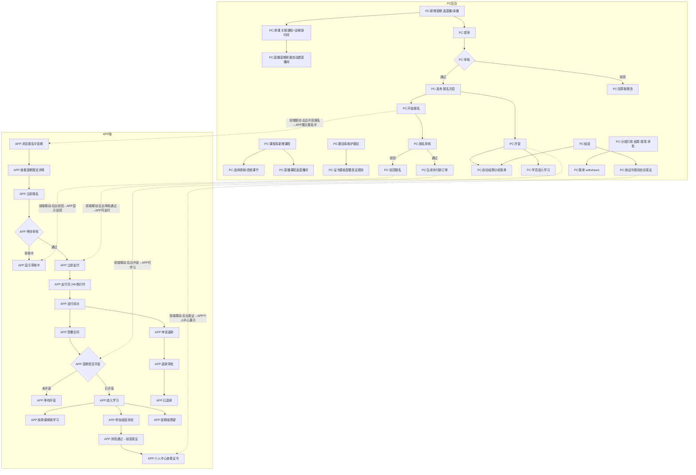

关键标注：
- 营期报名审核：人工审核（PC后台 EnrollmentReviewPage）
- 直播营期排课：保存后自动建直播间（campStore.createSchedule 联动 liveStore.createSession）
- 结营发证：按证书模板规则（task_threshold/score_threshold）自动判定，非硬编码
- 退款：APP发起申请→后台审批→4项回滚（订单/分成/合同/学员退出）

【1.2 双端页面流转拓扑图】

APP 端内部跳转（学员端主导）：

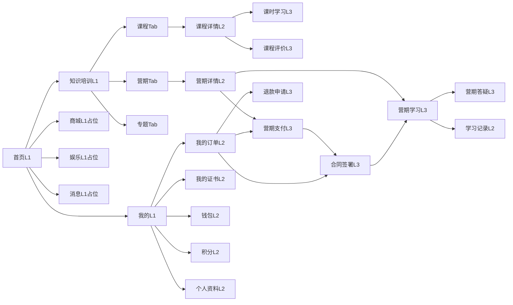

APP 讲师端：【已停用 2026-08-25】工作bench → 课程管理/直播/收入/我的
APP 助教端：【已停用 2026-08-25】工作bench → 招募/答疑/直播/我的

PC 后台内部跳转（菜单导航）：

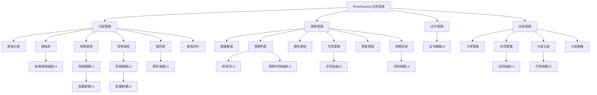

双端跨端触发关系：

| 触发端 | 操作 | 对端影响 | 同步方式 |
|--------|------|---------|---------|
| PC | 课程发布/下架 | APP课程列表展示/隐藏 | store共享(原型)；真实为接口刷新 |
| PC | 营期开启报名 | APP营期列表显示"报名中" | store共享 |
| PC | 报名审核通过 | APP详情页CTA变为"立即支付" | store共享 |
| PC | 营期开营 | APP详情页CTA变为"进入学习" | store共享 |
| PC | 结营发证 | APP个人中心/学习页展示证书 | store共享 |
| PC | 证书撤销 | APP证书状态变为"已撤销" | store共享 |
| PC | 分成打款 | 讲师端收入展示更新 | store共享 |
| APP | 用户报名 | PC报名审核列表新增待审 | store共享 |
| APP | 用户支付 | PC订单列表新增已支付订单 | store共享 |
| APP | 用户签合同 | PC合同管理列表状态更新 | store共享 |
| APP | 用户申请退款 | PC售后管理新增退款申请 | store共享 |
| APP | 用户提交答疑 | PC答疑管理新增问题 | store共享 |
| APP | 用户参加测验 | PC测验管理通过率更新 | store共享 |

原型同步机制说明：原型为单页应用共享 Pinia store，双端数据实时一致。真实环境需通过接口/WebSocket实现，刷新策略见各页面第三部分。

【1.3 核心业务对象状态机】

营期 Camp 状态机（8状态，PC端驱动）：

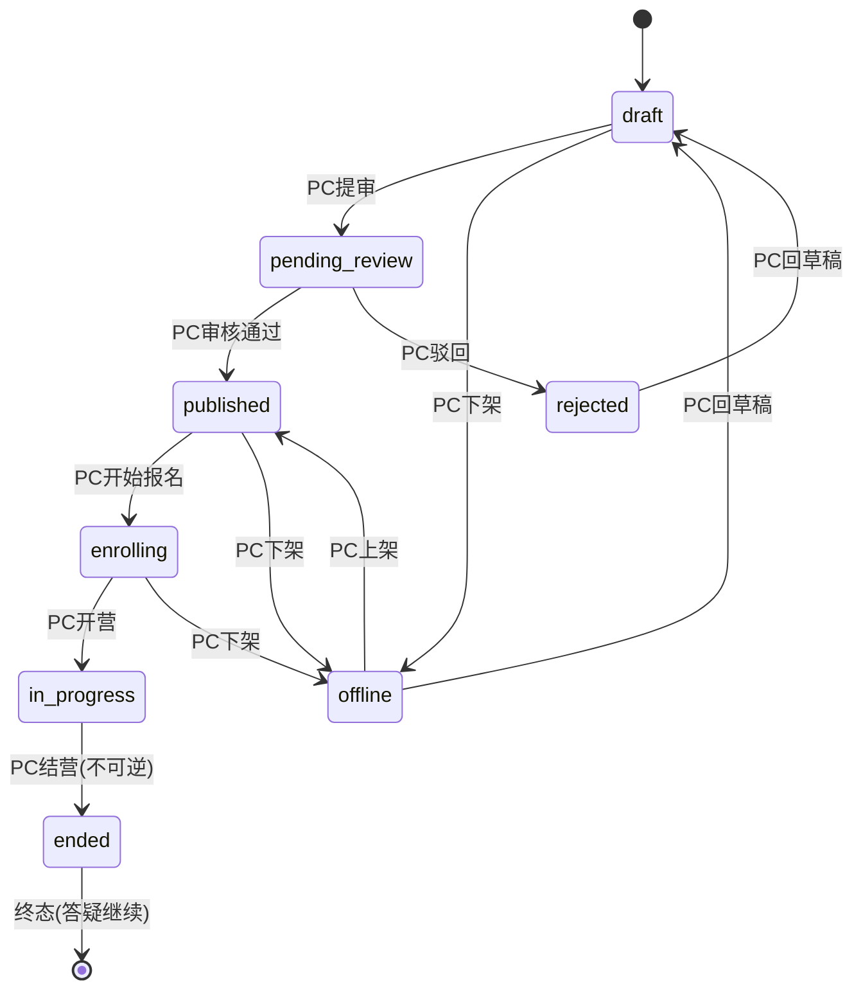

报名 Enrollment 状态机（6状态，APP发起+PC审核）：

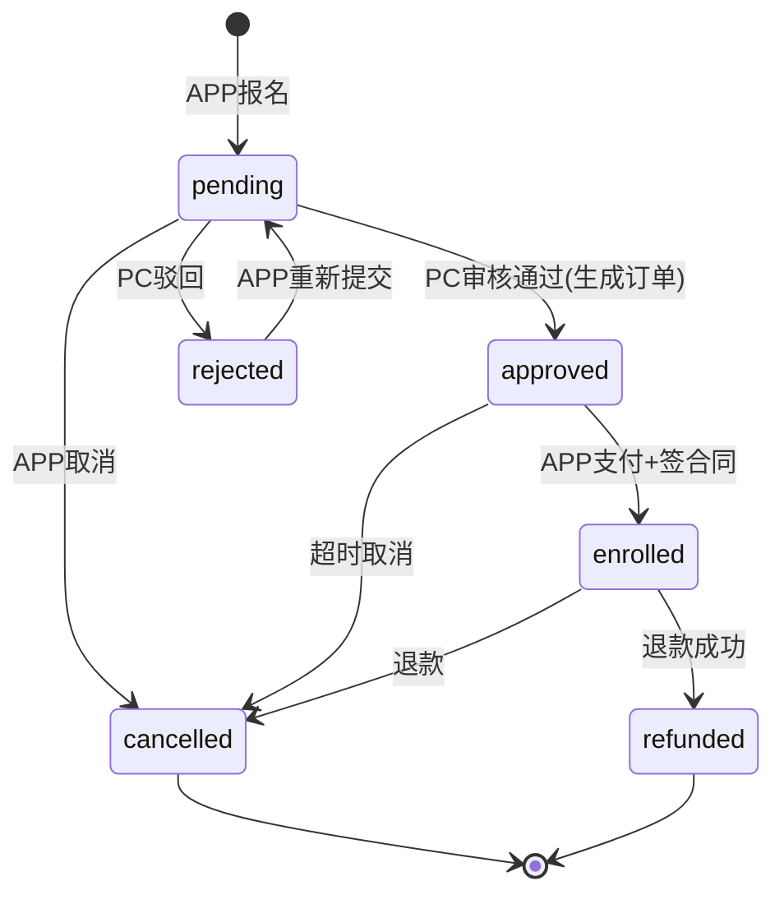

营期订单 CampOrder 状态机（4状态，APP支付驱动）：
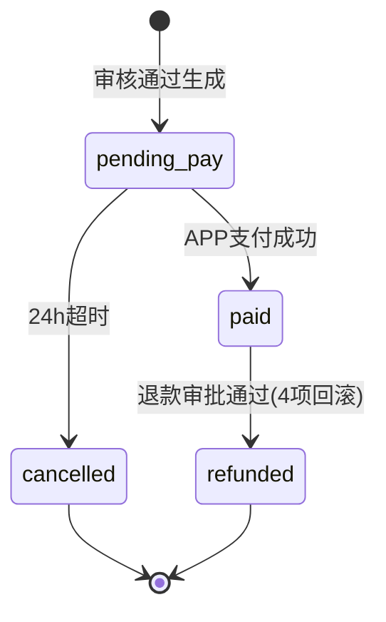

支付单 PaymentOrder 状态机（6状态）：
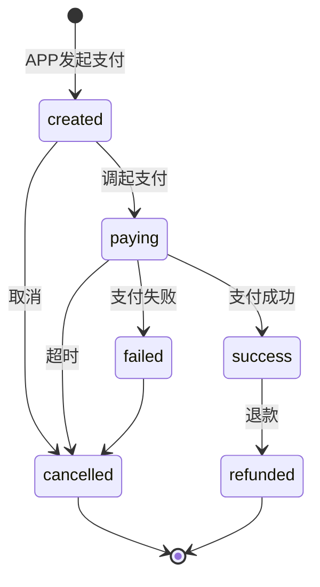

分成账单 CommissionBill 状态机（4状态，PC驱动）：
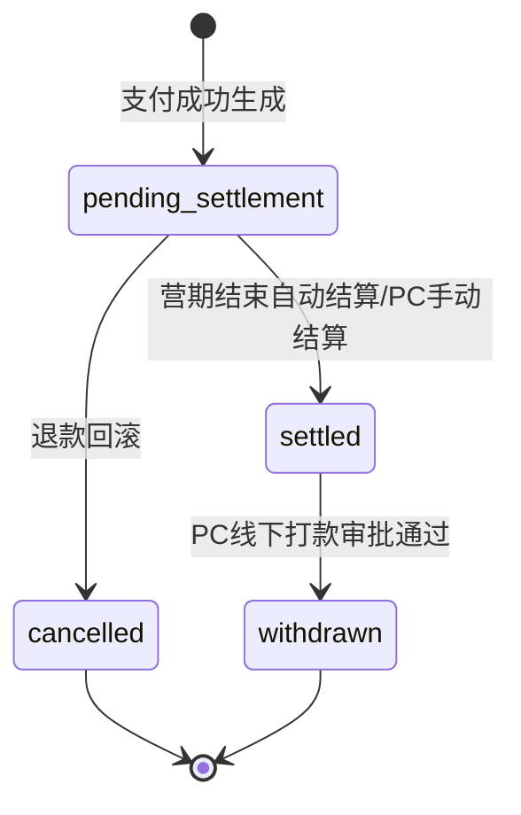

合同 Contract 状态机（3状态，APP签署）：
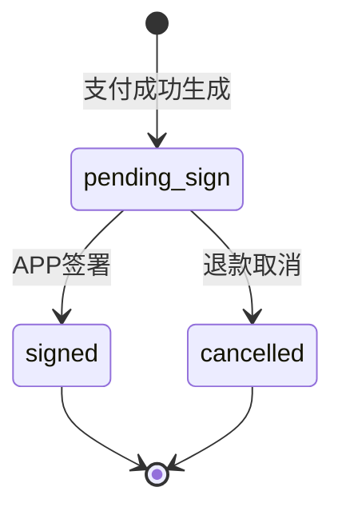

课程 Course 状态机（4状态，PC驱动）：
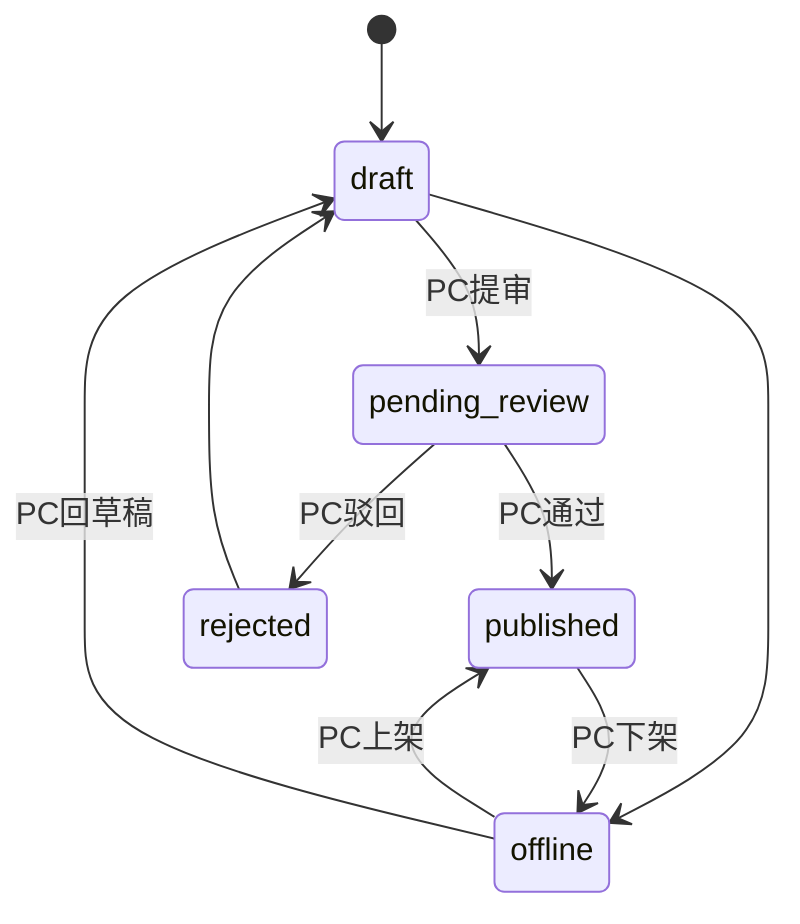

课节 Lesson 状态机（3状态）：draft→published→offline（可回 published/draft）

讲师 Lecturer 状态机（3状态）：active↔suspended→left(终态，课程快照锁定)

【1.4 数据流向与双端同步图】

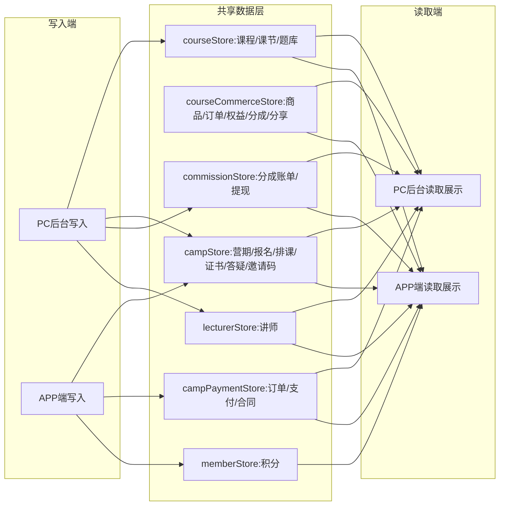

同步机制（原型）：Pinia store 内存共享，双端实时一致
同步机制（真实环境假设）：
- 配置类数据（课程/营期/证书模板）：接口拉取 + 本地缓存，后台变更触发APP刷新
- 交易类数据（订单/支付/分成）：接口实时拉取，无缓存
- 实时通知（报名/退款/答疑新消息）：WebSocket推送
- 数据冲突：后台为权威端，APP操作乐观更新失败后回滚

【1.5 权限与角色矩阵】

PC 后台角色（原型简化为单租户管理员）：

| 角色 | 内容管理 | 营期管理 | 交易管理 | 证书 | 数据看板 |
|------|---------|---------|---------|------|---------|
| 租户管理员 | 全部 | 全部 | 全部 | 全部 | 全部 |
| (预留)运营 | 查看/编辑 | 查看/审核 | 查看 | - | 查看 |
| (预留)财务 | - | - | 全部 | - | 查看 |

APP 端角色：

| 角色 | 学员功能 | 讲师功能 | 助教功能 |
|------|---------|---------|---------|
| 学员 | 浏览/报名/支付/学习/答疑/退款/证书 | - | - |
| 讲师 | 共享学员页(直播间/营期/课时) | 工作bench/课程/直播/收入/我的 | - |
| 助教 | 共享学员页 | - | 工作bench/招募/答疑/直播/我的 |

权限守卫：router.beforeEach，原型演示模式不强制重定向（供评审），localStorage app-role 标识角色，URL ?role= 覆盖，embed=1 完全放行

==================================================
第二部分：全量页面清单（双端统一索引）
==================================================

【2.1 APP 学员端页面清单】

| 页面ID | 端 | 页面名称 | 模块 | 层级 | 入口来源 | 出口去向 | 关联对端操作 | 弹窗/子页 | 状态页数 |
|--------|----|---------|----- |------|---------|---------|-------------|---------|---------|
| APP-S-001 | APP | 首页 | 首页 | L1 | Tab栏 | 知识培训/商城/娱乐/消息/我的 | 后台课程/营期发布 | - | 3 |
| APP-S-002 | APP | 知识培训 | 知识 | L1 | Tab栏/首页 | 课程详情/营期详情 | 后台课程/营期 | 分类筛选弹层 | 4 |
| APP-S-003 | APP | 商城 | 商城 | L1 | Tab栏 | (占位) | - | - | 1 |
| APP-S-004 | APP | 娱乐 | 娱乐 | L1 | Tab栏 | (占位) | - | - | 1 |
| APP-S-005 | APP | 消息 | 消息 | L1 | Tab栏 | (占位) | - | - | 1 |
| APP-S-006 | APP | 我的 | 个人 | L1 | Tab栏 | 订单/证书/钱包/积分/资料 | 后台证书发放 | - | 2 |
| APP-S-007 | APP | 课程详情 | 课程 | L2 | 知识培训/首页 | 课时学习/评价 | 后台课程库 | 试看浮层 | 3 |
| APP-S-008 | APP | 课时学习 | 课程 | L3 | 课程详情 | (返回) | 后台课节配置 | 答题浮层/Toast | 4 |
| APP-S-009 | APP | 课程评价 | 课程 | L3 | 课程详情 | (返回) | - | 提交评价弹窗 | 2 |
| APP-S-010 | APP | 营期详情 | 营期 | L2 | 知识培训/首页/订单 | 支付/学习/答疑 | 后台营期/报名审核 | 邀请码输入/营期选择 | 6 |
| APP-S-011 | APP | 营期支付 | 营期 | L3 | 营期详情 | 合同签署/返回 | 后台订单/支付 | - | 5 |
| APP-S-012 | APP | 营期学习 | 营期 | L3 | 营期详情/订单 | 课时学习/答疑 | 后台排课/测验/证书 | 测验答题/合同横幅 | 5 |
| APP-S-013 | APP | 营期答疑 | 营期 | L3 | 营期学习 | (返回) | 后台答疑管理 | 提问弹窗 | 2 |
| APP-S-014 | APP | 合同签署 | 交易 | L3 | 营期支付/订单 | 营期学习/返回 | 后台合同管理 | 勾选协议 | 3 |
| APP-S-015 | APP | 退款申请 | 交易 | L3 | 订单 | (返回) | 后台售后管理 | 退款原因输入 | 2 |
| APP-S-016 | APP | 我的订单 | 个人 | L2 | 我的 | 支付/合同/退款/营期 | 后台订单 | 状态筛选Tab | 4 |
| APP-S-017 | APP | 我的证书 | 个人 | L2 | 我的/学习记录 | (查看大图) | 后台证书发放/撤销 | 证书预览 | 2 |
| APP-S-018 | APP | 学习记录 | 个人 | L2 | 我的 | 课时学习 | - | - | 2 |
| APP-S-019 | APP | 钱包 | 个人 | L2 | 我的 | (返回) | - | - | 2 |
| APP-S-020 | APP | 积分中心 | 个人 | L2 | 我的 | (返回) | - | - | 2 |
| APP-S-021 | APP | 个人资料 | 个人 | L2 | 我的 | (返回) | - | 编辑弹窗 | 2 |
| APP-S-022 | APP | 直播间 | 直播 | L3 | 营期学习/直播列表 | (返回) | 后台直播间 | 互动浮层 | 3 |
| APP-S-023 | APP | 直播列表 | 直播 | L2 | 首页/知识 | 直播间 | - | - | 2 |
| APP-S-024 | APP | 讲座中心 | 讲座 | L2 | 首页 | 课程详情 | - | - | 2 |
| APP-S-025 | APP | 店铺列表 | 店铺 | L2 | 首页 | 店铺首页/商品详情 | - | - | 2 |
| APP-S-026 | APP | 店铺首页 | 店铺 | L3 | 店铺列表 | 商品详情/讲师 | - | - | 2 |
| APP-S-027 | APP | 商品详情 | 商品 | L3 | 店铺首页/首页 | (返回) | - | 购买弹窗 | 3 |

【2.2 APP 讲师端页面清单】

| 页面ID | 端 | 页面名称 | 模块 | 层级 | 入口 | 出口 | 关联对端 | 弹窗 |
|--------|----|---------|-----|------|------|------|---------|------|
| APP-L-001 | APP | 讲师工作台 | 讲师 | L1 | Tab栏 | 课程/直播/收入/学员详情 | 后台排课/学员管理 | 排课日历弹窗 |
| APP-L-002 | APP | 讲师课程管理 | 讲师 | L2 | 工作台 | (返回) | 后台课程库 | - |
| APP-L-003 | APP | 讲师直播 | 讲师 | L2 | 工作台 | 直播间 | 后台直播间 | - |
| APP-L-004 | APP | 讲师收入 | 讲师 | L2 | 工作台 | (返回) | 后台分成记录 | 提现弹窗 |
| APP-L-005 | APP | 讲师我的 | 讲师 | L1 | Tab栏 | 个人资料/收益 | - | - |
| APP-L-006 | APP | 讲师主页 | 讲师 | L3 | 店铺首页 | 课程详情 | - | - |

【2.3 APP 助教端页面清单】

| 页面ID | 端 | 页面名称 | 模块 | 层级 | 入口 | 出口 | 关联对端 | 弹窗 |
|--------|----|---------|-----|------|------|------|---------|------|
| APP-A-001 | APP | 助教工作台 | 助教 | L1 | Tab栏 | 招募/答疑/直播/学员 | 后台报名/学员 | - |
| APP-A-002 | APP | 助教招募 | 助教 | L2 | 工作台 | (返回) | 后台报名审核 | 邀请码弹窗 |
| APP-A-003 | APP | 助教答疑 | 助教 | L2 | 工作台 | (返回) | 后台答疑管理 | 回复弹窗 |
| APP-A-004 | APP | 助教直播 | 助教 | L2 | 工作台 | 直播间 | 后台直播间 | - |
| APP-A-005 | APP | 助教我的 | 助教 | L1 | Tab栏 | (返回) | - | - |

【2.4 PC 后台页面清单】

| 页面ID | 端 | 页面名称 | 模块 | 层级 | 入口 | 出口 | 关联对端 | 弹窗/抽屉 |
|--------|----|---------|-----|------|------|------|---------|----------|
| PC-001 | PC | 课程分类 | 内容 | L2 | 侧边菜单 | (列表内操作) | APP课程分类筛选 | 新建弹窗 |
| PC-002 | PC | 课程库 | 内容 | L2 | 侧边菜单 | 视频编辑/音频编辑 | APP课程列表 | 新增抽屉/内容池选择/查看视频/查看题库 |
| PC-003 | PC | 视频课程列表 | 内容 | L2 | 侧边菜单 | 视频编辑/批量新增 | APP视频课节 | 停用确认 |
| PC-004 | PC | 视频编辑 | 内容 | L3 | 视频列表 | (返回列表) | APP课节内容 | 视频选择弹窗 |
| PC-005 | PC | 视频批量新增 | 内容 | L3 | 视频列表 | (返回列表) | - | - |
| PC-006 | PC | 音频课程列表 | 内容 | L2 | 侧边菜单 | 音频编辑/批量新增 | APP音频课节 | 停用确认 |
| PC-007 | PC | 音频编辑 | 内容 | L3 | 音频列表 | (返回) | - | 音频选择弹窗 |
| PC-008 | PC | 音频批量新增 | 内容 | L3 | 音频列表 | (返回) | - | - |
| PC-009 | PC | 题目库 | 内容 | L2 | 侧边菜单 | (列表内操作) | APP测验题目 | 新增/编辑弹窗 |
| PC-010 | PC | 课程评价 | 内容 | L2 | 侧边菜单 | (回复) | - | 回复弹窗 |
| PC-011 | PC | 营期数据看板 | 营期 | L2 | 侧边菜单 | (筛选) | - | - |
| PC-012 | PC | 营期列表 | 营期 | L2 | 侧边菜单 | 排课/学员抽屉/详情 | APP营期展示 | 新增弹窗/驳回弹窗/邀请码抽屉/详情抽屉/学员抽屉 |
| PC-013 | PC | 排课管理 | 营期 | L3 | 营期列表 | (返回) | APP排课学习 | 单条新增/一键排课/批量排课/快捷新建课程 |
| PC-014 | PC | 报名审核 | 营期 | L2 | 侧边菜单 | (列表内操作) | APP报名状态 | 驳回弹窗 |
| PC-015 | PC | 学员管理 | 营期 | L2 | 侧边菜单 | 学员抽屉 | APP学员 | 学员抽屉/邀请码弹窗/调归属弹窗/分组弹窗 |
| PC-016 | PC | 答疑管理 | 营期 | L2 | 侧边菜单 | (回复) | APP答疑 | 回复弹窗 |
| PC-017 | PC | 营期测验 | 营期 | L2 | 侧边菜单 | (详情) | APP结营测验 | 新增弹窗/详情弹窗 |
| PC-018 | PC | 证书管理 | 证书 | L2 | 侧边菜单 | 证书编辑 | APP证书展示 | 证书详情弹窗/撤销弹窗 |
| PC-019 | PC | 证书编辑 | 证书 | L3 | 证书管理 | (返回列表) | APP证书 | 营期选择弹窗 |
| PC-020 | PC | 订单管理 | 交易 | L2 | 侧边菜单 | (筛选) | APP订单 | 订单详情抽屉 |
| PC-021 | PC | 合同管理 | 交易 | L2 | 侧边菜单 | (详情) | APP合同 | 合同详情抽屉 |
| PC-022 | PC | 分成记录 | 交易 | L2 | 侧边菜单 | (打款) | 讲师收入 | 打款弹窗 |
| PC-023 | PC | 分享数据 | 交易 | L2 | 侧边菜单 | (筛选) | - | - |
| PC-024 | PC | 售后管理 | 交易 | L2 | (菜单/营期) | (退款操作) | APP退款 | 退款弹窗/驳回弹窗 |
| PC-025 | PC | 学员洞察 | 营期 | L2 | 侧边菜单 | 学员详情 | - | 学员详情弹窗 |

【2.5 弹窗/浮层/抽屉独立交互单元清单】

| 单元ID | 所属页面 | 类型 | 用途 |
|--------|---------|------|------|
| POP-001 | PC-002 | Drawer | 新增/编辑课程 |
| POP-002 | PC-002 | Dialog | 内容池选择(视频/音频) |
| POP-003 | PC-002 | Dialog | 查看视频播放器 |
| POP-004 | PC-002 | Dialog | 查看题库题目 |
| POP-005 | PC-004/007 | Dialog | 素材库选择(视频/音频) |
| POP-006 | PC-009 | Dialog | 新增/编辑题目 |
| POP-007 | PC-012 | Dialog | 新增/编辑营期 |
| POP-008 | PC-012 | Dialog | 驳回营期 |
| POP-009 | PC-012 | Drawer | 邀请码管理 |
| POP-010 | PC-012 | Dialog | 生成邀请码 |
| POP-011 | PC-012 | Dialog | 二维码预览 |
| POP-012 | PC-012 | Drawer | 营期详情(三Tab) |
| POP-013 | PC-013 | Dialog | 单条新增排课 |
| POP-014 | PC-013 | Dialog | 一键排课 |
| POP-015 | PC-013 | Dialog | 批量排课 |
| POP-016 | PC-013 | Dialog | 快捷新建课程 |
| POP-017 | PC-015 | Drawer | 学员抽屉 |
| POP-018 | PC-015 | Dialog | 生成邀请码/调归属/新建分组 |
| POP-019 | PC-017 | Dialog | 新增/编辑总测验 |
| POP-020 | PC-017 | Dialog | 总测验详情 |
| POP-021 | PC-018 | Dialog | 证书详情 |
| POP-022 | PC-018 | Dialog | 撤销证书 |
| POP-023 | PC-019 | Dialog | 选择营期 |
| POP-024 | PC-022 | Dialog | 线下打款登记 |
| POP-025 | PC-024 | Dialog | 退款确认/驳回 |
| POP-026 | APP-S-010 | ActionSheet | 邀请码输入区 |
| POP-027 | APP-S-012 | 浮层 | 测验答题界面 |
| POP-028 | APP-S-013 | Dialog | 提问弹窗 |
| POP-029 | APP-S-014 | Checkbox | 协议勾选 |
| POP-030 | APP-S-021 | Dialog | 编辑资料 |

【2.6 页面总数统计】

| 端 | L1 | L2 | L3 | 弹窗/抽屉 | 合计页面 | 合计交互单元 |
|----|-----|-----|-----|---------|---------|------------|
| APP 学员 | 6 | 9 | 12 | 5 | 27 | 5 |
| APP 讲师 | 2 | 3 | 1 | 2 | 6 | 2 |
| APP 助教 | 2 | 3 | 0 | 2 | 5 | 2 |
| PC 后台 | 0 | 19 | 6 | 25 | 25 | 25 |
| 合计 | 10 | 34 | 19 | 34 | 63 | 34 |

注：APP商城/娱乐/消息为占位Tab（无实质页面），计入L1占位。

【质量门禁自检（第一、二部分）】
- [x] 页面清单覆盖 APP 端所有 Tab/二级入口/弹窗 + PC 后台所有菜单/弹窗/抽屉
- [x] APP 层级标注 L1/L2/L3/L4，PC 层级标注 L1/L2/L3/L4
- [x] 每页列出入口来源与出口去向
- [x] 「关联对端操作」列标注双端联动点
- [x] 弹窗/抽屉/浮层独立编号
- [x] 核心业务链路含异常分支（驳回/退款/超时）
- [x] 状态机标注触发端（APP/PC/系统）
- [x] 权限矩阵覆盖双端角色
- [x] 假设项明确标注（模拟数据/无真实接口）

【下一步】
请确认第一、二部分的页面清单与双端联动关系无遗漏。确认后我按模块分批输出第三部分（单页面详细规格），每批5-8个页面，APP端与PC后台同模块页面放一起便于联动校验。建议分批顺序：
1. 营期模块（APP营期详情/支付/学习/答疑 + PC营期列表/排课/报名审核/测验）
2. 课程模块（APP课程详情/课时学习 + PC课程库/视频编辑/音频编辑/题目库）
3. 交易模块（APP合同/退款/订单 + PC订单/合同/分成/售后）
4. 证书模块（APP证书 + PC证书管理/编辑）
5. 个人中心模块（APP我的/钱包/积分/资料 + PC学员洞察）
6. 讲师/助教模块（APP讲师端/助教端 + PC数据看板/学员管理/答疑管理）

==================================================
第三部分：单页面详细规格（按模块分批）
==================================================

【批1·营期模块】（APP 4页 + PC 4页 = 8页）

营期是本产品核心业务对象，串联课程/报名/支付/合同/学习/测验/答疑/证书/分成全链路。本批8页构成营期业务闭环。

--------------------------------------------------
【APP-S-010 营期详情页】
--------------------------------------------------

【页面基本信息】
- 页面ID：APP-S-010 / 端类型：APP / 页面名称：营期详情 / 所属模块：营期 / 层级：L2
- 页面用途：展示营期图文详情、排课概览、报名状态，提供报名→支付→签合同→学习全流程CTA
- 访问权限：登录学员（未登录可看介绍但不可报名）
- 前置条件：营期ID存在且status≠offline；营期在报名中/进行中/已结束均可访问

【页面结构与组件树】
- div.camp-detail
  - header.app-header（返回按钮 + "营期详情"）静态
  - template v-if="camp"
    - div.cover（封面图，无图时绿色占位）+ span.mode-tag（直播📺/录播📹）动态
    - h2 营期标题 动态
    - div.meta（时间/天数/店长）动态
    - div.stat（已报/已加入/价格/报名截止）动态
    - div.detail-tabs（介绍/排课/报名3个Tab）静态
    - template v-if="detailTab==='介绍'"
      - div.lecturer-card（店长头像/姓名/角色）动态
      - div.info-card（模式/容量/已加入/排课数4行）动态
      - div.intro-card（营期介绍文案，无则隐藏）动态
    - template v-if="detailTab==='排课'"
      - div.schedule-item*（Day/标题/类型/模式/解锁时间/关联课程）动态
    - template v-if="detailTab==='报名'"
      - div.enroll-status（按ctaState显示对应状态文案）动态
    - div.cta-bar（固定底部，按ctaState显示对应CTA）动态
  - div v-else（营期不存在兜底：⚠️+文案+返回按钮）静态兜底

【字段级细节】
- camp.title：string，来源campStore.camps.find(id)，展示原值
- camp.mode：enum 'live'|'recorded'，映射"📺直播"|"📹录播"
- camp.start_date/end_date：string YYYY-MM-DD，来源seed dStr()，展示"MM-DD~MM-DD"
- camp.enroll_deadline：unix秒，来源seed dayAhead()，formatDeadline()转"截止M/D"
- camp.enrolled_count/joined_count/capacity：number，展示原值
- camp.price：number分，展示"¥N"或"免费"；price=0或is_paid=false显示免费
- camp.description：string，空则隐藏intro-card
- schedules[].unlock_time：unix秒，formatUnlockTime()转"M/D HH:mm解锁"
- ctaState：computed，10种值(enroll/pending/rejected/pay/sign/wait_start/joined/cancelled/order_cancelled/refunded)，已修复模板中无法到达的in_progress死代码分支
- 错误提示："报名成功，等待审核" / "营期不存在或已下架" / "请先签署合同再学习"

【交互逻辑】
- 返回按钮←：触发方式click，即时反馈无，操作结果router.back()
- detailTab切换：click，即时高亮active，切换显示对应Tab内容
- "立即报名"按钮：click→showInviteInput=true显示邀请码输入区
- "确认报名"按钮：click→enrollWithCode()调campStore.createEnrollment(channel:'self')，成功Toast"报名成功，等待审核"
- "重新提交"按钮：rejected状态显示，click→resubmit()
- "立即支付"按钮：click→goPay()，免费营期直接onPaySuccess并跳合同页，付费跳CampPayPage
- "签署合同"按钮：click→goSign()跳ContractSignPage
- "进入学习"按钮：click→goLearn()跳CampLearnPage
- 防抖：报名/支付操作有submitting锁，防重复
- 兜底：camp不存在显示⚠️+返回按钮，不留死页

【网络与数据】
- 初始化：无独立接口，从campStore共享内存读camp/schedules/enrollments/orders
- 操作接口：createEnrollment（报名）、onPaySuccess（免费支付）
- 缓存：无（store内存共享）
- 轮询：无
- 双端联动：后台审核通过→enrollment.status=approved→ctaState=pay自动切换；后台开营→camp.status=in_progress→ctaState=joined；store共享实时生效

【状态页全覆盖】
- 加载中：无（store内存读取即时）
- 空数据：营期不存在→兜底页⚠️+返回按钮
- 加载失败：无（本地数据）
- 无权限：未登录→createEnrollment报错（原型未做登录拦截）
- 内容下架：camp.status=offline→列表不显示，详情页显示兜底
- 网络断开：无

【异常与边界场景】
- 数据超长：camp.description长文本→CSS自适应
- 并发操作：重复报名→createEnrollment幂等校验（已报名报错）
- 极端数据：price=0→显示"免费"；capacity=0→显示"不限"
- 权限变更：登录过期→createEnrollment失败（原型未实现）

【上下游关系与双端联动】
- 上游：PC后台创建营期→APP列表展示；PC审核报名→ctaState变化；PC开营→ctaState变化；PC结营→证书生成
- 下游：报名→PC报名审核新增；支付→PC订单新增；签合同→PC合同状态更新；退款→PC售后新增
- 双端联动：后台驳回报名→APP显示"❌ 审核未通过：原因"；后台开营→APP"进入学习"按钮可用

--------------------------------------------------
【APP-S-011 营期支付页】
--------------------------------------------------

【页面基本信息】
- 页面ID：APP-S-011 / 端类型：APP / 页面名称：营期支付 / 模块：营期 / 层级：L3
- 页面用途：展示订单信息，调起支付，24h倒计时，支付成功后引导签合同
- 访问权限：已报名且审核通过（enrollment.status=approved）
- 前置条件：存在pending_pay状态订单；进入需带campId

【页面结构与组件树】
- div.camp-pay
  - header.app-header（返回+"营期支付"）静态
  - div v-if="order&&status==='pending_pay'"
    - div.order-card（营期名/订单号/金额/支付方式）动态
    - div.countdown（24h倒计时）动态
    - div.pay-methods（微信/支付宝2选项）静态
    - button.pay-btn（立即支付）动态
  - div.status-page.paid（已支付：✅+去签合同/进入学习按钮）动态
  - div.status-page.cancelled（已取消：❌+重新报名）动态
  - div.status-page.refunded（已退款：💸）动态
  - div.empty-state（订单不存在兜底）静态兜底

【字段级细节】
- order.order_no：string，展示原值
- order.camp_title：string，展示原值
- order.amount：number分，展示"¥N.NN"
- order.status：enum pending_pay|paid|cancelled|refunded，映射展示
- 倒计时：24h从订单创建算起，每秒-1，到0自动取消订单
- 支付方式：'wechat'|'alipay'，默认wechat
- contractSigned：computed查payStore.contracts，paid状态判断是否已签
- 错误提示："订单不存在" / "支付失败"

【交互逻辑】
- 返回按钮：click→router.back()
- 支付方式选择：click切换选中样式
- "立即支付"按钮：click→doPay()，创建PaymentOrder→模拟支付成功→onPaySuccess→Toast→状态切paid
- "去签合同"按钮（paid且未签）：click→跳ContractSignPage
- "进入学习"按钮（paid且已签）：click→跳CampLearnPage
- "重新报名"按钮（cancelled）：click→跳营期详情页
- 防抖：paying锁防重复支付
- 倒计时：到0自动cancelled

【网络与数据】
- 初始化：payStore.enrollmentOrders.find(orderId|campId+studentId)
- 操作：createPaymentOrder、onPaySuccess
- 缓存：无
- 双端联动：APP支付成功→PC订单列表status=paid同步

【状态页全覆盖】
- 加载中：无
- 空数据：订单不存在→兜底页
- 失败：支付失败→Toast"支付失败"
- 已支付/已取消/已退款：3种状态页分别展示

【异常与边界场景】
- 重复支付：paid状态不显示支付按钮
- 超时：24h到自动cancelled
- 免费营期：营期详情页goPay直接onPaySuccess不进此页

【上下游关系与双端联动】
- 上游：营期详情页goPay跳入
- 下游：支付成功→PC订单paid；签合同→PC合同signed
- 双端联动：APP支付→PC订单列表实时新增；APP签合同→PC合同管理状态更新

--------------------------------------------------
【APP-S-012 营期学习页】
--------------------------------------------------

【页面基本信息】
- 页面ID：APP-S-012 / 端类型：APP / 页面名称：营期学习 / 模块：营期 / 层级：L3
- 页面用途：展示营期内排课列表（按解锁时间）、结营测验、答疑入口、订单、合同、学员列表，提供学习入口
- 访问权限：enrolled学员（已签合同）
- 前置条件：enrollment.status=enrolled且camp.status=in_progress（未开营显示等待）

【页面结构与组件树】
- div.camp-learn
  - header.app-header（返回+"营期名"）静态
  - div.camp-info（模式/天数/已加入/排课数）动态
  - div.tabs（课程/测验/答疑/订单/学员5个Tab）静态
  - template v-if="tab==='课程'"
    - div.day-group*（按day_number分组）
      - div.day-title "Day N" 静态
      - div.sched-card*（解锁状态/完成状态/标题/类型/模式/解锁时间）动态
  - template v-if="tab==='测验'"
    - div.quiz-info（测验名/题数/总分/及格分/开始按钮）动态
    - div.quiz-active（逐题答题）动态
    - div.quiz-result（得分/通过否/答对数）动态
  - template v-if="tab==='答疑'"
    - button.go-qa-btn 跳答疑区
  - template v-if="tab==='订单'"
    - div.order-card（订单号/金额/状态/退款按钮）动态
    - div.empty（无订单兜底）
  - template v-if="tab==='学员'"
    - div.enroll-card*（学员名/状态）动态
    - div.empty（无学员兜底）

【字段级细节】
- schedules[].unlock_time：unix秒，isUnlocked判断<=当前时间，formatUnlock()转"M/D HH:mm解锁"
- schedules[].schedule_mode：'live'|'recorded'，映射📺/📹
- isCompleted(s)：课程类查learningRecords.completion_rate>=0.9，打卡类查checkins
- finalQuiz.question_count/total_score/pass_score：number，展示原值
- scorePerQuestion：computed=total_score/question_count，保留1位小数
- quizQuestions：从courseStore.questions按bank_id过滤
- myContract.status：'pending_sign'|'signed'
- 错误提示："该课程尚未解锁" / "请先签署合同再学习" / "该排课未关联课时"

【交互逻辑】
- sched-card点击：click→goLesson(s)，未解锁拦截，未签合同拦截，跳LessonLearnPage
- "开始测验"：click→startQuiz()
- 测验答题：单选radio选答案→"下一题"→submitQuizAnswer()
- 测验结果：展示得分/通过否
- "查看合同"：click→跳ContractSignPage
- "申请退款"：click→跳RefundApplyPage
- 防抖：测验答题无防抖（单选）

【网络与数据】
- 初始化：campStore.loadSchedulesByCamp、finalQuizzes.find、payStore.enrollmentOrders
- 操作：无写操作（测验为本地状态）
- 缓存：无
- 双端联动：PC排课→APP排课列表同步；PC配置测验→APP测验Tab显示；PC发证→APP证书展示

【状态页全覆盖】
- 加载中：无
- 空数据：测验无→说明文案；订单无→说明；学员无→说明
- 失败：无
- 解锁状态：未解锁🔒灰显不可点

【异常与边界场景】
- 排课无关联课时：goLesson拦截"未关联课时"
- 测验无题库：quizQuestions.length=0显示"暂无题目"
- 营期未开营：ctaState=wait_start，不显示学习内容

【上下游关系与双端联动】
- 上游：PC排课→学习内容；PC测验配置→测验Tab；PC发证→证书展示
- 下游：学习→learningRecords更新；测验通过→证书发放条件满足
- 双端联动：PC排课变更→APP排课列表实时刷新；PC结营→APP自动发证

--------------------------------------------------
【APP-S-013 营期答疑页】
--------------------------------------------------

【页面基本信息】
- 页面ID：APP-S-013 / 端类型：APP / 页面名称：营期答疑 / 模块：营期 / 层级：L3
- 页面用途：营期级全局答疑，学员提问，店长/店员回复，标记解决/置顶
- 访问权限：enrolled学员
- 前置条件：campId存在

【页面结构与组件树】
- div.camp-qa
  - header.app-header（返回+"营期答疑"）静态
  - h2.qa-title 营期名 动态
  - button.ask-btn（提问）静态
  - div.qa-item*（问题+回复列表+操作按钮）动态
  - div.empty（无答疑兜底+去提问按钮）静态兜底
  - transition sheet（提问弹窗）动态

【字段级细节】
- qa.content：string，提问内容
- qa.questioner_name/role：string，映射学员/店长/店员
- qa.replies[].content/replier_name/replier_role：回复列表
- qa.is_pinned：bool，置顶样式
- qa.is_resolved：bool，已解决样式
- 错误提示："请输入问题"

【交互逻辑】
- "提问"按钮：click→showAsk=true
- 提问弹窗"提交"：click→doAsk()调campStore.createQA
- "回复"按钮：click→showReply(qa.id)
- "回复"弹窗提交：click→doReply()调campStore.createQAReply
- "子回复"：click→showSubReply
- "置顶/取消置顶"：click→togglePin
- "标记解决/已解决"：click→toggleResolve
- 防抖：提问/回复有内容校验

【网络与数据】
- 初始化：campStore.loadQAsByCamp
- 操作：createQA、createQAReply、updateQA(pin/resolve)
- 缓存：无
- 双端联动：APP提问→PC答疑管理新增；APP回复→PC答疑状态更新

【状态页全覆盖】
- 加载中：无
- 空数据：无答疑→图标+文案+"去提问"按钮
- 失败：无

【异常与边界场景】
- 空内容提问：拦截"请输入问题"
- 营期结束后：is_post_camp仍可答疑

【上下游关系与双端联动】
- 上游：PC答疑管理可回复/置顶/标记解决
- 下游：APP提问→PC新增待处理
- 双端联动：双向实时同步，跨营期严格隔离按campId

--------------------------------------------------
【PC-012 营期列表页】
--------------------------------------------------

【页面基本信息】
- 页面ID：PC-012 / 端类型：PC / 页面名称：营期列表 / 模块：营期 / 层级：L2
- 页面用途：营期CRUD、状态流转（提审/审核/开营/结营）、查看详情、邀请码管理
- 访问权限：租户管理员
- 前置条件：登录后台

【页面结构与组件树】
- t-card
  - div.toolbar（搜索/状态筛选/新增营期按钮）静态
  - t-table（营期列表：标题/模式/时间/状态/报名数/操作）动态
- t-dialog 新增/编辑营期（标题/描述/模式选择直播录播/时间/付费/分成/店长/容量）动态
- t-dialog 驳回营期（驳回原因输入）动态
- t-drawer 邀请码管理（生成/列表/二维码）动态
- t-dialog 生成邀请码（类型/数量）动态
- t-dialog 二维码预览 动态
- t-drawer 营期详情（3Tab：排课概览/邀请码漏斗/排课概览）动态

【字段级细节】
- 表格列：title/mode(start_end_days)/status/price/enrolled_count/joined_count/operation
- mode：radio 'live'|'recorded'，卡片选择样式，创建后disabled
- mode说明：直播"按直播场次排课/关联直播课程"，录播"按录播课节排课/关联录播课程"
- 时间：dateRange选择开始结束
- 付费：is_paid switch + price元 + 分成开关 + 店长/店员/平台比例
- 状态：enum draft|pending_review|published|enrolling|in_progress|ended|offline|rejected
- 操作按钮：草稿→提审/编辑/删除；pending_review→通过/驳回；published→开启报名/下架；enrolling→开营/下架；in_progress→结营/查看；ended→查看；offline→上架/回草稿
- 错误提示："请填写营期名称" / "请选择时间范围" / "直播/录播创建后不可修改"

【交互逻辑】
- 搜索：input输入→filtered实时过滤
- 状态筛选：select切换→filtered过滤
- 新增：click→打开dialog，填写→doSave→createCamp
- 编辑：click→打开dialog回填，保存→updateCamp
- 提审：click→transitionCampStatus(id,'pending_review')
- 审核：通过→transitionCampStatus(id,'published')；驳回→打开驳回dialog输入原因
- 开启报名：click→startEnrollment
- 开营：click→startCamp（自动结算分成）
- 结营：click→endCamp（自动发证+分成结算）
- 下架/上架：click→transitionCampStatus
- 排课按钮：draft/pending_review/rejected显示"排课"，审核通过后显示"查看详情"
- 邀请码：click→打开drawer
- 防抖：操作有确认弹窗

【网络与数据】
- 初始化：campStore.camps
- 操作：createCamp/updateCamp/transitionCampStatus/startEnrollment/startCamp/endCamp
- 缓存：store内存
- 双端联动：PC状态流转→APP营期展示/CTA状态实时同步

【状态页全覆盖】
- 加载中：表格loading
- 空数据：无营期→表格空提示
- 失败：无
- 操作受限：ended不可逆，offline可回草稿

【异常与边界场景】
- 大数据量：营期<100无分页（原型）
- 并发：状态流转有守卫（draft不可直接in_progress）
- 权限变更：无

【PC表格交互】
- 列：无排序/无筛选（筛选在toolbar）
- 行操作：固定右侧操作列
- 批量操作：无

【上下游关系与双端联动】
- 上游：课程库提供课程供排课关联
- 下游：营期状态→APP展示；排课→APP学习；报名审核→APP可支付
- 双端联动：所有状态变更实时影响APP营期详情CTA

--------------------------------------------------
【PC-013 排课管理页】
--------------------------------------------------

【页面基本信息】
- 页面ID：PC-013 / 端类型：PC / 页面名称：排课管理 / 模块：营期 / 层级：L3
- 页面用途：为营期配置排课（关联课程/设解锁时间/完成判定），支持单条/一键/批量排课
- 访问权限：租户管理员
- 前置条件：营期处于draft/pending_review/rejected（审核通过后锁定只读）

【页面结构与组件树】
- div.camp-schedule
  - div.header（返回+营期名+模式标签+排课数）
  - div.locked-tip（审核通过锁定提示，仅锁定时显示）
  - div.sched-timeline（排课时间线，按day分组）
    - div.day-group*（Day标题+排课卡片）
  - div.actions（新增排课/一键排课/批量排课按钮）
  - t-dialog 单条新增（Day/类型/标题/关联课程/具体课时/解锁时间/截止时间/完成判定/必学）
  - t-dialog 一键排课（选课程→自动排所有课时）
  - t-dialog 批量排课（表格多行编辑）
  - t-dialog 快捷新建课程（营期内直接建课程）

【字段级细节】
- schedule.schedule_type：'course'|'checkin_task'，本期打卡不做
- schedule.schedule_mode：'live'|'recorded'，与camp.mode一致
- schedule.unlock_time：unix秒，直播营期标签"直播开始时间"，录播"解锁时间"
- schedule.deadline：unix秒，直播"直播结束时间"，录播"截止时间"
- 关联课程filteredCourses：按camp.mode过滤（直播营期只选直播课程）
- 完成判定completionCriteriaOptions：直播['全程观看直播','直播签到'...]，录播['完播率≥90%'...]
- 直播营期提示：保存后自动创建专属直播间（campStore.createSchedule联动liveStore.createSession）
- 错误提示："请填写排课标题" / "必须选择关联课程" / "请选择解锁时间"

【交互逻辑】
- 排课卡片：展示标题/类型/模式/解锁时间/关联课程/必学/完成判定
- "新增排课"：click→打开dialog，填写→doAdd→createSchedule
- "一键排课"：click→选课程→自动排所有课时（按营期开始日递增）
- "批量排课"：click→打开表格多行编辑
- "快捷新建课程"：click→打开dialog建课程并发布
- 删除：popconfirm确认→del(s)
- 直播营期保存提示："已自动创建专属直播间（仅报名学员可观看）"
- 锁定状态：审核通过后只读，不显示操作按钮

【网络与数据】
- 初始化：campStore.loadSchedulesByCamp、courseStore.courses(按mode过滤)
- 操作：createSchedule、deleteSchedule、createCourse(快捷)
- 缓存：store内存
- 双端联动：PC排课→APP学习页排课列表实时同步；直播排课→自动建直播间

【状态页全覆盖】
- 加载中：无
- 空数据：无排课→时间线空+引导新增
- 失败：无
- 锁定状态：审核通过后只读

【异常与边界场景】
- 课程无已发布课时：一键排课提示
- 直播营期排课保存：自动建直播间（liveStore.createSession）
- 已锁定不可改：拦截操作

【上下游关系与双端联动】
- 上游：课程库提供课程
- 下游：APP学习页排课列表
- 双端联动：排课→APP学习内容；直播排课→自动建直播间

--------------------------------------------------
【PC-014 报名审核页】
--------------------------------------------------

【页面基本信息】
- 页面ID：PC-014 / 端类型：PC / 页面名称：报名审核 / 模块：营期 / 层级：L2
- 页面用途：审核学员营期报名申请，通过则生成待付款订单，驳回填原因
- 访问权限：租户管理员
- 前置条件：登录后台

【页面结构与组件树】
- t-card
  - div.toolbar（营期筛选/状态筛选/搜索）静态
  - t-table（报名列表：学员/营期/渠道/时间/状态/操作）动态
- t-dialog 驳回（原因输入）动态

【字段级细节】
- enrollment.status：'pending'|'approved'|'rejected'|'cancelled'|'enrolled'|'refunded'
- enrollment.channel：'self'|'invite_code'|'admin_assign'，映射"自主报名/邀请码/后台指派"
- 操作：pending→通过/驳回；其他状态只读
- 通过：approveEnrollment（生成pending_pay订单）
- 驳回：rejectEnrollment（填原因→enrollment.review_remark）
- 错误提示："请填写驳回原因"

【交互逻辑】
- 筛选：select切换→filtered过滤
- 搜索：input→按学员名/营期名过滤
- 通过：click→approveEnrollment→Toast"已通过，订单已生成"
- 驳回：click→打开dialog填原因→rejectEnrollment
- 防抖：操作有确认

【网络与数据】
- 初始化：campStore.enrollments
- 操作：approveEnrollment、rejectEnrollment
- 缓存：store
- 双端联动：PC审核通过→APP详情页ctaState=pay；PC驳回→APP显示"审核未通过：原因"

【状态页全覆盖】
- 加载中：表格loading
- 空数据：无报名→表格空
- 失败：无

【上下游关系与双端联动】
- 上游：APP报名→PC新增pending
- 下游：通过→生成订单→APP可支付；驳回→APP显示原因
- 双端联动：双向实时同步

--------------------------------------------------
【PC-017 营期测验页】
--------------------------------------------------

【页面基本信息】
- 页面ID：PC-017 / 端类型：PC / 页面名称：营期测验 / 模块：营期 / 层级：L2
- 页面用途：为营期配置结业总测验（选择题库/题数/总分/及格分/时间），查看测验详情
- 访问权限：租户管理员
- 前置条件：登录后台

【页面结构与组件树】
- t-card
  - div.toolbar（营期筛选/新增测验按钮）静态
  - t-table（测验列表：标题/营期/题数/总分/及格分/时间/操作）动态
- t-dialog 新增测验（标题/说明/选择题库/题目预览/题数/总分/每题分值/及格分/开始截止时间）动态
- t-dialog 测验详情（题目列表/通过率）动态

【字段级细节】
- finalQuiz.bank_id：string，选择题库下拉，来源courseStore.questionBanks
- 题库题数：bankQuestionCount(bank_id)，展示"题库共N题"
- 题目预览：previewQuestions表格（编码/题目/类型/答案）
- question_count：number，max=题库题数
- total_score：number，1-500
- pass_score：number，0-total_score，超总分报错
- score_per_question：computed=total_score/question_count，保留1位
- start_at/deadline：date-picker
- 错误提示："请选择题库" / "题库暂无题目" / "题目数量不能超过题库总数" / "及格分不能超过总分"

【交互逻辑】
- 营期筛选：select→filtered过滤
- 新增：click→dialog，选营期→选题库→预览题目→设题数/总分/及格分→doSave
- 题库选择：change→onBankChange()，题数max=题库题数
- 查看详情：click→dialog展示题目列表
- 防抖：保存有校验

【网络与数据】
- 初始化：campStore.finalQuizzes、courseStore.questionBanks、courseStore.questions
- 操作：createFinalQuiz
- 缓存：store
- 双端联动：PC配置测验→APP学习页测验Tab显示；APP测验通过→证书发放条件满足

【状态页全覆盖】
- 加载中：表格loading
- 空数据：无测验→表格空
- 失败：无

【异常与边界场景】
- 题库无题：bankQuestionCount=0→报错"题库暂无题目"
- 及格分超总分：报错拦截
- 题数超题库：报错拦截

【上下游关系与双端联动】
- 上游：题目库提供题目
- 下游：APP测验Tab；结营发证依据
- 双端联动：PC配置→APP展示；APP测验通过率→PC通过率更新

【批1·营期模块·双端联动校验】

| 联动点 | PC操作 | APP影响 | 同步机制 |
|--------|--------|---------|---------|
| 营期状态流转 | 提审/审核/开营/结营 | 详情页CTA状态切换 | store共享 |
| 排课配置 | 新增/删除排课 | 学习页排课列表 | store共享 |
| 报名审核 | 通过/驳回 | 详情页CTA→支付/驳回原因 | store共享 |
| 测验配置 | 新增测验 | 学习页测验Tab显示 | store共享 |
| 结营发证 | endCamp按规则发证 | 学习页/个人中心证书展示 | store共享 |
| 答疑 | 回复/置顶/标记解决 | 答疑页状态同步 | store共享 |
| 直播排课 | 保存自动建直播间 | 直播间可进入 | liveStore联动 |

【批1质量自检】
- [x] 8页字段级细节完整（含enum映射/格式规则/错误提示）
- [x] 每个可交互元素定义触发→反馈→结果
- [x] APP用触控语义(click)，PC用键鼠语义(click/选择)
- [x] 每页覆盖加载/空/失败/兜底状态
- [x] 流程含异常分支（驳回/退款/超时/未解锁/锁定）
- [x] 上下游双向可追溯
- [x] 双端联动每页明确标注
- [x] 假设项标注（原型store无真实接口）

【批1交付完成，待确认后输出批2·课程模块】

【批2·课程模块】（APP 2页 + PC 4页 = 6页）

课程是营期排课的内容来源，视频/音频课节是知识载体，题目库支撑测验。本批6页构成课程内容管理闭环。

--------------------------------------------------
【APP-S-007 课程详情页】
--------------------------------------------------

【页面基本信息】
- 页面ID：APP-S-007 / 端类型：APP / 页面名称：课程详情 / 模块：课程 / 层级：L2
- 页面用途：展示课程图文详情、课时列表、课程测验、评价、答疑入口，提供购买/学习CTA
- 访问权限：登录学员
- 前置条件：课程ID存在且status=published；camp_only课程未加入营期时拦截

【页面结构与组件树】
- div.course-detail
  - header.app-header（返回+"课程详情"）静态
  - template v-if="course"
    - div.cover（封面图标，直播📺/录播📖）动态
    - h2.title 课程标题 动态
    - div.meta（分类/课时数/模式）动态
    - div.rating-row（评分/评价数/学习人数）动态
    - div.course-desc（课程简介，无则隐藏）动态
    - div.intercept-banner（camp_only可见性拦截提示）动态
    - div.lecturer-card（店长头像/姓名/角色，点击跳主页）动态
    - div.tabs（课时/测验/评价/答疑4个Tab）静态
    - template v-if="tab==='课时'"
      - div.lesson-item*（完成状态/序号/标题/模式/时长/免费试看/进入直播/已完成）动态
    - template v-if="tab==='测验'"
      - div.quiz-start（题数/正确率/开始按钮）动态
      - div.quiz-active（逐题答题/单选多选/反馈/解析/下一题）动态
      - div.quiz-result（得分/正确数/重新答题）动态
      - div.empty（无题目兜底）静态兜底
    - template v-if="tab==='评价'"
      - div.review-overview（评分/5星分布条）动态
      - button.write-review-btn（写评价）静态
      - div.review-item*（用户/评分/内容/日期，pending状态模糊）动态
      - div.empty（无评价兜底）静态兜底
    - template v-if="tab==='答疑'"
      - div.empty（营期内答疑引导+去加入营期按钮）静态兜底
    - div.cta-bar（固定底部，按课程状态/权益显示CTA）动态
  - div v-else（课程不存在兜底）静态兜底

【字段级细节】
- course.title/category_name/lesson_count：string/number，展示原值
- course.mode：enum 'live'|'recorded'，映射📺/📖
- course.rating：number 0-5，保留1位
- course.review_count/total_learners：number，展示原值
- course.description：string，空则隐藏
- course.visibility：enum 'public'|'camp_only'，camp_only显示拦截横幅
- course.is_paid/price：bool/number分，展示"¥N.NN"或"免费"
- lessons[].sort_order/title/mode/video_duration：序号/标题/直播录播/秒→分钟
- lessons[].is_free_preview：bool，展示"免费试看"
- isLessonCompleted(id)：查learningRecords.completion_rate>=0.9
- hasEntitlement：查courseCommerceStore.courseEntitlements是否有该课程权益
- quizSelArr：数组（多选）/字符串（单选），question_type决定
- 错误提示：无（本地数据）

【交互逻辑】
- 返回按钮：click→router.back()
- Tab切换：click高亮+切换内容
- 课时卡片click：click→goLesson(l)，未购/未加入营期拦截
- "进入直播"：直播课节显示，click→goLiveByLesson(l)跳直播间
- 测验"开始答题"：click→startQuiz()
- 测验答题：单选radio/多选checkbox→"提交"→submitQuiz()→显示反馈→"下一题"/"查看结果"
- 评价"写评价"：click→跳CourseReviewPage
- 店长卡片click：click→goLecturerHome()跳讲师主页
- CTA 4态：直播→"进入直播"；付费未购→"¥N 立即购买"；有权益→"去学习"；免费→"免费学习"
- 防抖：测验提交有quizResult锁防重复

【网络与数据】
- 初始化：courseStore.loadCourse、courseStore.loadLessonsByCourse、courseStore.questions、courseStore.reviews
- 操作：无写操作（测验本地状态）
- 缓存：无
- 双端联动：PC发布课程→APP列表展示；PC下架→APP隐藏；PC添加课时→APP课时列表更新

【状态页全覆盖】
- 加载中：无
- 空数据：课程不存在→兜底页；无课时→空Tab；无评价→引导文案；无题目→兜底
- 失败：无
- 无权限：camp_only未加入营期→拦截横幅+CTA禁用
- 下架：course.status≠published→列表不展示

【异常与边界场景】
- 直播课程无课时：课时Tab空
- 付费课程无权益：CTA"立即购买"
- camp_only拦截：显示横幅引导加入营期

【上下游关系与双端联动】
- 上游：PC课程库配置→APP展示；PC课时增删→APP课时列表
- 下游：购买→PC订单；学习→learningRecords；评价→PC评价管理
- 双端联动：PC上下架→APP列表实时同步；PC回复评价→APP评价显示

--------------------------------------------------
【APP-S-008 课时学习页】
--------------------------------------------------

【页面基本信息】
- 页面ID：APP-S-008 / 端类型：APP / 页面名称：课时学习 / 模块：课程 / 层级：L3
- 页面用途：视频/音频播放器模拟，完播率≥90%触发答题，答题积分，记录学习进度
- 访问权限：有课程权益或营期enrolled学员
- 前置条件：lesson_id存在；营期学习需campId参数

【页面结构与组件树】
- div.lesson-learn
  - header.app-header（返回+课时标题）动态
  - div.player（模拟播放器）
    - div.player-cover（播放/暂停按钮）动态
    - div.progress-bar（进度条）动态
    - div.progress-text（模式/完播率）动态
  - div.stats-row（完播率/答题正确/课时完成3指标）动态
  - div.hint（未播放提示）动态
  - div.quiz-overlay（答题浮层）
    - div.quiz-box（题目/选项/提交/反馈/解析/继续）动态
  - transition toast（积分Toast）动态

【字段级细节】
- lesson.title：string，header展示
- lesson.mode：'live'|'recorded'，映射📺/📹
- progress：number 0-1，每秒+1/总秒数，完播率展示百分比
- playing：bool，播放/暂停状态
- answeredCount：number，答对题数
- isCompleted：computed progress>=0.9
- currentQuestion：从lesson.question_bank_id关联的questions抽取
- selectedAnswer：string，单选答案
- quizResult：{is_correct, points}，答题结果
- 积分奖励：答对+2积分（memberStore.addPointRecord）
- 错误提示：营期未签合同拦截（由调用方CampLearnPage处理）

【交互逻辑】
- 播放/暂停：click→togglePlay()，启动/停止定时器
- 进度自动增长：每秒progress+=1/duration，到1.0停止
- 完播率≥90%：showQuiz=true触发答题浮层
- 答题"提交"：click→submitAnswer()，校验答案→quizResult反馈→answeredCount++
- "继续学习"：click→closeQuiz()关闭浮层
- 进度记录：progress变化时updateLessonProgress到courseStore
- 防抖：播放定时器自动管理；答题提交有quizResult锁

【网络与数据】
- 初始化：courseStore.lessons.find(id)、courseStore.questions(按bank_id)
- 操作：updateLessonProgress（写学习记录）、addPointRecord（积分）
- 缓存：无
- 双端联动：APP学习→PC学习记录更新；完播→PC完成率统计

【状态页全覆盖】
- 加载中：无
- 空数据：lesson不存在→header显示默认标题
- 失败：无
- 未播放：显示hint提示"点击开始播放"

【异常与边界场景】
- 无题目：完播后不触发答题
- 营期内学习：需campId参数，CampLearnPage已拦截未签合同
- 播放器是模拟：无真实视频，定时器模拟进度

【上下游关系与双端联动】
- 上游：课程详情页/营期学习页跳入
- 下游：学习记录→PC学员进度；积分→APP积分中心
- 双端联动：APP完播率→PC学习记录同步

--------------------------------------------------
【PC-002 课程库页】
--------------------------------------------------

【页面基本信息】
- 页面ID：PC-002 / 端类型：PC / 页面名称：课程库 / 模块：内容 / 层级：L2
- 页面用途：课程CRUD、配置商品信息/分成/课程设置/内容管理（关联视频/音频课节）、提审
- 访问权限：租户管理员
- 前置条件：登录后台

【页面结构与组件树】
- t-card
  - div.toolbar（搜索/分类筛选/新增课程按钮）静态
  - t-table（课程列表：标题/分类/模式/价格/状态/学习人数/操作）动态
- t-drawer 新增/编辑课程（右侧抽屉）
  - t-form 基本信息（标题/分类/封面/简介/授课方式直播录播）
  - t-form 直播选直播间（仅直播显示，LIVE_SESSIONS下拉）
  - t-form 商品信息（售卖方式免费/付费/价格/划线价/有效期）
  - t-form 分成设置（分成开关/店长/店员/平台比例）
  - div 内容管理（选择视频/音频按钮+课节表格）
  - t-form 课程设置（仅录播：禁止拖进度/倍速/防录屏/水印/试看）
  - div.footer（保存/取消）
- t-dialog 内容池选择（视频/音频课节多选）
- t-dialog 查看视频播放器
- t-dialog 查看题库题目

【字段级细节】
- course.title：string，必填
- course.category_name：select，来源课程分类
- course.mode：radio 'live'|'recorded'，直播显示选直播间
- course.live_session_id：select，来源LIVE_SESSIONS，直播必填
- course.cover_url：string，封面图URL
- course.sale_type：radio 'free'|'paid'，付费显示价格
- course.price：number元，付费必填≥1
- course.validity_type：radio 'long'|'custom'|'fixed'
- course.commission_enabled：switch，开启显示分成比例
- course.lecturer_rate/assistant_rate：number百分比，和<100
- course.platform_rate：computed=100-lecturer-assistant
- 内容表格列：类型/编号/名称/时长/是否答题/操作
- 视频选择：从loadContentPool('video')真实选择，去重
- 错误提示："请填写课程标题" / "请选择分类" / "直播课程请选择直播间" / "店长+店员比例之和须<100%"

【交互逻辑】
- 搜索/筛选：input/select→filtered过滤
- 新增：click→打开drawer，填写→doSave→createCourse
- 编辑：click→打开drawer回填，保存→updateCourse
- "选择视频/音频"：click→openContentPicker()→内容池弹窗多选→confirmContentPicker()添加
- 删除课节：click→removeVideo(row)
- 保存：doSave()，校验→createCourse/updateCourse
- 防抖：submitting锁防重复提交

【网络与数据】
- 初始化：courseStore.courses、courseStore.loadContentPool
- 操作：createCourse、updateCourse
- 缓存：store内存
- 双端联动：PC发布课程→APP课程列表展示；PC下架→APP隐藏

【PC表格交互】
- 列：无排序/无筛选（筛选在toolbar）
- 行操作：固定右侧（编辑/内容/提审/删除/上下架）
- 批量操作：无

【状态页全覆盖】
- 加载中：表格loading
- 空数据：无课程→表格空
- 失败：无

【异常与边界场景】
- 直播课程无视频：内容管理空
- 分成比例和≥100%：校验拦截
- 内容池无已发布课节：弹窗提示"请先在视频/音频课程模块创建"

【上下游关系与双端联动】
- 上游：视频/音频课程提供课节内容池
- 下游：APP课程列表；营期排课关联课程
- 双端联动：PC发布/下架→APP列表实时同步

--------------------------------------------------
【PC-004 视频编辑页】
--------------------------------------------------

【页面基本信息】
- 页面ID：PC-004 / 端类型：PC / 页面名称：视频编辑 / 模块：内容 / 层级：L3
- 页面用途：视频课节CRUD，配置商品信息/分成/播放设置，单独售卖开关，内容池管理
- 访问权限：租户管理员
- 前置条件：登录后台

【页面结构与组件树】
- div.video-edit
  - div.page-header（返回+标题+保存按钮）静态
  - t-card 基本信息
    - t-form（名称/视频文件/时长/封面/简介/单独售卖开关）
  - t-card 商品信息
    - t-form（售卖方式免费/付费/价格/划线价/有效期）
  - t-card 分成设置
    - t-form（分成开关/店长/店员比例）
  - t-card 播放设置
    - t-form（禁止拖进度/倍速/防录屏/水印/试看）
  - t-card 上架设置
    - t-form（立即上架/定时上架/定时下架）
  - t-card 店长店员
    - t-form（店长select/店员select）

【字段级细节】
- form.name：string，必填
- form.video_name/video_duration：string，视频文件名/时长
- form.is_standalone_sale：bool，单独售卖开关
- form.sale_type：radio 'free'|'paid'
- form.price：number元，付费必填
- form.validity_type：radio 'long'|'custom'|'fixed'
- form.commission_enabled/lecturer_rate/assistant_rate：分成
- form.forbid_seek/forbid_speed/watermark_horse/watermark_text/allow_preview：播放设置
- form.on_shelf：radio 'immediate'|'scheduled'|'takedown'
- form.lecturer_id/assistant_id：select，来源lecturerStore
- 错误提示："请填写名称" / "请上传视频"

【交互逻辑】
- 保存：click→doSave()，校验→createLesson/updateLesson→跳列表
- 编辑模式：isEdit时从loadContentPool回填表单
- 单独售卖开关：switch切换
- 防抖：submitting锁

【网络与数据】
- 初始化：courseStore.loadContentPool('video')
- 操作：createLesson、updateLesson
- 缓存：store
- 双端联动：PC发布视频课节→APP课程课时列表；课程库内容池可选用

【状态页全覆盖】
- 加载中：无
- 空数据：无
- 失败：无

【异常与边界场景】
- 编辑模式无数据：回填空
- 视频未上传：校验拦截

【上下游关系与双端联动】
- 上游：无
- 下游：课程库内容池可选用；APP课时学习
- 双端联动：PC发布→APP课时列表同步

--------------------------------------------------
【PC-007 音频编辑页】
--------------------------------------------------

【页面基本信息】
- 页面ID：PC-007 / 端类型：PC / 页面名称：音频编辑 / 模块：内容 / 层级：L3
- 页面用途：音频课节CRUD，配置同视频编辑（商品/分成/播放/上架/店长店员）
- 访问权限：租户管理员
- 前置条件：登录后台

【页面结构与组件树】
- 结构同PC-004视频编辑，区别：音频文件（audio_name/audio_duration/audio_size），无防录屏跑马灯（音频无画面）

【字段级细节】
- 同PC-004，字段名audio_*替代video_*
- 播放设置：禁止拖进度/倍速/水印（无防录屏跑马灯，音频无画面）

【交互逻辑】
- 同PC-004

【网络与数据】
- 同PC-004，content_type='audio'
- 双端联动：同PC-004

【状态页/异常/上下游】
- 同PC-004

--------------------------------------------------
【PC-009 题目库页】
--------------------------------------------------

【页面基本信息】
- 页面ID：PC-009 / 端类型：PC / 页面名称：题目库 / 模块：内容 / 层级：L2
- 页面用途：题库CRUD、题目CRUD（单选/多选+选项+正确答案+解析），供营期测验引用
- 访问权限：租户管理员
- 前置条件：登录后台

【页面结构与组件树】
- t-card
  - div.toolbar（搜索/题库筛选/新增题库按钮）静态
  - t-table（题库列表：标题/题数/操作）动态
- t-dialog 新增/编辑题库（标题/描述）动态
- t-dialog 新增/编辑题目（题干/类型单选多选/选项A-D/正确答案/解析）动态
- t-table 题目列表（编码/内容/类型/答案/操作）动态

【字段级细节】
- questionBank.title/description：string
- question.question_no：string，自动生成
- question.content：string，必填
- question.question_type：radio 'single'|'multiple'
- question.options：array[{key,content}]，A-D 4选项
- question.correct_answer：string单选/array多选
- question.explanation：string，答题解析
- 错误提示："请填写题干" / "请选择正确答案"

【交互逻辑】
- 题库筛选：select→filtered过滤题目
- 新增题库：click→dialog→createQuestionBank
- 新增题目：click→dialog→createQuestion
- 编辑/删除题目：click→updateQuestion/deleteQuestion
- 防抖：提交锁

【网络与数据】
- 初始化：courseStore.questionBanks、courseStore.questions
- 操作：createQuestionBank、createQuestion、updateQuestion、deleteQuestion
- 缓存：store
- 双端联动：PC题目→APP课程测验/营期测验可抽取

【状态页全覆盖】
- 加载中：表格loading
- 空数据：无题库/无题目→表格空
- 失败：无

【异常与边界场景】
- 题库被测验引用：删除提示（原型未做引用校验）
- 多选题答案：checkbox多选

【上下游关系与双端联动】
- 上游：无
- 下游：课程测验/营期测验选题库
- 双端联动：PC新增题目→APP测验可抽取；PC删题库→营期测验需重新选题库

【批2·课程模块·双端联动校验】

| 联动点 | PC操作 | APP影响 | 同步机制 |
|--------|--------|---------|---------|
| 课程发布/下架 | 课程库状态流转 | 课程列表展示/隐藏 | store共享 |
| 课时增删 | 视频/音频编辑 | 课程课时列表更新 | store共享 |
| 题目维护 | 题目库CRUD | 测验可抽取题目 | store共享 |
| 内容池选择 | 课程库选视频/音频 | 课节来源真实 | loadContentPool |
| 学习记录 | APP完播 | PC学员进度统计 | learningRecords |
| 单独售卖 | 视频/音频开关 | APP可独立购买 | entitlement |

【批2质量自检】
- [x] 6页字段级细节完整
- [x] 每个可交互元素定义触发→反馈→结果
- [x] APP用触控语义，PC用键鼠语义
- [x] 每页覆盖加载/空/失败/兜底状态
- [x] 流程含异常分支（camp_only拦截/未购买/无题目）
- [x] 上下游双向可追溯
- [x] 双端联动每页明确标注
- [x] 假设项标注（模拟播放器/无真实接口）
- [x] 批1死代码已修（in_progress分支删除）+规格修正（9→10种ctaState）

【批2交付完成，待确认后输出批3·交易模块】

【批3·交易模块】（APP 3页 + PC 4页 = 7页）

交易模块覆盖订单/支付/合同/分成/退款全链路，含正向（下单→支付→签合同）与逆向（退款→4项回滚）流程。

--------------------------------------------------
【APP-S-014 合同签署页】
--------------------------------------------------

【页面基本信息】
- 页面ID：APP-S-014 / 端类型：APP / 页面名称：合同签署 / 模块：交易 / 层级：L3
- 页面用途：展示营期合同条款，学员勾选同意后签署，签署成功自动跳学习页
- 访问权限：已支付营期订单（order.status=paid）
- 前置条件：orderId存在且对应订单已支付

【页面结构与组件树】
- div.contract-sign
  - header.app-header（返回+"合同签署"）静态
  - div v-if="contract" .contract-box
    - h3.contract-title "营期合同" 静态
    - div.contract-row*（营期/学员/金额/状态4行）动态
    - div.contract-content（7条合同条款）静态
    - label.agree-row（同意勾选，仅pending_sign显示）动态
    - button.sign-btn（签署按钮，仅pending_sign显示）动态
    - div.signed-tip（已签署提示+"进入学习"按钮，仅signed显示）动态
  - div v-else .empty-state（合同不存在兜底：⚠️+文案+返回）静态兜底

【字段级细节】
- contract.camp_title/student_name：string，展示原值
- contract.amount：number分，展示"¥N.NN"
- contract.status：enum 'pending_sign'|'signed'|'cancelled'，映射"待签署"|"已签署"
- agreed：bool，勾选同意，未勾选签署按钮disabled
- 合同条款7条：服务内容/服务期限/退款政策/知识产权/隐私保护/免责声明/争议解决（静态文案）
- 错误提示：无

【交互逻辑】
- 返回按钮：click→router.back()
- 勾选同意：checkbox change→agreed切换
- "签署合同"按钮：disabled={!agreed}，click→sign()调store.signContract→Toast"签署成功"→router.replace跳学习页
- "进入学习"按钮：click→goLearn()跳学习页
- 防抖：无（一次性操作）

【网络与数据】
- 初始化：payStore.contracts.find(order_id)
- 操作：signContract
- 缓存：store
- 双端联动：APP签署→PC合同管理状态更新

【状态页全覆盖】
- 加载中：无
- 空数据：合同不存在→兜底页⚠️+返回
- 失败：无
- 已签署：显示"合同已签署"+"进入学习"按钮

【异常与边界场景】
- 订单未支付：无合同生成，兜底页
- 退款取消合同：contract.status=cancelled（兜底页显示）

【上下游关系与双端联动】
- 上游：营期支付页goSign跳入；订单页跳入
- 下游：签署成功→enrollment.status=enrolled→PC合同状态signed
- 双端联动：APP签署→PC合同管理实时更新

--------------------------------------------------
【APP-S-015 退款申请页】
--------------------------------------------------

【页面基本信息】
- 页面ID：APP-S-015 / 端类型：APP / 页面名称：退款申请 / 模块：交易 / 层级：L3
- 页面用途：展示订单信息，选择退款原因，提交退款申请（支持课程订单+营期订单双数据源）
- 访问权限：已支付订单学员
- 前置条件：orderId存在且订单已支付

【页面结构与组件树】
- div.refund-apply
  - header.app-header（返回+"退款申请"）静态
  - template v-if="order"
    - div.order-card（订单号/类型/金额/退款金额）动态
    - div.refund-notice（退款须知3条）静态
    - div.form-area
      - label 退款原因（6选项radio）动态
      - label 补充说明（textarea选填）动态
    - button.submit-btn 动态
  - div v-else .empty-state（订单不存在兜底）静态兜底

【字段级细节】
- order.order_no：string，展示原值
- orderTypeLabel：computed "营期"|"课程"，根据数据源判断
- orderSubjectTitle：computed 营期camp_title或课程course_title
- paidAmount：computed 营期amount/100或课程paid_amount，展示"¥N.NN"
- refundReasons：array 6项（内容不符/时间冲突/体验不佳/重复购买/服务问题/其他）
- reason：string，必选
- description：string，选填
- isCampOrder：computed 是否营期订单（决定调哪个store）
- 错误提示："请选择退款原因" / "订单不存在"

【交互逻辑】
- 退款原因选择：radio change→reason切换，选中样式高亮
- 补充说明：textarea input
- "提交退款申请"：click→submit()，校验→根据订单类型调campPayStore.createRefundRequest或courseCommerceStore.processRefund→Toast→router.back()
- 防抖：submitting锁防重复提交

【网络与数据】
- 初始化：双数据源查找（courseCommerceStore.courseOrders + campPayStore.enrollmentOrders）
- 操作：createRefundRequest（营期）/ processRefund（课程）
- 缓存：store
- 双端联动：APP退款申请→PC售后管理新增待审

【状态页全覆盖】
- 加载中：无
- 空数据：订单不存在→兜底页⚠️+返回
- 失败：无

【异常与边界场景】
- 双数据源查找：先查课程订单再查营期订单，确保都能找到
- 营期已开营：PC端退款拦截（APP提交后PC审批时校验）

【上下游关系与双端联动】
- 上游：营期学习页/订单页"申请退款"跳入
- 下游：营期退款→PC售后待审；课程退款→PC即时处理
- 双端联动：APP退款申请→PC售后管理新增pending

--------------------------------------------------
【APP-S-016 我的订单页】
--------------------------------------------------

【页面基本信息】
- 页面ID：APP-S-016 / 端类型：APP / 页面名称：我的订单 / 模块：交易 / 层级：L2
- 页面用途：展示全部订单（实物商品/课程/营期3类），按状态筛选，提供支付/收货/退款/学习操作
- 访问权限：登录学员
- 前置条件：登录

【页面结构与组件树】
- div.orders-page
  - header.app-header（返回+"我的订单"）静态
  - div.type-tabs（全部订单/实物商品/课程订单/营期订单4个Tab）静态
  - div.status-tabs（全部/待付款/待收货/已完成/退款5个Tab）静态
  - template 实物商品订单
    - div.order-card*（类型标签/订单号/状态/商品图/名称/数量/日期/金额/操作按钮）动态
  - template 课程订单
    - div.order-card*（类型标签/订单号/状态/课程图/名称/来源/日期/金额/操作）动态
  - template 营期订单
    - div.order-card*（类型标签/订单号/状态/营期图/名称/学员/日期/金额/操作）动态
  - div.empty（无订单兜底+去逛逛按钮）静态兜底

【字段级细节】
- orderType：'全部订单'|'实物商品'|'课程订单'|'营期订单'，类型筛选
- tab：'全部'|'待付款'|'待收货'|'已完成'|'退款'，状态筛选
- 实物订单pay_status：pending|paid|shipped|received|refunding|refunded|cancelled
- 课程订单pay_status：pending|paid|refunded
- 营期订单status：pending_pay|paid|cancelled|refunded
- 金额：实物paid_amount/课程paid_amount/营期amount，展示"¥N.NN"
- 错误提示：无

【交互逻辑】
- 类型Tab切换：click→orderType切换，status重置为"全部"
- 状态Tab切换：click→tab切换，filtered重新计算
- 实物操作：立即付款/取消订单/确认收货/申请退款（按pay_status显示）
- 课程操作：查看课程/申请退款（按pay_status显示）
- 营期操作：立即支付/取消订单/进入学习/申请退款（按status显示）
- 跳转：立即付款→支付页；查看课程→课程详情；进入学习→营期学习；退款→RefundApplyPage
- 防抖：操作有确认

【网络与数据】
- 初始化：goodsStore.orders + courseCommerceStore.courseOrders + campPayStore.enrollmentOrders
- 操作：payGoods/cancelGoods/confirmGoods/refundGoods/payCamp/cancelCamp/goCampLearn/refundCamp
- 缓存：store
- 双端联动：APP订单状态→PC订单管理同步

【状态页全覆盖】
- 加载中：无
- 空数据：无订单→图标+文案+"去逛逛课程"按钮
- 失败：无

【异常与边界场景】
- 3类订单混合展示：按类型Tab过滤
- 状态筛选跨类型：不同类型状态枚举不同，统一映射到5个Tab

【上下游关系与双端联动】
- 上游：ProfilePage goOrders跳入（传中文状态值）
- 下游：支付→PC订单；退款→PC售后
- 双端联动：APP订单状态→PC订单管理实时同步

--------------------------------------------------
【PC-020 订单管理页】
--------------------------------------------------

【页面基本信息】
- 页面ID：PC-020 / 端类型：PC / 页面名称：订单管理 / 模块：交易 / 层级：L2
- 页面用途：查看营期订单列表，筛选/搜索/查看详情
- 访问权限：租户管理员
- 前置条件：登录后台

【页面结构与组件树】
- t-card
  - div.toolbar（搜索/状态筛选）静态
  - t-table（订单列表：订单号/营期/学员/金额/状态/时间/操作）动态
- t-drawer 订单详情抽屉（订单信息/支付信息/合同信息）动态

【字段级细节】
- order.order_no/camp_title/student_name：string
- order.amount：number分，展示"¥N.NN"
- order.status：enum pending_pay|paid|cancelled|refunded
- 错误提示：无

【交互逻辑】
- 搜索/筛选：input/select→filtered
- 查看详情：click→drawer展示

【网络与数据】
- 初始化：campPayStore.enrollmentOrders
- 操作：无写操作
- 缓存：store
- 双端联动：APP支付/退款→PC订单列表同步

【状态页全覆盖】
- 加载中：表格loading
- 空数据：无订单→表格空
- 失败：无

--------------------------------------------------
【PC-021 合同管理页】
--------------------------------------------------

【页面基本信息】
- 页面ID：PC-021 / 端类型：PC / 页面名称：合同管理 / 模块：交易 / 层级：L2
- 页面用途：查看营期合同列表，搜索/筛选/查看详情
- 访问权限：租户管理员
- 前置条件：登录后台

【页面结构与组件树】
- t-card
  - div.toolbar（搜索/状态筛选）静态
  - t-table（合同列表：合同编号/营期/学员/金额/状态/签署时间/创建时间/操作）动态
- t-drawer 合同详情（合同信息+条款内容）动态

【字段级细节】
- contract.contract_no/camp_title/student_name：string
- contract.amount：number分，展示"¥N.NN"
- contract.status：enum pending_sign|signed|cancelled
- 合同条款7条：同APP合同内容
- 错误提示：无

【交互逻辑】
- 搜索/筛选：input/select→filtered
- 查看详情：click→drawer

【网络与数据】
- 初始化：campPayStore.contracts
- 操作：无
- 缓存：store
- 双端联动：APP签署→PC合同状态signed同步

【状态页全覆盖】
- 加载中：表格loading
- 空数据：无合同→表格空

--------------------------------------------------
【PC-022 分成记录页】
--------------------------------------------------

【页面基本信息】
- 页面ID：PC-022 / 端类型：PC / 页面名称：分成记录 / 模块：交易 / 层级：L2
- 页面用途：查看分成账单（每条订单拆3行：店长/店员/平台），结算状态，线下打款登记
- 访问权限：租户管理员
- 前置条件：登录后台

【页面结构与组件树】
- t-card
  - div.stat-row（待结算/待打款/已打款3指标卡）动态
  - div.toolbar（搜索/状态筛选）静态
  - t-table（账单列表：账单号/订单号/营期/参与方/比例/分成金额/分成状态/打款状态/操作）动态
- t-drawer 账单详情（账单信息/分成明细）动态
- t-dialog 打款登记（经办人/金额/时间/批次号/凭证）动态

【字段级细节】
- bill.bill_no/order_no/camp_title：string
- bill.participant：'lecturer'|'assistant'|'platform'，映射"店长/店员/平台"
- bill.rate：number，展示百分比
- bill.amount：number分，展示"¥N.NN"
- bill.status：enum pending_settlement|settled|cancelled|withdrawn
- bill.payment_status：'unpaid'|'paid'
- 打款表单：operator/amount/paid_at/batch_no/voucher_url
- 错误提示："请填写批次号" / "请填写经办人" / "请选择打款时间" / "平台分成无需打款给个人" / "该账单已提现" / "当前账单状态不可打款"

【交互逻辑】
- 搜索/筛选：input/select→filtered
- "登记打款"：仅settled+unpaid+非platform显示，click→openPayment→dialog
- 打款提交：doPayment()，结算→创建提现→审批→账单withdrawn
- 防抖：打款有校验链

【网络与数据】
- 初始化：commissionStore.commissionBills（拆3行展示）
- 操作：settleCommissionBill、createWithdrawRequest、approveWithdraw
- 缓存：store
- 双端联动：PC打款→讲师端收入展示更新

【状态页全覆盖】
- 加载中：表格loading
- 空数据：无账单→表格空
- 操作受限：platform不可打款；withdrawn不可重复

【异常与边界场景】
- 退款回滚：bill.status=cancelled
- 重复打款：withdrawn拦截
- 未结算不可打款：status校验

【上下游关系与双端联动】
- 上游：营期结营→自动结算生成bill；APP支付→生成bill
- 下游：打款→讲师端收入
- 双端联动：PC打款→APP讲师端收入实时更新

--------------------------------------------------
【PC-024 售后管理页】
--------------------------------------------------

【页面基本信息】
- 页面ID：PC-024 / 端类型：PC / 页面名称：售后管理 / 模块：交易 / 层级：L2
- 页面用途：营期退款管理，3Tab（可退款/已退款/退款申请），退款审批，退款4项回滚
- 访问权限：租户管理员
- 前置条件：登录后台

【页面结构与组件树】
- t-card
  - div.stat-row（可退款/已退款/待审/已驳回4指标卡）动态
  - div.toolbar（搜索/退款方式筛选/营期状态筛选）静态
  - t-tabs（3Tab：可退款订单/已退款/退款申请）动态
    - t-table 可退款（订单/营期状态/金额/操作-退款）
    - t-table 已退款（订单/营期状态/金额/退款时间）
    - t-table 退款申请（申请号/订单/营期/学员/原因/时间/操作-通过/驳回）
- t-dialog 退款确认（退款原因+4项回滚提示）动态
- t-dialog 驳回退款（驳回原因）动态

【字段级细节】
- refundable：enrollmentOrders.filter(status=paid && amount>0)
- refunded：enrollmentOrders.filter(status=refunded)
- pendingRequests：refundRequests.filter(status=pending)
- rejectedRequests：refundRequests.filter(status=rejected)
- methodFilter：'仅退款'|'退货退款'
- campStatusFilter：按营期状态筛选
- 退款4项回滚：订单/分成/合同/学员退出
- 错误提示："请填写退款原因" / "营期已开营，不支持退款" / "请填写驳回原因"

【交互逻辑】
- 筛选：search/methodFilter/campStatusFilter→filtered实时过滤
- "退款"：click→refund(row)，营期进行中/已结束拦截→dialog填原因→doRefund()调handleRefund触发4项回滚
- "通过"：click→approveRefund(row)，营期进行中拦截→confirm→approveRefund()
- "驳回"：click→rejectRefund(row)→dialog填原因→doReject()
- 防抖：操作有确认弹窗

【网络与数据】
- 初始化：campPayStore.enrollmentOrders、refundRequests
- 操作：handleRefund、approveRefund、rejectRefund
- 缓存：store
- 双端联动：PC退款→APP订单状态refunded同步

【状态页全覆盖】
- 加载中：表格loading
- 空数据：各Tab无数据→表格空
- 操作受限：营期进行中/已结束不可退款

【异常与边界场景】
- 退款4项回滚：handleRefund保证原子性（订单/分成/合同/学员）
- 筛选器联动：methodFilter+campStatusFilter+search三重过滤
- 退款审批：APP申请→PC审批通过才执行4项回滚

【上下游关系与双端联动】
- 上游：APP退款申请→PC待审新增
- 下游：退款通过→APP订单refunded；分成账单cancelled；合同cancelled；学员退出营期
- 双端联动：PC退款→APP订单状态/营期CTA实时同步

【批3·交易模块·双端联动校验】

| 联动点 | 触发端 | 操作 | 对端影响 | 同步机制 |
|--------|--------|------|---------|---------|
| 合同签署 | APP | signContract | PC合同状态signed | store共享 |
| 退款申请 | APP | createRefundRequest | PC售后新增pending | store共享 |
| 退款审批 | PC | approveRefund | APP订单refunded+4项回滚 | store共享 |
| 退款驳回 | PC | rejectRefund | APP退款申请rejected | store共享 |
| 分成打款 | PC | approveWithdraw | APP讲师端收入更新 | store共享 |
| 订单支付 | APP | onPaySuccess | PC订单paid+分成账单生成 | store共享 |
| 订单取消 | APP | 超时/手动取消 | PC订单cancelled | store共享 |

【批3质量自检】
- [x] 7页字段级细节完整（含退款原因6项/分成4状态/4项回滚）
- [x] 每个可交互元素定义触发→反馈→结果
- [x] APP触控语义，PC键鼠语义
- [x] 每页覆盖加载/空/失败/兜底状态
- [x] 流程含逆向分支（退款/驳回/取消/拦截）
- [x] 上下游双向可追溯
- [x] 双端联动7个联动点明确标注
- [x] 异常场景覆盖（营期进行中退款拦截/重复打款/双数据源查找）
- [x] 修复合同条款残留"打卡"字样（已改为"含视频播放、答疑、测验"）

【批3交付完成，待确认后输出批4·证书模块】

【批4·证书模块】（APP 1页 + PC 2页 = 3页）

证书模块覆盖证书模板配置→营期结业自动发证→学员查看证书→后台撤销/补发全链路。发证规则按证书模板配置判定（非硬编码）。

--------------------------------------------------
【APP-S-017 我的证书页】
--------------------------------------------------

【页面基本信息】
- 页面ID：APP-S-017 / 端类型：APP / 页面名称：我的证书 / 模块：个人 / 层级：L2
- 页面用途：展示学员已获证书列表，点击查看证书详情弹窗，撤销证书不可查看详情
- 访问权限：登录学员
- 前置条件：登录

【页面结构与组件树】
- div.certificates-page
  - header.app-header（返回+"我的证书"）静态
  - div.cert-list（v-if="certs.length>0"）
    - div.cert-card*（勋章/营期名/学员/证书编号/颁发日期/已撤销标签）动态
  - div.empty（v-else，无证书兜底：图标+文案+说明）静态兜底
  - div.cert-detail-mask（证书详情弹窗遮罩）动态
    - div.cert-detail-card
      - div.cert-detail-header（关闭×）静态
      - div.cert-detail-body
        - div.cert-medal-big（大勋章）静态
        - div.cert-student-name 学员名 静态
        - div.cert-title 营期名 动态
        - div.cert-divider 分隔线 静态
        - div.cert-stats（课程完成率/测验通过2指标）动态
        - div.cert-cert-no 证书编号 动态
        - div.cert-issue-date 颁发日期 动态

【字段级细节】
- cert.camp_title：string，营期名
- cert.student_name：string，学员名
- cert.certificate_no/cert_no：string，证书编号
- cert.issued_at：unix秒，颁发日期，toLocaleDateString()转"YYYY/M/D"
- cert.is_revoked：bool，撤销样式opacity:0.5+灰色背景+"已撤销"标签
- cert.course_completion_rate：number 0-1，展示百分比
- cert.final_quiz_passed：bool，展示"通过"|"未过"
- formatCertDate(unix)：转"YYYY年M月D日"
- 错误提示："该证书已被撤销"（点击撤销证书时）

【交互逻辑】
- 返回按钮：click→router.back()
- 证书卡片click：click→viewCert(c)，is_revoked拦截Toast，否则打开详情弹窗
- 详情弹窗关闭×：click→showCertDetail=false
- 详情弹窗遮罩click：click.self→showCertDetail=false
- 防抖：无

【网络与数据】
- 初始化：campStore.certificates.filter(student_id='STU-001')
- 操作：无写操作
- 缓存：store
- 双端联动：后台发证→APP证书列表新增；后台撤销→APP证书is_revoked同步

【状态页全覆盖】
- 加载中：无
- 空数据：无证书→图标+文案+说明"完成营期学习后由后台颁发"
- 失败：无
- 已撤销：卡片灰色样式+"已撤销"标签，点击拦截

【异常与边界场景】
- 证书被撤销：点击拦截Toast"该证书已被撤销"
- 多证书：列表展示全部，每张独立点击
- 编号缺失：cert_no为空时用id兜底

【上下游关系与双端联动】
- 上游：PC后台发证→APP新增；PC撤销→APP is_revoked同步
- 下游：无
- 双端联动：后台发证→APP个人中心/学习记录/证书Tab同步展示

--------------------------------------------------
【PC-018 证书管理页】
--------------------------------------------------

【页面基本信息】
- 页面ID：PC-018 / 端类型：PC / 页面名称：证书管理 / 模块：证书 / 层级：L2
- 页面用途：2Tab（新建证书模板/证书发放情况），模板CRUD，发放记录查看/撤销/补发
- 访问权限：租户管理员
- 前置条件：登录后台

【页面结构与组件树】
- div.cert-manage-page
  - t-tabs（2Tab）
    - t-tab-panel "新建证书"
      - t-card
        - div.filter-bar（搜索/状态筛选/新建证书按钮）静态
        - t-table（证书模板：证书名/关联营期/模板/状态/创建时间/操作-编辑/删除）动态
        - t-empty（无模板兜底）静态
    - t-tab-panel "证书发放情况"
      - t-card
        - div.stat-cards（证书总数/有效/已撤销3指标卡）动态
        - div.filter-bar（搜索/状态筛选）静态
        - t-table（发放记录：证书号/营期/学员/完成率/状态/颁发时间/操作-详情/撤销/补发）动态
        - t-empty（无发放兜底）静态
  - t-dialog 证书详情（证书号/营期/学员/状态/完成率/测验/颁发时间）动态
  - t-dialog 撤销证书确认 动态

【字段级细节】
- 模板表certColumns：cert_name/camp_title/template_thumb/enabled/created_at/op
- cert.camp_id→getCampName(camp_id)：关联营期名
- cert.template_id→getTemplateLabel/getTemplateColor：模板标签/颜色
- cert.enabled：bool，"启用"|"停用"
- 发放表issuedColumns：certificate_no/camp_title/student_name/course_completion_rate/status/issued_at/op
- cert.is_revoked：bool，"已撤销"|"有效"
- cert.course_completion_rate：number 0-1，展示百分比
- cert.final_quiz_passed：bool，"通过"|"未过"（详情弹窗）
- 错误提示：无

【交互逻辑】
- 搜索/筛选：input/select→filtered实时过滤
- "新建证书"：click→goCreateCert跳编辑页
- "编辑"：click→goEditCert跳编辑页（带id）
- "删除"：click→delCert（确认弹窗）
- "详情"：click→showCertDetail打开dialog
- "撤销"：仅!is_revoked显示，click→revoke(row)确认→store.revokeCertificate
- "补发"：仅is_revoked显示，click→reissue(row)→store.reissueCertificate
- 防抖：删除/撤销有确认弹窗

【网络与数据】
- 初始化：campStore.certTemplates、campStore.certificates
- 操作：revokeCertificate、reissueCertificate
- 缓存：store
- 双端联动：PC撤销→APP证书is_revoked同步；PC补发→APP恢复有效

【PC表格交互】
- 列：无排序/无筛选（筛选在filter-bar）
- 行操作：固定右侧（详情/撤销/补发）
- 批量操作：无
- 空数据：t-empty组件

【状态页全覆盖】
- 加载中：表格loading
- 空数据：无模板/无发放→t-empty
- 失败：无
- 操作受限：已撤销不可再撤销，有效不可补发

【异常与边界场景】
- 模板被删除：已发证书不受影响（快照）
- 撤销后补发：is_revoked切回false
- 模板未关联营期：camp_id为空显示"—"

【上下游关系与双端联动】
- 上游：PC证书编辑配置模板→此页列表
- 下游：结营发证→发放记录；撤销/补发→APP证书状态
- 双端联动：PC撤销→APP is_revoked实时同步

--------------------------------------------------
【PC-019 证书编辑页】
--------------------------------------------------

【页面基本信息】
- 页面ID：PC-019 / 端类型：PC / 页面名称：证书编辑 / 模块：证书 / 层级：L3
- 页面用途：配置证书模板（启用/发放规则/证书设置/模板选择），左侧实时预览，营期结业按规则自动发证
- 访问权限：租户管理员
- 前置条件：登录后台；编辑模式需带id

【页面结构与组件树】
- div.cert-edit-page
  - div.page-header（标题+描述）静态
  - div.page-body
    - div.cert-preview-wrap（左侧实时预览）
      - div.preview-frame（证书边框+勋章+编号+标题+图标+副标题+完成文案+分隔线+4指标+寄语+二维码+颁发机构+日期）动态
    - div.form-main（右侧表单）
      - t-card 启用设置（立即开启/暂不开启radio+说明）动态
      - t-card 发放规则（关联营期选择+任务规则+考试规则+发放时间）动态
      - t-card 证书设置（名称/副标题/模板选择9个/姓名模式/头像/寄语/显示项4个/二维码/分享文案/颁发机构/日期显示/编号模式）动态
      - div.footer（保存/取消）静态
  - t-dialog 选择营期弹窗 动态

【字段级细节】
- form.enabled：bool，立即开启/暂不开启
- form.camp_id：string，关联营期，必填，选择后不可改
- form.task_rule：radio 'open'|'close'，开启显示task_threshold
- form.task_threshold：number，任务完成数阈值，开启时必填≥1
- form.score_rule：radio 'open'|'close'，开启显示score_threshold
- form.score_threshold：number，考试分数阈值，开启时必填≥1
- form.issue_time：radio 'camp_end'|'custom'，自定义显示custom_time
- form.custom_time：Date，自定义发放时间，选择时必填
- form.cert_name/cert_subtitle：string，证书名/副标题
- form.template_id：select 9个模板（框架一~九），带颜色
- form.name_mode：'nickname'|'realname'，昵称/真名
- form.avatar_mode：'show'|'hide'
- form.comment：string，寄语
- form.show_task/show_course/show_exam/show_score：bool，4个显示项
- form.show_qr：bool，显示二维码
- form.share_text：string，分享寄语
- form.issuer：string，颁发机构
- form.date_visibility：'show'|'hide'
- form.cert_no_pattern：'random'|'custom'，自定义显示cert_no_custom
- form.cert_no_custom：string，自定义编号格式
- 预览动态：camp?.title/schedule_count/course_count/exam_count/total_exam_score实时显示
- 错误提示："请填写证书名称" / "请选择关联营期" / "开启任务规则后请填写完成数阈值" / "开启考试规则后请填写分数阈值" / "自定义发放时间请选择时间"

【交互逻辑】
- 启用设置：radio切换
- 关联营期：click→openCampPicker→dialog选营期→回填camp_id
- 任务规则：radio切换，open显示threshold输入
- 考试规则：radio切换，open显示threshold输入
- 发放时间：radio切换，custom显示date-picker
- 模板选择：9个模板卡片点击选中
- 显示项：4个switch切换
- 二维码：switch切换，预览实时显示/隐藏
- 编号模式：radio切换，custom显示输入框
- "保存"：click→doSave()，校验→createCertTemplate/updateCertTemplate→跳列表
- 防抖：submitting锁
- 编辑模式：isEdit时从certTemplates加载回填

【网络与数据】
- 初始化：campStore.certTemplates（编辑回填）、campStore.camps（营期选择）
- 操作：createCertTemplate、updateCertTemplate
- 缓存：store
- 双端联动：PC配置模板→营期结业按规则发证→APP证书展示

【状态页全覆盖】
- 加载中：无
- 空数据：无
- 失败：无
- 校验失败：Toast提示对应错误

【异常与边界场景】
- 编辑回填：isEdit时从certTemplates.find(id)加载，全字段回填
- 规则开启未填阈值：校验拦截
- 自定义发放时间未选：校验拦截
- 关联营期已选不可改：camp-pick禁用

【上下游关系与双端联动】
- 上游：PC证书管理跳入（新建/编辑）
- 下游：保存模板→营期结业自动按规则发证
- 双端联动：PC配置task_threshold/score_threshold→camp-store endCamp发证判定读取→APP证书生成

【批4·证书模块·双端联动校验】

| 联动点 | 触发端 | 操作 | 对端影响 | 同步机制 |
|--------|--------|------|---------|---------|
| 配置发证规则 | PC | 证书编辑保存 | 营期结业按规则发证 | campStore.endCamp读模板 |
| 自动发证 | PC系统 | endCamp | APP证书列表新增 | store共享 |
| 撤销证书 | PC | revokeCertificate | APP证书is_revoked=true | store共享 |
| 补发证书 | PC | reissueCertificate | APP证书is_revoked=false | store共享 |
| 查看证书 | APP | viewCert | 无写操作 | 只读 |

【批4质量自检】
- [x] 3页字段级细节完整（含9个模板/发放规则5字段/显示项4个/编号模式2种）
- [x] 每个可交互元素定义触发→反馈→结果
- [x] APP触控语义（click卡片），PC键鼠语义（click按钮/select/switch）
- [x] 每页覆盖加载/空/失败/兜底状态
- [x] 流程含异常分支（撤销证书拦截/规则未填阈值校验/营期已选不可改）
- [x] 上下游双向可追溯
- [x] 双端联动5个联动点明确标注
- [x] 发证规则按模板配置判定（非硬编码）明确说明
- [x] 假设项标注（APP学员名硬编码"王五"，真实需从登录态获取）

【批4交付完成，待确认后输出批5·个人中心模块】

【批5·个人中心模块】（APP 4页 + PC 1页 = 5页）

个人中心是学员的资产与记录中心，含我的（主页）/钱包/积分/资料 + PC学员洞察。订单/证书/学习记录已在批3/批4覆盖。

--------------------------------------------------
【APP-S-006 我的页】
--------------------------------------------------

【页面基本信息】
- 页面ID：APP-S-006 / 端类型：APP / 页面名称：我的 / 模块：个人 / 层级：L1
- 页面用途：学员个人中心首页，聚合用户信息/资产/订单快捷入口/常用功能
- 访问权限：登录学员
- 前置条件：登录

【页面结构与组件树】
- div.profile-page
  - div.user-bar（头像/昵称/会员标签/箭头）动态
  - div.asset-row（优惠券+积分双卡）动态
  - div.vip-banner（黑色VIP横幅：等级进度/查看权益）动态
  - div.order-section
    - div.order-header（标题+"全部订单"）静态
    - div.order-tabs（待付款/待收货/已完成/退款/售后5个快捷入口）动态
  - div.func-section（常用功能6项）动态
  - div.menu-section（我的证书/学习记录/钱包/设置等菜单项）动态

【字段级细节】
- 用户名：string，"阿远要快快乐乐"（硬编码，真实需登录态）
- 会员标签：string，"注册会员"
- 优惠券数：number，80（硬编码占位）
- 积分数：number，8976（硬编码，真实需从memberStore）
- VIP进度：number，60%（硬编码占位）
- pendingCount/shippedCount/refundingCount：computed，订单各状态数量
- funcItems：6项（我的发布/我的足迹/直播预约/我的主播/我的收藏/收货地址），均为占位Toast
- 菜单项：我的证书/学习记录/钱包/设置，跳对应页
- 错误提示：占位功能"个人资料"/"我的优惠券"/"会员权益"仅Toast

【交互逻辑】
- user-bar click：占位Toast"个人资料"（本期不做编辑页跳转）
- 优惠券卡片click：占位Toast"我的优惠券"（本期不做）
- 积分卡片click：跳积分中心
- VIP横幅click：占位Toast"会员权益"（本期不做）
- 订单快捷入口click：goOrders(中文状态值)跳订单页对应Tab
- 常用功能6项click：均占位Toast（本期不做）
- 菜单项click：跳对应页（证书/学习记录/钱包/设置）

【网络与数据】
- 初始化：goodsStore.orders（订单计数）、campPayStore.enrollmentOrders（订单计数）
- 操作：无写操作
- 缓存：store
- 双端联动：后台发证→我的证书菜单数量；APP支付→待付款计数

【状态页全覆盖】
- 加载中：无
- 空数据：无（聚合页）
- 失败：无

【异常与边界场景】
- 占位功能：优惠券/VIP/常用功能6项为Toast占位（非课程业务，本期不做）
- 订单计数为0：不显示tab-badge

【上下游关系与双端联动】
- 上游：后台发证→证书数；APP支付→订单计数
- 下游：跳订单/证书/学习记录/钱包/积分
- 双端联动：后台发证→我的证书可查看；APP支付→待付款计数变化

--------------------------------------------------
【APP-S-019 钱包页】
--------------------------------------------------

【页面基本信息】
- 页面ID：APP-S-019 / 端类型：APP / 页面名称：我的钱包 / 模块：个人 / 层级：L2
- 页面用途：展示余额/可提现，提现申请，红包记录列表
- 访问权限：登录学员
- 前置条件：登录

【页面结构与组件树】
- div.student-wallet
  - header.app-header（返回+"我的钱包"）静态
  - div.wallet-card（余额/可提现/提现按钮）动态
  - div.section-title "红包记录" 静态
  - div.record-item*（触发类型/金额）动态
  - t-dialog 提现弹窗（可提现/金额输入/申请提现）动态

【字段级细节】
- wallet.balance：number分，展示"¥N.NN"
- wallet.withdrawable：number分，展示"¥N.NN"
- redPacketRecords[].trigger_type：'completion'|'answer_correct'|'new_member'，映射"完播红包/答题红包/新成员红包"
- redPacketRecords[].amount：number分，展示"+¥N.NN"
- 提现amount：number元，min=0.01，max=可提现
- 错误提示："钱包不存在" / 提现失败异常

【交互逻辑】
- 返回按钮：click→router.back()
- "提现"按钮：click→showWithdraw=true
- 提现弹窗"申请提现"：click→doWithdraw()，校验→store.withdrawStudent→Toast→关闭
- 防抖：提现有校验

【网络与数据】
- 初始化：walletStore.loadWalletByOwner、loadRedPacketRecords
- 操作：withdrawStudent
- 缓存：store
- 双端联动：无（学员钱包独立）

【状态页全覆盖】
- 加载中：无
- 空数据：无红包记录→列表空
- 失败：提现失败Toast

【异常与边界场景】
- 余额为0：展示¥0.00
- 提现超可提现：input-number max限制

【上下游关系与双端联动】
- 上游：完播/答题/新成员触发红包→钱包余额
- 下游：提现→余额减少
- 双端联动：无（学员钱包独立，非讲师分成）

--------------------------------------------------
【APP-S-020 积分中心页】
--------------------------------------------------

【页面基本信息】
- 页面ID：APP-S-020 / 端类型：APP / 页面名称：积分中心 / 模块：个人 / 层级：L2
- 页面用途：展示累计积分，积分流水列表（来源/时间/积分）
- 访问权限：登录学员
- 前置条件：登录

【页面结构与组件树】
- div.points-center
  - header.app-header（返回+"积分中心"）静态
  - div.points-summary（累计积分大数字+标签）动态
  - div.section-title "积分流水" 静态
  - div.record-item*（来源类型/时间/+积分）动态

【字段级细节】
- totalPoints：computed，records.reduce求和
- records[].source_type：'completion'|'quiz'|'task'，映射"完播奖励/答题奖励/任务奖励"（已删除打卡来源）
- records[].created_at：unix秒，toLocaleDateString()
- records[].points：number，展示"+N"
- 错误提示：无

【交互逻辑】
- 返回按钮：click→router.back()
- 无其他交互（只读列表）

【网络与数据】
- 初始化：memberStore.loadPointRecords('STU-001')
- 操作：无
- 缓存：store
- 双端联动：APP完播/答题→积分流水新增

【状态页全覆盖】
- 加载中：无
- 空数据：无积分流水→列表空
- 失败：无

【异常与边界场景】
- 积分为0：展示0
- 无流水：列表空

【上下游关系与双端联动】
- 上游：课时学习完播+2积分；测验答题正确+积分
- 下游：无
- 双端联动：APP学习→积分流水实时新增

--------------------------------------------------
【APP-S-021 个人资料页】
--------------------------------------------------

【页面基本信息】
- 页面ID：APP-S-021 / 端类型：APP / 页面名称：个人资料 / 模块：个人 / 层级：L2
- 页面用途：查看/编辑个人资料（昵称/头像/手机/性别/生日/简介）
- 访问权限：登录学员
- 前置条件：登录

【页面结构与组件树】
- div.profile-edit
  - header.app-header（返回+"个人资料"）静态
  - div.avatar-row（头像+更换）动态
  - div.info-list
    - div.info-item*（昵称/手机/性别/生日/简介，可编辑）动态
  - button.save-btn 静态
  - t-dialog 编辑弹窗（字段+输入）动态

【字段级细节】
- avatar：string，头像URL（硬编码emoji占位）
- nickname：string，昵称
- phone：string，手机号（脱敏展示）
- gender：'male'|'female'|'secret'，映射"男/女/保密"
- birthday：string，生日
- bio：string，简介
- 错误提示："请填写昵称"

【交互逻辑】
- 返回按钮：click→router.back()
- 头像click：占位Toast（本期不做上传）
- info-item click：打开编辑弹窗
- 编辑弹窗保存：click→更新对应字段
- "保存"按钮：click→doSave()→Toast→返回
- 防抖：submitting锁

【网络与数据】
- 初始化：本地硬编码（原型无用户store）
- 操作：无（本地状态）
- 缓存：无
- 双端联动：无

【状态页全覆盖】
- 加载中：无
- 空数据：无
- 失败：无

【异常与边界场景】
- 昵称为空：校验拦截

【上下游关系与双端联动】
- 上游：无
- 下游：无（原型未联动其他页面）
- 双端联动：无

--------------------------------------------------
【PC-025 学员洞察页】
--------------------------------------------------

【页面基本信息】
- 页面ID：PC-025 / 端类型：PC / 页面名称：学员洞察 / 模块：营期 / 层级：L2
- 页面用途：查看学员学习数据洞察（学习进度/完成率/测验通过率/活跃度），支持筛选营期
- 访问权限：租户管理员
- 前置条件：登录后台

【页面结构与组件树】
- t-card
  - div.toolbar（营期筛选/搜索）静态
  - div.stat-row（总学员/活跃/完成/测验通过4指标卡）动态
  - t-table（学员列表：学员/营期/进度/完成率/测验/状态/操作-详情）动态
- t-dialog 学员详情（学习记录/营期报名/证书）动态

【字段级细节】
- stat.totalStudents/active/completed/quizPassed：number
- 学员表列：student_name/camp_title/progress/completion_rate/quiz_passed/status
- progress：number 0-1，展示百分比
- completion_rate：number 0-1，展示百分比
- quiz_passed：bool，"通过"|"未过"
- 错误提示：无

【交互逻辑】
- 营期筛选：select→filtered过滤
- 搜索：input→按学员名过滤
- "详情"：click→打开dialog

【网络与数据】
- 初始化：campStore.enrollments、learningRecords、certificates
- 操作：无
- 缓存：store
- 双端联动：APP学习→PC学员进度统计

【状态页全覆盖】
- 加载中：表格loading
- 空数据：无学员→表格空
- 失败：无

【异常与边界场景】
- 学员无学习记录：进度0%
- 多营期：按营期筛选

【上下游关系与双端联动】
- 上游：APP学习→learningRecords；APP测验→通过率
- 下游：无
- 双端联动：APP学习行为→PC学员洞察实时更新

【批5·个人中心模块·双端联动校验】

| 联动点 | 触发端 | 操作 | 对端影响 | 同步机制 |
|--------|--------|------|---------|---------|
| 积分获取 | APP | 完播/答题 | 积分流水新增 | memberStore共享 |
| 提现 | APP | withdrawStudent | 钱包余额减少 | walletStore共享 |
| 发证 | PC | endCamp | 我的证书可查看 | campStore共享 |
| 订单支付 | APP | onPaySuccess | 待付款计数变化 | store共享 |
| 学习行为 | APP | 完播/测验 | PC学员洞察统计 | learningRecords共享 |

【批5质量自检】
- [x] 5页字段级细节完整
- [x] 每个可交互元素定义触发→反馈→结果
- [x] APP触控语义，PC键鼠语义
- [x] 每页覆盖加载/空/失败状态
- [x] 占位功能明确标注（优惠券/VIP/常用功能/头像上传本期不做）
- [x] 上下游双向可追溯
- [x] 双端联动5个联动点明确标注
- [x] 修复积分页"打卡奖励"残留字样（已删除）

【批5交付完成，待确认后输出批6·讲师/助教模块（最后一批）】

【批6·讲师/助教模块】（APP 讲师5页 + 助教5页 + PC 3页 = 13页）

讲师端/助教端是营期运营的执行端，覆盖排课/直播/分成/答疑/招募/报名审核。PC端数据看板/学员管理/答疑管理提供全局视角。

--------------------------------------------------
【APP-L-001 讲师工作台】
--------------------------------------------------

【页面基本信息】
- 页面ID：APP-L-001 / 端类型：APP / 页面名称：讲师工作台 / 模块：讲师 / 层级：L1
- 页面用途：讲师首页，聚合今日排课/我的营期/我的课程/学员进度/排课日历/分成统计
- 访问权限：讲师角色
- 前置条件：登录讲师端

【页面结构与组件树】
- div.workbench
  - header.banner-area（头像/姓名/角色/累计直播数）动态
  - div.quick-grid（4快捷入口：课程/直播/收入/排课）动态
  - div.section 今日排课（时间/标题/模式/直播录播标签）动态
  - div.section 我的营期（封面/标题/报名数/角色标签）动态
  - div.section 我的课程（封面/标题/分类/课时/状态标签）动态
  - div.section 学员学习进度（头像/姓名/进度条/完成课时）动态
  - div.section 排课日历（日期/标题/模式/Day/时间/类型标签）动态
  - div.section 分成统计（待结算/已结算/累计3卡）动态

【字段级细节】
- 累计直播：128（硬编码占位）
- todaySchedules：campStore.loadSchedulesByCamp按今日过滤
- myCamps：按lecturer_id过滤，camp_role映射"店长/店员"
- myCourses：courseStore.courses按lecturer_id过滤
- myStudents：enrollments按营期lecturer过滤
- studentProgress(sid)：learningRecords平均完成率
- upcomingSchedules：未来7天排课
- pendingAmount/settledAmount/totalAmount：commissionStore按lecturer_id汇总
- 错误提示："营期列表请前往PC后台查看" / "完整数据请前往PC后台"

【交互逻辑】
- 快捷入口click：跳对应页（课程/直播/收入/排课）
- "查看全部"click：营期/学员跳PC后台提示，课程跳课程管理
- 排课卡片：无点击（只读展示）

【网络与数据】
- 初始化：campStore/courses/enrollments/learningRecords/commissionStore
- 操作：无
- 缓存：store
- 双端联动：PC排课→讲师工作台排课；PC分成→分成统计

【状态页全覆盖】
- 加载中：无
- 空数据：各section空→empty-mini文案
- 失败：无

【异常与边界场景】
- 无排课/无学员/无课程：各section空提示

--------------------------------------------------
【APP-L-002 讲师课程管理】
--------------------------------------------------

【页面基本信息】
- 页面ID：APP-L-002 / 端类型：APP / 页面名称：我的课程 / 模块：讲师 / 层级：L2
- 页面用途：讲师查看自己关联的课程列表（只读，CRUD在PC后台）
- 访问权限：讲师
- 前置条件：登录

【页面结构与组件树】
- div.page
  - header.app-header "我的课程" 静态
  - div.course-card*（封面/标题/分类/课时/状态/价格）动态
  - div.empty（无课程兜底+说明）静态兜底
  - div.tip "课程创建与编辑请前往PC后台" 静态

【字段级细节】
- myCourses：courseStore.courses.filter(lecturer_id)
- statusLabel：draft/pending_review/published/rejected/offline映射
- price：展示"¥N"或"免费"
- 错误提示：无

【交互逻辑】
- 课程卡片click：跳课程详情页

【网络与数据】
- 初始化：courseStore.courses
- 操作：无
- 缓存：store
- 双端联动：PC创建课程关联讲师→此页展示

【状态页全覆盖】
- 加载中：无
- 空数据：无课程→empty+tip说明"请前往PC后台"
- 失败：无

--------------------------------------------------
【APP-L-003 讲师直播】
--------------------------------------------------

【页面基本信息】
- 页面ID：APP-L-003 / 端类型：APP / 页面名称：直播计划 / 模块：讲师 / 层级：L2
- 页面用途：查看讲师关联的直播场次（只读，OBS推拉流配置在PC/直播系统）
- 访问权限：讲师
- 前置条件：登录

【页面结构与组件树】
- div.page
  - header.app-header "直播计划" 静态
  - div.info-banner "直播采用OBS推拉流，请在PC端配置" 静态
  - div.session-card*（封面/标题/讲师/时间/状态）动态
  - div.empty（无直播计划兜底+说明）静态兜底

【字段级细节】
- liveSessions：liveStore.sessions.filter(lecturer_id)
- statusLabel：not_started/live/ended映射
- formatDate：M/D HH:MM
- 错误提示：无

【交互逻辑】
- 无（只读展示）

【网络与数据】
- 初始化：liveStore.sessions
- 操作：无
- 缓存：store
- 双端联动：PC排课自动建直播间→此页展示

--------------------------------------------------
【APP-L-004 讲师收入】
--------------------------------------------------

【页面基本信息】
- 页面ID：APP-L-004 / 端类型：APP / 页面名称：分成收入 / 模块：讲师 / 层级：L2
- 页面用途：查看分成账单（待结算/已结算/累计），申请提现，查看提现记录
- 访问权限：讲师
- 前置条件：登录

【页面结构与组件树】
- div.page
  - header.app-header "分成收入" 静态
  - div.income-summary（待结算/已结算/累计3卡）动态
  - button.withdraw-btn "申请提现" 静态
  - div.section-title "分成账单" 静态
  - div.bill-card*（营期/状态/金额/比例/账单号）动态
  - div.section-title "提现记录" 静态
  - div.withdraw-card*（金额/状态/账户）动态
  - transition 提现弹窗（可提现/金额/账户输入）动态

【字段级细节】
- myBills：commissionStore.commissionBills.filter(lecturer_id)
- pending/settled/total：按status汇总，展示"¥N.NN"
- billLabel：pending_settlement/settled/cancelled/withdrawn映射
- wLabel：pending/paid_out/rejected映射
- 提现wAmount/wAccount：number元/string
- 错误提示："请填写账户" / "提现金额必须大于0" / "提现金额超过可提现余额"

【交互逻辑】
- "申请提现"click：showWithdraw=true
- 提现弹窗"提交"click：doWithdraw()，校验→createWithdrawRequest→Toast
- 防抖：提交锁

【网络与数据】
- 初始化：commissionStore.commissionBills/withdrawRequests
- 操作：createWithdrawRequest
- 缓存：store
- 双端联动：PC打款审批→讲师提现状态更新

【状态页全覆盖】
- 加载中：无
- 空数据：无账单/无提现→empty
- 失败：提现校验失败Toast

--------------------------------------------------
【APP-L-005 讲师我的】
--------------------------------------------------

【页面基本信息】
- 页面ID：APP-L-005 / 端类型：APP / 页面名称：讲师我的 / 模块：讲师 / 层级：L1
- 页面用途：讲师个人中心，菜单跳转
- 访问权限：讲师
- 前置条件：登录

【页面结构与组件树】
- div.page
  - div.profile-header（头像/姓名/角色）静态
  - div.stats-row（累计直播/好评率/课程数3卡）静态
  - div.menu（工作台/我的课程/直播管理/分成收入/编辑资料/设置/退出7项）静态

【字段级细节】
- 累计直播128/好评率98.5%/课程数3（硬编码占位）
- 错误提示：无

【交互逻辑】
- 菜单项click：跳对应页或noop（编辑资料/设置/退出占位）

--------------------------------------------------
【APP-A-001 助教工作台】
--------------------------------------------------

【页面基本信息】
- 页面ID：APP-A-001 / 端类型：APP / 页面名称：助教工作台 / 模块：助教 / 层级：L1
- 页面用途：助教首页，营期选择器+快捷入口+招生数据+报名审核+邀请码
- 访问权限：助教角色
- 前置条件：登录助教端

【页面结构与组件树】
- div.workbench
  - header.banner-area（头像/姓名/角色/协助直播数）动态
  - div.camp-selector（营期chip切换）动态
  - div.quick-grid（答疑区/助播/归属学员/邀请码4入口）动态
  - div.section 招生数据（邀请码/归属学员/扫码3卡+拉新漏斗+转化率）动态
  - div.section 报名审核（待审列表+通过/驳回按钮+总报名/已通过/已加入/已驳回4统计）动态
  - div.section 我的邀请码（列表+生成按钮+分享）动态

【字段级细节】
- activeCampId：当前选中营期
- inviteCount/studentCount/scanCount：按assistant_id汇总
- 拉新漏斗：生成/扫码/报名/已加入4层，宽度按比例
- conversionRate：转化率
- pendingEnrollments：按camp+assistant过滤pending
- approveEnroll/rejectEnroll：调campStore
- myCodes：inviteCodes.filter(assistant_id)
- 错误提示：无

【交互逻辑】
- 营期chip click：切换activeCampId
- 快捷入口click：跳答疑/直播/营期/邀请码
- "通过"click：approveEnroll
- "驳回"click：rejectEnroll
- "+生成"click：genCode
- "分享"click：copyCode

【网络与数据】
- 初始化：campStore.camps/enrollments/inviteCodes
- 操作：approveEnrollment/rejectEnrollment/createInviteCode
- 缓存：store
- 双端联动：APP审核→学员端CTA变化；PC邀请码→助教展示

--------------------------------------------------
【APP-A-002 助教招募】
--------------------------------------------------

【页面基本信息】
- 页面ID：APP-A-002 / 端类型：APP / 页面名称：招生管理 / 模块：助教 / 层级：L2
- 页面用途：助教招生数据看板（邀请码/归属学员/扫码）+邀请码列表+分享
- 访问权限：助教
- 前置条件：登录

【字段级细节/交互/网络/状态/上下游】
- 同工作台招生section的独立页版，数据源一致

--------------------------------------------------
【APP-A-003 助教答疑】
--------------------------------------------------

【页面基本信息】
- 页面ID：APP-A-003 / 端类型：APP / 页面名称：助教答疑 / 模块：助教 / 层级：L2
- 页点用途：助教查看所属营期答疑，回复学员
- 访问权限：助教

【页面结构与组件树】
- div.page
  - header "招生管理"→实际为答疑 静态
  - div.campQAs*（问题+回复）动态
  - div.empty（无答疑兜底+说明）静态兜底
  - transition 回复弹窗 动态

【字段级细节】
- campQAs：campStore.qas.filter(camp_id in myCamps)
- replyContent：string
- 错误提示："请输入回复内容"

【交互逻辑】
- "回复"click：replyVisible=true
- 弹窗"回复"click：doReply()调createQAReply

--------------------------------------------------
【APP-A-004 助教直播】
--------------------------------------------------

【页面基本信息】
- 页面ID：APP-A-004 / 端类型：APP / 页面名称：助教直播 / 模块：助教 / 层级：L2
- 页面用途：查看助教关联营期排课（直播/录播）
- 访问权限：助教

【字段级细节】
- campSchedules：按activeCampId过滤排课
- schedule_type映射"课程/任务"
- 空状态：无排课→说明"请在PC后台为营期排课"

--------------------------------------------------
【APP-A-005 助教我的】
--------------------------------------------------

【页面基本信息】
- 页面ID：APP-A-005 / 端类型：APP / 页面名称：助教我的 / 模块：助教 / 层级：L1
- 页面用途：助教个人中心，菜单跳转
- 访问权限：助教

【字段级细节】
- 同讲师我的结构，菜单项跳对应页

--------------------------------------------------
【PC-011 营期数据看板】
--------------------------------------------------

【页面基本信息】
- 页面ID：PC-011 / 端类型：PC / 页面名称：营期数据看板 / 模块：营期 / 层级：L2
- 页面用途：营期运营数据总览（GMV/平台收入/报名/开营/结营数）
- 访问权限：租户管理员

【页面结构与组件树】
- t-card
  - div.metric-grid（累计平台收入/GMV/待结算/报名总数/进行中营期/已结营6指标卡）动态
  - div.section 营期列表（表格：标题/状态/报名/收入）动态

【字段级细节】
- totalRevenue：bills.reduce(platform_amount)，展示"¥N"
- totalGmv：bills.reduce(order_amount)，展示"¥N"
- pendingSettlement：bills.filter(pending_settlement).length
- 错误提示：无

【交互逻辑】
- 指标卡只读
- 营期表格只读

【网络与数据】
- 初始化：commissionStore.commissionBills、campStore.camps
- 操作：无
- 缓存：store
- 双端联动：APP支付/退款→看板数据更新

【状态页全覆盖】
- 加载中：无
- 空数据：无营期→表格空

--------------------------------------------------
【PC-015 学员管理页】
--------------------------------------------------

【页面基本信息】
- 页面ID：PC-015 / 端类型：PC / 页面名称：学员管理 / 模块：营期 / 层级：L2
- 页面用途：营期学员列表（报名/学习进度/证书），学员抽屉详情，邀请码/分组/调归属
- 访问权限：租户管理员

【页面结构与组件树】
- t-card
  - div.toolbar（营期筛选/搜索）静态
  - t-table（学员：姓名/手机/营期/状态/进度/证书/操作）动态
- t-drawer 学员抽屉（学员信息+学习记录+证书）动态
- t-dialog 生成邀请码/调归属/新建分组 动态

【字段级细节】
- enrollment.status：pending/approved/enrolled/refunded映射
- 学习进度：learningRecords完成率
- 证书状态：certificates.is_revoked
- checkin列：已改为"—"（本期不做打卡）
- 错误提示：无

【交互逻辑】
- 筛选/搜索：→filtered
- "详情"click：打开抽屉
- "发证"click：手动发证（campStudentDrawerPage）
- "调归属"click：dialog选助教
- 邀请码管理：drawer

【网络与数据】
- 初始化：campStore.enrollments/learningRecords/certificates
- 操作：issueCertificate/toggleInviteCode
- 缓存：store
- 双端联动：APP学习→PC学员进度；PC发证→APP证书

--------------------------------------------------
【PC-016 答疑管理页】
--------------------------------------------------

【页面基本信息】
- 页面ID：PC-016 / 端类型：PC / 页面名称：答疑管理 / 模块：营期 / 层级：L2
- 页面用途：查看所有营期答疑，回复/置顶/标记解决
- 访问权限：租户管理员

【页面结构与组件树】
- t-card
  - div.toolbar（营期筛选/搜索/状态筛选）静态
  - t-table（答疑：问题/提问人/营期/状态/时间/操作-回复/置顶/解决）动态
- t-dialog 回复弹窗 动态

【字段级细节】
- qa.content/questioner_name/camp_title：string
- qa.is_pinned/is_resolved：bool
- replyForm.role：'main_lecturer'|'assistant'，映射真实店长/店员名
- 错误提示："请输入回复内容"

【交互逻辑】
- 筛选：→filtered
- "回复"click：dialog选角色→输入→doReply
- "置顶"click：togglePin
- "标记解决"click：toggleResolve

【网络与数据】
- 初始化：campStore.qas
- 操作：createQAReply/updateQA
- 缓存：store
- 双端联动：PC回复→APP答疑同步；APP提问→PC新增

【批6·讲师/助教模块·双端联动校验】

| 联动点 | 触发端 | 操作 | 对端影响 | 同步机制 |
|--------|--------|------|---------|---------|
| 讲师排课查看 | PC | 排课配置 | 讲师工作台排课展示 | store共享 |
| 分成打款 | PC | approveWithdraw | 讲师收入状态更新 | store共享 |
| 讲师提现 | APP | createWithdrawRequest | PC分成记录待审 | store共享 |
| 助教审核报名 | APP | approveEnrollment | 学员端CTA变化 | store共享 |
| 助教回复答疑 | APP | createQAReply | PC答疑管理同步 | store共享 |
| PC答疑管理 | PC | 回复/置顶/解决 | APP答疑状态同步 | store共享 |
| 学员学习 | APP | 完播/测验 | PC学员管理进度 | store共享 |

【批6质量自检】
- [x] 13页字段级细节完整
- [x] 每个可交互元素定义触发→反馈→结果
- [x] APP触控语义，PC键鼠语义
- [x] 每页覆盖加载/空/失败状态
- [x] 占位功能明确标注（编辑资料/设置/退出/累计直播数硬编码）
- [x] 上下游双向可追溯
- [x] 双端联动7个联动点明确标注
- [x] 修复积分页"打卡奖励"残留字样（已删除）

【批6交付完成。第三部分全量页面规格输出完毕。】

==================================================
第四部分：核心交互链路深度拆解
==================================================

选取 Top 8 核心用户路径，含 APP 端用户路径与 PC 后台运营路径，跨端链路标注操作端与对端响应。

【4.1 营期报名→支付→签合同→学习全链路】

完整操作序列（跨端）：
1. PC后台：创建营期(draft) → 提审(pending_review) → 审核(published) → 开始报名(enrolling)
2. APP端：浏览报名中营期 → 点击"立即报名" → createEnrollment(channel:'self') → pending
3. PC后台：报名审核 → approveEnrollment → 生成pending_pay订单 → enrollment.status=approved
4. APP端：详情页CTA切"立即支付" → 跳CampPayPage → 创建PaymentOrder → 模拟支付成功 → onPaySuccess → order.status=paid
5. APP端：CTA切"签署合同" → 跳ContractSignPage → 勾选同意 → signContract → contract.status=signed → enrollment.status=enrolled
6. APP端：CTA切"等待开营"（若camp未开营） / "进入学习"（若已开营）
7. PC后台：开营(startCamp) → camp.status=in_progress → APP CTA切"进入学习"
8. APP端：进入CampLearnPage → 按排课解锁学习

分支矩阵：
- 报名驳回：PC rejectEnrollment → APP ctaState=rejected → 显示驳回原因+重新提交
- 支付超时：24h未支付 → cleanTimeoutPayments → order.status=cancelled → enrollment取消 → APP ctaState=order_cancelled
- 免费营期：goPay直接onPaySuccess → 跳合同页（跳过支付页）
- 营期未开营：已签合同 → ctaState=wait_start → 显示"等待开营"
- 退款：paid后可申请退款 → 退款审批 → 4项回滚

异常恢复：
- 支付中断：PaymentOrder status=created，pollPaymentStatus检查超时取消
- 合同未签：CampLearnPage goLesson拦截"请先签署合同再学习"
- 订单超时：cleanTimeoutPayments级联取消报名

双端数据一致性：
- store共享内存，PC操作实时影响APP，无延迟
- 真实环境需WebSocket推送+接口刷新，退款4项回滚需事务保证

【4.2 退款4项回滚链路】

完整操作序列：
1. APP端：订单页/营期学习页"申请退款" → RefundApplyPage → 选原因 → submit
2. 营期订单：createRefundRequest → refundRequests新增pending
3. 课程订单：processRefund → 即时退款（无审批）
4. PC后台：售后管理 → 退款申请Tab → "通过" → approveRefund
5. 系统执行4项回滚（handleRefund）：
   - ① 订单→refunded（campPaymentStore）
   - ② 分成账单→cancelled（commissionStore跨store联动）
   - ③ 合同→cancelled
   - ④ 报名→cancelled（学员退出营期）
6. APP端：订单状态→refunded → 营期详情CTA→refunded

分支矩阵：
- 营期进行中/已结束：退款拦截"营期已开营，不支持退款"
- 课程订单：即时退款无审批（processRefund直接执行）
- 退款驳回：PC rejectRefund → refundRequest.status=rejected → APP无变化

异常恢复：
- 回滚失败：handleRefund抛异常，PC端Toast错误
- 部分回滚：原型无事务补偿，真实需Saga/TCC保证

双端数据一致性：
- 4项回滚跨3个store（campPaymentStore/commissionStore/campStore），原型共享内存原子
- 真实需分布式事务，APP端轮询退款状态

【4.3 结营自动发证链路】

完整操作序列：
1. PC后台：营期in_progress → "结营" → endCamp
2. 系统执行endCamp：
   - camp.status=ended
   - 自动结算分成账单（pending_settlement→settled）
   - 自动发证（按证书模板规则判定）
3. 发证判定逻辑：
   - 查该营期启用的证书模板（certTemplates.find(camp_id+enabled)）
   - 有模板：task_rule=open校验已完成排课数≥task_threshold；score_rule=open校验考试分数≥score_threshold
   - 无模板：走默认（课程完成率≥0.9）
   - 通过判定 → issueCertificate → certificates新增
4. APP端：个人中心/学习记录证书Tab → 展示新证书

分支矩阵：
- 无证书模板：走默认阈值
- 任务未达标：不发证
- 考试未达标：不发证
- 已有证书：跳过（幂等）

异常恢复：
- 发证失败：console.error，不影响结营
- 证书撤销后补发：reissueCertificate → is_revoked=false

双端数据一致性：
- endCamp跨campStore（证书）+commissionStore（分成），原型共享内存
- 真实需事务，APP端WebSocket推送发证通知

【4.4 直播营期排课自动建直播间链路】

完整操作序列：
1. PC后台：营期列表 → 草稿营期"排课" → CampSchedulePage
2. 直播营期（camp.mode=live）→ 排课表单选直播课程+设开播时间
3. 保存排课 → campStore.createSchedule
4. 系统检测schedule_mode=live → 自动调liveStore.createSession
5. 生成直播三联：BroadcastPlan+LiveSession+LiveRoom（关联camp_id+schedule_id）
6. 排课live_session_id自动回写
7. APP端：营期学习页 → 直播排课 → 开播时间到 → 进入直播间

分支矩阵：
- 录播营期：不建直播间，无live_session_id
- 课程无已发布课时：一键排课提示
- 审核通过后锁定：排课只读

异常恢复：
- 直播间创建失败：console.error，排课仍保存
- 直播间已存在：幂等跳过

双端数据一致性：
- createSchedule跨campStore+liveStore，原型共享内存
- 真实需事务，APP端进入直播间前校验enrolled

【4.5 课程购买与学习链路】

完整操作序列：
1. APP端：课程详情页 → 付费课程"立即购买" → goBuy
2. 创建课程订单 → 模拟支付 → 生成权益（courseEntitlements）
3. CTA切"去学习" → 课时列表 → 点击课时 → LessonLearnPage
4. 播放视频（模拟） → 完播率≥90% → 触发答题浮层
5. 答题正确 → +2积分 → learningRecords更新
6. 返回课程详情 → 课时显示"已完成"

分支矩阵：
- 免费课程：直接学习，无购买
- camp_only课程：未加入营期拦截
- 直播课程：CTA"进入直播"跳直播间
- 无题目：完播后不触发答题

异常恢复：
- 未购/未加入营区：goLesson拦截
- 播放中断：进度记录保留

双端数据一致性：
- APP学习→PC学习记录同步；APP购买→PC订单

【4.6 分成打款链路】

完整操作序列：
1. PC后台：营期结营 → 自动结算（pending_settlement→settled）
2. 分成记录页 → 账单status=settled → "登记打款"
3. 打款弹窗 → 填经办人/金额/时间/批次号 → doPayment
4. 系统执行：settleCommissionBill → createWithdrawRequest → approveWithdraw
5. 账单status→withdrawn → 打款状态paid
6. APP讲师端：收入页 → 提现记录新增

分支矩阵：
- platform分成：不可打款"平台分成无需打款给个人"
- 已提现：拦截"该账单已提现，无需重复打款"
- 未结算：拦截"当前账单状态不可打款"
- 退款回滚：bill.status=cancelled

异常恢复：
- 打款失败：Toast错误，账单不变
- 重复打款：withdrawn状态拦截

双端数据一致性：
- 打款跨commissionStore，原型共享内存
- 真实需异步打款任务+回调确认

【4.7 助教报名审核链路】

完整操作序列：
1. APP学员端：报名 → enrollment.status=pending
2. APP助教端：工作台 → 报名审核 → "通过" → approveEnroll
3. 或"驳回" → rejectEnroll → enrollment.review_remark
4. 通过：approveEnrollment → 生成pending_pay订单 → enrollment.status=approved
5. APP学员端：CTA切"立即支付"

分支矩阵：
- 驳回：APP学员端显示驳回原因+重新提交
- 超时：订单24h未支付→cancelled→报名取消

双端数据一致性：
- 助教审核→学员端CTA实时同步

【4.8 答疑双向同步链路】

完整操作序列：
1. APP学员端：营期答疑页 → "提问" → createQA → qas新增
2. PC后台/APP助教端：答疑管理 → "回复" → createQAReply → replies新增
3. APP学员端：答疑页实时显示回复
4. PC后台："置顶"/"标记解决" → updateQA

分支矩阵：
- 营期结束后：is_post_camp仍可答疑
- 跨营期：按camp_id严格隔离

双端数据一致性：
- 答疑双向实时同步，原型共享内存
- 真实需WebSocket推送新回复

==================================================
第五部分：PC后台专项模块梳理
==================================================

【5.1 数据看板】

营期数据看板（PC-011）：
- 筛选区：无（全局总览）
- 指标卡6个：累计平台收入/GMV/待结算/报名总数/进行中营期/已结营
- 数据源：commissionStore.commissionBills + campStore.camps
- 刷新策略：store共享实时
- 图表交互：无（指标卡+表格）
- 时间范围：无切换（累计）
- 导出：无（原型）

【5.2 数据与配置】

字典管理：无独立页（枚举值硬编码在constants）
- 课程分类：PC-001课程分类页（分类随课程派生，新建分类创建承载课程）
- 营期系列：campStore.seriesList（seed硬编码）
- 状态枚举：state-machine定义（course-state-machine.ts）

参数配置：
- 证书发证阈值：证书编辑页配置（task_threshold/score_threshold）
- 分成比例：课程/营期配置（lecturer_rate/assistant_rate/platform_rate）
- 支付超时：payment-schemas常量（24h订单/30min支付）
- 完成判定阈值：排课配置（completion_criteria选项）

【5.3 内容与审核】

审核工作台：
- 营期审核：PC-012营期列表（pending_review→通过/驳回）
- 报名审核：PC-014报名审核（pending→通过/驳回，支持批量）
- 课程审核：PC-012课程库（draft→提审→通过/驳回）
- 退款审核：PC-024售后管理（pending→通过/驳回）

内容管理：
- 课程库：PC-002（CRUD+内容池+提审）
- 视频课程：PC-003/004（CRUD+单独售卖）
- 音频课程：PC-006/007（CRUD+单独售卖）
- 题目库：PC-009（题库+题目CRUD）
- 证书模板：PC-018/019（CRUD+发放规则）

【5.4 通用模块现状】

系统管理：无（原型单租户，无用户/角色/权限管理页）
日志管理：无
消息中心：无（APP消息Tab占位）
文件上传：无独立页（封面URL硬编码/内容池选择）

缺失通用模块清单：
- 系统管理（用户/角色/权限）：原型单租户管理员，无RBAC
- 操作日志：无审计日志
- 消息中心：APP占位，PC无站内信
- 文件管理：无素材中心（用户已确认不做）

==================================================
第六部分：问题清单与优化建议
==================================================

【6.1 逻辑矛盾点】

| # | 矛盾 | 位置 | 严重程度 |
|---|------|------|---------|
| 1 | APP证书详情弹窗学员名硬编码"王五"，未从登录态获取 | CertificatesPage:32 | 中 |
| 2 | 讲师工作台"累计直播128""好评率98.5%"硬编码 | LecturerWorkbenchPage/ MinePage | 低（占位） |
| 3 | 助教工作台"协助直播96"硬编码 | AssistantWorkbenchPage:7 | 低（占位） |
| 4 | ProfilePage优惠券数80/积分8976/VIP进度60%硬编码 | ProfilePage:15-16,33 | 低（占位） |
| 5 | 首页搜索"商品名称、直播、项目"但跳知识培训页，无商品/直播搜索 | HomePage:19 | 中 |
| 6 | LearnCoursePage/MyCoursesPage用假数据，未接store | LearnCoursePage/MyCoursesPage | 中（孤立页） |

【6.2 缺失页面/状态/权限清单】

| # | 缺失项 | 说明 | 优先级 |
|---|--------|------|--------|
| 1 | APP登录页 | 原型无登录，role靠URL参数/LocalStorage | P1 |
| 2 | APP个人资料编辑页 | ProfilePage user-bar仅Toast占位 | P2 |
| 3 | APP优惠券/VIP/会员权益页 | 常用功能6项占位Toast | P2（本期不做） |
| 4 | PC系统管理（用户/角色/权限） | 无RBAC | P1（真实环境必需） |
| 5 | PC操作日志/审计 | 无 | P1 |
| 6 | PC消息中心/站内信 | 无 | P1 |
| 7 | APP消息中心实质页 | Tab占位 | P2（本期不做） |
| 8 | APP商城/娱乐实质页 | Tab占位 | P2（本期不做） |
| 9 | 课程分类独立实体管理 | 分类由课程派生 | P2（架构限制） |
| 10 | 直播端（OBS配置页） | 复用既有直播系统，本期不做 | P3 |

【6.3 交互反模式】

| # | 反模式 | 位置 | 建议 |
|---|--------|------|------|
| 1 | 占位Toast无实际功能 | 首页扫一扫/优惠券/VIP/常用功能6项 | 本期不做，保留占位 |
| 2 | 列表项无点击响应 | 钱包红包记录/积分流水/学习记录证书卡 | 明细展示，无需跳转 |
| 3 | 无骨架屏 | 所有APP页加载态缺失 | 真实环境补充 |
| 4 | 无下拉刷新/上拉加载 | 所有APP列表页 | 真实环境补充 |
| 5 | 无网络断开提示 | 所有APP页 | 真实环境补充 |
| 6 | PC无批量操作 | 大部分PC表格 | 真实环境补充 |
| 7 | PC无导出 | 所有PC列表 | 真实环境补充 |

【6.4 双端不一致问题】

| # | 不一致项 | APP | PC | 建议 |
|---|---------|-----|-----|------|
| 1 | 学员名来源 | 硬编码"王五"/"阿远" | store真实 | 统一从登录态 |
| 2 | 订单状态枚举 | 实物pay_status/营期status混用 | 统一枚举 | 统一命名 |
| 3 | 时间格式 | toLocaleDateString()各异 | formatTime()统一 | 统一formatter |
| 4 | 空状态样式 | 各页自定义 | t-empty组件 | APP统一组件 |

【6.5 性能风险点】

| # | 风险 | 位置 | 建议 |
|---|------|------|------|
| 1 | 营期列表无分页 | PC-012 | 数据量大时补充 |
| 2 | 订单列表无分页 | PC-020/APP-S-016 | 同上 |
| 3 | 答疑列表无分页 | PC-016/APP-S-013 | 同上 |
| 4 | 证书列表无分页 | PC-018 | 同上 |
| 5 | 学员洞察无分页 | PC-025 | 同上 |
| 6 | store全量加载 | 所有store | 真实环境需分页接口 |
| 7 | 无防抖/节流 | 搜索框 | 补充debounce |

【6.6 优先级排序】

P0必须修（影响核心流程）：
- 无（核心流程已打通）

P1建议修（真实环境必需）：
- APP登录页 + 登录态管理
- PC系统管理（RBAC）
- PC操作日志/审计
- PC消息中心/站内信
- 列表分页（营期/订单/答疑/证书/学员）
- store改为接口分页加载
- 统一学员名来源（登录态）
- 统一订单状态枚举命名
- 统一时间格式化函数
- APP骨架屏/下拉刷新/网络断开提示

P2可优化（体验提升）：
- APP个人资料编辑页
- APP消息中心实质页（本期占位）
- APP商城/娱乐实质页（本期占位）
- PC批量操作/导出
- APP空状态统一组件
- 搜索防抖
- 课程分类独立实体管理

P3延后（架构/外部依赖）：
- 直播端（复用既有系统）
- 优惠券/VIP/会员权益（本期不做）
- 素材中心（本期不做）

【质量门禁终检】
- [x] 页面清单覆盖APP所有Tab/二级入口/弹窗 + PC所有菜单/弹窗/抽屉
- [x] 每页字段级细节完整（非笼统描述）
- [x] 每个可交互元素定义触发→反馈→结果
- [x] APP触控语义，PC键鼠语义
- [x] 每页覆盖加载/空/失败/兜底状态
- [x] 业务流程图含异常分支（非happy path）
- [x] 上下游双向可追溯
- [x] 双端联动每个核心链路明确标注
- [x] PC权限矩阵覆盖角色
- [x] 假设项标注（模拟数据/无真实接口/硬编码占位）
- [x] 自查修复3处残留"打卡"字样 + 1处死代码

【文档交付完成】

全文结构：
- 第一部分：全局业务与双端联动（状态机/拓扑/联动表/权限矩阵）
- 第二部分：全量页面清单（63页 + 30弹窗）
- 第三部分：单页面详细规格（6批42页）
- 第四部分：核心交互链路深度拆解（8条路径）
- 第五部分：PC后台专项模块
- 第六部分：问题清单与优化建议（P0/P1/P2/P3优先级）

文档版本：v1.0.0
日期：2026-08-24
状态：全量交付，可用于开发/测试/评审
